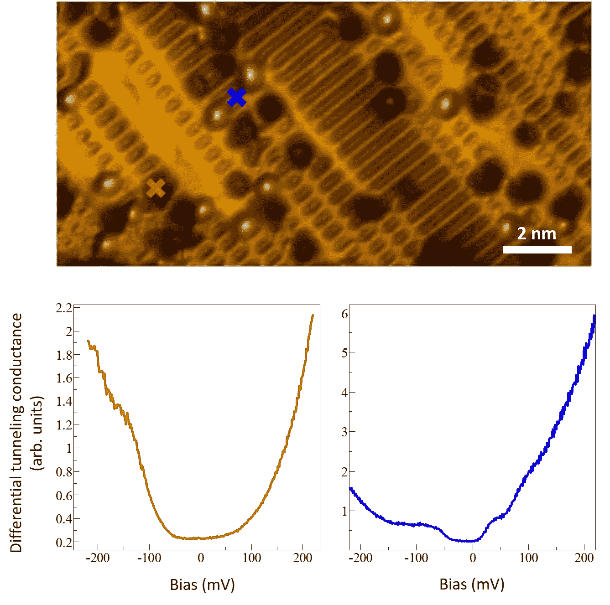
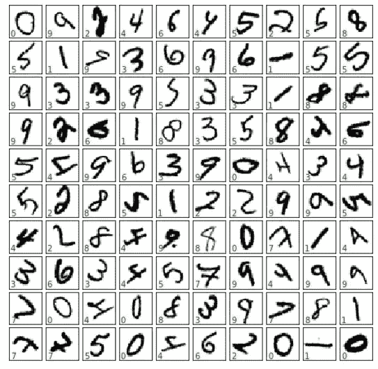
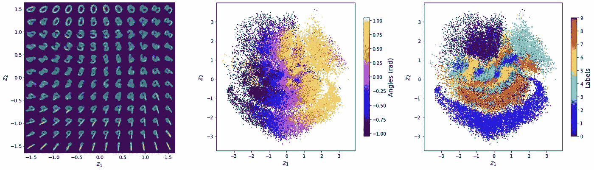
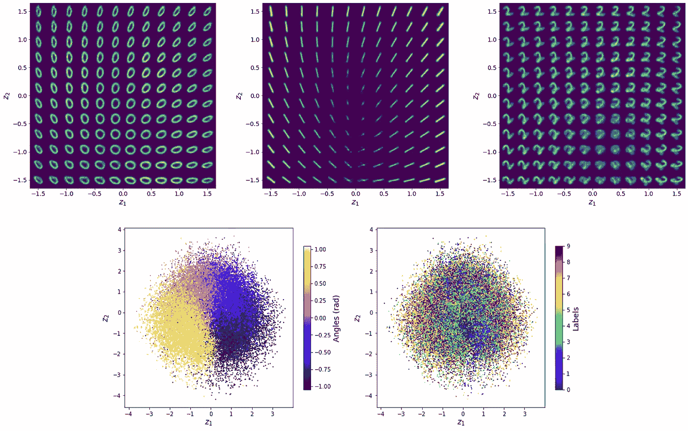
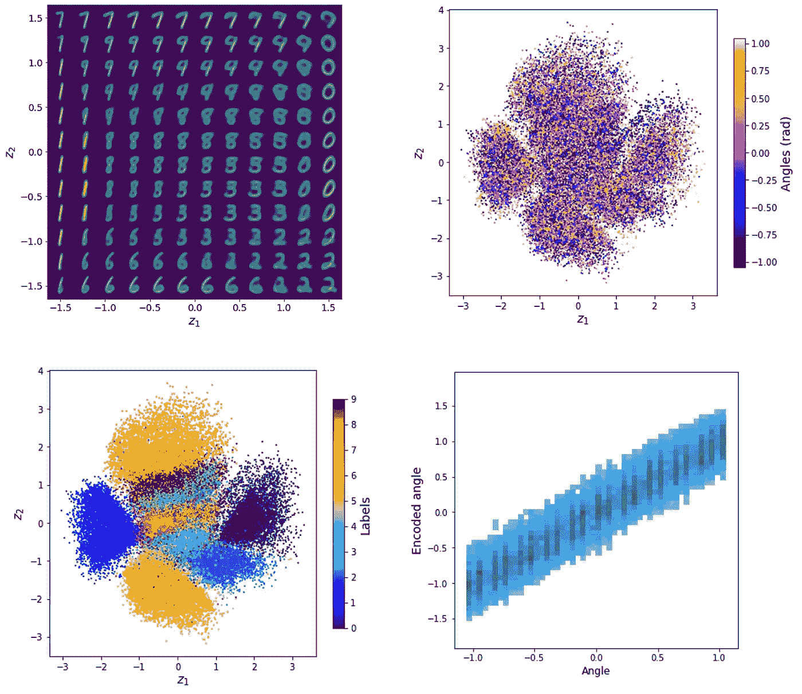
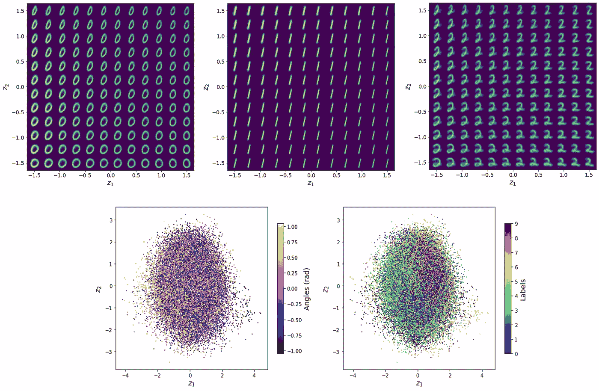

# 我们是如何学会爱上旋转不变变分自动编码器(rVAE ),并(几乎)停止使用 PCA 的

> 原文：<https://towardsdatascience.com/how-we-learnt-to-love-the-rotationally-invariant-variational-autoencoders-rvae-and-almost-562aa164c59f?source=collection_archive---------8----------------------->

## [思想和理论](https://towardsdatascience.com/tagged/thoughts-and-theory)

## 具有旋转不变性的无监督和类条件变分自动编码器及其在图像分析中的应用

*马克西姆·齐亚德诺夫&谢尔盖·加里宁*

*美国田纳西州橡树岭橡树岭国家实验室纳米材料科学和计算科学与工程中心*

科学研究通常会产生大量的数据。这些例子包括天文学及其精密的光学和射电望远镜、卫星地理空间成像、医学和生物成像、中子和 X 射线散射以及扫描探针和电子显微镜等领域。通常在每个空间位置的多个波段或光谱上可以获得成像信息，从而产生复杂的多维数据集。典型的例子是超光谱卫星成像，其中在每个空间位置测量全光谱。然而，更多的成像模式出现在领域科学应用的背景下，例如扫描探针或电子显微镜。在所有这些情况下，研究人员的第一步是根据感兴趣的对象可视化并随后解释成像数据，无论是天文学中的新型恒星或系外行星，地理空间成像中的植物生长模式或隐藏装置，还是扫描隧道显微镜中的单个原子的电子属性。

*铁基超导体的原子级表面形貌(刚好在超导转变之上)和与几个选定位置的电子态局部密度成比例的隧道电导。图片来自 M.Z .(从他学会爱 VAE 之前的时间)*

人类的眼睛非常适合分析成像数据，这种能力是草原上千年进化的结果，及时发现捕食者或猎物是生存的一个条件。同时，人类的感知和理解(几乎没有例外)通常不太适合 3、4 或更高维数据的理解和对象识别。因此，自然的问题是机器学习是否能在这方面有所帮助。

科学领域充满了远见卓识者的例子，他们的远见卓识大大超越了这个领域。一个众所周知的例子是阿达·洛芙莱斯，他早在计算机出现之前就已经探索了计算机编程的背景。另一位是 DARPA 的创始人之一 [Joe Licklider](https://en.wikipedia.org/wiki/J._C._R._Licklider) ，他在 50 年代写的书《未来的图书馆》中预言了许多现代基于互联网的知识基础设施，包括电子书籍和期刊、数据库等。在显微镜学领域，Noel Bonnett 在其出版物《描述机器学习和多元统计在超光谱数据中的应用》中提出了第一个有远见的观点[1，2]。多元统计方法在显微镜学中的首次实际应用出现在几年后，当时个人计算机已经变得足够强大，可以处理电子显微镜[3]和扫描探针[4]中的“巨大”50x50x1000 超光谱数据集，从而产生可接受的图像。

当时选择(或可用)的 ML 方法是主成分分析(PCA)，这是一种将高光谱数据集 *R* ( *x* ， *y* ， *E* )转换为加载图 *aᵢ* ( *x* ， *y* )和成分 *Aᵢ* ( *E* )的线性组合的技术。在最一般的意义上，组件定义了系统的特定行为，并且加载映射包含关于该行为在哪里表现的信息。人们经常认为 PCA 分析没有赋予成分物理意义(这是正确的——它们仅在信息论意义上定义),因此，在过去十年中出现了多个版本的线性和非线性降维方法，允许特定的物理约束[5]。目前，这些方法中有许多是作为 scikit-learn 等基本 Python 库的一部分提供的，甚至更多是作为独立库提供的。然而，应用于高光谱数据的这些方法的关键方面在于，它们仅探索光谱域中的共同特征，并且空间域中的像素交换不影响分量，并且仅导致加载地图中的像素交换。

然而，在许多情况下，分析成像数据的科学家对特定的形状感兴趣。在古代人类世界，我们试图在相反的事情发生之前发现掠食者。在天文学中，我们的目标是确定星系的形状或表明系外行星存在的恒星强度的微弱变化。在扫描探针或电子显微镜中，我们的目标是发现表明对称性破缺和新的电子或结构有序出现的有序模式。有时，PCA 和相关方法允许通过检查装载图进行这种发现。然而，在许多情况下，相关的空间分辨信息分布在数十个装载地图上。因此，问题是是否有机器学习算法可以探索形状？

这里的一个主要困难是图像中的形状可以有任何方向。虽然现代深度卷积神经网络(DCNNs)是等变的，即允许检测图像中任何地方的特定对象，但当发现单个对象的多个旋转类时，它们通常是有限的。例如，在经典情况下，如图像网络或图像中猫的监督学习，猫通常朝向垂直方向。虽然猫在任何方向的数据集都可以制作，但这可能会引起动物伦理待遇的严重问题。因此，即使有监督的网络在识别同一物体的旋转版本方面也不是特别好(例如，参见著名的[鸭子对兔子错觉](https://hub.packtpub.com/researchers-input-rabbit-duck-illusion-to-google-cloud-vision-api-and-conclude-it-shows-orientation-bias/))。当我们不知道我们正在试图寻找什么特定对象时，这对于无监督学习来说甚至是一个更大的问题。

接下来是旋转不变变分自动编码器(在过去的一年里，我们已经学会喜欢它，因为它们让我们解决了困扰我们十年的几个物理问题)。让我们一步步探索这个概念。自动编码器通常指一类特殊的神经网络，其中原始数据集被压缩成少量连续的潜在变量，然后被扩展回原始数据集。网络被训练以改善(在选择的损失函数的意义上)数据重建，这听起来像是有点受限的目标(例如，我们可以不去管它)。这里的关键技巧是，在这个过程中，网络学习如何根据潜在变量来最佳地描述数据。这允许自动编码器发现最佳表示，同时也拒绝数据中存在的噪声。因此应用于去噪、图像重建等。

变分自动编码器(VAE)通过使重建过程概率化而建立在这个概念上。在这种情况下，潜在变量从特定(通常为高斯)分布中提取，并且训练寻求优化编码图像和潜在空间中对应于解码图像的潜在变量的分布之间的重建损失和 Kullback-Leibler 散度。VAEs 最吸引人的特征之一是它们解开数据表示的能力，即发现特定的特征，例如 MNIST 数据中的笔迹风格、人脸的情感或定义机器人系统自由度的复杂流形。在 Medium 和 arXiv [6]上有许多解释 VAEs 的优秀资料来源。

这里，我们将 VAE 扩展到旋转不变特征的分析。在旋转不变 VAE (rVAE)中，潜在层中有一个“神经元”被指定用于吸收图像中结构的任意旋转，而所有其他神经元用于解开剩余的变化因素。这里的技巧是将 VAE 解码器写成图像(空间)坐标的函数，这可以通过空间生成器 net [7](对于全连接解码器)或者通过空间广播生成器[8]的稍微修改版本(对于卷积解码器)来实现。这里，我们通过 [Pyro](https://pyro.ai/) 概率编程语言实现了 rVAE。为了完整性，我们介绍并讨论了简单 rVAE 和类条件 rVAE。(r)VAE 的更复杂版本，包括联合(r)VAE、半监督(r)VAE 和(r)VAE，增加了允许未知和部分已知类的正常化流，将在后面讨论。

让我们使用经典的 MNIST 数据集来研究 rVAE 及其变体(注意，它可以是不同的原子或分子结构，而不是数字)。首先，我们创建如下所示的旋转 MNIST 数据集:

*来自 MNIST 数据集的样本在-60°到+60°范围内随机旋转。图片由作者提供。*

我们进一步使用旋转的数字作为特征，并保留标签和旋转角度作为基础真实数据，以与 rVAE 和类条件 rVAE 分析的结果进行比较。

首先，我们探索简单的 VAE。在这里，我们推导出了潜在空间和点在潜在空间中的分布，用角度和数字来表示。提醒一下，说明 VAE 运算的便利方式是通过潜在空间中(编码)点的分布，以及通过投影到图像空间的潜在空间表示。在前者中，数据集中的所有特征被编码并在潜在平面中可视化。如果数据集的一些属性是已知的(例如类别或旋转角度)，它们可以用于设置色标以检查潜在空间中的趋势。可选地，潜在空间可以由点的矩形网格采样，并且相应的图像可以被解码并绘制为潜在空间表示。当潜在空间是 2D，特征也是 2D 时，这种分析特别方便。

*VAE 对旋转后的 MNIST 数据的分析。图片由作者提供。*

上面显示的是简单 VAE 的旋转 MNIST 数据的潜在空间表示。在这里，我们可以清楚地看到，潜在空间包含所有方向的数字。通过随附笔记本中的函数*vae . manifold 2d(d = some _ positive _ integer)*试验重建子图像的数量可能会很有趣。特别是对于非常大的 *d* = 100，单个数字不能被识别，但是潜在空间表示开始显示与单个数字占据的区域相对应的图案。

对潜在空间的检查表明，角度沿着第一潜在方向变化，而数字沿着第二潜在维度变化，形成分离良好的簇。显著的例外是对应于‘9’和‘6’的群集，其在 180°旋转后不能被区分(对于 VAE 是相同的，对于人类也是相同的)。总的来说，这清楚地说明了数据表示概念的解开，其中旋转角度和类别作为数据内变化的两个最突出的因素出现。

现在，我们用条件 VAE (cVAE)重复同样的分析。在这种情况下，我们在训练和预测期间解码的对象是连接的图像和类，因此我们对每个类都有单独的潜在空间。

*旋转 MNIST 数据的 cVAE 分析。图片由作者提供。*

上面显示的是数字“0”、“1”和“2”的潜在空间。请注意一个非常有趣的模式——在这种情况下,“非物理形状”形成了一个由“物理上可实现的”数字包围的簇(例如，在图像中带有“1”的中心区域周围)。这种行为与物理学的一个基本方面有关，即潜在空间和数据空间的拓扑结构。这方面的一些优秀资源是参考。[9, 10].编码数据也显示在上图中。这里，潜在角度形成了一个定义明确的圆(逆时针方向从负到正的旋转角度)，而数字类现在作为单个斑点分布(正如预期的那样，假设每个都形成了自己的潜在空间)。带回家的信息是，现在两个解开的因素是角度变化，VAE 和 cVAE 没有处理好角度。

现在让我们添加旋转不变性，就像包含在 rVAE 中一样。潜在空间表示如下所示。

旋转 MNIST 数据的 rVAE 分析。图片由作者提供。

在这种情况下，潜在空间中的手指指向一个方向。潜在空间显示，角度现在是随机的，而数字形成了定义明确的簇(考虑到我们仅使用两个潜在变量对数据集进行编码，这相当值得注意)。我们也得到了角度作为潜变量之一，上图比较了潜在角度和地面真值角度。请注意，它们是线性相关的，但同时潜在角度具有广泛的分布。这并不奇怪，因为角度是书写风格的特征之一，并且因人而异！因此，我们发现的潜在表征通过引入它作为一个额外的增加变量，然后将其与其他变异因素分开，从而得到了这一事实的补偿。

最后，我们说明了应用于该数据集的类条件 rVAE (crVAE ):

*旋转 MNIST 数据的 crVAE 分析。图片由作者提供。*

在这种情况下，我们的潜在重建清楚地表明，在每个潜在空间内，数字都指向同一个方向，潜在变量现在编码了笔迹风格的非常微妙的细节。看看上面的“0”、“1”和“2”，并在附带的笔记本上玩其他数字。

这概括了 rVAE 和 crVAE 的介绍。请随意使用笔记本，并将其应用于您的数据集。作者在他们对扫描探针和电子显微镜中的原子分辨和介观成像的研究中使用了 VAE 及其扩展，但这些方法可以应用于更广泛的光学、化学和其他成像，以及跨其他计算机科学领域。还请查看我们的 [AtomAI](https://github.com/pycroscopy/atomai) 软件包，用于将该工具和其他深度/机器学习工具应用于科学成像。

最后，在科学界，我们感谢资助这项研究的赞助商。这项工作在橡树岭国家实验室纳米材料科学中心(CNMS)进行并得到支持，该中心是美国能源部科学用户设施办公室。您可以使用[此链接](https://my.matterport.com/show/?m=MT819FqAwbT)进行虚拟漫游，如果您想了解更多，请告诉我们。

可执行的 Google Colab 笔记本可以通过 GitHub 在[买到。](https://colab.research.google.com/github/ziatdinovmax/notebooks_for_medium/blob/main/pyroVAE_MNIST_medium.ipynb)

1.Bonnet，n,《显微镜图像系列分析的多元统计方法:在材料科学中的应用》。J. Microsc。-Oxf。 **1998，** *190* ，2–18。

2.Bonnet，n .，显微镜图像处理和分析中的人工智能和模式识别技术。在*成像和电子物理学进展，第 114 卷*，霍克斯，P. W .编辑。埃尔塞维尔学术出版社:圣地亚哥，2000 年；第 114 卷，第 1-77 页。

3.博斯曼，m；渡边，m；亚历山大博士。Keast，V. J .，使用电子能量损失光谱图像的多元分析绘制化学和成键信息。*超显微* **2006，***106*(11–12)，1024–1032。

4.杰西；扫描探针显微镜中光谱成像数据的主成分和空间相关性分析。*纳米技术* **2009，** *20* (8)，085714。

5.坎南河；耶夫列夫公司；新泽西州拉纳伊特；文学硕士齐亚特迪诺夫；瓦苏德万；杰西；Kalinin，S. V,《通过物理约束线性分解进行深度数据分析:通用框架、领域示例和社区范围平台》。高级结构。化学。Imag。 **2018，** *4* ，20。

6.金玛，D. P。可变自动编码器导论。 *arXiv 预印本 arXiv:1906.02691*2019。

7.t .贝普勒；钟；凯利，k。布里格诺尔，e；Berger，b,“用空间 VAE 明确地将图像内容从平移和旋转中分离出来。”。*神经信息处理系统进展* **2019** ，15409–15419。

8.沃特斯，新泽西州；马特伊湖；伯吉斯公司；空间广播解码器:学习 VAEs 中非纠缠表示的简单架构。 *arXiv 预印本 arXiv:1901.07017*2019。

9.巴特森；哈夫公司；卡恩，y。自动编码的拓扑障碍。 *arXiv 预印本 arXiv:2102.08380*2021。

10.法洛尔西湖；德汉，p。戴维森；新泽西州曹德；魏勒，m。福雷出版社；同胚变分自动编码的探索。 *arXiv 预印本 arXiv:1807.04689*2018。