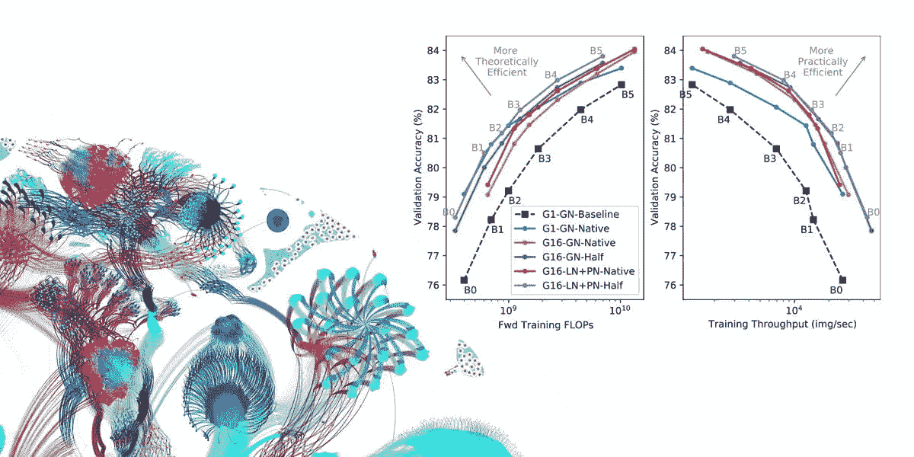
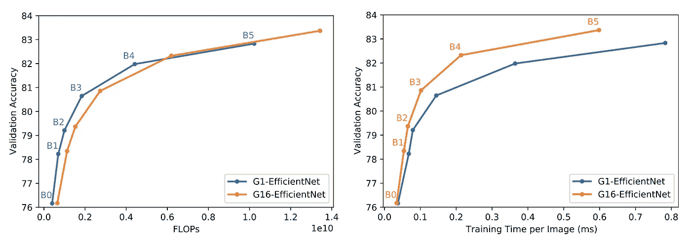
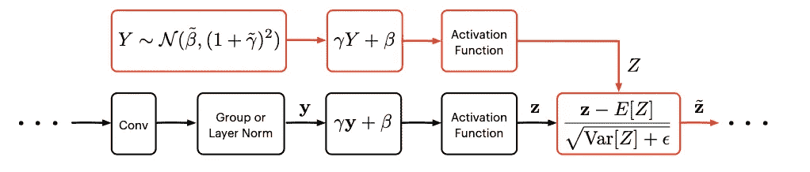
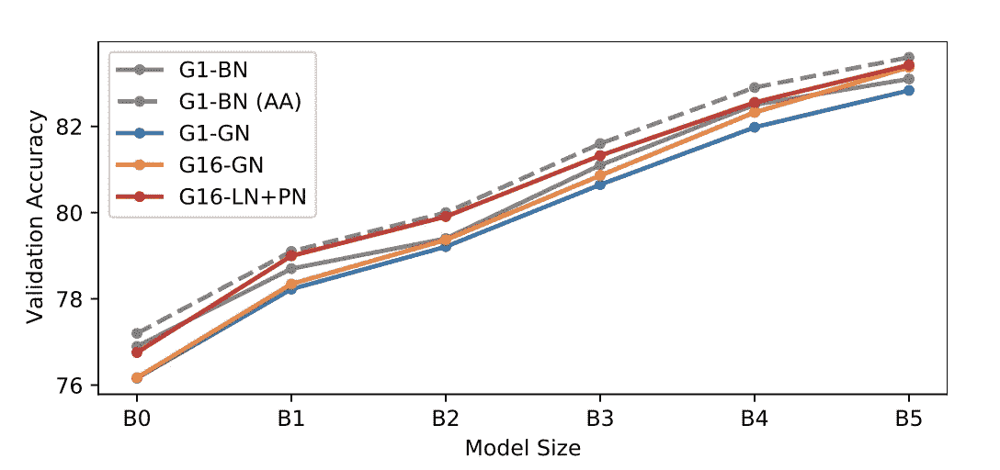
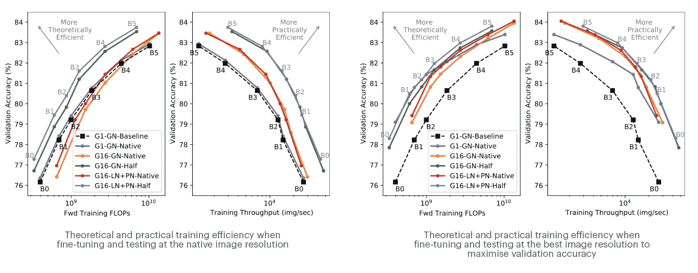
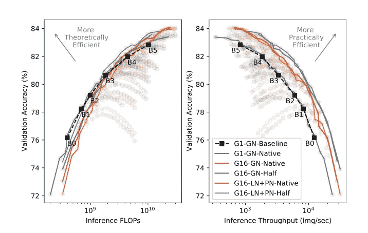

# 我们如何让 EfficientNet 更加高效

> 原文：<https://towardsdatascience.com/how-we-made-efficientnet-more-efficient-61e1bf3f84b3?source=collection_archive---------23----------------------->

## [思想和理论](https://towardsdatascience.com/tagged/thoughts-and-theory)

## 实践中更高效的网络性能

图片作者。

在我们的[新论文](https://arxiv.org/abs/2106.03640)“使 EfficientNet 更有效:探索批量独立的规范化、组卷积和降低分辨率训练”中，我们采用了最先进的模型 EfficientNet [1]，它在理论上被优化为高效，并研究了三种方法来使它在 IPUs 上的实践更有效。

例如，添加组卷积，[在 IPUs](https://www.graphcore.ai/posts/delving-deep-into-modern-computer-vision-models) 上表现良好，在理论计算成本差异最小的情况下，实际训练吞吐量提高了 3 倍。

结合所研究的所有三种方法，我们在训练吞吐量上实现了高达 7 倍的改进，在 IPUs 上实现了 3.6 倍的推理改进，而验证准确性相当。

模型训练的理论成本(通常以 FLOPs 为单位)很容易计算，并且与所使用的硬件和软件堆栈无关。这些特征使其成为一种有吸引力的复杂衡量标准，已经成为寻求更有效的深度学习模型的关键驱动因素。

然而，在现实中，这种培训成本的理论衡量与实际成本之间存在着巨大的差距。这是因为简单的 FLOP 计数没有考虑许多其他重要因素，如计算和数据移动的结构。

# 引入群卷积

我们研究的第一种方法是如何提高与深度方向卷积(换句话说，组大小为 1 的组卷积)相关的性能。EfficientNet 本身对所有空间卷积运算使用深度方向卷积。众所周知，它们具有翻转和参数效率，因此已成功应用于许多先进的卷积神经网络(CNN)中。然而，它们在实践中对加速提出了几个挑战。

例如，由于每个空间核被孤立地考虑，通常由向量乘累加硬件加速的点积运算的长度是有限的。这意味着这种硬件不能总是得到充分利用，导致“浪费”周期。

[深度方向卷积也具有非常低的算术强度](https://www.graphcore.ai/posts/delving-deep-into-modern-computer-vision-models)，因为相对于执行的 FLOPs 数量，它们需要大量的数据传输，这意味着存储器访问速度是一个重要因素。虽然这可能会限制替代硬件的吞吐量，但 IPU 的处理器内内存架构提供了高带宽内存访问，可以显著提高此类低算术强度运算的性能。

最后，当深度方向卷积被夹在两个密集的点方向“投影”卷积之间以形成 MBConv 块时，它们被发现是最有效的。这些逐点卷积围绕空间深度卷积以 6 的“扩展因子”增加和减少激活的维度。虽然这种扩展带来了良好的任务性能，但它也产生了非常大的激活张量，这会控制内存需求，并最终限制可使用的最大批处理大小。

为了解决这三个问题，我们对 MBConv 模块进行了简单但意义重大的修改。我们将卷积组的大小从 1 增加到 16；这导致了更好的 IPU 硬件利用率。然后，为了补偿触发器和参数的增加，并解决内存问题，我们将扩展比率降低到 4。这就产生了一个内存效率更高、计算更紧凑的 EfficientNet 版本，我们称之为 G16-EfficientNet。

虽然这些变化主要是由吞吐量的提高推动的，但我们也发现，它们使我们能够在所有模型大小上实现比普通组大小 1(G1-高效网络)基线更高的 ImageNet 验证准确性。这种修改导致实际效率的显著提高。

G1 效率网(基线)与 G16 变体(我们的)的理论(左)和实际(右)效率的比较。作者图片。

# 代理正常化激活

归一化卷积和矩阵乘法运算的输出已经成为现代细胞神经网络的一个基本要素，批量归一化是用于此目的的最常见形式的方法。然而，批量规范引入的批量限制是一个众所周知的问题，引发了一系列与批量无关的替代方案的创新。虽然这些方法中的许多都适用于 ResNet 模型，但我们发现它们都没有达到与 EfficientNet 的 Batch Norm 相同的性能。

为了解决这种批次范数替代方案的缺乏，我们利用了新的批次无关归一化方法代理范数，这是在最近的[论文](https://arxiv.org/abs/2106.03743)中介绍的。该方法建立在已经成功的组(和层)标准化方法的基础上。

组范数和层范数遭受激活可能变成通道反规格化的问题。随着深度的增加，这个问题变得更加严重，因为反规格化在每一层都变得更加严重。虽然这个问题可以通过简单地减少组规范中的组的大小来避免，但是，这样的组大小的减少会改变表现性和惩罚性能。

代理范数提供了一个更好的修复方法，它保留了表达性，同时抵消了反规格化的两个主要来源:仿射变换和遵循组范数或层范数的激活函数。具体地，通过将群范数或层范数的输出同化为高斯“代理”变量，并通过将相同的仿射变换和相同的激活函数应用于该代理变量，来抵消反规格化。然后，非规格化代理变量的统计被用于校正实际激活中的预期分布偏移。

代理规范允许我们最大化组大小(即使用层规范)并保持表达能力，而不会出现通道反规范化的问题。

附加代理标准化激活操作的卷积块显示为红色。图片作者。

在相关论文[2]中详细探讨了这种新的标准化技术。

重要的是，这种整体方法没有模仿任何批处理规范的隐含正则化特征。出于这个原因，需要额外的正则化——在这项工作中，我们使用了混合和剪切混合的组合。当将层范数+代理范数(LN+PN)的性能与具有标准预处理和自动增强(AA)的两个批范数(BN)基线进行比较时，我们发现 LN+PN 在整个模型大小范围内匹配或超过具有标准预处理的 BN 的性能。此外，LN+PN 几乎与具有 AA 的 BN 一样好，尽管 AA 需要昂贵的“训练”增强参数的过程。

不同大小有效网的不同归一化方法的比较。图片作者。

# 降低分辨率训练

Touvron 等人(2020 年)[3]表明，通过使用比原始训练图像更大的图像对最后几层进行训练后微调，可以获得显著的精度增益。由于这种微调阶段非常便宜，很明显，这将实现一些实际的培训效率的好处。这引发了许多更有趣的研究问题。应该如何选择训练分辨率以最大化效率？鉴于较大的图像测试速度较慢，这对推断效率有什么影响？

为了研究这些问题，我们比较了两种不同分辨率下的训练，一种是“原始”分辨率(如最初的 EfficientNet 网络中所定义的)，另一种是大约一半的像素数。然后，我们在各种图像尺寸下进行微调和测试。这使我们能够研究训练分辨率对效率的直接影响，并确定帕累托最优组合，以实现训练和推理的最佳速度-准确性权衡。

在比较训练效率时，我们考虑了两种测试方案:在原生分辨率上进行测试，或者选择“最佳”分辨率，以最大化整个分辨率范围内的验证准确性。

当以原生分辨率进行测试时，我们看到用一半大小的图像进行训练产生了相当大的理论和实际效率改进。值得注意的是，对于给定的模型大小，我们发现以半分辨率训练和以原生分辨率微调甚至比全部以原生分辨率训练、微调和测试产生更高的最终精度。这个结论表明，对于 ImageNet 训练，我们应该总是以比训练更高的分辨率进行测试。我们现在希望了解这是否也适用于其他领域。

如果我们接下来允许自己在“最佳”图像分辨率下进行测试，我们会看到在原始分辨率下的训练在最终精度上产生了显著的提高，缩小了 Pareto 前沿的差距。

然而，应该注意的是，为了实现这一点,“本地”训练方案的“最佳”测试分辨率最终比对应于一半训练分辨率情况的那些分辨率大得多。这意味着它们在推理时会更昂贵。

作者图片。

这些结果突出了通过研究的三个改进实现的训练效率的改进(I)组卷积[G16(我们的)对 G16(ii)代理标准化激活[LN+PN(我们的)对 GN]和(iii)半分辨率训练[半分辨率(我们的)对本地]。请注意，基线结果没有微调，并且使用原始图像分辨率。

比较推理本身的效率，我们看到在半分辨率下的训练在全精度范围内产生帕累托最优效率。这是一个显著的结果，因为在推论中根本没有直接的翻牌优势。此外，沿着半分辨率推理效率 Pareto 前沿的点对于训练吞吐量保持最优。

理论和实践推理效率。在所有分辨率下测试；线条突出了帕累托前沿。作者图片。

在所有的效率指标中，具有代理标准的模型与具有组标准的模型表现相当或稍好。这是因为精度提高了，而吞吐量只增加了约 10%。然而，重要的是，具有代理范数的模型在整个帕累托前沿使用更少的参数，突出了代理范数在相对于模型大小的效率方面的额外好处。

# 如何让 EfficientNet 更有效率

在进行这项研究时，我们对 EfficientNet 模型进行了一些修改，以提高训练和推理的整体效率:

*   通过添加组卷积和降低 MBConv 块中的扩展比率，我们提高了空间卷积的 IPU 硬件利用率，并降低了内存消耗。
*   通过使用一半分辨率的图像进行训练，我们缩短了训练时间，并显著提高了最终精度。
*   通过利用新的标准化方法代理标准，我们匹配了批次标准性能，而不依赖于批次信息。据我们所知，这是 EfficientNet 实现这一目标的第一种方法。

结合使用所有这些方法，我们在 IPU 上实现了高达 7 倍的实际训练效率改进和 3.6 倍的实际推理效率改进。这些结果表明，当使用适合处理组卷积的硬件时，如 IPU，EfficientNet 可以提供训练和推理效率，使其超越理论，走向实际的、真实世界的应用。

[看报](https://arxiv.org/abs/2106.03640)

# 谢谢你

感谢 [Antoine Labatie](https://medium.com/@antoinelabatie) 、Zach Eaton-Rosen 和 Carlo Luschi，他们也为这项研究做出了贡献，感谢我们在 Graphcore 的其他同事的支持和见解。

# 参考

[1] M. Tan，Q. V. Le， [EfficientNet:反思卷积神经网络的模型缩放](https://arxiv.org/abs/1905.11946) (2019)，arXiv 2019

[2] A. Labatie，D. Masters，Z. Eaton-Rosen，C. Luschi，[代理正常化激活以匹配批量正常化，同时移除批量依赖性](https://arxiv.org/abs/2106.03743) (2021)，arXiv 2021

[3] H. Touvron，A. Vedaldi，M. Douze，H. Jégou，[修复训练-测试分辨率差异:FixEfficientNet](https://arxiv.org/abs/2003.08237) (2020)，NeurIPS 2019