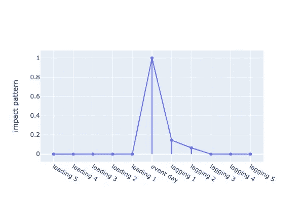
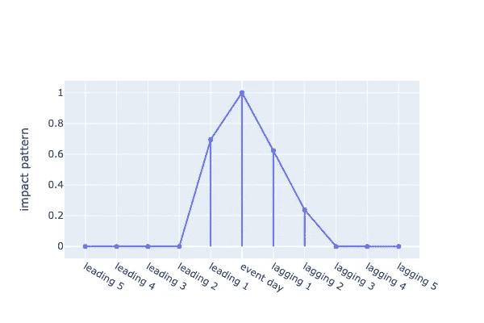
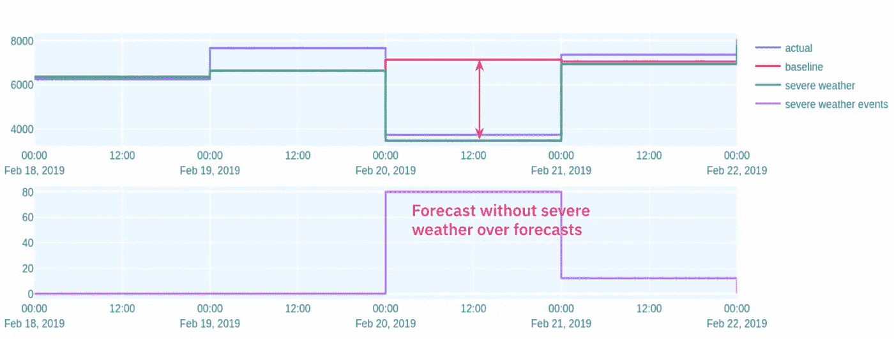
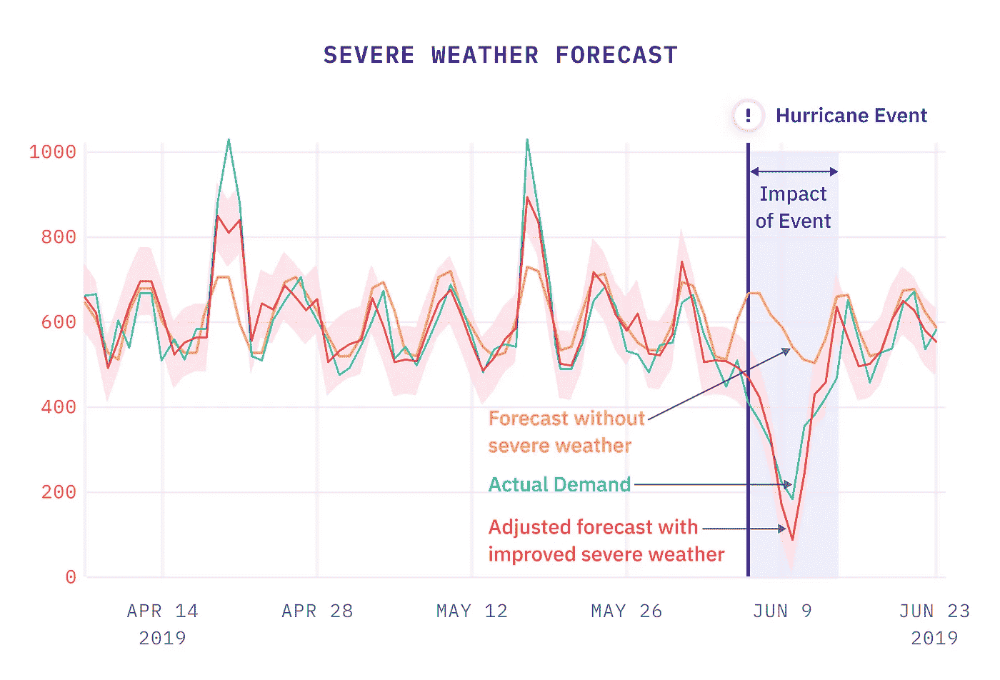

# 我们如何确定 73 种恶劣天气对快餐和零售需求的普遍影响

> 原文：<https://towardsdatascience.com/how-we-pinpointed-the-generalized-impact-of-73-kinds-of-severe-weather-on-fast-food-and-retail-3120eb22ca9a?source=collection_archive---------18----------------------->

## [行业笔记](https://towardsdatascience.com/tagged/notes-from-industry)

## 以及如何构建具有动态特征集的机器学习模型来克服数据稀疏性

我们都知道恶劣的天气会影响快速服务零售连锁店的需求。在这个行业工作的人知道，它的影响不仅仅是事件本身的一两天。但是，鉴于恶劣天气事件数据的频率和分布有限，建立一个模型来准确识别这些需求影响模式对于 QSR 链来说是不可能的。下面是我的团队如何解决这个问题，并成功确定了 73 种不同的恶劣天气事件的多天影响。

你不能依靠轶事知识来驱动预测模型或可扩展的需求计划组织。你需要信息——你需要数字。因此，我的团队需要找到一种方法，在发布观察或警告后，立即将恶劣天气影响造成的代价高昂的混乱转化为准确的影响数据。这需要包括:

*   恶劣天气事件影响需求的时间长度，包括事件发生的日期以及提前和滞后的一天的影响
*   这些天 QSR 需求平均每天受到多少影响

剧透:非常具有挑战性。但是我们在 QSR 工业中找到了 73 种广义需求影响模式。请注意，这些可能会因地点不同而有很大差异(更多信息请见下文。)

中等强度热带风暴的 QSR 的广义需求影响模式-请注意它产生影响的第一天就是风暴发生的那一天，但它的影响会持续一段时间。

作者图片

空气质量预警 QSR 的广义需求影响模式是不同的。影响在事件发生前就开始了，随着空气质量恶化，警告需要更长时间才能消失，因此人们发现对需求的影响更长。

作者图片

请注意，上面的可视化假设恶劣天气事件是一天的事件，但许多严重事件会持续更长时间。

虽然 2019 年美国发生了 26793 起[恶劣天气事件](https://www.predicthq.com/intelligence/data-enrichment/event-categories/severe-weather)，但恶劣天气事件有很多种，而且分布非常广泛。这意味着数据稀疏性——发生在相关相似地点的相关相似事件——将是一个需要克服的重大挑战。我知道许多数据科学家对模型有很好的计划，但由于数据集太小、太倾斜而无法充分训练模型，所以我想在这篇文章中分享我们的学习成果，以鼓励我的数据科学家同事继续解决看起来几乎不可能解决的问题。

# 克服数据稀疏性—如何开始

确定单个事件对需求的影响不是问题。面临的挑战是找到一种事件在多个地点和不同种类的 QSR 公司中的统计上准确的平均影响。由于数据稀疏和偏斜，这是一个挑战。

我的公司 PredictHQ 非常适合应对这一挑战，因为我们与许多大型 QSR 和零售商合作，多年来一直在我们的数据集中包括经过验证的恶劣天气观察、警告和事件。但即便如此，我们也没有多余的需求数据和天气数据可以利用。在疫情期间，我们的许多大型 QSR 和零售客户向我们寻求帮助，了解如何更好地管理恶劣天气事件，即使在世界处于封锁状态时，这些事件仍在继续对他们的计划造成严重破坏。他们知道这很重要，原因有三:

1.  你无法控制天气，但你可以通过更好地调整员工、库存和供应链策略来应对预测的影响，从而节省数百万美元。
2.  您需要在历史预测中考虑恶劣天气事件，否则它们会扭曲您的需求基线，导致代价高昂的不准确。
3.  随着世界转向更加动态和强大的预测模型，如果拥有正确的数据，以每日粒度提前一周或两周进行预测的公司将能够迅速做出决策以节省资金。

如果这对他们很重要，对我们也很重要。我们必须克服数据稀疏的三个要素:

1.  足够多的类似事件，以确定其对 QSR 公司需求的影响，并了解事件的严重程度如何影响，即各种强度的飓风足够多，严寒事件足够多，洪水足够多等
2.  在同一地点发生足够多相似的事件
3.  在同一时间同一地点发生了足够多相似的事件(这里时间是一个非常重要的因素，我们必须考虑多个时间段)。

作者图片

假设是好的数据科学的敌人。我们意识到，与其担心在每个地点没有成百上千个几乎相同的活动，我们需要首先确定哪些因素以具有统计意义的方式实际影响了需求。

# 第一步:空隙和内部空间测试，以确定必要的特征空间

我的团队对每个季节和每个地点的所有恶劣天气事件进行了空间测试，确定了这些因素的影响程度。这意味着我们可以排除一些我们认为对许多恶劣天气类型至关重要的特征。但是相关的特征根据事件的不同而有很大的不同。

例如，冬季风暴和严寒警告只发生在冬季，因此季节特征对这些类型并不重要。但我们确实了解到，纬度对这些恶劣天气类型有着巨大的影响:它们越是在北方，它们的严寒警告和事件就越严重，冬季风暴也越严重，所以这确实需要考虑在内。

我们发现了类似的高温模式(美国南部各州比北部更具影响力)，以及 73 种恶劣天气类型中每一种的不同模式。

该测试使我们能够识别恶劣天气事件的一些最具影响的特征，包括:

*   事件发生的地点。
*   事件的严重性。
*   事件的紧迫性。
*   某一事件发生的概率，即某一地点某一事件的淡季或极不频繁的事件。
*   事件发生的时间:如上所述的年度时间和每周时间——周末的恶劣天气事件或其他 qsr 和零售的高峰需求时间影响更大。
*   事件的确定性:我们跟踪观察、警告和事件本身，因此我们需要观察和警告来反映事件的演变性质。

作者图片

# 步骤 2:动态特征集选择

随着我们的研究，我们的模型开始识别每种事件类型的不同模式。我们意识到，我们必须建立一个模型，其中包括针对每种恶劣天气类型的动态特征集选择。我们还需要这个特性集不断发展，以确保它保持准确。在气候变化的时代，恶劣天气事件的严重性和频率都在增加，因此我们的模型需要根据当前的情况不断更新，而不是依赖 20 年前的数据。

到目前为止，我们已经确定了 73 种不同的恶劣天气需求影响模式。这涵盖了以下恶劣天气类型影响的复杂性，但根据严重程度，有几种天气类型具有不同的模式:

*   洪水
*   飓风
*   旋风
*   酷热
*   大寒
*   热浪
*   飓风
*   大雨
*   严重沙尘暴
*   严重的暴风雪
*   暴风
*   龙卷风
*   台风
*   强风
*   空气质量
*   暴雪
*   寒潮
*   飓风
*   灰尘
*   雾

我们发现不同的类别有不同的关键影响因素。例如，一些恶劣天气类型发生在正常季节之外时，如暴雨，会产生更大的影响，但一些天气类型只发生在正常季节内，如冬季风暴和严寒。这意味着我们不需要为那些事件的模型加入这个特性。

我们发现的另一个有重大影响的因素是纬度。例如，严寒对美国北部的影响要大得多，而飓风对美国东南部的影响要比西北部严重得多。

最后，我们的测试版包括 73 种不同的需求影响模式来捕捉这些差异。这些被添加到 PredictHQ 的数据中每一个即将到来的恶劣天气事件中。

# 选择具有动态特征集的高级机器学习模型，而不是更简单的模型

像许多复杂的模型一样，我们原型的架构与我们开始研究前的想象截然不同。一旦我们完成了研究的一小部分，基于规则的模型显然是行不通的。

我们的高级机器学习模型的关键是约束正则化回归模型(CR2M)。它有一个正则项，所以它会有一个合理的形状，包含了关于你期望看到的行为的先入为主的知识。然后，我们基于预先测试的动态特征空间对其进行训练，以便它可以自动学习领先和落后的天数以及影响的大小。

利用这一点(也就是几千小时后)，我们开始获得令人兴奋的结果，例如:

*   在我们测试的数千家商店中，当他们有需求影响模式来指导他们的模型时，58%的商店可以明显受益于恶劣天气事件数据。
*   对于受恶劣天气影响的 58%的商店，平均相对 WAPE(加权平均百分比误差)改善为 2.42%，最大改善超过 14%
*   其根本原因是我们的需求影响模式将受计划外事件影响的预测天数从 46 天延长至 137 天，几乎增加了两倍。

即使 WAPE 改进 1 个百分点，也能为我们正在建设的全国 QSR 连锁店节省数百万美元，我们对结果感到非常兴奋。我希望这篇文章对您有所帮助，并且您的数据科学团队也在处理和解决具有挑战性的问题。

对于热衷于探索恶劣天气数据的数据科学家，我们制作了一个 [Jupyter 笔记本作为指导](https://docs.predicthq.com/datascience/severe-weather-events/)。