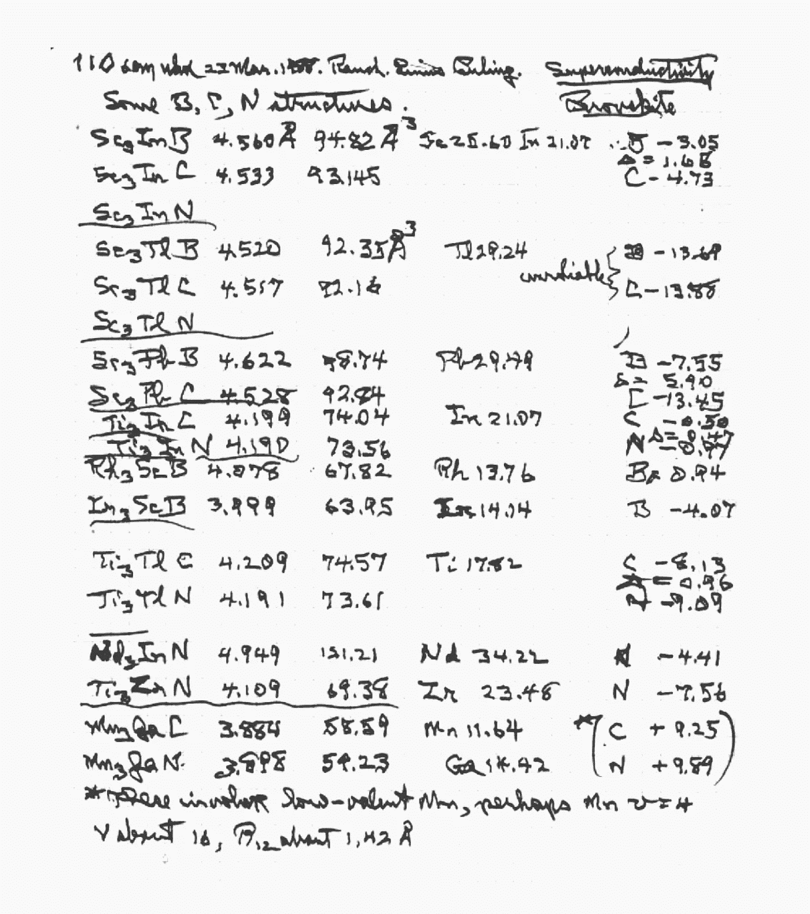
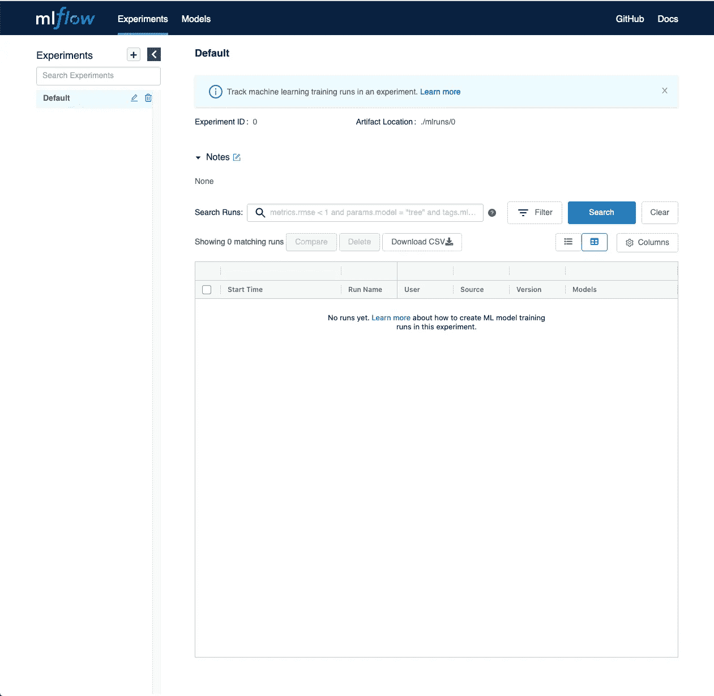
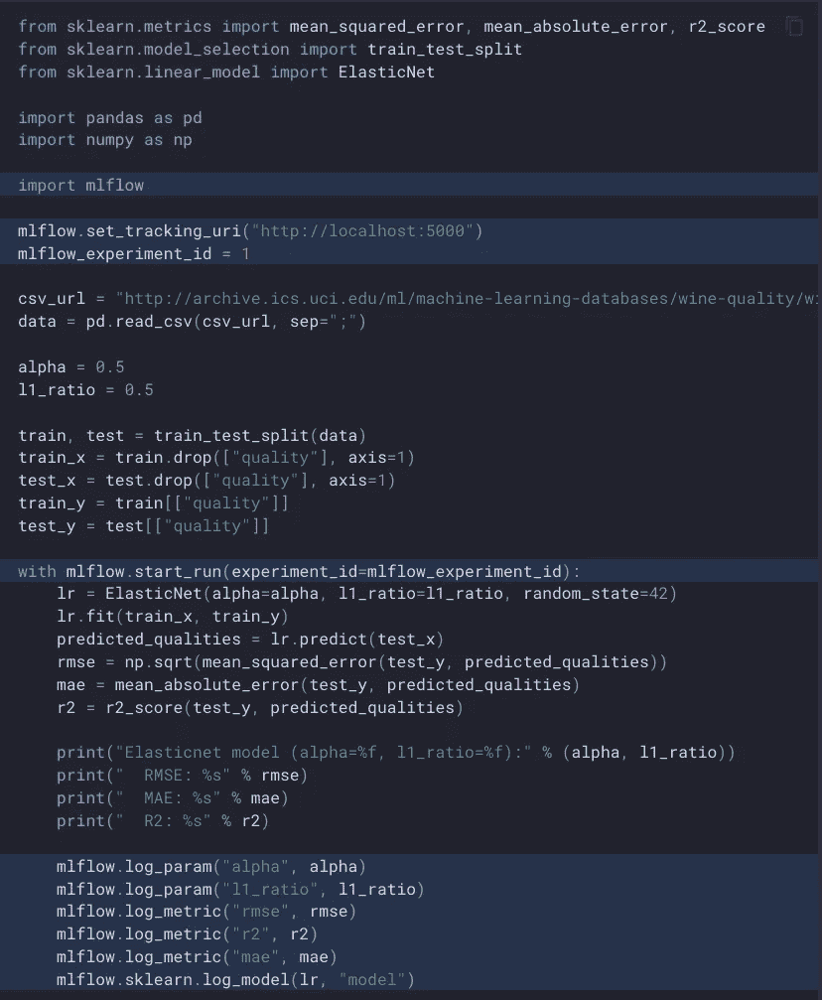
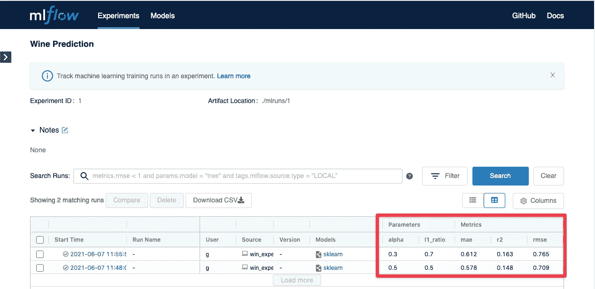
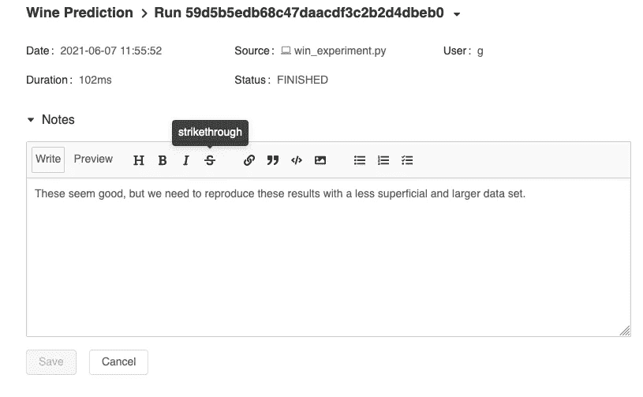

# 我们如何用 MLFlow 追踪机器学习实验

> 原文：<https://towardsdatascience.com/how-we-track-machine-learning-experiments-with-mlflow-948ff158a09a?source=collection_archive---------37----------------------->

## 正确跟踪你的机器学习实验比你想象的要容易

来源:作者

当您建立机器学习模型时，通常会运行几十个或数百个实验来找到正确的输入数据、参数和算法。你做的实验越多，就越难记住什么有效，什么无效。

有时你看到一个很好的结果，但是因为它需要几个小时或几天才能产生，你已经改变了代码。而现在你不记得你用什么参数得到那个结果了！

当然，这是所有科学研究的永恒问题。这是一个传统上由实验室笔记本解决的问题:一本科学家仔细记录他们进行的每个实验的日志。

莱纳斯·鲍林实验笔记本的一页。来源:作者

许多数据科学家遵循类似的方法，用数字或手工记录他们的实验。但这并不总是适用于机器学习。您需要跟踪三件事情:[数据、代码和模型](https://datarevenue.com/en-blog/software-development-vs-machine-learning-engineering)。即使你记笔记非常精确，也不可能把所有事情都完整地记录下来。

幸运的是，您可以使用 MLFlow 自动跟踪实验。它不仅设置简单，而且很容易适应您现有的工作流程。

# 什么是 MLFlow？

MLFlow 是一个广泛的机器学习平台，有几个组件。我们现在只关注它的实验跟踪特性。我们之前已经讨论过[模型注册中心以及它们为什么有价值](https://datarevenue.com/en-blog/why-is-a-model-registry-valuable)。实验跟踪和模型注册之间肯定有一些重叠，但它们并不相同。

# 实验跟踪与模型注册

模型注册是为系统经理准备的，关注于**生产的模型**。另一方面，实验跟踪工具是让科学家跟踪所有的实验，包括不成功的实验。

注册中心跟踪并可视化这些模型的性能和相关元数据。但对于生产中的每个模型，通常都有数百次失败的尝试。实验跟踪是为科学家和研究人员设计的，有助于理解不成功和尚未成功的实验。通过确保工作不会丢失或重复，它使研究过程更有效率。

# MLFlow 的 Python 库和仪表盘

您将用于实验追踪的 MLFlow 的两个组件是其 Web UI 和 Python 库。您可以通过运行一个 install 命令来获得这两者:

*pip 安装 mlflow*

通过运行 *mlflow ui* 并在浏览器中访问 [http://localhost:5000](http://localhost:5000) ，您可以立即查看所有实验所在的仪表板。

MLFlow 仪表板的默认视图。来源:作者

这个仪表板已经有了一系列类似于实验室笔记本的功能:你可以做笔记，搜索以前的数据，并设置新的实验。

当您将它与您刚刚安装的同一个 *mlflow* Python 库结合使用时，事情会变得更加有趣。通过在现有的机器学习代码文件中添加几行代码，您可以轻松地跟踪每一次运行。这将自动保存您使用的参数、结果，甚至完整的模型二进制文件。

下面的截图展示了如何用大约十行代码开始自动跟踪你的实验。

使用 MLFlow 跟踪预测葡萄酒质量的代码。来源:作者

突出显示的行是特定于 MLFlow 的，而其余的是预测葡萄酒质量的标准 scikit-learn 示例。

每当您用这段代码运行一个实验时，它都会记录一个条目，您可以在仪表板中查看。请注意以下几点:

*   在 Python 代码中，我们引用了一个*实验 id`。在 UI 中创建新实验后，您可以在仪表板中看到这一点。一个实验可以运行多次，因此每次尝试新的超参数或其他变化时，您都不需要新的实验 ID。*
*   您现有的培训和评估代码需要在 *mlflow.start_run* 块内。
*   您可以使用方法 *log_param、* *log_metric* 和 *sklearn.log_model* 记录参数、度量和整个模型。

显示两次运行的 MLFlow 仪表板。来源:作者

从这里，您可以随心所欲地更改参数，而不用担心忘记您已经使用了哪些参数。例如，在屏幕截图中，您可以看到 MLFlow 跟踪了两个实验的结果，在这两个实验中，我们更改了 *alpha* 和 *l1_ratio* 参数，从而很容易比较这些指标如何影响 r2 和 rmse 性能。

# 保存自由格式的笔记

许多科学家保留自己的笔记本而不是使用结构化平台的原因是，他们觉得预先创建的模板不够灵活。

我们喜欢 MLFlow 的一点是，您可以在不同的级别保存笔记:与整个实验或特定运行相关的笔记。

MLFlow 的笔记功能。来源:作者

# MLFlow 内部工作方式

MLFlow 可以用不同的方式设置。您可以在本地完成，就像我们在上面的例子中所做的那样，或者在远程服务器上完成，这样您就可以在整个科学家团队之间共享一个仪表板。

如果您在本地安装它，您会注意到它在您执行 Python 代码的同一个目录中创建了一个名为“mlruns”的目录。在这个目录中，您可以找到完整的模型二进制文件(如*)。pkl* 文件)。

如果您想要跟踪大量的模型，并且需要更多的空间，您可以配置 MLFlow 将这些文件存储在 S3 或另一个云存储提供商上。

# 扩展您的机器学习基础设施

我们使用 MLFlow 作为我们[开放式 MLOps 架构](https://github.com/datarevenue-berlin/OpenMLOps)的一部分。您可以单独使用 MLFlow，但它也可以与其他 MLOps 组件配合使用，例如用于调度和管理任务的[提督](https://datarevenue.com/en-blog/what-we-are-loving-about-prefect)，以及用于轻松协作的基于云的 Jupyter 笔记本环境。

我们喜欢讨论构建和跟踪机器学习模型的挑战。如果您想讨论您团队的机器学习方法，请联系我们。