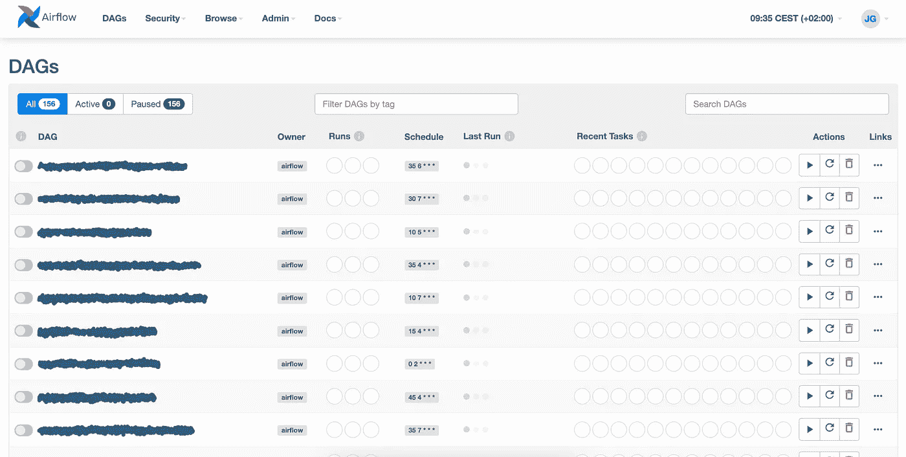

# 我们如何将气流用于 SQL 警报和松弛通知

> 原文：<https://towardsdatascience.com/how-we-use-airflow-for-sql-alerts-and-slack-notifications-5becedfc03fd?source=collection_archive---------17----------------------->

## 在加载数据时，当事情没有按计划进行时，使用气流来获得关于松弛的通知

在 [Sirena](https://sirena.app/) ，我们使用 [Apache Airflow](https://airflow.apache.org/) 来运行我们所有的数据编排。Airflow 是一个开源工具，由 Airbnb 创建的[，用于创建和调度数据工作流。本质上，Airflow 是一个管弦乐队，它以给定的频率运行任务，同时还处理回填、任务依赖等等。在 Airflow 中，工作流被定义为有向无环图(Dag ),它定义了不同任务之间的依赖关系。](https://airbnb.io/projects/airflow/)

在 Sirena，除了帮助我们将数据从一个地方转移到另一个地方，我们还发现了气流的另一种用途。我们还使用它来触发某些数据质量指标的警报。这个想法很简单，我们定义一个 SQL 查询，然后为结果定义一个条件。该查询应该输出一个数字，如果该数字不符合条件，那么我们将发送一个 Slack 警报。它的美妙之处在于它们的制作非常简单。我们已经对警报进行了参数化，允许我们在 [YAML](https://yaml.org/) 中创建配置文件，这些文件将作为 Dag 在 Airflow 中具体化(关于这一点的更多信息，请参见未来关于 Airflow factories 的帖子……)。这些警报对于确保数据管道没有发生灾难性事件特别有用。

在这篇文章中，我将指导您为您的 Airflow 实现建立一个类似的工作流。

# 配置文件

在我们深入研究 Python 代码之前，让我们停下来想一想我们希望我们的配置文件是什么样子。除了在 Airflow 中创建 Dag 所需的所有“必需”字段，如名称、间隔、所有者等。我们还需要一些其他的东西。

可以说，最重要的字段是我们将用来实际定义警报的字段。为此，我们将需要一个字段来写我们的 SQL 查询和我们的条件，比如"*大于 5* "之类的。我们将把我们的条件一分为二。标准(`greater than`、`less than`等)和我们的目标值。

除此之外，我们还需要定义我们希望如何通知，我们希望通知谁，以及实际的消息是什么。正如我之前提到的，在 Sirena 中我们使用 Slack 来发送通知，所以我们的通知方法是 Slack。我们的收件人来自 Slack 频道或用户列表，但我们有一个专用频道来接收所有数据团队的通知。最后，我们将使用警报的描述来发送描述性消息，让我们知道发生了什么。

注意，我们定义了一个`notifier`。这允许我们配置我们将使用什么服务向我们的列表`recipients`发送通知。

我们可以为我们想要设置的每个警报创建一个配置文件，并将它们全部存储在`/dags/alerts/`中，我们的 DAG 工厂将从这里获取所有这些配置文件，并创建必要的 DAG。我们的 DAG 工厂将从这个目录中获取所有的配置文件，这就是为什么这个`enabled`属性会派上用场。我们可以使用它来启用/禁用警报，而不必删除整个文件。

# 警报工厂

现在我们可以跳到我们的警报工厂。**我建议你** [**关注我的博客**](https://juangesino.medium.com/) **以获取即将发布的所有关于 DAG 工厂在气流中的帖子**。现在，重要的是要知道工厂本质上是一个 Python 脚本，它将遍历`/dags/alerts/`中的所有配置文件，并为每个文件创建一个 DAG。它的代码非常简单，但是让我们一起来看一下。

我们要做的第一件事是从`/dags/alets/`导入所有的配置文件并迭代它们。对于它们中的每一个，我们都希望创建一个 DAG，为了做到这一点，我们实现了一个函数`create_dag_alert`，它接受配置文件(作为一个 Python 字典)并返回一个带有一个使用`PythonOperator`的单一任务的气流 DAG。

让我们将这个函数分成不同的部分，这样我们就可以一部分一部分地检查它:

## 第 1 部分:定义 DAG

我们首先基于配置文件为 DAG 定义一些默认参数。你可以看到，对于其中一些值，我们实际上使用了配置文件(例如`owner`和`schedule_interval`)，但是对于其他一些值，我们只是硬编码了我们想要使用的值(例如`retries`和`catchup`)。这取决于你，我们目前没有看到将这些添加到配置文件中有太多的价值，但我们可能会在某个时候这样做。关键是，不要拘泥于这种做法，做对自己最有效的事情。

## 第 2 部分:任务功能

这其实是工厂的大头。这里我们想要做的是创建一个将使用`PythonOperator`执行的函数。本质上，这个函数应该确定条件是否满足，如果不满足，就发出通知。

我们首先从配置文件中获取查询，并针对我们的数据仓库运行它(在我们的例子中是雪花，但这应该适用于任何数据仓库)。然后，我们根据 YAML 文件中配置的目标值评估结果，并使用我们指定的标准进行比较。之后，我们检查是否需要通知，如果需要，我们将根据选择的通知程序调用适当的函数。

## 第 3 部分:设置 DAG 和任务

最后，我们只需要向 DAG 添加一个任务，使用`PythonOperator`执行`_run_alert`函数。

回到原点，注意我们如何返回我们创建的 DAG (dag ),以便我们可以使用它并将其添加到全局范围。

# 结论

现在，关于这个实现有很多要说的。我认为最重要的一点是 DAG 工厂方法，以及编写新警报是多么简单。但是在以后的文章中会有更多的介绍。关于警报本身，最好记住这不会取代您的数据质量工具，如 [great_expectations](https://greatexpectations.io/) ，甚至 [dbt tests](https://docs.getdbt.com/docs/building-a-dbt-project/tests) 。此外，同样地，great_expectations 和 dbt 测试可以和谐共处，我看到了这些 SQL 警报与这些其他工具相结合的地方。我的想法是，您可以使用这些 SQL 警报进行数据加载，使用 dbt 测试来测试您的转换，并对您的最终产品寄予厚望，以确保您的数据利益相关者使用可靠的数据。

回头看看实现本身，在我写这篇文章的时候，我注意到这段代码需要重构，有些东西可以用更简洁的方式实现。但是，嘿，我把它作为一个练习留给读者去寻找更好的方法来改进这个脚本，甚至可能把它扩展到更多更好的用例。在任何情况下，希望这是一个有用的基础，并激发您的创造力，以改进关于数据加载到数据仓库的通知。