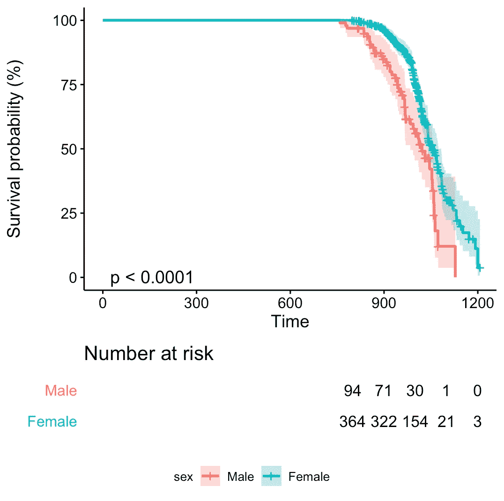
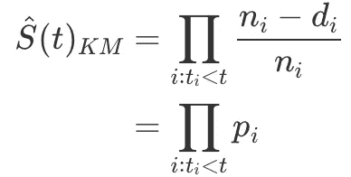
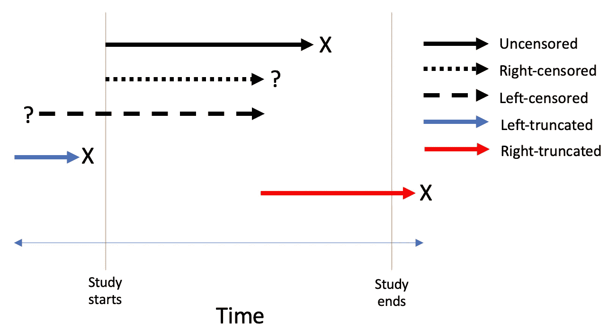
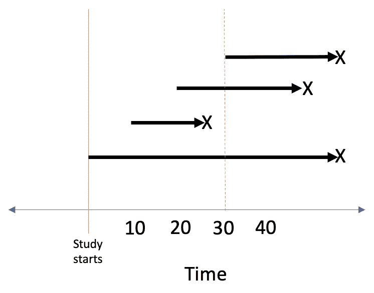
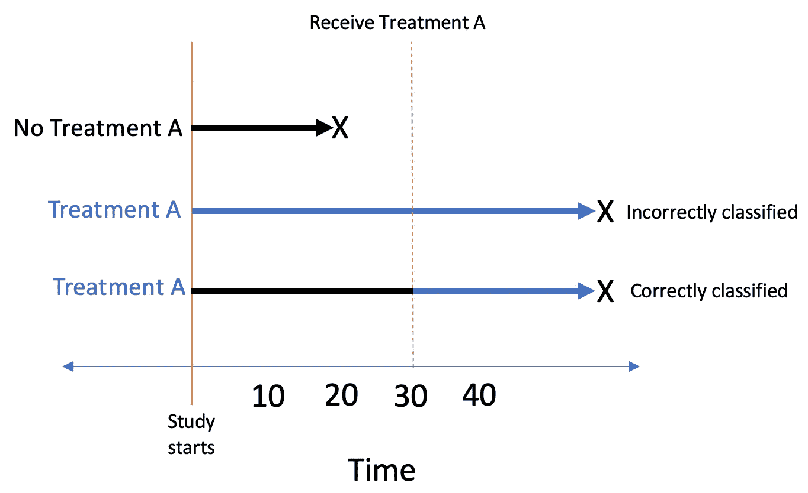

# 你“真正”了解生存分析吗？

> 原文：<https://towardsdatascience.com/how-well-do-you-really-know-survival-analysis-221885b89a8e?source=collection_archive---------12----------------------->

## [入门](https://towardsdatascience.com/tagged/getting-started)


由[乔纳森·博尔巴](https://unsplash.com/@jonathanborba?utm_source=medium&utm_medium=referral)在 [Unsplash](https://unsplash.com?utm_source=medium&utm_medium=referral) 上拍摄的照片

"你能描述一下这些卡普兰-迈耶曲线中发生了什么吗？"面试官问我。我当然知道那些是什么，当他们催促我说更多的时候，我确实很震惊——我不知道我还能说什么。于是，我结结巴巴地找到了一个答案，过了一会儿，面试官们都点了点头，感谢我抽出时间。

我没有得到那份工作。

尽管我把生存分析作为我的技能之一写在了我的简历上——而且我也合法地学习和使用了它——但后来我意识到我的理解仍然存在漏洞。生存分析是一个庞大的主题，可以从不同的层面进行探讨(这里是一些常见主题的概述[这里是](https://www.emilyzabor.com/tutorials/survival_analysis_in_r_tutorial.html#Part_1:_Introduction_to_Survival_Analysis)以及深入数学的示例[这里是](https://math.tntech.edu/machida/counting/page9.html))。这篇文章是我试图更严格地教会自己一些生存分析中固有的偏见，并与更多的读者分享这些信息。虽然有许多不同种类的偏差(你可以看到一个相当全面的，但不是详尽的，这里列出)，我将重点关注**长度偏差**和**时间相关偏差**(注意这些偏差有许多其他名称)。最后，我给那些曾经怀疑我真的了解自己的东西的人一些建议？

当你通读这篇文章的时候，有一些事情需要记住(我们很快会回到这个话题):



你相信这张图表向你展示的吗？

所以问问你自己:

> 你对生存分析有多了解？

# 关键生存概念

本文将假设您对生存分析和流行病学中一些更常见的主题有所了解，所以我不会涉及太多的技术细节。在这一节中，我将描述一些贯穿始终的关键概念。

**生存分析**是一个统计字段，它考虑了一个随机变量， *X，*，它代表了事件发生前的某段时间。这个事件可以是好的，比如肿瘤缓解，也可以是坏的，比如死亡。表征 *X、*的方法有很多，但我只会简单介绍一种:生存函数**。**

****生存函数**代表个体存活超过时间 *x 的概率。*这个量应该严格递减。当我们知道我们所有观察的结果时，我们可以凭经验估计生存函数——在任何时间 *x，*生存函数是尚未经历该事件的人或事物的比例。然而，在真实数据中，往往不是这样。要么研究在我们观察到所有研究参与者的事件之前结束，要么参与者退出并离开研究。因此，我们引入一个叫做**审查的概念。**这是一个二元变量，按照惯例，被审查的参与者要么没有经历过这个事件，要么已经退出，因此我们无法再观察他们。如果你忽视审查，你就高估了生存概率。**

**快速说明一下，审查应该是随机的。举个例子，假设我们正在进行药物 X 的临床试验，但它似乎在亚洲男性中引发了非常痛苦的副作用。所以当所有亚洲男性退出时，研究样本变得有偏差，我们失去了关于药物 X 对整个群体的实际影响的信息。**

**回到估计生存函数。当我们没有每个人的结果信息时，我们使用 **Kaplan-Meier 估计值**。**

****

**其中 n_i 代表仍未经历该事件的观察值的数量，d_i 代表在时间 t_i 经历该事件的观察值的数量**

**如果我们在 *x 轴*上绘制时间，在 *y 轴*上绘制卡普兰-迈耶估计量，我们会得到**卡普兰-迈耶曲线**。**

**还有一个关键术语我不得不介绍:**截断**。这通常与审查相混淆——我花了一段时间才自信地区分这两者。这可能通过图表更容易理解。**

****

**截尾与截断图**

****左截断**发生在由于研究设计的原因，只记录了存活超过一定时间的个体的数据时。我们通常将在研究开始之前经历过该事件的个体(因此，不包括在研究中)称为**。**我能想到的最简单的经验法则(对于相当棘手的话题！)截断和删截的区别在于，**删截的个体仍然是研究的*部分，而截断的个体则不是。*** (注意，当我们处理*多个事件时，这个经验法则开始失效，*参见[这篇文章](https://www.ncbi.nlm.nih.gov/pmc/articles/PMC3121224/#:~:text=Left%20truncation%20occurs%20when%20individuals,understood%20and%20implemented%20by%20epidemiologists.)获得更深入的解释)。忽略截断**会产生一个有偏差的估计**，因为我们试图从我们的*样本*中得出一个关于总体*人口*的结论，这个样本甚至不包括被截断的个体。我发现有一个简单的自测题有助于确定你的数据是否被截断，那就是*我的研究中可以不包括某些人吗？***

**希望你已经做到了这一点——这就是我愿意在本文中包含的所有数学知识！正如我在开始时提到的，本文假设对生存分析有一些基本的理解，所以理想情况下，前面的部分更多的是作为复习而不是介绍。**

# **长度偏差**

## **背景**

**长度偏差是我们要讨论的第一个偏差(我在两段前提到过它！).它也被称为*长度-时间偏差*、*长度偏差抽样、生存偏差、生存偏差、延迟进入偏差*等等。它发生在我们**忽略左截断**的时候。考虑左截断意味着调整*风险集、*或仍未经历该事件的人数，以仅包括在每个事件时间已经进入研究**的人。**让我用一个玩具例子来演示一下:**

****

**x 表示一个事件**

**如果我们想估计我们在**时间 30** 的生存函数，正确调整左截断，我们将得到 2/3，或 66%的存活率。如果没有正确考虑左侧截断，我们将包括在时间 30 时尚未进入研究的顶级个体，并错误地计算 3/4，或夸大的 75%存活率。你看到我们的估计*是如何偏向上方*的了吗？因为我们的样本错误地包括了每个人，假设每个人都是研究的一部分。**

## **r 使用真实数据进行演示**

```
install.packages("pacman")
pacman::p_load(tidyverse, broom, survival, survminer, KMsurv)# KMsurv provides datasets from Klein and Moeschberger (1997)data(channing)
```

**让我们先来看看我们正在处理的数据:**

```
head(channing, 5) obs death ageentry  age time gender
1   1     1     1042 1172  130      2
2   2     1      921 1040  119      2
3   3     1      885 1003  118      2
4   4     1      901 1018  117      2
5   5     1      808  932  124      2
```

**`death`是审查变量，`ageentry`表示个人进入研究时的年龄(以月为单位)(又名**观察到的** **截断时间**),而`age`表示他们经历事件/成为审查对象时的年龄(以月为单位)。在这种情况下，起源时间是出生(因为我们正在处理年龄)，但在其他研究中，起源时间可以是疾病诊断年，例如，然后时间尺度将是日历年。在这个例子中，我们问的问题是“人们进入养老院后能活多久？”**

**你还记得我一开始给你看的图表吗？如果我从表面上看这张图表，我会得出结论，性别与这个养老院的不同存活率有关，随着时间的推移，男性的平均存活率低于女性！**

****

**与本文前面的图表相同**

**但是你猜怎么着，这是因为我忽略了左截断。在采访中，这是他们希望我思考的类型，但我不知道。**

**为了夸大忽略左截断的影响，我稍微修改了数据。我在这个数据集中随机挑选了 50 名男性，并将他们的事件时间`age`设置为等于他们的进入时间`ageentry`。这 50 只雄性现在是**左截断**。**

```
set.seed(47)
male_indices <- which(channing$gender == 1)
truncated_sample <- sample(male_indices, 50)
xchanning <- channing %>%
  mutate(id = row_number(),
         age = case_when(id %in% truncated_sample ~ ageentry,
                          TRUE ~ age),
         time = age - ageentry)
```

**然后我定义了一个函数来拟合 KM 曲线，不需要调整左截断。**

```
fit_naively <- function(data) {
  naive_fit <- survfit(Surv(age, death) ~ gender, data = data)
  plot <- survminer::ggsurvplot(naive_fit, 
                        data = data,
                        conf.int = T,
                        risk.table = T,
                        pval = T,
                        fun = "pct",
                        legend = "bottom",
                        legend.title = "sex",
                        legend.labs = c("Male", "Female"),
                        tables.theme = theme_cleantable())
  return(list(fit = naive_fit,
              plot = plot))
}fit_naively(xchanning)$plot
```

**就像在我们的玩具例子中一样，生存估计器没有考虑左截断，即个人在特定时间没有技术上进入风险集，并且*高估了生存概率*。长度偏差源于这样一个事实，即为了被纳入本研究(即进入养老院)，一个人必须存活足够长的时间！**

**在*设计*阶段考虑左截断为时已晚，但我们仍然可以通过使用 R `survival`包在*分析*阶段考虑左截断。我们简单地将`Surv`对象指定为:`Surv(truncation_time, time_to_event, status, type = "counting")`的形式，并过滤掉那些在研究期开始时被左截断的对象，因为他们不应该被包括在风险集中(通常，在实际设置中，我们甚至没有关于那些在研究开始前经历过事件的人的数据，因为我们永远不会知道这些人！).**

```
fit_with_lt <- function(data) {
  adj_fit <- survfit(Surv(ageentry, age, death, type = "counting") ~ gender, data = data %>% filter(age > ageentry))
  plot <- survminer::ggsurvplot(adj_fit, 
                        data = data,
                        conf.int = T,
                        risk.table = T,
                        fun = "pct",
                        legend = "bottom",
                        legend.title = "sex",
                        legend.labs = c("Male", "Female"),
                        tables.theme = theme_cleantable())
  return(list(fit = adj_fit,
              plot = plot))
}
```

**要了解性别效应是如何产生偏差的，最简单的方法就是用`coxph`运行一个 Cox PH 模型。我不会在这篇文章中解释这一点，因为担心这篇文章会比现在更长，但是你可以在这里查看一个简单的解释。**

```
naive_cox_x <- coxph(Surv(age, death) ~ gender, data = xchanning)
broom::tidy(naive_cox_x, exponentiate = T)# A tibble: 1 x 5
  term   estimate std.error statistic  p.value
  <chr>     <dbl>     <dbl>     <dbl>    <dbl>
1 gender    0.561     0.173     -3.34 0.000823adj_cox_x <- coxph(Surv(ageentry, age, death) ~ gender, data = xchanning)
broom::tidy(adj_cox_x)# A tibble: 1 x 5
  term   estimate std.error statistic p.value
  <chr>     <dbl>     <dbl>     <dbl>   <dbl>
1 gender    0.791     0.232     -1.01   0.311
```

**你看到如何解释左截断(解释在我们修改的数据集中*没有*包括在研究中的人)表明性别与长期存活率没有真正的联系吗？简而言之，`coxph`函数通过计算生存来解决左截断问题(技术上的风险，但本文没有涉及！)函数，其条件是人们存活足够长的时间以进入研究。**

****总是占截断；否则，您可能会得到一些不正确的、有偏见的结果。****

# **时间相关偏差**

## **背景**

**我想回顾一下生存分析中一种更常见的偏见。这种偏差在您的数据中可能以不同的形式表现出来，但本质上是当一个**时间相关的暴露**(一个您期望随时间变化的暴露)被错误地分析为一个不变的基线协变量时。这种偏差也被称为*不朽时间偏差*或*幸存者治疗选择偏差*。让我用一个玩具例子来演示一下。在这个例子中，假设我们对一个叫做治疗 a 的暴露感兴趣。**

****

**x 表示一个事件**

**在这个假设的研究中，治疗 A 仅在时间 30 分配。不言而喻，活不到时间 30 的患者将无法接受治疗 A。然而，对于那些接受治疗的患者来说，将患者归类为在时间 30 之前接受治疗 A *将是一个错误，因为这必然会使结果**偏向于研究中的暴露(如治疗),因为暴露组获得了虚假的生存优势。**从概念上讲，只有当一个人实际受到暴露时，我们才应将人-时间分类为暴露。***

## **r 使用真实数据进行演示**

**处理时间相关偏差的分析方法与处理长度偏差的方法非常相似，但是**两种偏差是不同的**。时间依赖偏差从根本上说是一种信息误分类偏差，而长度偏差从根本上说是一种选择偏差。**

**让我们先来看看我们正在处理的数据:**

```
cgd <- survival::cgd0
head(cgd %>% select(id, treat, futime, etime1:etime7))id treat futime etime1 etime2 etime3 etime4 etime5 etime6 etime7
1     1    414    219    373     NA     NA     NA     NA     NA
2     0    439      8     26    152    241    249    322    350
3     1    382     NA     NA     NA     NA     NA     NA     NA
4     1    388     NA     NA     NA     NA     NA     NA     NA
5     0    383    246    253     NA     NA     NA     NA     NA
6     1    364     NA     NA     NA     NA     NA     NA     NA
```

**慢性肉芽肿病(CGD)是一组不常见的遗传性疾病，以反复感染为特征，通常在生命早期开始，并可能导致儿童期死亡。在 1986 年，基因泰克公司进行了一项随机、双盲、安慰剂对照试验，其中 128 名 CGD 患者在一年(`treatment`)内每天三次接受试验药物或安慰剂。收集了所有严重感染的数据，直到随访结束`futime`，对于大多数患者来说，这发生在第 400 天之前。`etime`代表患者感染的日期。例如，患者#1 在第 219 天和第 373 天有 2 次感染。研究的问题是这种治疗对与感染相关的存活率是否有影响。**

**我们需要更改这个数据集，以便每行的每个感染之间有时间间隔。下面的代码不是最漂亮的，但是它用`survival::tmerge()`完成了工作。有关`tmerge`正在做什么的更多信息，请参见本文第[页。](https://cran.r-project.org/web/packages/survival/vignettes/timedep.pdf)**

```
newcgd <- tmerge(cgd %>% select(-starts_with("etime")), cgd, id=id, tstop=futime,
                 infect = event(etime1), infect= event(etime2),
                 infect = event(etime3), infect= event(etime4),
                 infect = event(etime5), infect= event(etime6),
                 infect = event(etime7))
newcgd <- tmerge(newcgd, newcgd, id=id, enum=cumtdc(tstart))head(newcgd %>% select(id, treat, infect, futime, tstart, tstop, enum))id treat infect futime tstart tstop enum
1     1      1    414      0   219    1
1     1      1    414    219   373    2
1     1      0    414    373   414    3
2     0      1    439      0     8    1
2     0      1    439      8    26    2
2     0      1    439     26   152    3
```

**如果我们忽略与时间相关的偏差，这意味着将治疗视为非时变的，我们将得到如下错误结果:**

```
coxph(Surv(futime, infect) ~ treat + cluster(id), newcgd) %>%
  broom::tidy(exponentiate = T)# A tibble: 1 x 6
  term  estimate std.error robust.se statistic p.value
  <chr>    <dbl>     <dbl>     <dbl>     <dbl>   <dbl>
1 treat    0.578     0.266     0.349     -1.57   0.117
```

**为了说明这种偏差，我们使用了一种类似的`Surv`方法，通过指定两个时间点来说明左侧截断偏差。**

```
coxph(Surv(tstart, tstop, infect) ~ treat + cluster(id), newcgd) %>% 
  broom::tidy(exponentiate = T)# A tibble: 1 x 6
  term  estimate std.error robust.se statistic  p.value
  <chr>    <dbl>     <dbl>     <dbl>     <dbl>    <dbl>
1 treat    0.334     0.261     0.312     -3.51 0.000446
```

**我们可以看到，不考虑时间依赖性偏倚**低估了风险比**，在这种情况下，治疗对感染率没有显著影响。然而，实际上，治疗确实对感染率有显著影响，接受治疗的人感染的可能性是没有接受治疗的人的 0.3 倍。**

**关于这一点的更深入的解释，请参见这篇[文章](https://cran.r-project.org/web/packages/survival/vignettes/timedep.pdf)。**

****始终考虑时间相关偏差；否则，你可能会低估暴露患者的风险，高估未暴露患者的风险。****

# **总结想法**

**观察性研究中的生存分析非常普遍，需要很好地理解这些偏差，以减少错误的结论。**

**我将以从技术角度后退一步来结束我的演讲。理解是一种光谱。我很难接受面试结果，因为我想了很久，这意味着我根本不懂生存分析。那根本不是真的。总有更深更复杂的东西需要理解。在生存分析的情况下，我相信许多人能够告诉你它是什么，但是更深入的理解最终是你的研究与其他人的区别。熟能生巧，努力学习并投入时间会对这门学科有更严格的掌握。我想我想说的是:如果你想在生活中真正推进一个领域，一个话题或任何东西，不要放弃，继续学习！**