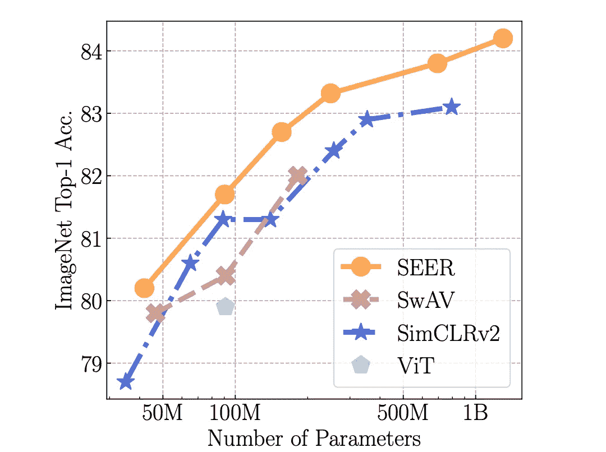
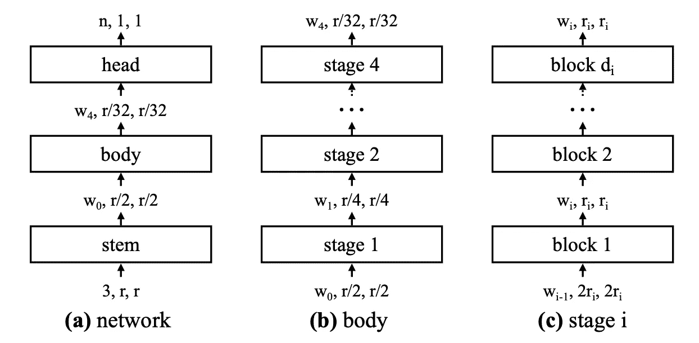
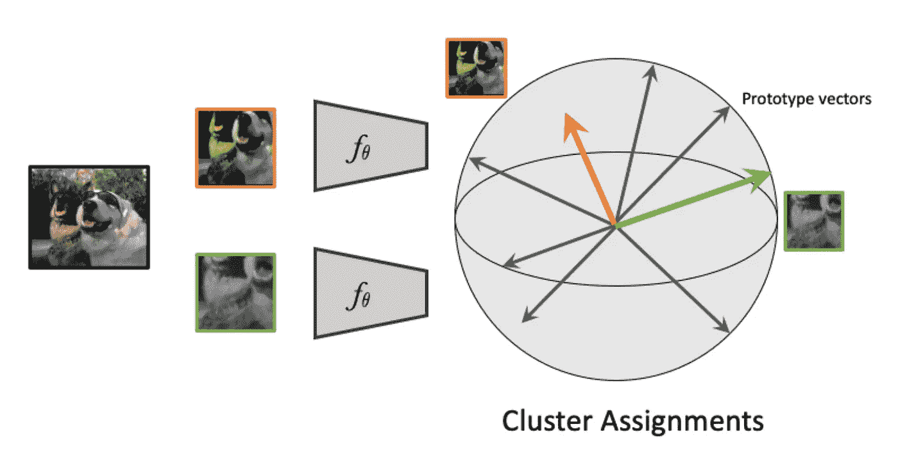
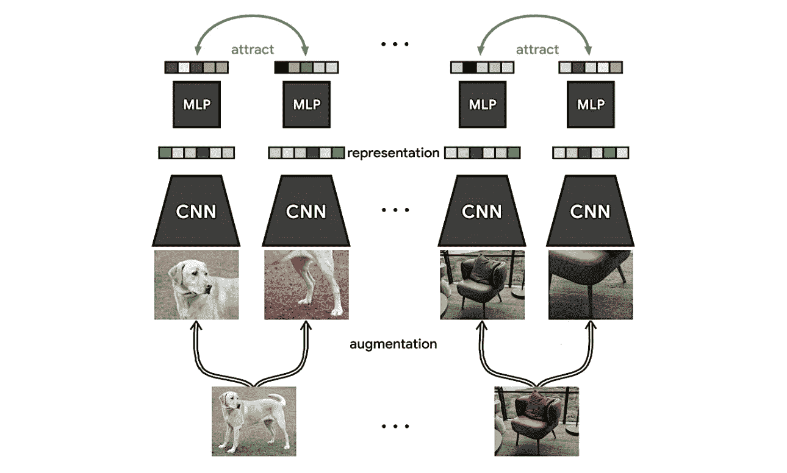
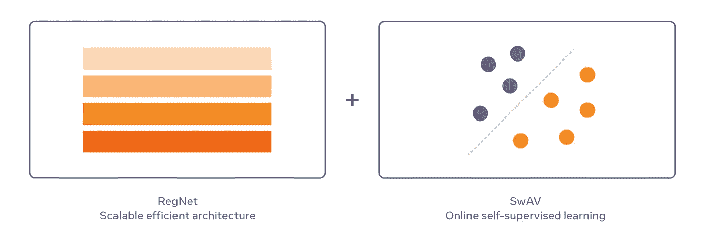
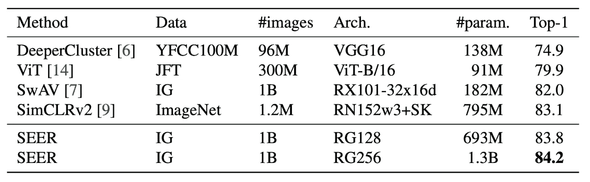
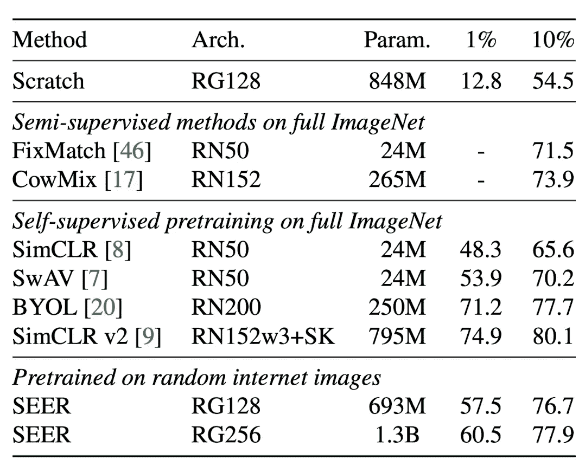
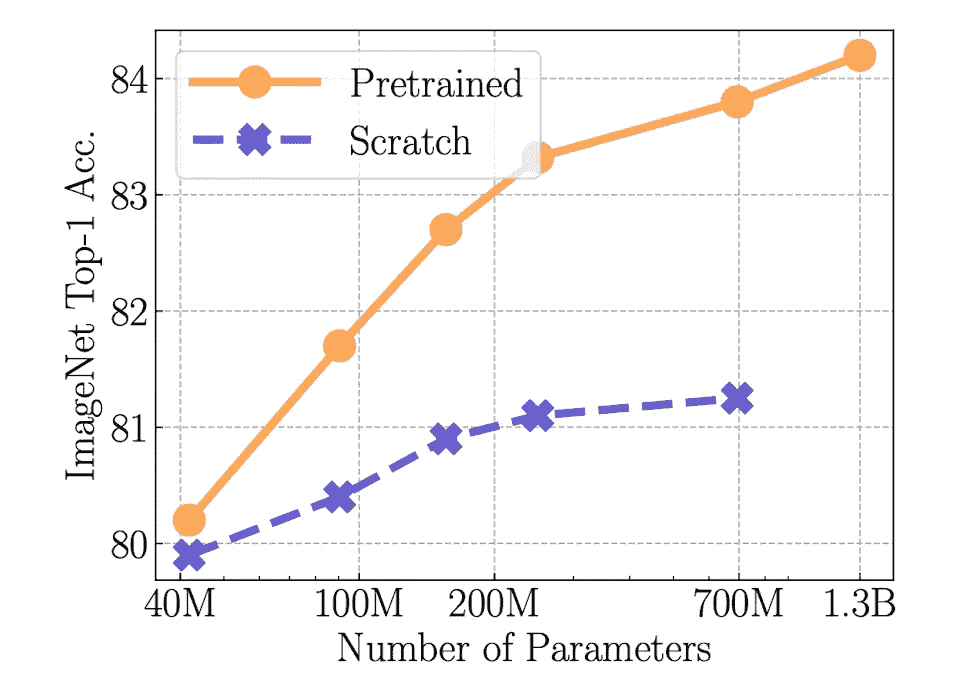
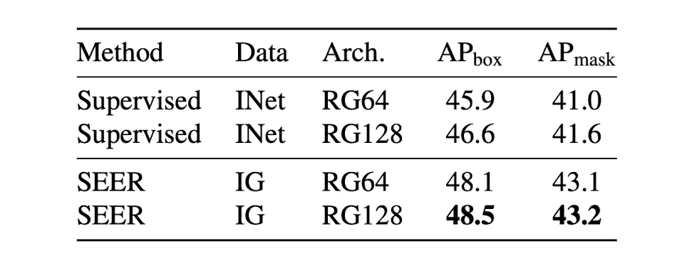

# 自我监督学习在现实世界中表现如何？

> 原文：<https://towardsdatascience.com/how-well-does-self-supervised-learning-perform-in-the-real-world-ece18b2d45f6?source=collection_archive---------26----------------------->

## 在随机互联网图像而不是 ImageNet 上预先训练模型

如果你一直在阅读最近关于自我监督预培训的出版物，你可能会注意到所有的新方法和技术大多是在 ImageNet 上评估的。ImageNet 数据集高度多样化，规模庞大，包含大量的类。它是专门为评估图像处理模型的性能而策划的，因此它无疑非常适合这项任务。但是相对来说，很少有人强调这些自我监督技术在其他图像数据集上的表现。未切割且包含大量随机影像的数据集。在他们的论文*“野外视觉特征的自我监督预训练”*中，Goyal 等人着手调查**当在一组随机、未切割的图像上进行训练时，自我监督预训练技术的感知性能是否成立**。

此图显示本文的主要模型 SEER 优于所有其他架构。来源:[【1】](https://arxiv.org/pdf/2103.01988.pdf)

# 先决条件

本文中介绍的 SEER 模型结合了计算机视觉的多项最新进展。

首先，它利用了一个新颖且可扩展的架构，名为 **RegNet** 。RegNet 由**量化的线性函数定义，以形成具有最佳宽度和深度的多个块的网络**。RegNet 有两种变体:RegNetX 使用传统 ResNet 的剩余块，RegNetY 利用挤压和激励块。我写了一整篇关于 RegNet 架构的文章，可以在这里随意阅读。

RegNet 各部分的图解。它由茎、体和头组成，如(a)所示。插图(b)和(c)更详细地展示了各个阶段和模块。来源:[【2】](https://arxiv.org/pdf/2003.13678.pdf)

SEER 论文的另一个重要组成部分是一种自我监督的预训练技术，称为 **SwAV** 。这种技术用于 SEER 模型和进行比较。 **SwaV 使用数据增强来形成同一图像的多个不同版本**。这些然后通过卷积神经网络创建一个潜在的表示。**然后，通过公式化**交换预测问题**，该向量被学习分配给 *K* 个原型向量**之一。如果你想更新你在 SwAV 上的知识，请在这里随意阅读我在报纸[上的故事。](https://medium.com/towards-data-science/paper-explained-unsupervised-learning-of-visual-features-by-contrasting-cluster-assignments-f9e87db3cb9b)

SwAV 训练过程的图解。来源:[【3】](https://arxiv.org/pdf/2006.09882.pdf)

最后，SEER 论文比较了它与另一种自我监督预训练技术 **SimCLR** 的性能。SimCLR 就像 SwAV 一样，使用**数据增强来形成同一图像的增强版本对**。这些然后被传递到一个卷积神经网络，形成一个特征向量。然后，这个矢量进入 MLP，形成最终的网络输出。SimCLR 使用了一种叫做 **NT-Xent** 的新型损失函数，它寻求吸引同一物体的不同表示。同样，如果你想更深入地了解 SimCLR，我在报纸上有一篇文章，你可以在这里阅读[。](https://medium.com/towards-data-science/paper-explained-a-simple-framework-for-contrastive-learning-of-visual-representations-6a2a63bfa703)

显示 SimCLR 训练过程的图。来源:[【4】](https://arxiv.org/pdf/2002.05709.pdf)

# 开发可受益于大型未切割图像数据集的模型

现在来看这篇论文的主要贡献。如前所述，**本文的一个主要目标是找出一个大的、未切割的图像数据集将如何影响自监督方法的性能**。此外，作者旨在开发一种方法，以超越其他当前最先进的技术。

为了实现这一点，**他们使用 SwAV 技术**来定义预训练流程。更具体地说，他们创建了分辨率为 2 x 224 和 4 x 96 的图像对，并将许多不同的数据放大传递到模型中。他们还定义 SwAV 具有 16K 原型向量，这是为该技术设置的一个重要的超参数。

对于模型架构，他们选择了前面提到的 **RegNet** ，具体来说，他们试验了一系列网络，即使用前面提到的**挤压和激励模块**的 **RegNetY-{8，16，32，64，128，256}GF** 。只有 RegNet 架构的巨大灵活性才能实现这种规格范围。在这个 RegNet 之上，他们定义了一个 3 层 MLP 投影头，以形成一个 256 维的输出向量

“SEER 将最近的架构家族 RegNet 与在线自我监督训练相结合，以在数十亿张随机图像上对数十亿个参数进行预训练。”。来源:[【5】](https://ai.facebook.com/blog/seer-the-start-of-a-more-powerful-flexible-and-accessible-era-for-computer-vision/)

整个 SEER 模型(SwAV with RegNet)是在**多个不同的数据集**上训练的，我们将在“结果”部分获得这些数据集**，其中最值得注意的是来自 Instagram** 的 10 亿张未切割图像。为了训练模型，作者使用了令人惊叹的**512 NVIDIA V100 32GB GPU**并训练了 122K 次迭代。现在，让我们看看 SEER 模型如何针对其他技术和不同的数据集进行测量。

# 结果

这里有很多东西要打开。让我们从自我监督学习模型的经典评估开始。

在不同数据集上进行预训练并在 ImageNet 上进行微调时，不同自我监督预训练方法的结果表。来源:[【1】](https://arxiv.org/pdf/2103.01988.pdf)

作为第一个实验的一部分， **SEER 在 Instagram 的 10 亿张随机图片上进行了预训练，然后在 ImageNet 上进行微调**。令人难以置信的是， **SEER 能够在 ImageNet top-1 精度上胜过所有其他方法**。值得注意的是，它可以胜过原始的 SwAV 论文，即使它使用了自我监督的预训练技术，只是使用了不同的网络架构。此外，**它的性能优于 SimCLRv2 模型，后者的参数比它的前身**更大。顶级精度和参数数量之间似乎也有关联:模型越大，性能越好。**有趣的是，SEER 优于所有其他方法，尽管它是唯一一种在随机图像上预先训练的方法**。SimCLRv2 甚至在 ImageNet 上进行了预训练，后来用于评估。

一个显示低镜头学习场景结果的表格。来源:[【1】](https://arxiv.org/pdf/2103.01988.pdf)

作者还定义了一个所谓的低镜头学习场景，即在预训练后，**仅使用 ImageNet 数据集**的 1%或 10%对模型进行微调(相比之下，第一次评估为 100%)。虽然 SimCLRv2 似乎是性能最好的模型，但由于在 ImageNet 上进行了预训练， **SEER 尽管之前没有见过 ImageNet 中的任何图像(在随机图像上进行了预训练)，但其性能几乎可以与之匹敌**。这再次表明，SEER 能够学习足够多的关于它在预训练期间所看到的视觉世界的知识，以将其知识足够好地转移到 ImageNet 分类任务。

显示正则分类精度与模型中参数数量关系的图表。来源:[【1】](https://arxiv.org/pdf/2103.01988.pdf)

另一个与论文高度相关的发现是，**随着 RegNet 中参数数量的增加，预训练模型相对于从头开始训练的 RegNet 的优势显著增加**。换句话说，如果您正在训练一个非常大的模型，那么与较小的模型相比，它更有可能受益于(自我监督的)预训练。

该表显示了使用 SEER 对下游任务(如对象检测和语义分割)进行预训练的性能。来源:[【1】](https://arxiv.org/pdf/2103.01988.pdf)

最后，让我们看看 **SEER 对下游任务**的影响。作者还在 MS COCO 数据集上使用预训练的 RegNet 主干训练了一个 **Mask R-CNN，用于对象检测和语义分割**。他们表明，与使用标签从零开始训练模型相比，**使用 SEER RegNet 主干**的模型在随机互联网图像**上预先训练，导致两个下游任务**的性能提高。

# 包装它

在本文中，您了解了 SEER，以及自我监督的预训练即使不与精选数据集结合使用也是有效的。这一点的含义相当深远:**我们可能离图像模型的完全无监督训练更近了一步**。虽然我希望这个故事让你对这篇论文有了一个很好的初步了解，但仍然有很多东西需要发现，特别是在结果和消融研究方面。因此，我会鼓励你自己阅读这篇论文，即使你是这个领域的新手。你必须从某个地方开始；)

如果你对论文中介绍的方法有更多的细节感兴趣，请随时在 Twitter 上给我留言，我的账户链接在我的媒体简介上。

我希望你喜欢这篇论文的解释。如果你对这篇文章有任何意见，或者如果你看到任何错误，请随时留下评论。

**最后但同样重要的是，如果你想在高级计算机视觉领域更深入地探索，考虑成为我的追随者**。我试着每周发一篇文章，让你和其他人了解计算机视觉研究的最新进展。

参考资料:

[1] Goyal，Priya 等人，“野外视觉特征的自我监督预训练” *arXiv 预印本 arXiv:2103.01988* (2021)。【https://arxiv.org/pdf/2103.01988.pdf 

[2] Radosavovic，Ilija 等人，“设计网络设计空间”IEEE/CVF 计算机视觉和模式识别会议文集。2020.[https://arxiv.org/pdf/2003.13678.pdf](https://arxiv.org/pdf/2003.13678.pdf)

[3]卡隆、玛蒂尔德等人，“通过对比聚类分配对视觉特征进行无监督学习。” *arXiv 预印本 arXiv:2006.09882* (2020)。[https://arxiv.org/pdf/2006.09882.pdf](https://arxiv.org/pdf/2006.09882.pdf)

[4]陈，丁等:“视觉表征对比学习的一个简单框架。”*机器学习国际会议*。PMLR，2020 年。[https://arxiv.org/pdf/2002.05709.pdf](https://arxiv.org/pdf/2002.05709.pdf)

[5]脸书人工智能研究博客文章:SEER:计算机视觉一个更强大、更灵活、更容易进入的时代的开始。[https://ai . Facebook . com/blog/seer-the-start-of-a-more-powerful-flexible-and-access-era-for-computer-vision/](https://ai.facebook.com/blog/seer-the-start-of-a-more-powerful-flexible-and-accessible-era-for-computer-vision/)