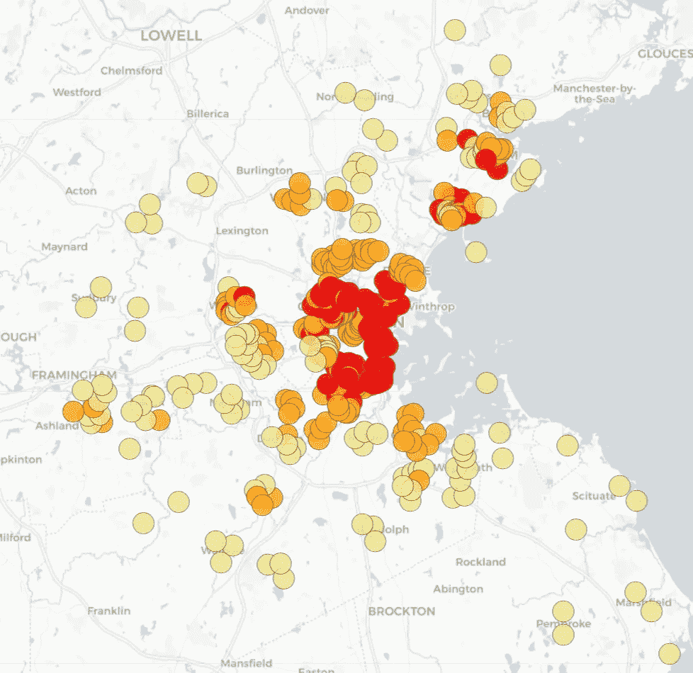
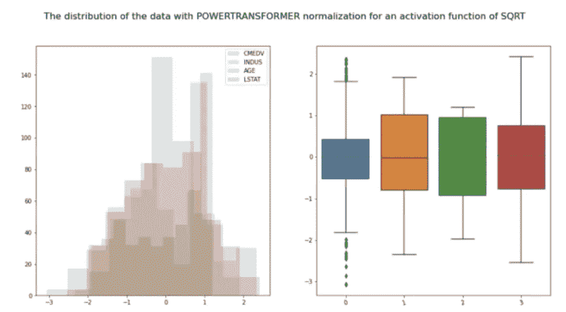
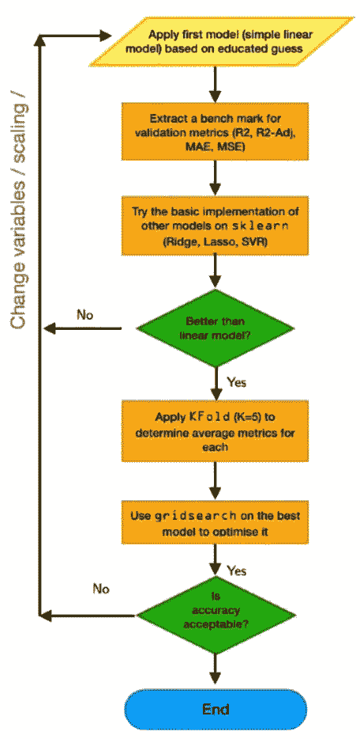
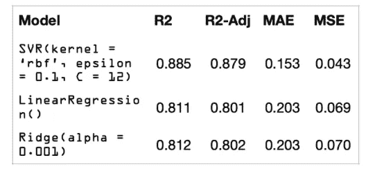
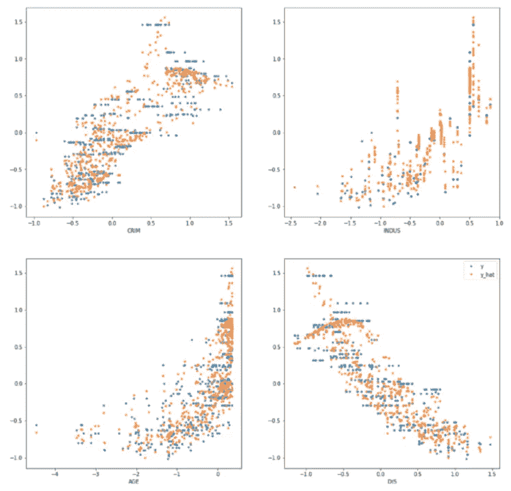
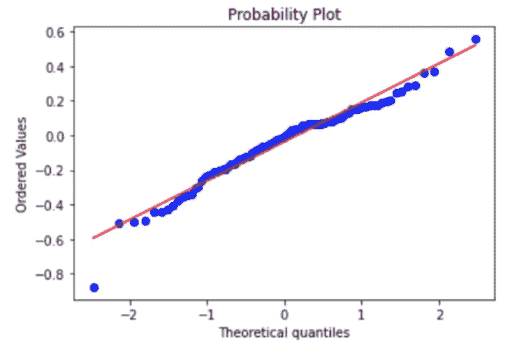
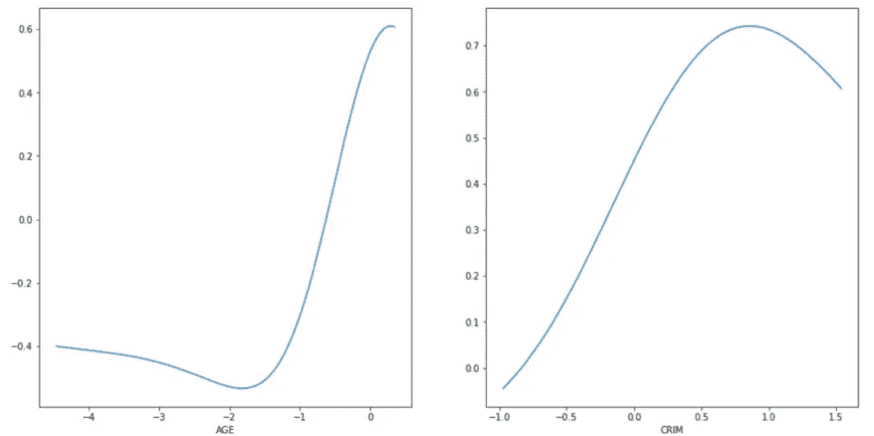
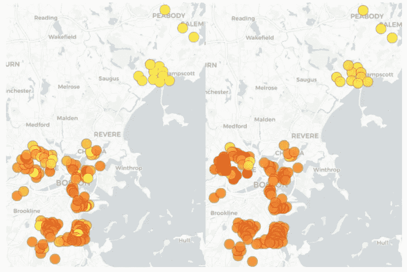
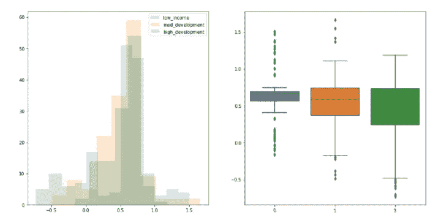
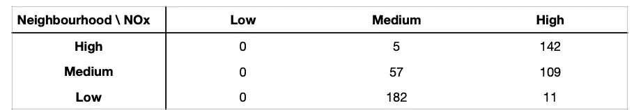

# 波士顿低收入社区的发展将如何影响氮氧化物水平？

> 原文：<https://towardsdatascience.com/how-will-developing-low-income-neighbourhoods-in-boston-affect-nox-levels-af5288b3c9ab?source=collection_archive---------37----------------------->

## 一篇**小说**对波士顿住房市场数据集的分析

来自 Unsplash 的 Cameron Venti 的照片([来源](https://unsplash.com/photos/_MjAjDQQgrY)

## 行动纲要

波士顿住房市场数据集无处不在，但并不完美:存在规模小、定义不一致和坐标不正确等问题。然而，它仍然是一个非常丰富的数据集，包含丰富的地理信息、强大的社会经济指标和连续的氮氧化物(NOx)水平。这个项目探索了**发展**低收入社区对氮氧化物的影响。该项目在 24 小时 [AI Hack 2021](https://2021.aihack.org/#sec-introduction) 中获得**一等奖**。下面的链接是为那些有兴趣深入分析的人准备的。

> [项目网站](https://namiyousef.github.io/ai_hack_2021/)
> 
> [项目库](https://github.com/namiyousef/ai_hack_2021)
> 
> [团队博客](https://techcommunity.microsoft.com/t5/educator-developer-blog/mech-eng-defectors-a-hackathon-story-ai-hack-2021/ba-p/2178670)

## 目的和目标

这个项目的目的是在波士顿住房数据集中探索新的途径。数据集的典型项目侧重于回归或聚类。虽然两者都很有趣，但我们的目标是回答一个可以直接导致政策建议的研究问题。

这是通过 3 个目标实现的:

1.  **验证数据集是否能提供足够的信息来解决研究问题:**我们的问题提出了一个重要的假设，即数据足够丰富，可以根据收入来区分城镇。**成功标准:**找到可与外部文献相媲美的集群。
2.  **寻找预测氮氧化物水平的最佳模型:**该项目包括寻找预测氮氧化物水平的回归模型，以及为此选择最佳回归变量。**成功标准:**找到给出高精度和正态分布残差的模型。
3.  **模拟低收入城镇的‘发展’:**这意味着一个城镇被‘发展’了？是否有任何参数受到限制，例如地理位置？有没有可以通过政策建议改变的社会经济参数？成功标准:找到一种合理的方式来模拟低收入城镇的“发展”。

## 数据处理和特征提取

我们的第一步是使用 *pandas_profiling* 库可视化地探索数据。这使我们能够从连续变量、顺序变量和分类变量的角度快速理解数据。

我们总结出有两种类型的特征:

*   地理信息数据:这包括 **DIS** (离就业中心的距离)和 **RAD** (道路指数)等。
*   社会经济指标:例如包括**年龄**(平均房龄)和 **CMEDV** (房价)。

我们注意到一些变量，如 **CHAS** ，因此将它们排除在任何分析之外。

我们在*叶子*上绘制了每个住所，在那里我们意识到纬度和经度是错误的。使用 Goolge 的 geocoder API 修复了这些问题(此处的[描述了方法学](/correcting-the-boston-housing-market-dataset-aa8cfabfa085))。

# 方法的主要方面

## 目标 1:验证我们的数据集足够丰富

为了验证我们的数据集包含足够的信息来回答研究问题，我们必须找到一种方法来根据收入对城镇进行聚类，并将我们的结果与文献进行比较。由于我们关心 3 个集群:低、中、高收入城镇，我们选择简单的 K-means 算法作为城镇集群的起点。结果实际上足够代表文献(见我们的[报告](https://github.com/namiyousef/ai_hack_2021/blob/main/reports/AIHACKREPORT_1.pdf)第 11 页)，所以我们觉得没有必要寻找更复杂的聚类方法。住所如下图 1 所示。

图 1:按收入分类的波士顿住宅。红色→低，橙色→中，黄色→高

我们选择了以下 4 个预测变量作为 K-means 的特征，这是基于我们对它们在聚类中的信息量的理解，以及我们对相关系数的读取。

1.  **CMEDV**——以千美元为单位的自有住房修正中值的数字向量
2.  **INDUS** —每个城镇的非零售商业英亩数比例的数字向量(对于所有波士顿区域都是常数)
3.  **年龄**—1940 年之前建造的自有住房比例的数字向量
4.  **LSTAT** —较低地位人群百分比值的数值向量

在进行任何缩放之前， **LSTAT** 是高度倾斜的，并且包含许多异常值。我们编写了一个优化器，它根据变换后分布的**峰度**和**偏斜度**来确定数据的理想变换(和归一化)函数。下面的图 2 显示了进行转换后我们所选特性的分布和箱线图。

图 2:标准化和转换后我们的预测变量的分布

## 目标 2:建立回归模型，准确预测氮氧化物水平

由于氮氧化物的输出是连续的，回归模型被认为是合适的。除了用于聚类的 4 个预测值，我们还选择了另外一个预测值， **CRIM** (给定城镇的犯罪指标)，因为它与 NOx 排放相关。我们的目标变量当然是氮氧化物排放量。

我们从一个简单的回归模型作为基准开始，然后使用不同的模型对此进行改进。下面的流程图给出了我们的方法。

图 3:我们获得最佳回归模型的方法流程图

最好的模型是支持向量回归机。这是预料之中的，因为支持向量机可以:a)捕获非线性行为，而且 b)从顺序和分类变量中捕获信息。由于我们的预测指标之一 **RAD** 实际上是一个有序指数，依赖于“距离”的正常回归模型是不合适的，而 SVR 可以很好地捕捉这一信息。

除了 SVR 和标准线性回归，还使用了基于岭、套索和神经网络的回归。后两者表现相当差。在 Lasso 回归的情况下，这是预料之中的，但是神经网络的结果却相当令人惊讶。然而，由于比赛期间的时间限制，神经网络没有进一步优化，因为 SVR 获得的 R2 分数(和模型简单性)被认为是足够的。

下表 1 总结了前 3 种模型。

表 1:前 3 种型号汇总

下面的图 4 显示了相对于 4/5 回归的真实数据绘制的 SVR 的预测输出(顺序预测器 **RAD** 被省略)。

图 4:原始数据和预测数据的输出变量 NOx 相对于 4/5 预测变量的曲线图

为了验证我们的回归模型正确工作，我们决定在 QQ 图上绘制残差，以验证我们的正态假设。这显示在下面的图 5 中。

图 5:来自 SVR 的 y_hat 残差的 QQ 图

我们还使用了部分相关法(有关这方面的更多信息，请参考我们的[报告](https://github.com/namiyousef/ai_hack_2021/blob/main/reports/AIHACKREPORT_1.pdf)第 14 页)来测量不同预测因素对 NOx 水平的影响，同时保持其他所有因素不变。我们只对衡量社会经济指标变化时的差异感兴趣(因为这些指标通过政策是可变的，而地理参数是固定的)。因此，我们只研究了**年龄**和**卷曲**的影响。结果如下图 6 所示。

图 6:两个非地理回归变量的部分差异图

## 目标 3:模拟低收入城镇的发展

为了回答我们的研究问题，“波士顿低收入城镇的发展将如何影响氮氧化物水平？”我们需要定义一个衡量发展的标准。为此，我们利用了这样一个事实，即我们选择的特征可以分为地理上的和非地理上的约束。

在我们的例子中，我们注意到**年龄**和**卷曲**是唯一不受地理限制的特征。这意味着，当谈到政策建议时，我们可以建议翻新房屋，或推动减少犯罪的政策。有了我们的其他预测指标，即 **DIS** 、 **INDUS** 和 **RAD** ，我们不可能在不引起根本性变化的情况下提出政策建议。例如:

*   改变 DIS 或 INUDS 意味着迁移/关闭就业中心和工业区，这将产生重大的经济影响
*   改变 RAD 标志着波士顿道路系统的彻底改变，这将再次产生重大影响

因此，我们将这些称为地理限制特征，因为改变它们需要对城市进行彻底的重新规划。

将我们的数据分成这两类后，我们可以通过替换来自高收入社区的非地理约束特征来模拟低收入社区的发展。

> 这意味着，对于我们低收入城镇中的每一处住宅，我们用从基于高收入城镇的自举分布中抽取的样本来替换**年龄**和**犯罪**预测值。然后，我们将新的“开发”数据点输入到氮氧化物回归模型中，以预测新的氮氧化物值。

其结果如下图 7 所示:

图 7:(左)开发后的低收入住宅，其中颜色表示氮氧化物水平的强度(红色→高，黄色→低)和(右)未开发的低收入城镇(原始数据集)

差异是明显的:这一分析的结果表明，有一个激励提高低收入城镇，因为它可能会降低氮氧化物的水平。这甚至为推行这一倡议提供了非人道的理由。下图 8 显示了中高收入地区通过自助提升低收入社区对分配的影响。似乎分布的峰值保持不变，变化很小，但是数据更加向左分散，导致总体正偏斜。

图 8:3 个数据集和直方图(左)的箱线图(右)

## 讨论和政策建议

部分依赖分析的结果(见图 6)既有趣又令人困惑。**楼龄**的影响大多是合乎逻辑的，即房屋**楼龄**的增加将表明供暖基础设施的老化，从而减少氮氧化物的排放。然而， **CRIM** 的说法令人困惑，因为它似乎表明，在其他条件相同的情况下，犯罪率的上升会增加氮氧化物的含量。如果不检查其他依赖性，很难相信这个概念。

其他推荐方面: **INDUS** 对 NOx 解释的比较多。对政府的一个建议可能是鼓励工业迁出城市，并在更多的农村地区(相对于城市中心)建设，因为这既影响拥堵，也影响总体污染密度。然而，需要做更多的研究来确定这对低收入社区的社会经济影响，因为许多居民可能因此失去工作。

然而，值得注意的是，数据集存在问题，影响了这项研究的有效性。例如，地理参数 **CHAS** 对任何事物都没有影响，而直觉上人们会这样认为，文献似乎也是这样建议的。另一个值得注意的有趣的事情是，该数据集相当薄…许多富裕的社区位于城市的郊区。虽然这似乎与文献一致，但数据集有不平衡的类。

根据模型和现有的在线阈值来观察一些概率是很有趣的。根据在线标准，加州的最大氮氧化物水平(每 1000 万份中的含量)为 0.3，联邦政府将上限设定为 0.53。如果将加州的限值作为低 NOx 的阈值，而将政府的限值作为高 NOx 的阈值，这意味着 52%的数据集具有过高的 NOx 水平，而实际上没有一个是低的。关于这种差异的另一个有趣的见解是……给定一个低收入社区，氮氧化物等级高的概率是 96.6%。下表很好地总结了这些信息:

表 2:相对于中低收入和高收入城镇，低、中和高氮氧化物水平的比例(基于在线标准)

## 结束语和进一步的工作

该项目的目标是探索低收入社区的发展如何影响氮氧化物水平，以便为政策制定提供见解。这个目标分为三个逻辑步骤:1)确定数据集是否足以完成手头的任务，2)找到一个模型来预测任何数据点的 NOx 水平，3)确定发展低收入社区的影响，同时保持地理限制不变。为了验证数据集的充分性，使用 K-means 聚类来寻找 3 个不同的聚类(对应于低、中、高收入社区)。这一结果与显示类似分布的过去数据进行了验证，这意味着数据足够好，可以合理地将社区分为三类。

项目的第二个方面应用回归技术，使用 5 个回归量来确定 NOx 排放量，即**年龄**、 **DIS** 、 **INDUS** 、 **CRIM** 和 **RAD** 。这方面发现 SVR 是最好的预测器，给出了 88%的准确度。残差的正态性通过 QQ 图进行验证，然后允许创建高收入邻里数据点的自举样本。保持地理位置固定(即 **INDUS** 、 **DIS** 和 **RAD** )，来自低收入社区数据集的可改善数据被来自高收入社区的数据取代(即 **AGE** 、 **CRIM** )。发现这导致 NOx 水平的总体降低。统计结果表明，低收入居民区的氮氧化物分布不会改变其峰值。但是它的周围分散在左边，随着开发的增加，导致整体的正向倾斜。根据研究，似乎气候和年龄是氮氧化物污染的强有力的人为可变指标。证据表明，改善低收入社区与降低氮氧化物值相关。

未来的工作最好考虑以下几点:1) **因果关系:**您能否探索一下**年龄** / **卷曲**是否可以被认为是原因，2) **数据扩充:**这项工作在扩充经度和纬度以及为“发达”低收入社区创建合成数据方面做了很多工作，未来的方法可以考虑使用神经网络驱动的数据扩充技术(如 GANs)。

我希望你喜欢阅读这篇文章(并希望学到一些新东西！)，并鼓励你总是渴望在你从事的项目中探索新的途径，即使看起来好像一切都已经被探索过了。

*除非另有说明，所有图片均由作者创作。*