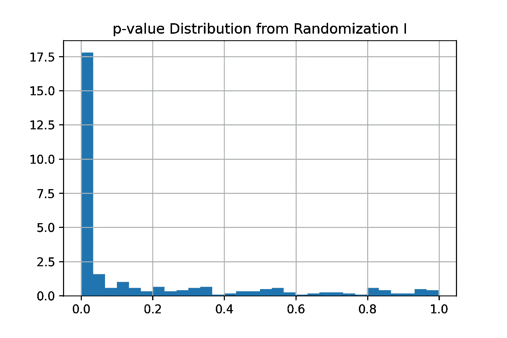
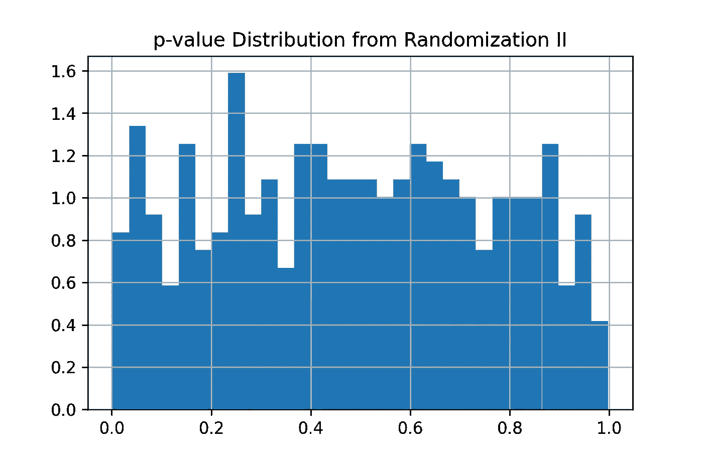
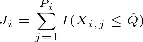
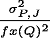
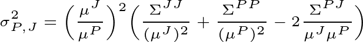
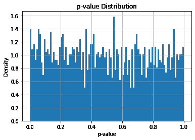

# 希望 A/B 如何测试百分点

> 原文：<https://towardsdatascience.com/how-wish-a-b-tests-percentiles-35ee3e4589e7?source=collection_archive---------14----------------------->

## 大规模在线实验中百分点差异的检测方法研究

投稿人:[戚克(Max)李](https://medium.com/@qike_max_li)&

图片由 [Gerd Altmann](https://pixabay.com/users/geralt-9301/?utm_source=link-attribution&utm_medium=referral&utm_campaign=image&utm_content=2422185) 从 [Pixabay](https://pixabay.com/?utm_source=link-attribution&utm_medium=referral&utm_campaign=image&utm_content=2422185) 拍摄

在本文中，我们分享了我们为百分位数开发 A/B 测试方法的旅程。您将看到示例用例、为什么 A/B 测试百分比指标具有挑战性、看似简单的解决方案如何失败、我们最终使用的统计测试以及测试的性能。

在[愿望](https://www.wish.com/careers?hide_login_modal=true)时，我们 [A/B 测试](https://en.wikipedia.org/wiki/A/B_testing)几乎所有的新[产品特性](https://www.productboard.com/glossary/product-features/)以确保它们增强用户体验。在每个实验中，我们对许多指标进行[假设检验](https://en.wikipedia.org/wiki/Statistical_hypothesis_testing)，其中一些指标是[百分位](https://en.wikipedia.org/wiki/Percentile#:~:text=In%20statistics%2C%20a%20percentile%20(or,percentage%20falls%20(inclusive%20definition).)，如 P50(第五十百分位或中值)或 P95(第九十五百分位)。当测试来自两个实验组的两个百分位数的差异时(例如，对照组的 P95 与治疗组的 P95)，典型的假设检验方法，例如 [t 检验](https://en.wikipedia.org/wiki/Student%27s_t-test)，并不适用，因为这些检验比较的是两个样本的平均值，而不是百分位数。

# 示例使用案例

百分比 A/B 测试使我们能够衡量新产品功能对网站性能的影响。网站性能极大地影响了用户体验，并产生了实实在在的金钱效应。[亚马逊发现](https://www.forbes.com/sites/steveolenski/2016/11/10/why-brands-are-fighting-over-milliseconds/?sh=329501754ad3)仅仅 100 毫秒的额外加载时间就让他们损失了 1%的销售额。 [Pinterest 减少了 40%的等待时间，这使得搜索引擎流量和注册人数增加了 15%。](https://medium.com/pinterest-engineering/driving-user-growth-with-performance-improvements-cfc50dafadd7)

照片由 [CHUTTERSNAP](https://unsplash.com/@chuttersnap?utm_source=medium&utm_medium=referral) 在 [Unsplash](https://unsplash.com?utm_source=medium&utm_medium=referral) 上拍摄

百分位数，如 P50(第五十个百分位数)或 P95(第九十五个百分位数)，是比样本均值更好的网站绩效指标。例如，对于所有用户，产品 A 在 0.5 秒内加载，对于 95%的用户，产品 B 在 0 秒内加载，对于 5%的用户，在 10 秒内加载。尽管两种产品的平均加载时间相同，但产品 A 的用户体验要好得多。产品 A 在瞬间为所有用户加载。相比之下，5%的用户似乎永远都无法加载产品 B，糟糕的体验可能会鼓励这些用户流失。在整篇文章中，我们关注的是百分比测试在性能度量中的应用。

除了性能指标之外，当我们关心对指标分布的影响时，百分位数测试开启了许多其他的应用。例如，百分比测试对于事务度量也是非常宝贵的。Wish 致力于提供一个公平的市场，为各种规模的商家发展业务。因此，当我们改变政策时，我们的目标是提高所有商家的销售额。因此，在 A/B 测试控制和展示时段之间的平均销售额时，我们还需要比较 P10、P50 和 P90 等百分点，以确保该政策不会通过严重偏袒少数顶级商家来提高平台销售额，这可能会使小型商家处于不利地位。

# 测试百分位数的挑战

A/B 测试绩效指标的百分比差异具有挑战性，原因如下:

*   **挑战一:随机化单元**。大多数实验平台随机选择用户，这保证了用户之间的独立性。但是性能指标是在响应级别测量的，来自相同用户的响应时间可能是相关的，这违反了大多数统计测试的独立性假设，并且可能产生很高的误报率。这通常被称为随机化单元[和分析单元](http://alexdeng.github.io/public/files/WSDM2017draft.pdf)【1】之间的差异。
*   **挑战二:可扩展性。**该方法需要具有足够的可扩展性，以便在可接受的时间框架内从数十亿行输入数据中进行假设检验。

# 我们首先探索简单的解决方案

## 我们能否设置一个固定的阈值来检测性能变化？

是否足以检查治疗组和对照组之间的差异是否高于固定阈值，例如 100 毫秒的差异或 10%的相对变化？例如，如果处理桶中的 P95 比控制桶中的 P95 高 100ms，或者处理桶中的 P95 比控制桶中的 P95 高 10%,则我们得出结论:产品特性引入了延迟。

为了查看使用固定阈值是否合适，我们回顾性地进行了几次[模拟/模拟实验](https://www.optimizely.com/optimization-glossary/aa-testing/)，发现固定绝对变化和固定相对变化都不起作用。注:对于这些 A/A 实验，显示和控制之间的任何差异都不是真正的差异，而是由于自然波动。

我们研究了各种原料药在治疗组和对照组之间的 P95 差异。由于以下原因，使用固定阈值是不可靠的。

*   一个 API 可能比另一个慢两个数量级。对于一个 API 来说，10 ms 的差异无疑是性能下降，但对于另一个 API 来说，这可能是由于自然波动造成的。
*   当我们观察较少使用的 API 的延迟时，样本百分比变化可能相当大。例如，样本百分位数中 10%的差异可能来自自然变异。然而，对于大量使用的原料药，P95 增加 10%可能表明性能显著下降。

与统计测试相反，固定阈值不考虑样本差异(即某些 API 的响应时间比其他 API 的响应时间更易变)，因此，不能保证良好控制的[I 型错误率](https://en.wikipedia.org/wiki/Type_I_and_type_II_errors)(假阳性率)。

## 可以应用[比例 Z 检验](https://stattrek.com/hypothesis-test/difference-in-proportions.aspx)吗？

双样本[比例 Z 检验](https://stattrek.com/hypothesis-test/difference-in-proportions.aspx)允许我们比较两个比例，以查看两个比例之间的差异是否显著。当两个实验组的两个 P95 之间确实存在显著差异时，合并的 P95(来自对照和处理的组合数据的 P95)之上的样品比例将存在显著差异。为了说明，假设治疗组、对照组和混合组中的 P95 潜伏期分别为 300 毫秒、100 毫秒和 200 毫秒。假设两组大小相等，治疗(控制)组可能包含明显更多(更少)的 200ms 以上的数据点。为了使用此属性构建一个有意义的测试，我们将比例 Z 测试修改如下:

*   计算合并的 P95。
*   使用比例 Z 测试来比较响应时间高于治疗组和对照组的合并 P95 的请求的比例。

这种方法对于比较百分位数似乎是合理的。但是，不幸的是，它没有解决实验单元和分析单元之间的差异(**挑战 I** )。因此，我们以如下两种不同的方式模拟 [A/A 检验](https://www.optimizely.com/optimization-glossary/aa-testing/)，以研究修正的比例 Z 检验是否适用于百分位数。

*   追溯模拟的 [A/A 测试](https://www.optimizely.com/optimization-glossary/aa-testing/)使用来自 Wish 的数据，采用两种不同的随机化:1)随机化用户(**随机化 I**)；2)随机化请求(**随机化 II** )。请注意，由于这些是模拟的 A/A 测试，因此随机请求是可能的。
*   应用修改的比例 Z 检验

如果测试工作正常，A/A 测试产生的 p 值分布[应该遵循从 0 到 1 的均匀分布](https://www.ncbi.nlm.nih.gov/pmc/articles/PMC6629378/#s2title)。并且，如果我们将显著性水平设置为 5%，我们应该会看到 p 值小于 0.05 的~5% A/A 测试。

我们发现，在用户层面进行随机化时(**随机化 I** )，超过 60%的 A/A 测试会导致假阳性。假阳性率很高，因为随机化单元不同于分析单元。另一方面，当在请求级别随机化时(随机化单元与分析单元相同)，p 值分布相当接近均匀，并且 I 型误差得到很好的控制。

总之，如果我们可以随机化请求，这种方法将是合理的。然而，在实践中，我们的随机化是在用户级别，这使得这种方法无效。

# 集群自举适用吗？

为了解决随机化单元和分析单元之间的差异，我们可以应用[集群引导](https://en.wikipedia.org/wiki/Bootstrapping_(statistics)#Cluster_data:_block_bootstrap)。然而，自举是不可扩展的(**挑战二**)，它的计算非常昂贵。自举的复杂度本质上是 *O(nB)* ，其中 *n* 是样本数 *B* 是自举迭代次数。考虑到 Wish 庞大的用户群，运行一个实验的集群引导需要几天时间，而且我们经常同时运行数百个实验。

虽然集群自举对于 Wish 的数据规模(或大多数其他科技公司)来说是不可扩展的，但理论上是合理的。我们可以用它作为金标准来评估样本百分位数的[标准误差](https://www.ncbi.nlm.nih.gov/pmc/articles/PMC1255808/)估计值。

# Wish 溶液

我们对上述方法的探索强调，A/B 测试百分位数的方法需要解决随机化单元和分析单元之间的差异(挑战 I)并且是可扩展的(挑战 II)。

[LinkedIn 在 2019 年发布的一种方法](https://arxiv.org/pdf/1903.08762.pdf) [2]提供了一种封闭形式的分析解决方案来估计样本百分位数估计的标准误差，因此是可扩展的。它还专门解决了挑战 LinkedIn 方法中的一个步骤需要估计百分位的概率密度。对于这一步，我们发现 [Quora 的方法](https://www.quora.com/q/quoradata/Two-Sample-Hypothesis-Tests-for-Differences-in-Percentiles)在实践中更容易使用，并且产生了令人满意的结果。

我们采用这两种方法来估计样本百分位数的标准误差。利用样本百分位数及其标准误差，我们对零假设应用 [Z 检验](https://en.wikipedia.org/wiki/Z-test)——来自两个实验桶(例如，对照和处理)的百分位数之间没有差异。

# 记号

假设我们用两个变体运行 A/B 测试，每个变体中的用户在查看产品页面时会得到不同的体验。我们的目标是检测这两种变体之间的产品页面加载时间 P95 的差异。注意，这里我们使用 P95 作为例子，我们使用这种方法来测试实践中的各种百分位数。关注一个变体，假设有:

*   n 个用户，索引为 i = 1，2，.。。，N；
*   用户 I 查看 Pᵢ产品，其中 Pᵢ's 是独立同分布(i.i.d .)随机变量；
*   Xᵢⱼ是用户 I 的 jᵗʰ页面视图的页面加载时间。Xᵢⱼ's 可能是正相关的，因为对于使用快速网络和快速设备的用户来说，页面浏览可能都更快，反之亦然。
*   {Xᵢⱼ的样品 P95，i = 1，2，.。。，N；j = 1，2，.。。，Pᵢ}被称为 Q̂.

# 汇总统计数据

为了进行假设检验，我们的数据管道需要输出以下汇总统计数据:

*   用户数量 N
*   样品 P95 Q̂
*   ∑ᵢ Jᵢ，哪里

并且 Jᵢ是在一个桶中比用户 I 的样本 P95 低的页面加载次数。

*   ∑ᵢPᵢ，其中 Pᵢ是用户 I 的页面访问量
*   ∑ᵢ Jᵢ
*   ∑ᵢPᵢ
*   ∑ᵢJᵢPᵢ
*   P(95-δ)和 P(95+δ)。δ是可调窗口大小。假设δ=0.25，我们需要计算 P94.75 和 95.25。

请注意，所有这些汇总统计数据都是在实验桶级别聚合的，这使得数据管道更加简单。关于调整参数，我们发现= 0.25 对于像 P50 和 P95 这样的百分位数产生了令人满意的结果。当涉及到像 P99 或 P99.9 这样的极端百分位数时，可能需要更仔细的调整。

# 假设检验

根据汇总统计数据，样本 P95 的方差估计为

注意，我们遵循 Quora 的方法来估计分母中的密度 fₓ(Q

fₓ(Q)= 2*δ/(P(95+δ) -P(95-δ))

分子估计如下

利用样本 P95 的方差估计，我们进行 [Z 检验](https://en.wikipedia.org/wiki/Z-test)来计算 p 值。

如果你好奇为什么我们可以这样估计样本 P95 的标准差，请参考 LinkedIn 论文中[的等式 1-6。本质上，百分位等于 F⁻(百分比)，其中 f 是 Xᵢⱼ的](https://arxiv.org/pdf/1903.08762.pdf)[累积密度函数](https://en.wikipedia.org/wiki/Cumulative_distribution_function) (cdf)，在 P95 的情况下百分比是 0.95。这个百分比是∑ᵢJᵢ和∑ᵢPᵢ.的函数另外(1/n∑ᵢJᵢ和 1/n∑ᵢPᵢ)由于[中心极限定理](https://en.wikipedia.org/wiki/Central_limit_theorem)遵循二元正态分布。应用[德尔塔法](https://en.wikipedia.org/wiki/Delta_method)两次，我们可以得出样本百分位数的分布。

# 数据管道

百分位数测试的数据管道与典型的 A/B 测试的数据管道有很大的不同，后者通常应用 t-test，并且只需要三个汇总统计数据:样本均值、样本方差和样本大小。此外，计算大型数据集的百分位数是缓慢且资源密集型的。因此，我们计算了近似的百分位数，这快了一个数量级，并产生了令人满意的结果。最后，由于一些汇总统计数据是十进制百分位数(例如，P94.75 和 P95.25)，最小样本量需要至少大于 10，000，这远远小于期望的典型样本量。

# 结果

## 解析解产生精确的方差估计

使用聚类自举作为金标准，我们比较了由上述解析解估计的标准误差和由聚类自举估计的标准误差。这两种方法估计的标准误差在不同的客户端平台上非常接近。在超过 200 个内核和 1.5T 内存的服务器上，对于中等大小的样本，集群引导需要几个小时。如果我们使用 bootstrapping 的话，所有的实验都需要几天才能完成。相比之下，解析解的计算时间可以忽略不计。

A/A 测试中 I 类错误率得到了很好的控制

为了评估 I 型错误率，我们使用来自各种 API 调用的请求数据为不同的百分位数追溯性地构建了 A/A 测试。I 型错误率(假阳性率)接近 5%，p 值分布遵循从 0 到 1 的均匀范围。

# 解析解产生良好的统计功效

我们还评估了[功效](https://en.wikipedia.org/wiki/Power_of_a_test)(真阳性率)。我们将历史请求数据随机分为 50%对照组和 50%治疗组。对于处理时段，我们将请求时间乘以 110%或 101%。即使响应时间只增加了 1%,检测差异的能力仍然相当不错。

# 结论

可靠的统计测试是可信实验平台的关键组成部分。对于不同的指标和不同类型的业务，没有一个通用的统计测试。我们分享我们在开发百分位数测试方面的努力，这释放了我们的实验平台的更多潜在应用。百分比测试现在应用于所有实验，希望 A/B 测试它们对 API 响应时间的延迟影响。我们设置了护栏规则来识别引入高延迟的实验，并通知实验所有者来防止引入缓慢的产品特性。

# 感谢

感谢高波和齐超对此项目的贡献。我们也非常感谢 Pai Liu，Shawn Song，Simla Ceyhan 的支持，以及 Pavel Kochetkov，Lance Deng，Caroline Davey，Leah Levine 对本文草稿的反馈。

Wish 的数据科学家热衷于构建一个值得信赖的实验平台。如果你对解决这个领域的挑战性问题感兴趣，我们正在招聘[数据科学团队](https://smrtr.io/6VnPr)。

[1] A. Deng，J. Lu，J. Litz，[在线 A/B 测试的可信性分析:陷阱、挑战与解决方案](https://dl.acm.org/doi/abs/10.1145/3018661.3018677) ( 2017)，:第十届网络搜索与数据挖掘国际会议。英国剑桥。

[2] M. Liu，X. Sun，M. Varshney 和 Y. Xu，[分位数度量的大规模在线实验](https://arxiv.org/abs/1903.08762) (2019)， *arXiv 预印本 arXiv:1903.08762*