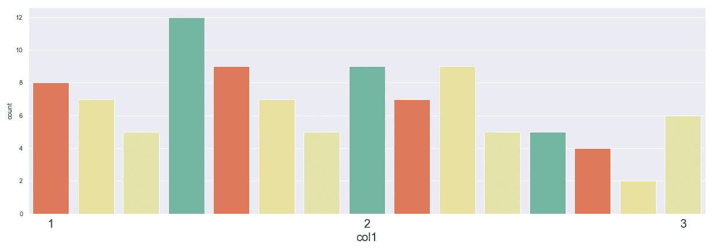
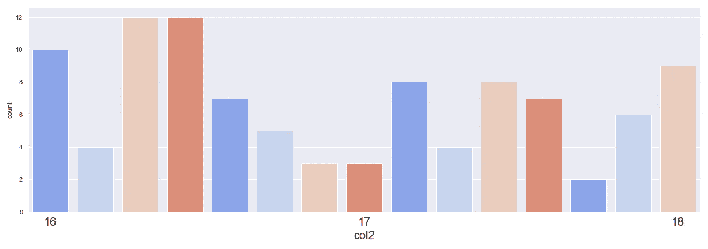
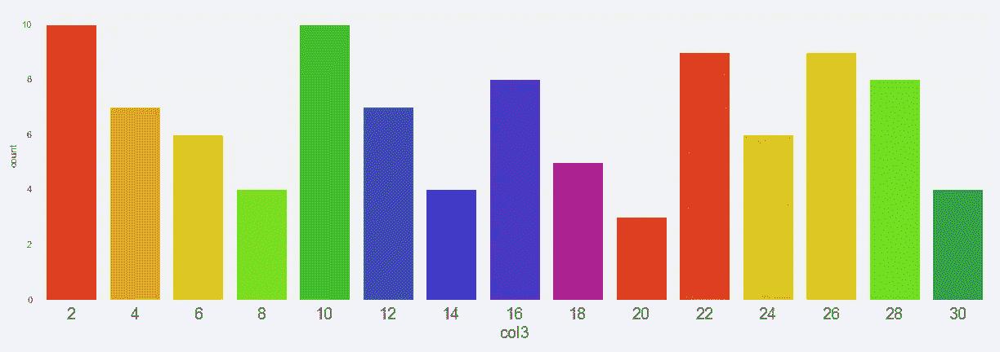
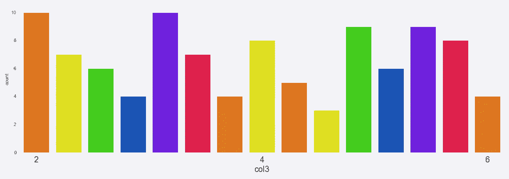
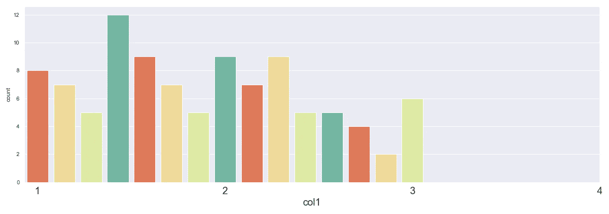
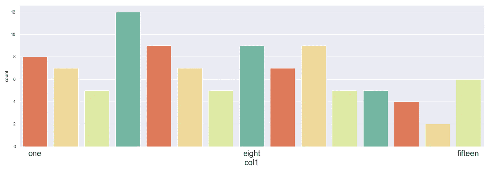
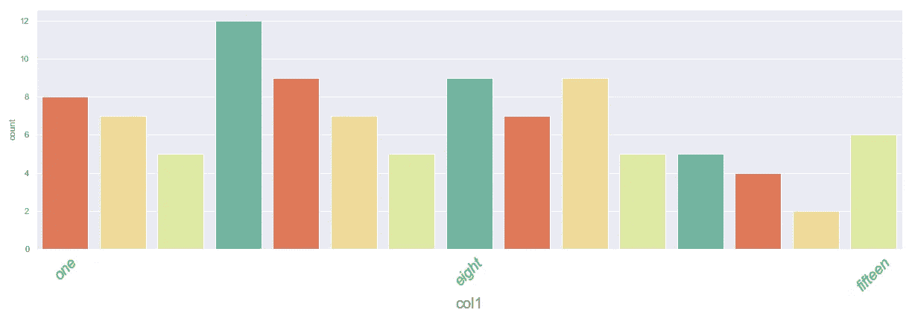

# xticks 和 xticklabels 的实际工作原理:演练

> 原文：<https://towardsdatascience.com/how-xticks-and-xticklabels-really-work-a-walkthrough-aff80755838?source=collection_archive---------7----------------------->

## [入门](https://towardsdatascience.com/tagged/getting-started)


马库斯·温克勒在 [Unsplash](https://unsplash.com/s/photos/chart?utm_source=unsplash&utm_medium=referral&utm_content=creditCopyText) 上拍摄的照片

我最近在 Seaborn 中创建可视化，这是基于 Matplotlib 的，当标记 x 轴时，我没有得到我期望的结果。我决定后退一步，试验一下 xticks 和 xticklabels 在可视化中实际做了什么。

我们来分解一下。

# 基本情节

首先，我创建了一个包含两列 100 行的 dataframe。第一列为每行分配一个从 1 到 15 的随机数，第二列为每行分配一个从 16 到 30 的随机数。

```
np.random.seed(0)
col1 = np.random.randint(1, 16, size=100).tolist()
col2 = np.random.randint(16, 31, size=100).tolist()
df = pd.DataFrame({'col1': col1, 'col2': col2})
```

使用 Seaborn 的`countplot`方法，我测试了第一列。

```
ax = sns.countplot(x = df['col1'])
```


作者图片

当我用`len(df.loc[df['col1'] == 4])`运行一个单元格时，我得到了 12，这与我的可视化相匹配。换句话说，这 100 行中的 12 行是类别 bin *4* 的一部分。到目前为止，一切顺利。

让我们看看数字较高的那一栏。

```
ax = sns.countplot(x = df['col2'])
```


作者图片

结果看起来与第一个相似。标签上显示的数字是 16 到 30。

# 添加一些刻度

假设 x 轴上有 15 个潜在值，我有 100 个？还是 200？轴标签会变得太拥挤而难以辨认。

`xticks`属性的要点是只显示 x 轴上某些点的值。因此，让我们尝试使用`xticks`只显示三个间隔开的值。

```
ax = sns.countplot(x = df['col1'])
ax.set(xticks=([0, 7, 14]))
```



作者图片

注意在`ax.set(xticks=([0, 7, 14])`中，数字指的是指数。数字 1 位于`xticks`的`0`索引处，然后它转到数据帧中的第 8 号索引`7`，然后它转到数据帧中的第 15 号索引`14`。但是看看 xticks 是如何数出 **1，2，3** 和*而不是* 1，8，15 的。

那么高计数列呢？

```
ax = sns.countplot(x = df['col2'])
ax.set(xticks=[0, 7, 14])
```



作者图片

同样，在`ax.set(xticks=([0, 7, 14])`中，数字指的是指数。数字 16 在`xticks`的`0`索引处，然后它转到数据帧中的第 23 号索引`7`，然后它转到数据帧中的第 30 号索引`14`。沿着 y 轴的可视化值仍然很好，但是请注意 xticks 是如何数出 **16，17，18** 和*而不是* 16，23，30 的。

综上所述，从第一个索引的值开始计数，有意义。但是，沿着 x 轴，标签每次增加 1，而不管分类容器的值。

我应该注意，它每次只增加 1，因为我的 bin 是增加 1 的整数。我创建了一个新列， **col3** ，其中有 100 个 1 到 30 之间的随机数，仅由偶数**和偶数**组成。

标准的情节是你所期待的:

```
ax = sns.countplot(x = df['col3'])
```



作者图片

当我选择与其他示例中相同的索引时，xticks 将按 2 计数。

```
ax = sns.countplot(x = df['col3'])
ax.set(xticks=[0, 7, 14])
```



作者图片

并且 xticks 数出 **2，4，6** 和*而不是* 2，16，30。

出于好奇，让我们看看如果我将 xticks 放在 dataframe 的值之外会发生什么。再次使用数字较小的列:

```
ax = sns.countplot(x=df['col1'])
ax.set(xticks=([0, 7, 14, 21]))
```



作者图片

在这个可视化中，我向 xticks 列表中添加了另一个索引`21`，这个索引高于引用类别 bin 值的任何索引。如您所见，它扩展了 x 轴以显示空白区域。

还有一点:尽管传递给`xticks()`的列表引用了索引，但是如果需要的话，您可以使用浮点数在索引之间放置记号。

# 指定标签

为了控制标签显示的内容，设置 ax 的`xticklabels`属性:

```
ax = sns.countplot(x=df['col1'])
ax.set(xticks=([0, 7, 14]))
ax.set(xticklabels = (['one', 'eight', 'fifteen']))
```



作者图片

酷毙了。我得到了我想要的结果。可以使用字符串或数字。注意，如果我没有在某个时候为 ax 设置`xticks`，这三个标签将被放置在前三个索引中，或者[0，1，2]。

另外，请注意，在以上所有示例中，我使用了通用的`Axes.set()`函数，然后传递了关键字参数。

要对记号及其标签进行更多控制，请使用`Axes.set_xticks()`和`Axes.set_xticklabels()`。对于后者，您可以指定各种字体属性、标签的旋转等等。

```
ax = sns.countplot(x=df['col1'])
ax.set_xticks([0, 7, 14])
ax.set_xticklabels(labels = ['one', 'eight', 'fifteen'], 
                   rotation=45, 
                   fontstyle='italic', 
                   color='green')
```



作者图片

# 摘要

*   如果不指定任何内容，所有记号都将自动放置。
*   使用`ax.set(xticks=[a, b, c])`或`ax.set_xticks([a, b, c])`选择在索引处添加记号的特定位置。
*   如果不指定标签，第一个刻度将采用输入的第一个索引的值。然后，后续值将在分笔成交点处使用，即使它们可能不会引用其余索引处的实际值。
*   使用`ax.set(xticklabels=[a, b, c])`或`ax.set_xticklabels([a, b, c])`选择标签(字符串或数字)在设定的索引处添加记号。
*   要控制标签的外观和文本属性，请使用带有关键字参数的`set_xticklabels()`。