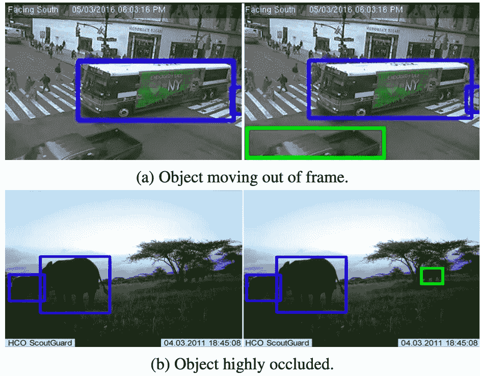
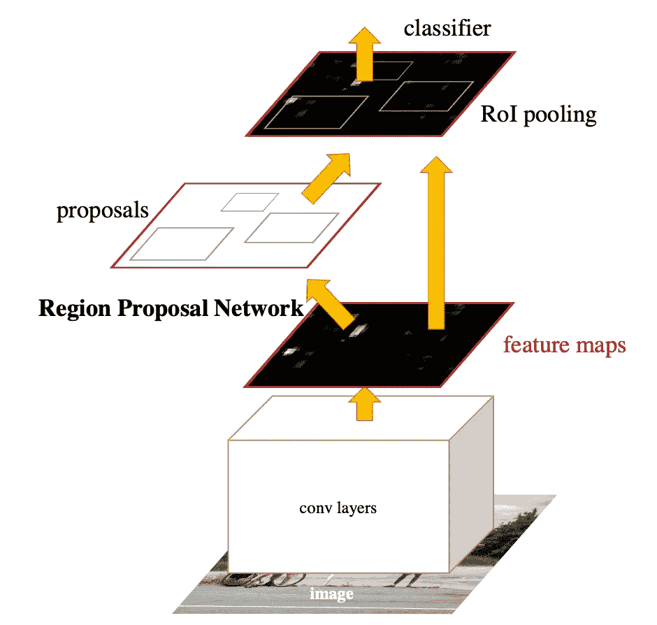
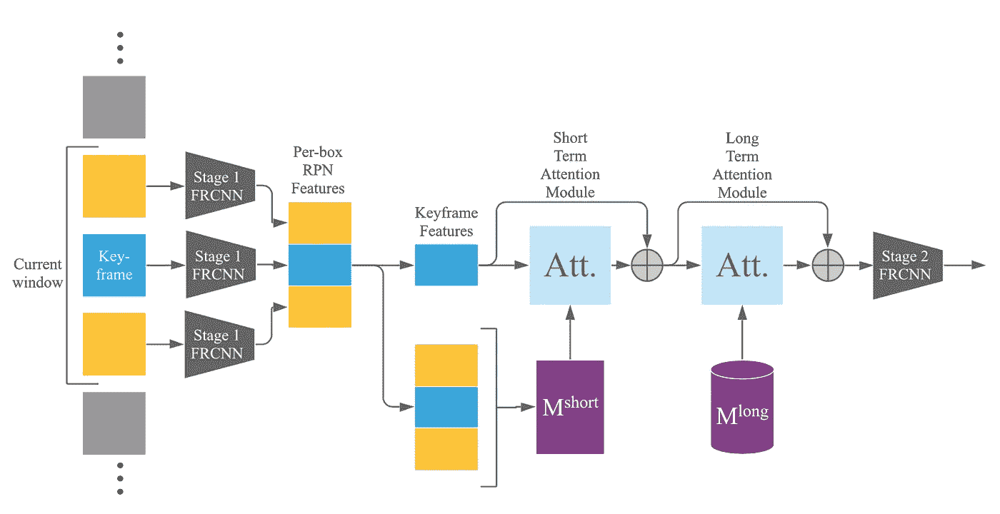
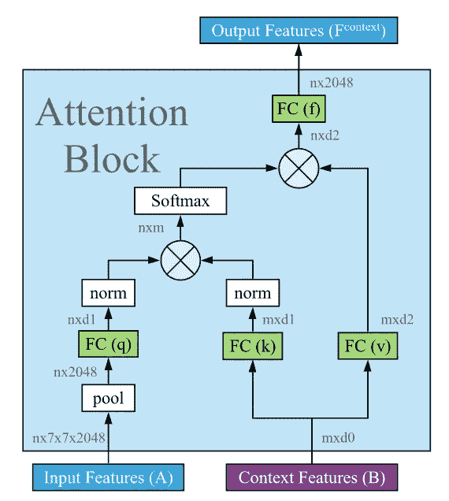
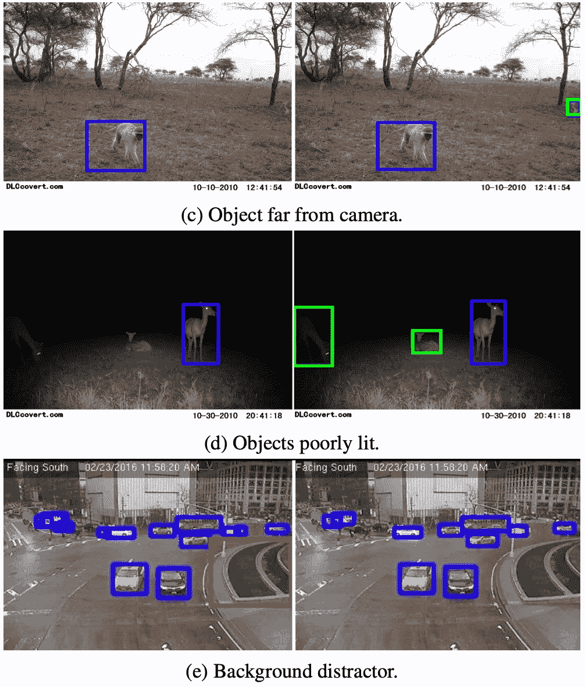
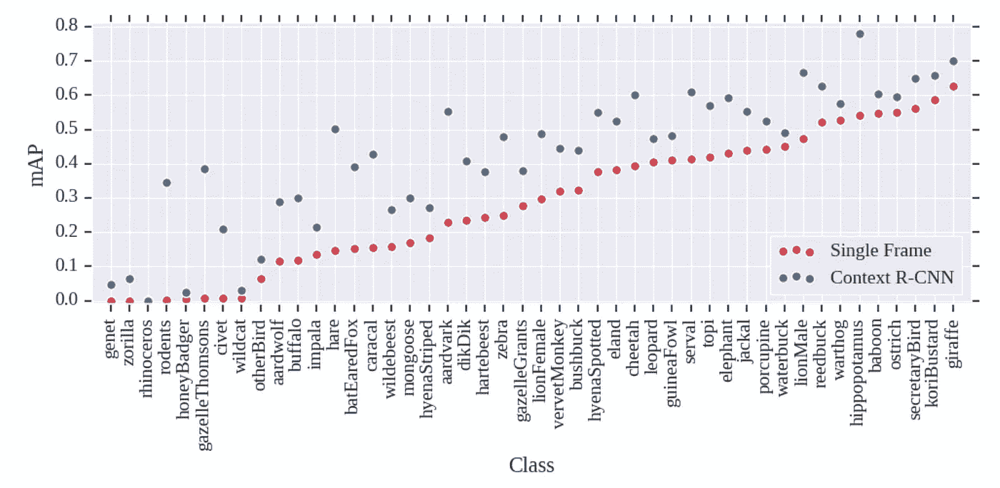
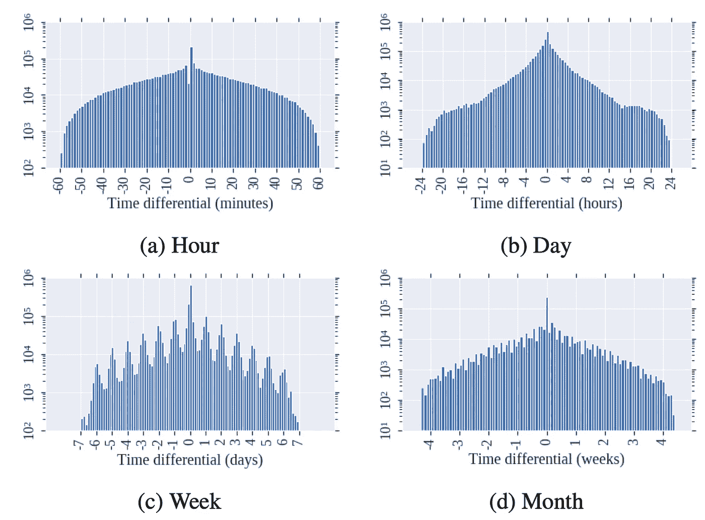

# 如何利用时间上下文检测部分遮挡物体

> 原文：<https://towardsdatascience.com/how-you-can-detect-partially-occluded-objects-using-temporal-context-3db1194e7171?source=collection_archive---------15----------------------->

## 解决长期存在的目标检测问题

检测真实世界场景中的所有对象对于任何对象检测模型都是一项具有挑战性的任务。但是，如果您有一系列由固定位置的相机拍摄的图像，您可以利用通过多个图像获得的时间背景。在本文中，我们将回顾一篇介绍 **Context R-CNN** 的论文，它使用这种机制在现实世界的对象检测上实现了令人难以置信的性能，即检测遮挡、光线不佳、远处和移出图像的对象。该出版物名为[*“Context R-CNN:每个摄像机对象检测的长期时间上下文”*](https://arxiv.org/pdf/1912.03538.pdf) ，由加州理工学院和谷歌的 Beery 等人出版。我尽量让文章简单，这样即使没有什么先验知识的读者也能理解。事不宜迟，我们开始吧！

上下文 R-CNN 对被遮挡或移出帧的对象的性能。来源:[【1】](https://arxiv.org/pdf/1912.03538.pdf)

# 先决条件:对象检测和更快的 R-CNN

如果您已经熟悉对象检测和更快的 R-CNN 模型架构，请随意跳过这一部分。

目标检测是计算机视觉中最具挑战性的任务之一。从本质上来说，目标是训练一个模型，它既可以通过预测物体周围的边界框(上面的蓝色/绿色)来定位场景中的物体**，也可以通过对物体**进行分类来预测物体的类别(例如，狗、猫等)。).

最流行的对象检测架构之一被称为更快的 R-CNN。不要进入太多的细节，快速介绍模型的主要概念是有意义的，因为它们与理解 R-CNN 文章的上下文相关。

通过可视化其关键概念来显示更快的 R-CNN 模型架构。来源:[【2】](https://arxiv.org/pdf/1506.01497.pdf)

速度更快的 R-CNN 使用卷积骨干从图像中提取特征。这可以通过任何类型的 ConvNet 实现，例如 ResNet-50 或 AlexNet。该主干输出包含图像所有特征的特征图。现在重要的部分来了:这些特征被传递到一个**区域提议网络(RPN)** ，在那里模型检测它预测包含它被训练的对象的区域。区域是由包含对象的边界框标记的区域。然后，在 **RoI(感兴趣区域)汇集**步骤中，将区域提议与特征图汇集在一起，然后传递给**分类器**，最终输出**边界框和预测类**。

# 利用时间上下文检测难以看见的物体

现在，让我们继续讨论 R-CNN 的背景。通常，对象检测模型对单帧输入进行操作，即，它们仅使用来自一个图像的信息来进行预测。这就是上下文 R-CNN 的不同之处。

上下文 R-CNN 的高级架构，具有窗口滑块、短期和长期记忆库。来源:[【1】](https://arxiv.org/pdf/1912.03538.pdf)

让我们来分解整个架构:作为输入，使用来自不同时间的同一场景的多个帧。其中一帧(蓝色)是我们想要对其执行对象检测的图像。例如，该窗口可以设置为 5，则 5 幅图像将作为输入。也许第一张是在早上 5 点拍的，最后一张是在下午 3 点。对于这些图像中的每一个，特征由更快的 R-CNN 提取，以生成每个盒子的 RPN 特征(这就是为什么我们之前重新访问了 RPN)。因此，现在我们有了每个图像的每个边界框的特征。然后，我们将所有这些特征传递到短期记忆库中，并保存在那里。长期记忆库也包含来自过去帧的特征，但是在更长的时间范围内，例如来自过去的 50 个图像。**只有关键帧特征，即我们实际上想要对其执行对象检测的图像的特征，被直接传递到注意机制。**

用于整合来自短期和长期记忆库的保存特征的注意机制。这种关注决定了哪些特性是相关的，这比硬编码一些 IoU 匹配要好得多。来源:[【1】](https://arxiv.org/pdf/1912.03538.pdf)

这种注意机制在两个方面发挥作用:短时记忆和长时记忆。每次，来自关键帧的输入特征与来自记忆库的上下文特征一起被传递到注意块。在**注意块**中，模型学习**哪些特征最相关，从而做出正确的检测**。这意味着，如果模型意识到对于一个提议的边界框，它已经在过去看到过那些特征，它可以**组合来自关键帧和来自过去**的特征来执行对象的**重新识别。我个人觉得这个机制还是蛮厉害的！**

# 结果

在本文的介绍中，我们已经看到了检测移出框架或被遮挡的对象的改进性能。让我们看看上下文 R-CNN 可以发挥作用的更多领域，如**弱光、远处的物体或背景干扰物。**

在具有挑战性的场景中，上下文 R-CNN 在对象检测方面的出色性能。来源:[【1】](https://arxiv.org/pdf/1912.03538.pdf)

这些结果看起来相当令人印象深刻！在左侧，您可以看到没有上下文的性能，在右侧，上下文 R-CNN 使用内存库来检测额外的对象。让我们来看看一些定量结果:

有上下文的 R-CNN 与没有上下文的更快 R-CNN 的性能比较。对于所有类别，新模型都优于单帧检测。来源:[【1】](https://arxiv.org/pdf/1912.03538.pdf)

毫不奇怪，对于动物数据集中的所有类，上下文 R-CNN 在单个帧上的检测性能优于其他检测(感兴趣的人可以使用 Snapshot Serengeti)。这可以归因于语境机制。

同样非常有趣的是注意力机制的可视化。该块从时间上更接近关键帧的上下文帧中了解到特征对于对象重新识别任务也是最相关的。虽然这对人类来说是直观的，但令人印象深刻的是模型能够学习这一点。

时间上分离的帧对于关键帧中的检测的重要性的可视化。这些帧在时间上越接近，它们对于检测任务就变得越重要。来源:[【2】](https://arxiv.org/pdf/1912.03538.pdf)

这种模型的另一个大优势是，上下文机制可以轻松地集成到任何快速、更快或屏蔽的 R-CNN 架构中。

# 包装它

在本文中，您已经了解了 Context R-CNN，这是一篇以短期和长期特征记忆库的形式利用时间上下文进行对象检测的论文。虽然我希望这个故事能让你对这篇论文有一个很好的初步了解，但是还有很多东西需要发现。因此，我会鼓励你自己阅读这篇论文，即使你是这个领域的新手。你必须从某个地方开始；)

如果你对论文中介绍的方法有更多的细节感兴趣，请随时在 Twitter 上给我留言，我的账户链接在我的媒体简介上。

我希望你喜欢这篇论文的解释。如果你对这篇文章有任何意见，或者如果你看到任何错误，请随时留下评论。

**最后但同样重要的是，如果你想在高级计算机视觉领域更深入地探索，考虑成为我的追随者**。我试着每周发一篇文章，让你和其他人了解计算机视觉研究的最新进展。

参考资料:

[1] Beery，Sara 等人，“背景 r-cnn:每个摄像机对象检测的长期时间背景”*IEEE/CVF 计算机视觉和模式识别会议论文集*。2020.【https://arxiv.org/pdf/1912.03538.pdf 

[2]任，，等.“快速 r-cnn:面向区域提议网络的实时目标检测”*神经信息处理系统进展*28(2015):91–99。[https://arxiv.org/pdf/1506.01497.pdf](https://arxiv.org/pdf/1506.01497.pdf)