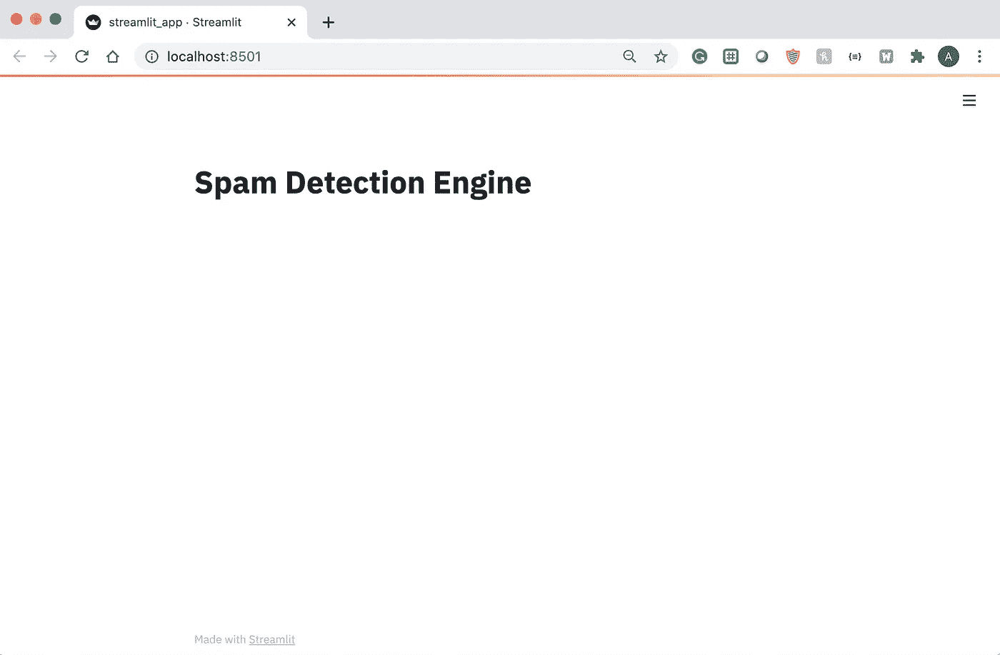
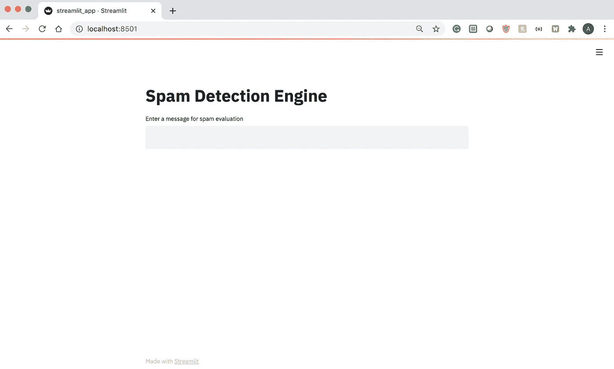
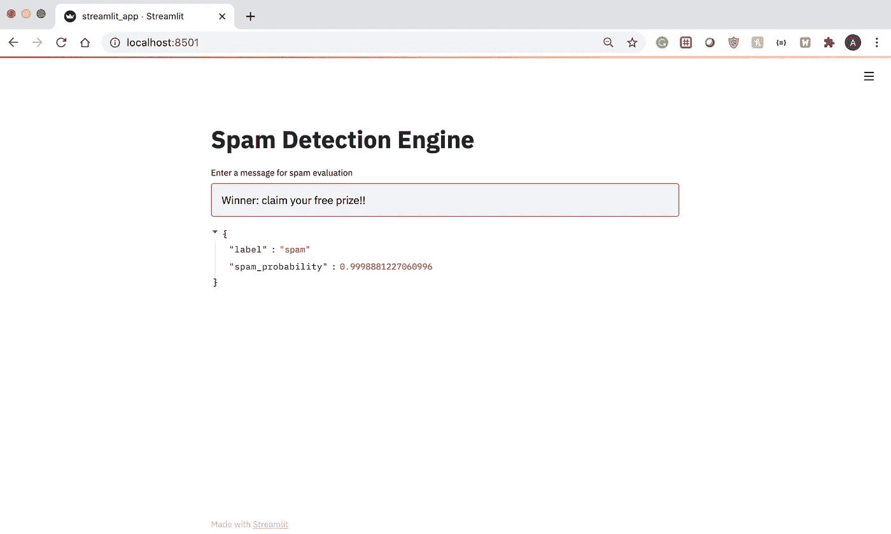
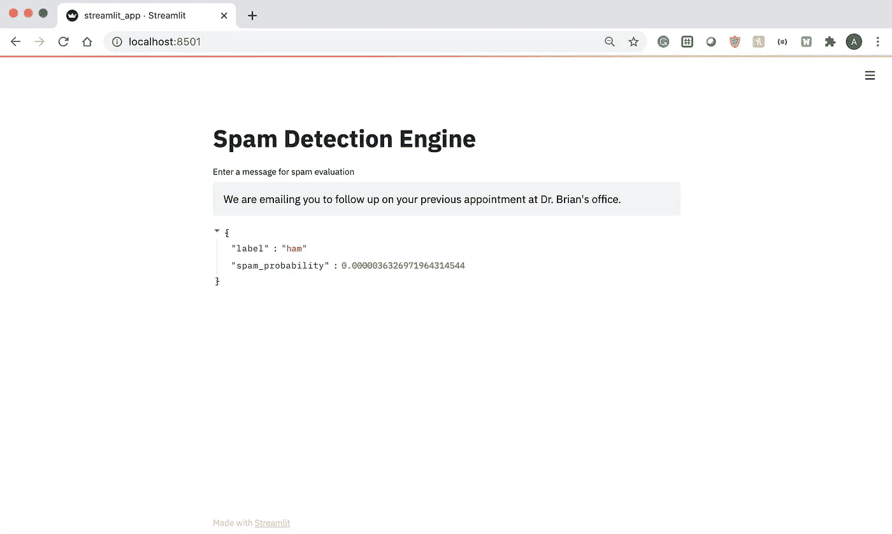
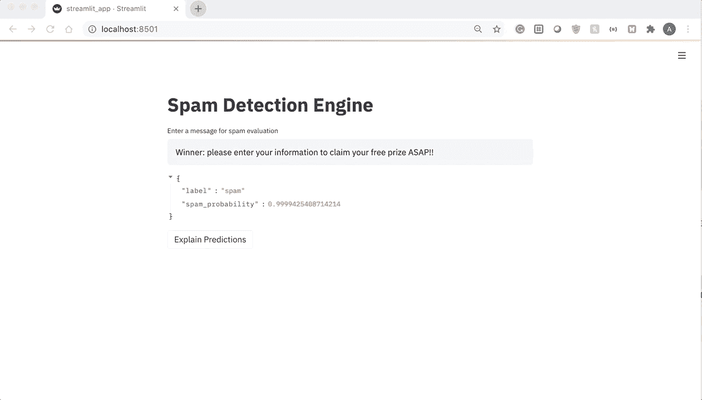

# 如何使用 Streamlit 快速构建 ML web 应用程序？

> 原文：<https://towardsdatascience.com/how-you-can-quickly-build-ml-web-apps-with-streamlit-62f423503305?source=collection_archive---------15----------------------->

## 将模型嵌入 web 应用程序的最快方法。


汤姆·盖诺尔在 [Unsplash](/s/photos/stream-lit?utm_source=unsplash&utm_medium=referral&utm_content=creditCopyText) 上的照片

如果你是一名数据科学家或机器学习工程师，你可能对自己构建模型解决现实世界业务问题的能力相当有信心。但是你有多擅长前端 web 开发呢？你能构建一个视觉上吸引人的 web 应用程序来展示你的模型吗？您可能是 Python 专家，但不是前端 Javascript 专家。

但值得庆幸的是，你不必成为这样的人！Streamlit 是一个 Python 框架，它使机器学习和数据科学从业者可以非常容易地用纯 Python 构建 web 应用程序。没错，你甚至不用担心 HTML 标签、引导组件，或者编写自己的 Javascript 函数。

**在本文中，我将展示如何使用 Streamlit 快速构建一个展示文本分类模型的 web 应用程序。**

# 安装 Streamlit

您可以使用下面的命令通过 pip 轻松安装 Streamlit。

```
pip install streamlit
```

# 训练文本分类模型

在这一节中，我将训练一个简单的垃圾邮件分类模型来确定一条文本消息是否是垃圾邮件。因为本教程的主要焦点是演示如何使用 Streamlit，所以我将包含用于构建这个模型的代码，并附上最少的注释。我使用来自 Kaggle 的这个[垃圾邮件分类数据集](https://www.kaggle.com/team-ai/spam-text-message-classification)来训练一个用于垃圾邮件分类的神经网络。原始数据集在这里[可用](http://www.dt.fee.unicamp.br/~tiago/smsspamcollection/)作为[垃圾短信收集](http://www.dt.fee.unicamp.br/~tiago/smsspamcollection/)。你可以在 [GitHub](https://github.com/AmolMavuduru/StreamlitTutorial) 上找到本教程的完整代码。

上面的代码执行以下步骤:

1.  读取垃圾邮件数据集。
2.  将垃圾邮件数据集分成训练集和测试集。
3.  为垃圾邮件分类创建文本预处理和深度学习管道。
4.  在训练集上训练模型管道。
5.  评估测试集上的模型管道。
6.  保存训练好的模型管线。

# 构建简化的应用程序

在与保存的模型管道相同的文件夹中，我创建了一个名为 **streamlit_app.py** 的文件，并按照下面几节中的演示逐步添加代码。如果你想看这个教程的完整代码，请参考这个 [GitHub 库](https://github.com/AmolMavuduru/StreamlitTutorial)。

## 导入库

我导入了运行这个应用程序所需的必要库和模块，包括 Streamlit，如下所示。

```
import joblib
import re
from sklearn.neural_network import MLPClassifier
from sklearn.feature_extraction.text import TfidfVectorizer
import streamlit as st
```

## 创建标题

现在我们已经导入了 Streamlit，我们可以使用 Streamlit 的 Markdown 支持快速创建标题。

```
st.write("# Spam Detection Engine")
```

要查看这段代码的结果，我们可以运行以下命令。

```
streamlit run streamlit_app.py
```

运行代码并导航到 localhost:8501 会得到以下结果。



简化只有标题的应用程序。图片由作者提供。

只需一行代码(不包括导入语句)，您现在就拥有了一个正在运行的 Streamlit 应用程序！接下来，我们可以通过文本输入字段为应用程序添加一些交互性。

## 添加文本输入

```
message_text = st.text_input("Enter a message for spam evaluation")
```

在 localhost:8501 上刷新应用程序页面，我们会在标题下看到一个整洁的文本输入字段。



向 Streamlit 应用程序添加文本输入字段。图片由作者提供。

现在，我们可以将经过训练的垃圾邮件分类模型添加到应用程序中。

## 加载模型

在加载模型之前，我包含了预定义的文本预处理函数，因为这是已保存模型的一部分。

```
def preprocessor(text):
    text = re.sub('<[^>]*>', '', text) 
    emoticons = re.findall('(?::|;|=)(?:-)?(?:\)|\(|D|P)', text)
    text = re.sub('[\W]+', ' ', text.lower()) + ' '.join(emoticons).replace('-', '')
    return textmodel = joblib.load('spam_classifier.joblib')
```

## 生成和显示预测

我们可以定义一个特殊的函数来返回模型预测的标签(垃圾邮件或 ham)和邮件是垃圾邮件的概率，如下所示。

```
def classify_message(model, message): label = model.predict([message])[0]
  spam_prob = model.predict_proba([message]) return {'label': label, 'spam_probability': spam_prob[0][1]}
```

使用这个函数，我们可以将模型的预测输出为一个字典。

```
if message_text != '': result = classify_message(model, message_text) st.write(result)
```

我们可以再次刷新应用程序，并传入一些示例文本输入。先说一些明显是垃圾邮件的东西。



在 Streamlit 中显示模型的输出。图片由作者提供。

从上面的截图中，我们可以看到模型预测此邮件有很高的几率(99.98%)是垃圾邮件。

现在，让我们写一条关于医生预约的消息，看看模型是否将其分类为垃圾邮件或火腿。



在 Streamlit 中显示模型的输出。图片由作者提供。

正如我们在上面看到的，根据模型生成的预测，该邮件是垃圾邮件的概率非常低。

## 用石灰解释预测

我们可以使用 LIME(可解释的机器学习库)为模型生成的预测添加一些解释。关于如何使用这个库的深入教程，请看下面我写的关于可解释机器学习的文章。

</how-to-make-your-machine-learning-models-more-explainable-f20f75928f37>  

要使用 LIME 并在 web 应用程序中嵌入 LIME 解释，请将以下导入语句添加到代码的顶部。

```
from lime.lime_text import LimeTextExplainer
import streamlit.components.v1 as components
```

Streamlit 的组件模块允许我们在应用程序中嵌入定制的 HTML 组件。我们可以用 LIME 创建一个可视化，并将其作为 HTML 组件显示在 Streamlit 应用程序上。

接下来，我们可以在最后一个 if 块的末尾添加以下代码，以创建一个解释模型预测的按钮。

```
explain_pred = st.button('Explain Predictions')
```

点击一次按钮，变量 **explain_pred** 的值将被设置为 True。我们现在可以用 LIME 生成一个文本解释，如下面的代码所示。

```
if explain_pred:
  with st.spinner('Generating explanations'):
   class_names = ['ham', 'spam']
   explainer = LimeTextExplainer(class_names=class_names)
   exp = explainer.explain_instance(message_text, 
   model.predict_proba, num_features=10)
   components.html(exp.as_html(), height=800)
```

刷新应用程序使我们能够为模型的预测生成解释，如下图 GIF 所示。注意 LIME TextExplainer 如何通过突出显示模型在决策过程中使用的最重要的词，让用户理解为什么模型将邮件分类为垃圾邮件。



用细流中的石灰解释预测。作者 GIF。

此时，该应用程序功能齐全，可用于展示和解释垃圾邮件分类模型生成的预测。查看下面这个应用程序的完整代码。

# 额外的简化功能

我在本文中创建的应用程序绝对有用，可以作为类似项目的起点，但它只涵盖了 Streamlit 的一些强大功能。以下是 Streamlit 的一些额外特性，您一定要看看:

*   **Streamlit 支持 Markdown 和 Latex 命令，允许您在 web 应用程序中包含方程式。**
*   **Streamlit 允许你用一行代码显示表格和熊猫数据框。**
*   Streamlit 允许您显示来自各种库的图表和可视化，包括 Matplotlib、Bokeh、Pyplot、Pydeck，甚至 Graphviz。
*   **Streamlit 可让您轻松显示地图上的点。**
*   **Streamlit 还支持在您的应用中嵌入图像、音频和视频文件。**
*   **Streamlit 通过 Streamlit 共享简化了开源应用的部署。**

要了解更多关于 Streamlit 的功能，请查看 [Streamlit 文档](https://docs.streamlit.io/en/stable/index.html)。

# 摘要

在本文中，我展示了如何使用 Streamlit 构建一个 web 应用程序，该应用程序用不到 50 行代码展示了一个简单的文本分类模型。Streamlit 无疑是一个强大的高级工具，它使数据科学家的 web 开发变得简单易行。像往常一样，你可以在 [GitHub](https://github.com/AmolMavuduru/StreamlitTutorial) 上找到这篇文章的所有代码。

# 加入我的邮件列表

你想在数据科学和机器学习方面变得更好吗？您想了解数据科学和机器学习社区的最新图书馆、开发和研究吗？

加入我的[邮件列表](https://mailchi.mp/e8dd82679724/amols-data-science-blog)，获取我的数据科学内容的更新。当你[注册](https://mailchi.mp/e8dd82679724/amols-data-science-blog)的时候，你还会得到我免费的**解决机器学习问题的逐步指南**！

# 来源

1.  T.a .，Almedia 和 J. M. Gomez Hidalgo，[垃圾短信收集](http://www.dt.fee.unicamp.br/~tiago/smsspamcollection/)，(2011)，2011 年 ACM 文档工程研讨会会议录(DOCENG'11)。
2.  Streamlit Inc .， [Streamlit 文档](https://docs.streamlit.io/en/stable/index.html)，(2020)，streamlit.io