# 如何使用 FastAPI 快速部署 ML 模型

> 原文：<https://towardsdatascience.com/how-you-can-quickly-deploy-your-ml-models-with-fastapi-9428085a87bf?source=collection_archive---------6----------------------->

## 如何使用这个 API 构建工具快速部署您的 ML 模型？


在 [Unsplash](https://unsplash.com/s/photos/fast-car?utm_source=unsplash&utm_medium=referral&utm_content=creditCopyText) 上[给](https://unsplash.com/@laurentmedia?utm_source=unsplash&utm_medium=referral&utm_content=creditCopyText)拍照

知道如何将机器学习模型集成到可用的应用程序中是数据科学家的一项重要技能。在下面链接的上一篇文章中，我展示了如何使用 Streamlit 快速轻松地构建 web 应用程序来展示您的模型。

</how-you-can-quickly-build-ml-web-apps-with-streamlit-62f423503305>  

然而，如果你想将你的机器学习模型集成到一个更大的软件解决方案中，而不是一个简单的独立 web 应用程序，该怎么办？如果您正在与一位软件工程师一起工作，他正在构建一个大型应用程序，并且需要通过 REST API 访问您的模型，该怎么办？这正是 FastAPI 发挥作用的地方。

FastAPI 是一个 Python web 框架，它使开发人员能够轻松构建快速(高性能)、生产就绪的 REST APIs。如果您是一名主要使用 Python 的数据科学家，那么 FastAPI 是将您的模型部署为 REST APIs 的绝佳工具。**在本文中，我将演示如何通过用 FastAPI 构建 REST API 并在 Docker 容器中运行该 API 来部署垃圾邮件检测模型。**

# 训练垃圾邮件检测模型

在这一节中，我将训练一个简单的垃圾邮件分类模型来确定一条文本消息是否是垃圾邮件。我重用了我上一篇关于用 Streamlit 构建 web 应用程序的文章中的模型训练代码，所以我在下面加入了代码，并做了最少的注释。

我使用来自 Kaggle 的这个[垃圾邮件分类数据集](https://www.kaggle.com/team-ai/spam-text-message-classification)来训练一个用于垃圾邮件分类的神经网络。原始数据集在这里[可用](http://www.dt.fee.unicamp.br/~tiago/smsspamcollection/)作为[垃圾短信收集](http://www.dt.fee.unicamp.br/~tiago/smsspamcollection/)。你可以在 [GitHub](https://github.com/AmolMavuduru/FastAPISpamDetection) 上找到本教程的完整代码。

上面的代码执行以下步骤:

1.  读取垃圾邮件数据集。
2.  将垃圾邮件数据集分成训练集和测试集。
3.  为垃圾邮件分类创建文本预处理和深度学习管道。
4.  在训练集上训练模型管道。
5.  评估测试集上的模型管道。
6.  保存训练好的模型管线。

# 构建 FastAPI 应用程序

在这一节中，我将演示如何使用经过训练的垃圾邮件检测模型，并将其作为 REST API 与 FastAPI 一起部署。代码将被增量地写入一个名为 **main.py** 的文件中，该文件将运行 FastAPI 应用程序。完整代码请参考下面的 [Github repo](https://github.com/AmolMavuduru/FastAPISpamDetection) 。

## 导入库

在下面的代码中，我导入了加载垃圾邮件检测模型和构建 FastAPI 应用程序所需的库。

```
import joblib
import re
from sklearn.neural_network import MLPClassifier
from sklearn.feature_extraction.text import TfidfVectorizer
from fastapi import FastAPI
```

## 初始化 FastAPI 应用程序实例

只需一行代码，我们就可以初始化一个 FastAPI 实例，如下所示。

```
app = FastAPI()
```

这个 app 对象负责处理不同 URIs 对 REST API 的请求。

## 定义简单的 GET 请求

现在我们有了一个 FastAPI app 对象，我们可以用它来定义一个简单 get 请求的输出，如下所示。

```
@app.get('/')
def get_root():return {'message': 'Welcome to the spam detection API'}
```

上面对根 URL 的 get 请求只是返回一个带有欢迎消息的 JSON 输出。我们可以使用以下命令运行 FastAPI 应用程序。

```
uvicorn main:app --reload
```

该命令启动一个本地 Uvicorn 服务器，您应该会看到类似于下面截图所示的输出。

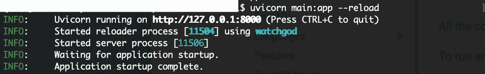

如何用 Uvicorn 服务器运行 FastAPI？图片由作者提供。

如果您在浏览器中转到本地主机 URL http://127.0.0.1.8000，您应该会看到如下所示的 JSON 消息输出。

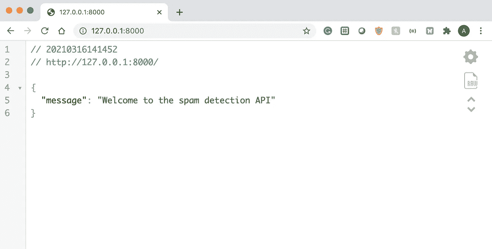

根 URL 上的 JSON 输出。图片由作者提供。

我安装了 JSON Viewer Chrome 扩展，这就是为什么我可以看到上面整洁的输出，如果你没有安装这个扩展，你的浏览器中的输出看起来会更像这样。

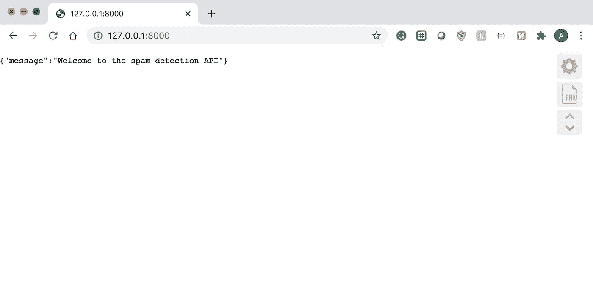

没有 JSON 查看器的根 URL 上的 JSON 输出。图片由作者提供。

现在我们知道了如何用 FastAPI 定义一个简单的 GET 请求，我们可以定义 GET 请求来检索垃圾邮件检测模型的预测。

## 加载模型和定义助手函数

在定义调用垃圾邮件检测模型的 GET 请求之前，我们需要首先加载模型，并定义预处理文本数据和返回模型预测的函数。

```
model = joblib.load('spam_classifier.joblib')def preprocessor(text):
    text = re.sub('<[^>]*>', '', text) # Effectively removes HTML markup tags
    emoticons = re.findall('(?::|;|=)(?:-)?(?:\)|\(|D|P)', text)
    text = re.sub('[\W]+', ' ', text.lower()) + ' '.join(emoticons).replace('-', '')
    return textdef classify_message(model, message): message = preprocessor(message)
    label = model.predict([message])[0]
    spam_prob = model.predict_proba([message]) return {'label': label, 'spam_probability': spam_prob[0][1]}
```

上面的**预处理器**函数从文本输入中删除表情符号和不需要的字符，而 **classify_message** 函数调用**预处理器**函数在使用垃圾邮件检测模型生成预测之前清理文本消息。 **classify_message** 函数返回一个字典，可以方便地解释为 JSON 响应。

## 定义垃圾邮件检测获取请求

FastAPI 使得为 GET 请求提供和读取变量变得非常容易。您可以使用查询参数或路径变量向 GET 请求提供机器学习模型的输入。

**使用查询参数**

对于 REST API，查询参数是 URL 字符串的一部分，并以“？”作为前缀。例如，对于我们正在创建的垃圾邮件检测 API，GET 请求可能如下所示:

*127 . 0 . 0 . 1 . 8000/spam _ detection _ query/？message= '您好，请回复此消息'*

请注意，最后的消息参数是一个查询参数。我们可以编写一个函数，接受一条消息作为查询参数，并将其分类为垃圾邮件，如下所示。

```
@app.get('/spam_detection_query/')
async def detect_spam_query(message: str): return classify_message(model, message)
```

如果我们导航到 localhost URL，我们可以用一个示例消息来测试这段代码。

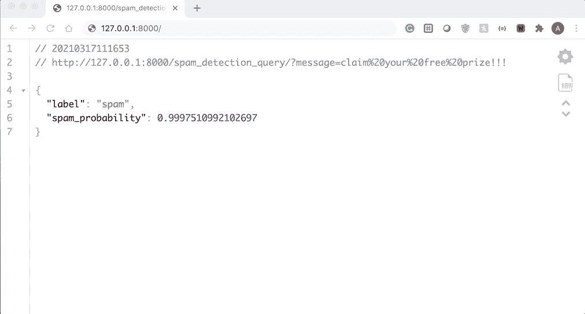

使用查询参数测试垃圾邮件检测 API。图片由作者提供。

**使用路径变量**

使用路径变量时，输入数据作为 URL 中的路径传递给 API。在这种情况下，GET 请求可能如下所示:

*127 . 0 . 0 . 1 . 8000/spam _ detection _ query/您好，请回复此消息*

注意，消息只是 URL 路径的一部分，我们不需要使用任何查询参数。我们可以编写一个 GET 请求来接受这种格式的消息，如下所示。

```
@app.get('/spam_detection_path/{message}')
async def detect_spam_path(message: str): return classify_message(model, message)
```

我们可以通过从 localhost 导航到 API URL 来测试这个新的 GET 请求，如下图所示。

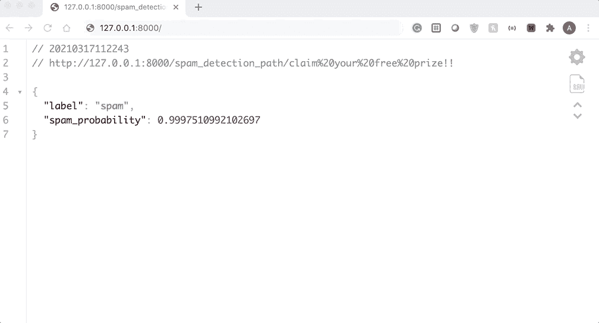

使用路径变量测试垃圾邮件检测 API。图片由作者提供。

至此，在编写了不到 40 行代码之后，我们有了一个用于垃圾邮件检测的正常运行的 REST API。查看下面完整的 Fast API 应用程序代码。

## 自动生成的文档

如果您导航到[http://127 . 0 . 0 . 1:8000/docs](http://127.0.0.1:8000/docs)，您将找到 FastAPI 应用程序的文档页面。

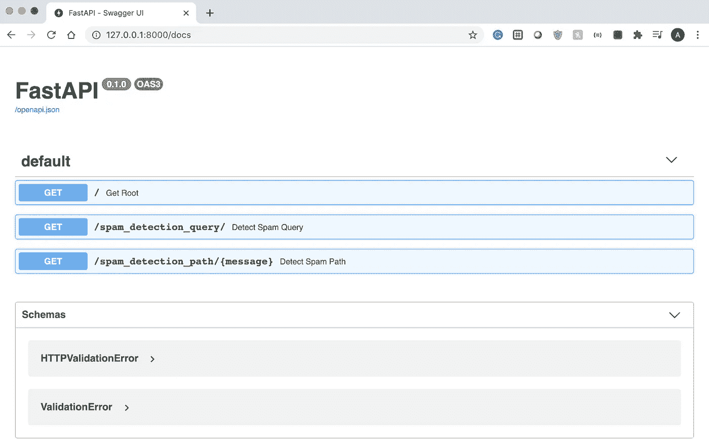

FastAPI 文档页面。图片由作者提供。

我们还可以使用这个文档页面来测试每个 GET 命令，如下面的 GIF 所示。

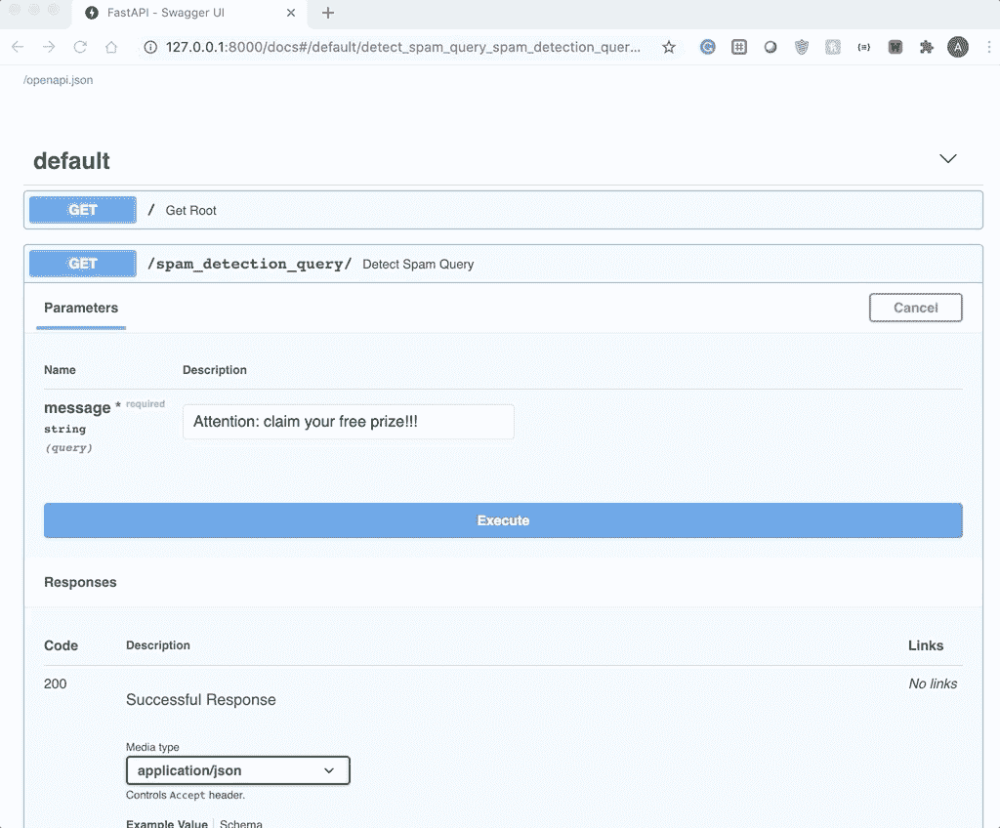

使用文档页测试垃圾邮件检测 API。图片由作者提供。

快速 API 的伟大之处在于这个文档页面是自动生成的。我们不需要编写任何代码或者投入大量时间来构建它。

## 在 Docker 上部署应用程序

现在我们有了一个工作的 API，我们可以很容易地将它作为 Docker 容器部署到任何地方。如果您不熟悉 Docker，它基本上是一个工具，可以让您在称为容器的隔离环境中打包和运行应用程序。

要将 API 作为 Docker 容器运行，首先需要创建一个名为 app 的目录，其中包含所有代码文件，并在父目录中创建一个 Docker 文件，其中包含运行 FastAPI 应用程序的说明。为此，打开一个名为“Dockerfile”的文本文件，并向其中添加以下行。

```
FROM tiangolo/uvicorn-gunicorn-fastapi:python3.7COPY ./app /appWORKDIR /appRUN pip install sklearn joblib
```

您的目录结构应该看起来像这样，还有一些来自训练垃圾邮件检测模型的额外文件:

。
├──app
│└──main . py
└──docker file

上面的 Dockerfile 文件执行以下任务:

1.  提取 FastAPI docker 图像。
2.  将应用程序目录的内容复制到映像。
3.  使应用程序目录成为工作目录。
4.  安装必要的依赖项，如 Scikit-learn 和 Joblib。

创建这个文件后，保存它并用下面的命令构建 Docker 映像。

```
docker build -t myimage .
```

一旦构建了映像，就可以用下面的命令运行 Docker 容器。

```
docker run -d --name mycontainer -p 80:80 myimage
```

现在，您应该有一个 Docker 容器在本地机器上运行。如果您打开 Docker 仪表板，您应该能够看到容器运行，如下图所示。

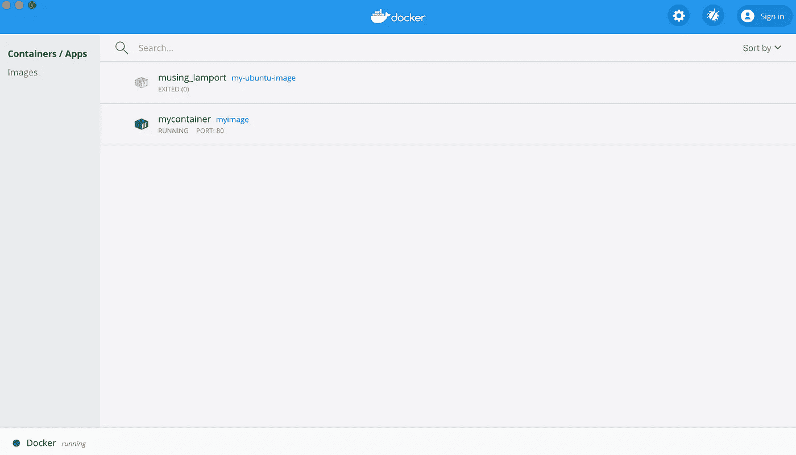

带有运行容器的 Docker 仪表板。图片由作者提供。

如果您将鼠标悬停在容器上，您应该会看到一个如下所示的“在浏览器中打开”按钮。

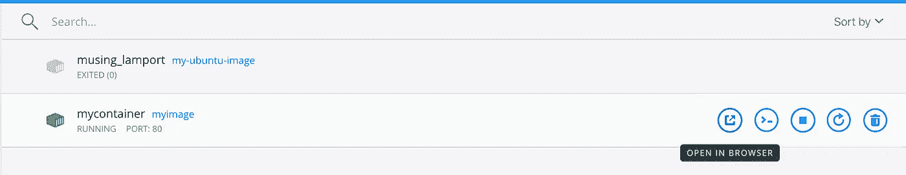

Docker 仪表板中的“在浏览器中打开”选项。图片由作者提供。

点击此按钮查看在您的浏览器中运行的容器。您应该看到从下面的根 URL 运行 GET 命令的输出。

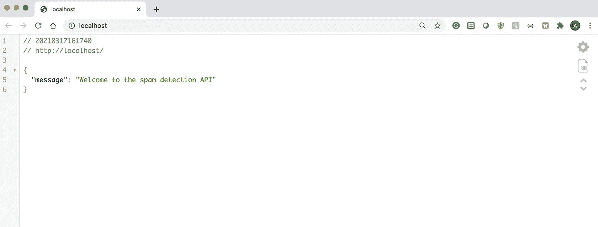

现在我们有了一个运行 API 的 docker 容器。图片由作者提供。

我们甚至可以通过访问 localhost/docs 中的文档页面来测试这个 API。

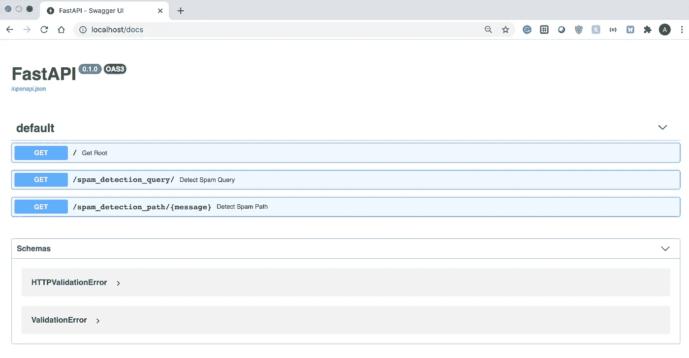

Docker 容器上运行的 API 的文档页面。图片由作者提供。

正如下面的截图所示，我们可以很容易地看出 API 正在按预期工作，但这次它是在 Docker 容器上运行的。

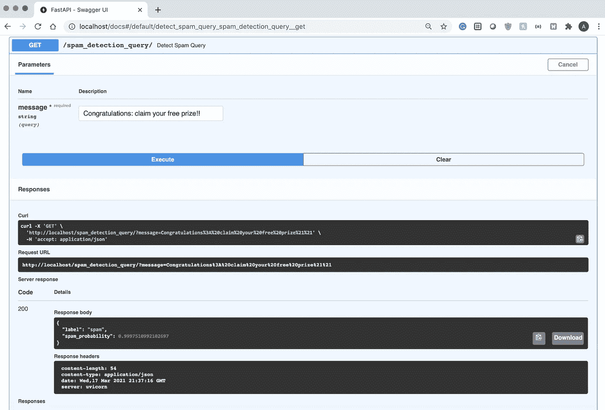

在 Docker 容器上运行 FastAPI 应用程序。图片由作者提供。

既然 API 运行在 Docker 容器中，我们就可以将它部署在广泛的平台上。如果你有兴趣将这个项目向前推进一步，如果你想在云平台上部署这个 API，请查看下面的一些链接。

[如何在 AWS 上部署 Docker 容器](https://aws.amazon.com/getting-started/hands-on/deploy-docker-containers/)

[在 Azure 上部署 Docker 容器](https://docs.docker.com/cloud/aci-integration/)

[在谷歌云平台上部署 Docker 容器](https://cloud.google.com/kubernetes-engine/docs/tutorials/hello-app)

# 摘要

在本文中，我演示了如何使用 FastAPI 和 Docker 快速部署垃圾邮件检测模型。FastAPI 是一个轻量级的快速框架，数据科学家可以使用它来创建机器学习模型的 API，这些模型可以轻松集成到更大的应用程序中。

和往常一样，你可以在 [GitHub](https://github.com/AmolMavuduru/FastAPISpamDetection) 上找到这篇文章的代码。

# 加入我的邮件列表

你想在数据科学和机器学习方面变得更好吗？您想了解数据科学和机器学习社区的最新图书馆、开发和研究吗？

加入我的[邮件列表](https://mailchi.mp/e8dd82679724/amols-data-science-blog)，获取我的数据科学内容的更新。当你[注册](https://mailchi.mp/e8dd82679724/amols-data-science-blog)的时候，你还会得到我免费的**解决机器学习问题的逐步指南**！

# 来源

1.  南 Ramirez， [FastAPI 文档](https://fastapi.tiangolo.com/)，(2021)。