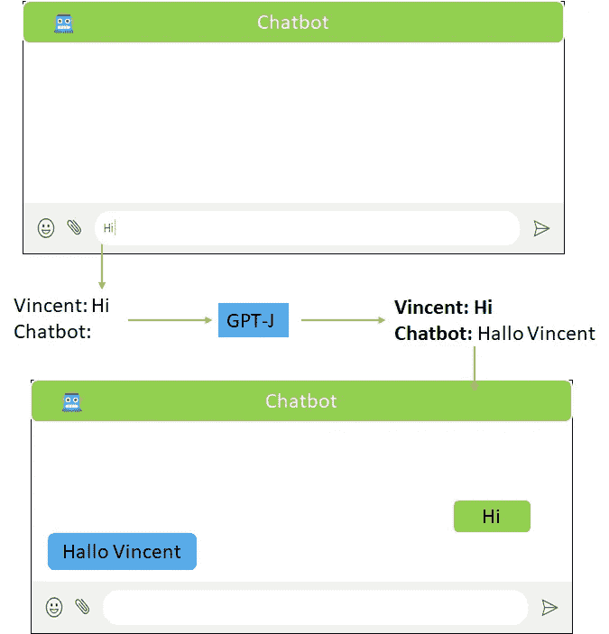
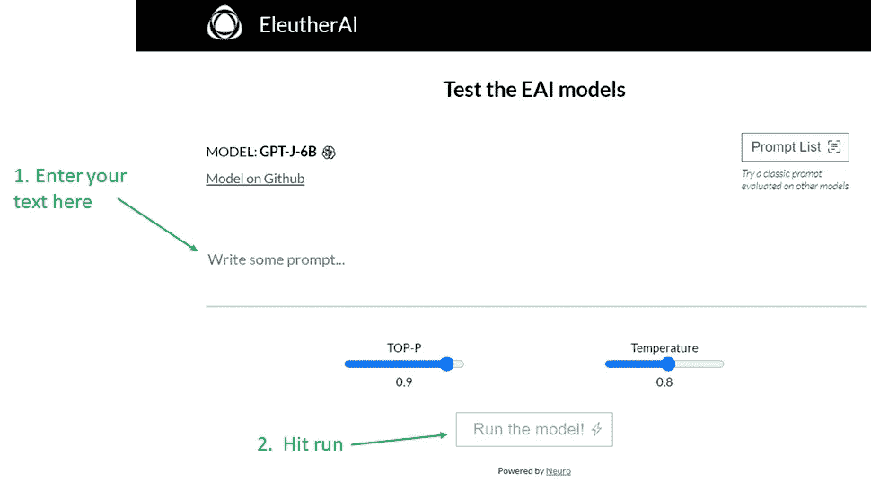
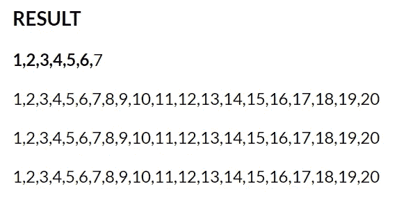
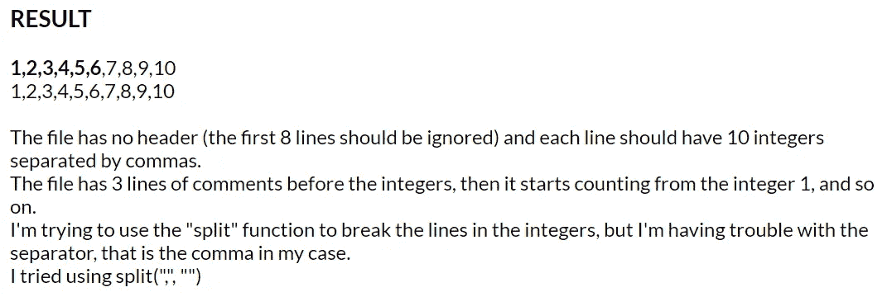
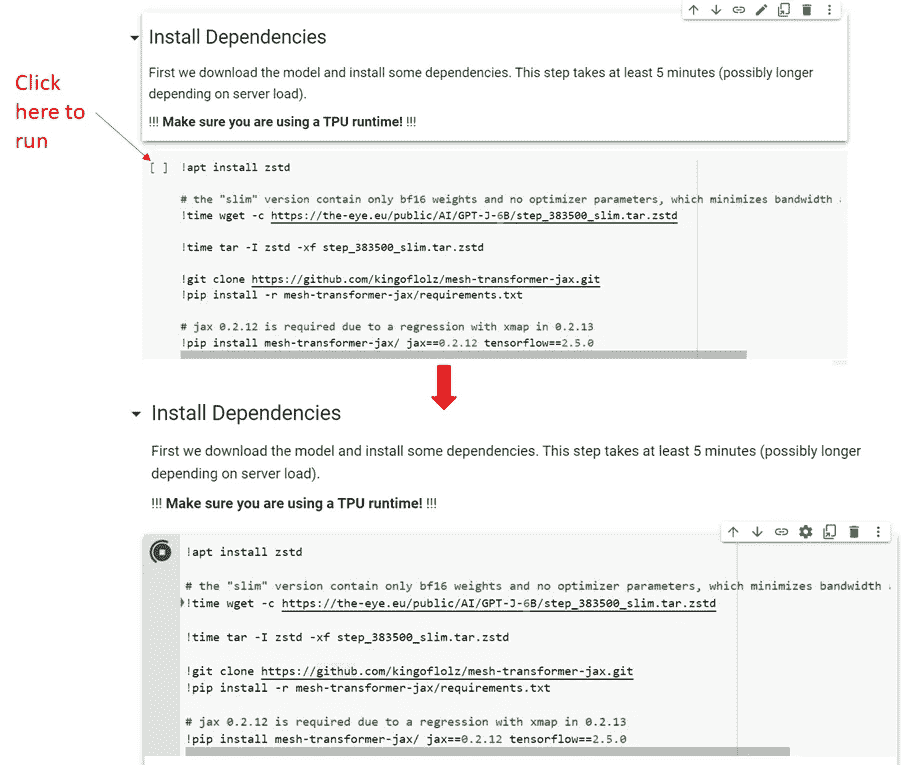
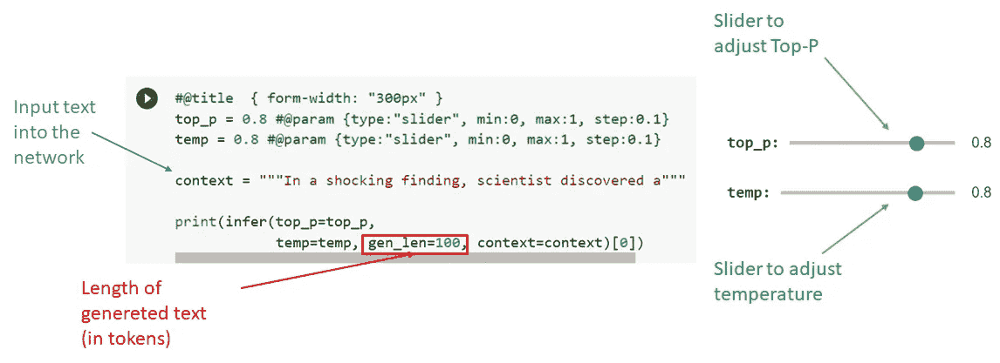
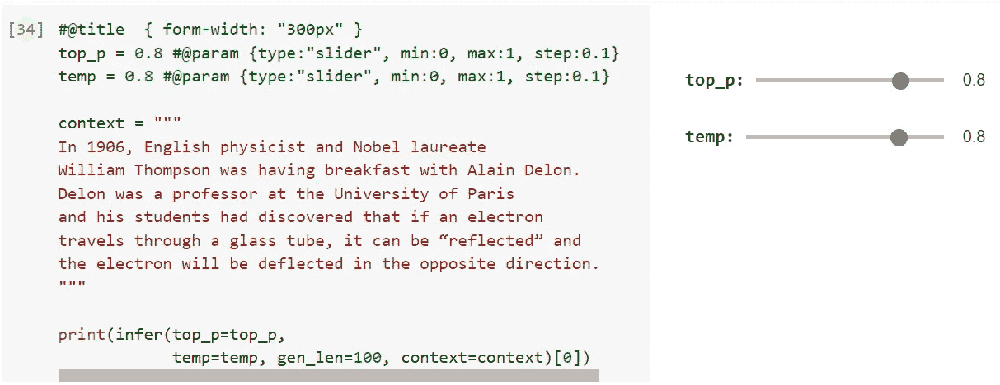
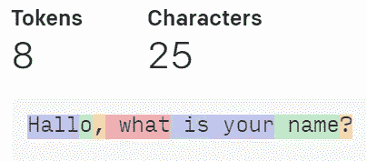

# 如何使用 GPT J

> 原文：<https://towardsdatascience.com/how-you-can-use-gpt-j-9c4299dd8526?source=collection_archive---------1----------------------->

GPT J 解释了 3 种简单的方法，你可以如何访问它


阿瑟尼·托古列夫在 [Unsplash](https://unsplash.com?utm_source=medium&utm_medium=referral) 上的照片

# 什么是 GPT J？

GPT-J 是一个名为 Eleuther AI 的组织发布的 60 亿参数模型。该组织的目标是使庞大的语言模型民主化，所以他们重新发布了 GPT-J，目前它是公开可用的。另一方面，由 openAI 发布的 GPT3 具有 1750 亿个参数，并且当时不公开可用。但是不要让参数数量上的差异欺骗了你。GPT-J 实际上在代码生成任务上胜过 GPT3。

GPT 模型不需要任何进一步的训练就可以完成语言处理中的各种任务，包括从未被训练过的任务。到目前为止，在 GPT 模型中实现这一点的方式是通过用来自互联网的书面文本来训练它们。一段文本被呈现给模型，它必须预测它将如何继续。因此，它“只能”预测文本可能如何继续，但这可以用于解决许多不同的任务，如语言翻译、代码完成、聊天、撰写博客文章等。

# GPT J 的使用案例

## 代码生成

GPT J 可以用来生成代码，这是非常高的质量和真正的工程。假设我们想在 tensorflow 中训练一个 CNN。我们可以写一个程序做什么的代码注释(也许包括一个我们希望程序使用的库),剩下的由 GPT-J 生成。

输入:

```
import tensorflow# 4 layer CNN with a softmax output# test on MNIST data set
```

输出:

(作者代码)

## 聊天机器人

你可以像写戏剧剧本一样写下整个对话来制作一个聊天机器人。



(图片作者

重要的是，你要不断地把整个守恒的一大块输入到 GPT j 中，否则这个模型会很快失去对话的上下文。

## 故事写作

开始写你的故事，把它输入 GPT J，它会继续下去。

## 语言翻译

输入:

```
**English: Vine
French:** 
```

输出:

```
**English: Vine
French: Vin**
```

## 搜索信息

GPT J 已经接受了许多科学文章的训练，并且已经吸收了许多知识。如果你不想查找某一特定的信息，你可以在 GPT-J 中键入该主题的标题，然后阅读它所写的内容。

输入:

```
Quantum entanglement
```

输出:

```
**Quantum entanglement** between two or more entangled particles plays an essential role in quantum information science. In many schemes, quantum states of photons, atomic spin systems, ions, and other quantum systems are entangled to encode quantum bits. An efficient method to entangle multiple quantum systems is to use the quantum interference between two or more independent and uncoupled sources, which can achieve quantum information processing and quantum cryptography[@b1]. An ideal interference can be produced by a beam splitter that splits a beam into two identical copies[@b2]. For the entanglement between two photons, beam splitter with 50:50 ratio can create maximally entang
```

# 1.浏览器中的 GPT J

Eleuther AI 设计了一个包含 GPT J API 的网页，我们可以在其中输入文本，并查看模型如何继续。



EleutherAI 网站的标题(图片由作者提供)

这是链接，你可以自己试试。

  

**温度设定**

我们还可以选择在网站上设置变压器模型的温度。将温度设置为非常低的值意味着模型对它认为可能的单词变得更有信心。过低的温度通常会导致模型陷入循环。在温度= 0.33 的下例中，我们可以很好地解决这个问题。



温度= 0.33(图片由作者提供)

高温会导致更疯狂、更出乎意料的用词。在下面的例子中，我使用了温度= 1.22。我们可以看到，现在数到十是计算机科学问题的一部分，看起来像是 stackoverflow 的一个论坛帖子。



温度= 1.22(图片由作者提供)

**Top-P 设置**

Top-P 值决定了有多少不太可能的单词被排除在总采样池之外。例如，Top-p 为 0.9 意味着所有单词中最不可能的 10%被排除在抽样之外。请注意，理论上一个单词有 90%的概率出现在下一个单词中，因此所有其他单词都将被排除在抽样之外。字的概率也随着温度而变化。

实际上，这意味着增加温度和增加 Top-P 具有非常相似的效果。

# 2.在 google colab 上运行 GPT J

Eleuther AI 网站的一个问题是，它会在很少的单词后删除文本。如果你想自己选择输出文本的长度，那么你可以在 google colab 笔记本上运行 GPT-J。如果你从来没有运行过这样的笔记本，不要担心我会指导你。但是我必须警告你，colab 需要 10 分钟来初始化模型。



(图片由作者提供)

以下是访问笔记本的链接:

<https://colab.research.google.com/github/ViniTheSwan/Bot/blob/main/colab_demo.ipynb>  

运行所有笔记本单元格，直到最后一个单元格。在笔记本的最后一个单元格，我们可以做我们的推断。我们可以更改 Top-P 和温度设置，并设置输入文本。但是我们也可以选择改变输出文本的长度。



(图片由作者提供)

python 中的三个引号意味着字符串可以跨多行。所以你可以把整段文字复制到程序中。

示例:



(图片由作者提供)

输出文本的长度是用记号来度量的，既不是字符也不是单词。令牌是常见的字符序列，可在互联网上的文本中找到。

在下面的图片中，我们可以看到我们的输入文本是如何被分成记号的。这个例子来自他们的 GPT2 模型的 OpenAI tokenizer。这实际上是同样的记号赋予器，也用在 GPT j



https://beta.openai.com/tokenizer[的说明(图片由作者提供)](https://beta.openai.com/tokenizer)

我们可以看到，Hallo get 分为“Hall”和“o”。标点符号也是独立的符号。除此之外，大多数单词等于一个单词。所以你可以把 gen_len 设置的比你最终想要得到的字数稍微高一点。

# 3.在 python 中使用 HuggingFace

你可以在电脑上用 huggingface 的“变形金刚”python 库运行 GPT-J。

## 要求

据推断，该模型大约需要 12.1 GB。因此，要在 GPU 上运行它，你需要一个至少有 16GB VRAM 和至少 16GB CPU Ram 的 NVIDIA 卡来加载模型。你也可以只在 CPU 上运行它，这样你只需要 16 GB 的普通内存，但是运行时间会更长。

## 装置

需要 pytorch 或 tensorflow 才能工作。所以如果你没有它们中的任何一个，用 pip 或者任何其他的包管理器安装一个。

```
pip install tensorflow
```

**或**

```
pip install pytorch
```

然后安装 transformer 库。

```
pip install transformers
```

您可以加载模型并使用下面的代码运行推理。您可以像在笔记本中一样，通过更改“上下文”字符串的内容来更改输入文本。

(作者代码)

变形金刚库的完整文档可以在:[https://hugging face . co/transformers/master/model _ doc/gptj . html](https://huggingface.co/transformers/master/model_doc/gptj.html)上找到

# 结论

GPT-J 非常容易访问，对于许多应用程序来说，它是非常方便的工具。

# 相关文章

</backpropagation-in-neural-networks-6561e1268da8>  </einstein-index-notation-d62d48795378>  </snake-with-policy-gradients-deep-reinforcement-learning-5e6e921db054>  

LinkedIn
[https://www.linkedin.com/in/vincent-m%C3%BCller-6b3542214/](https://www.linkedin.com/in/vincent-m%C3%BCller-6b3542214/)
脸书
[https://www.facebook.com/profile.php?id=100072095823739](https://www.facebook.com/profile.php?id=100072095823739)
Twitter
[https://twitter.com/Vincent02770108](https://twitter.com/Vincent02770108)
Medium
[https://medium.com/@Vincent.Mueller](https://medium.com/@Vincent.Mueller)
成为 Medium 会员并支持我(你的部分会费直接归我)
[https://medium.com/@Vincent.Mueller/membership](https://medium.com/@Vincent.Mueller/membership)