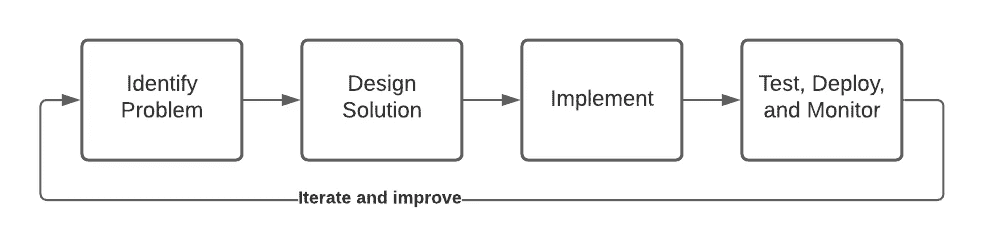
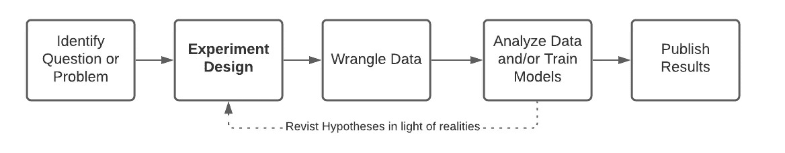
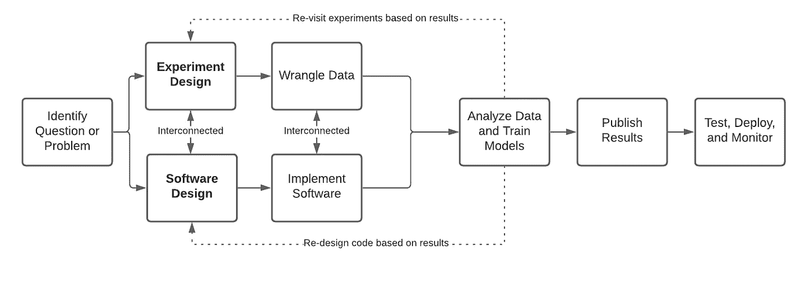
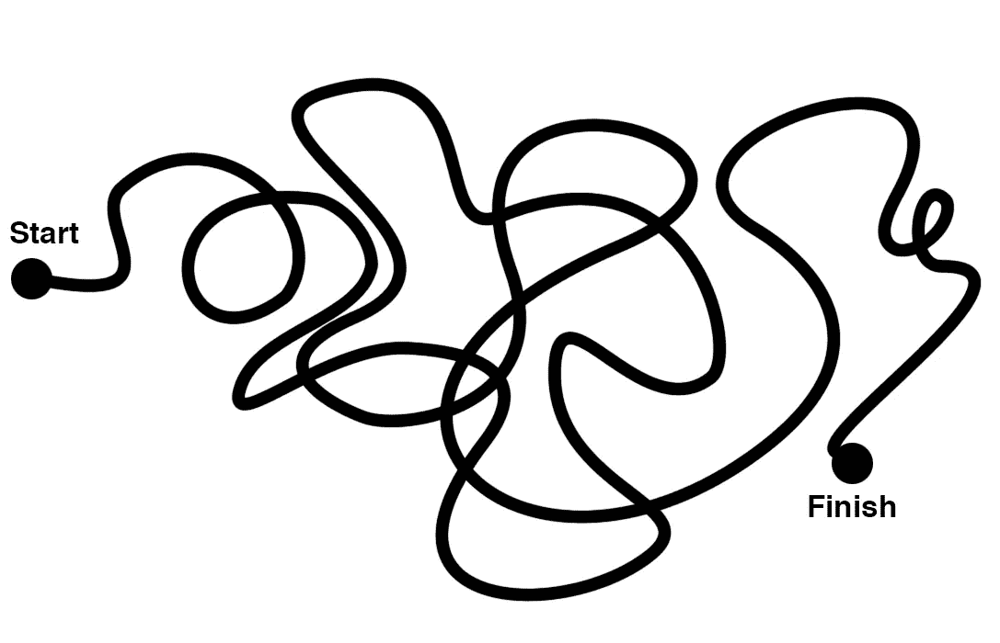
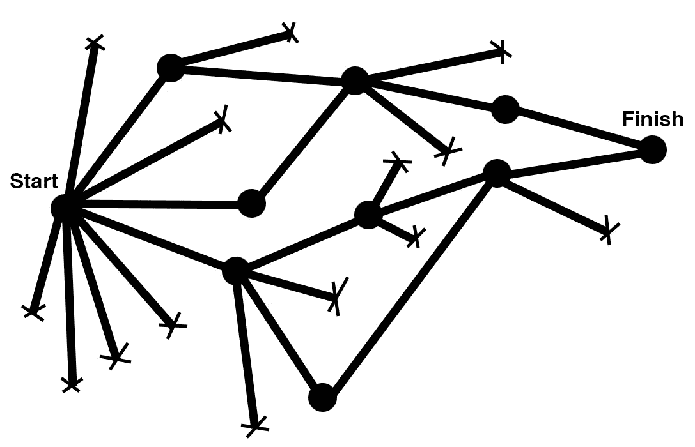

# 你应该如何设计 ML 工程项目

> 原文：<https://towardsdatascience.com/how-you-should-design-ml-engineering-projects-9af1930a4e2b?source=collection_archive---------27----------------------->

## ML 工程生命周期的分析，常见的陷阱，以及一个你可以使用的复制粘贴模板。

图片来源:[克里斯多夫·拉格](https://pixy.org/author/Christopher_Lague/)上[小精灵](https://pixy.org/9039/)

机器学习工程是很难的，尤其是在高速开发产品的时候(我们在变态安全就是这种情况)。开发 ML 系统时，典型的软件工程生命周期经常失败。

你或你团队中的某个人有多少次陷入了无休止的 ML 实验中？发现 ML 项目花费的时间是预期的两到三倍？从优雅的 ML 解决方案转向简单且仅限于按时发货的解决方案？*如果你对这些问题中的任何一个回答是肯定的，这篇文章可能适合你。*

**本文目的:**

1.  分析 ML 项目软件工程生命周期失败的原因
2.  使用**附带的设计文档模板**提出解决方案，帮助您和您的团队更有效地运行 ML 项目

# 软件和数据科学项目生命周期

典型的软件工程项目是关于开发代码和系统的。他们可能会这样:

(1)识别产品或基础设施问题(2)讨论并设计解决问题的软件系统(可能通过[爬行/行走/运行](https://www.forbes.com/sites/forbescommunicationscouncil/2020/09/24/ten-leadership-strategies-to-crawl-walk-run-your-way-to-success/?sh=5f1879763372) ) (3)将问题分解成几个部分并在几天、几周或几个月内实施，通常使用敏捷开发流程(4)投入生产和监控(5)根据需要返回到周期的开始以改进系统(图片由作者提供)

这个生命周期显然不是 ML 工程项目所发生的。数据实验呢？模型训练和评估呢？

也许我们应该关注数据科学研究项目，看看它们的生命周期是否更合适。

一个数据科学研究项目可能是这样的:(1)确定一个可以用数据回答的问题(2)设计实验(3)争论数据(4)用数据分析或建模评估假设(5)发布结果或训练好的模型。(图片由作者提供)

这个生命周期好像也不对。纯数据科学研究项目是关于回答问题，而不是关于构建系统。什么是中间立场？

# 机器学习工程

机器学习工程正处于数据科学和软件工程之间的独特十字路口。如果你试图强迫每个人在典型的软件开发生命周期中操作，那么 ML 工程师在软件工程组织中操作会有困难。另一方面，像纯粹的数据科学或研究团队一样运营机器学习团队将不会产生任何产品。

当 ML 工程师致力于一个需要实验的项目时，他们会感到沮丧。当他们不可避免地因为数据不支持他们最初的假设或因为争论数据比预期的更困难而有错误的开始时，他们开始落后于承诺的时间表。这种落后感导致一种感觉，即与从事软件工程任务的同事相比，他们工作的一个关键部分——即实验——感觉像是一个持续的失败。

一个典型的 ML 工程生命周期如下: (1)识别一个问题(2)设计软件和实验*(这些是相互关联的，因为你可能计划实现的模型将取决于哪些实验成功， 但是您可能需要设计特性和模型代码，以便首先运行您的实验)* (3)实现代码和争论数据*(这些可能是相互关联的，因为您可能需要实现软件来获得您需要的数据，并且您可能需要数据来编写和测试特性提取或模型训练代码)* (4)分析数据、训练模型、评估结果(5)发布结果(6)测试、部署和监控代码和模型。

典型的 ML 工程生命周期。软件设计和实验设计越好，需要的重复访问就越少，因为好的设计会预见到可能需要采取的分支。(图片由作者提供)

这种 ML 工程生命周期通常是在工作中发明的，而不是教授的。精心布局软件和实验设计，是有可能做得非常好的。尽管如此，它也很容易做得很差，导致许多错误的开始和通向解决方案的曲折道路(可能永远也不会达到)。

# 初级 ML 工程师 vs 高级 ML 工程师

在朱莉·卓的一篇精彩文章中，她生动地比较了[初级设计师和](https://medium.com/the-year-of-the-looking-glass/junior-designers-vs-senior-designers-fbe483d3b51e)高级设计师——这种形象化也适用于初级和高级 ML 工程师

初级 ML 工程师流程。他们经常会在实现、实验和数据的空间中徘徊，而没有明确的方法。这既浪费时间，又令人沮丧。(图片由[朱莉·卓](https://joulee.medium.com/)提供，经允许使用)

高级 ML 工程师流程)。高级 ML 工程师将仔细地规划实验路线，知道何时缩短它们，并朝着更有成效的方向前进，以及知道何时一个结果指示新的方向前进。(图片由[朱莉·卓](https://joulee.medium.com/)提供，经允许使用)

当重复实验时，有条理的思考和纪律是必须的。我们能帮助 ML 工程师按照这种模式规划工作吗？

# **帮助 ML 工程生命周期的设计文件**

我们如何鼓励更好的 ML 工程设计？

我们在“异常”实施的一个流程是，要求所有 ML 工程项目通过一个使用设计文档模板的正式设计审查流程，帮助工程师同时进行良好的软件和实验设计。

**设计 ML 工程项目应该鼓励什么？**

1.  在匆忙实施之前，将工作投入到明确的前瞻性实验中。这避免了我们不时会发现自己陷入的无休止且毫无结果的 ML/数据实验/无聊的实验迭代。
2.  无论实验是否验证了假设，都要大声说出实验的“成果”是有用的。推翻一个假设是有价值的，即使它不会导致 ML 产品的改进。
3.  设计软件时要考虑到实验，设计实验时要考虑到软件(也就是说，什么能够交付生产)。根据您将要构建的系统以及这些数据在生产中如何可用来争论您的数据。

考虑到这些，我们创建了这个模板，以便在任何 ML 工程项目开始时填写。工程师应该复制这个模板，填写他们项目的细节，然后将软件和实验设计提交给团队进行反馈和迭代。这个过程极大地提高了项目的成功和速度，我们非常鼓励你的 ML 工程团队采用这个设计模板(或类似的东西)。

— — — — — — —
异常安全的 ML 设计文件模板*(在新 ML 工程项目开始时复制并填写)。放心直接用，修改分享！*

# 问题陈述

*我们具体要解决什么，为什么现在要解决？一个强有力的理由将会把这与产品或客户问题联系起来。*

# 目标

**软件目标**

描述我们希望建立的软件系统及其功能。

**指标目标**

*期望的度量改进，我们将如何衡量这项工作的影响，我们为什么要以这种方式改进系统:*

*   *不好的例子:提高模型的性能*
*   *正常示例:将模型的 AUC 提高 X%*
*   *好的例子:在不降低任何其他类别的召回率超过 Y%的情况下，将假阴性类别的召回率提高 X%。*

*预期的度量折衷，如果有的话:例如:在不降低精度超过 5%的情况下提高召回率。*

# 试验设计

*与纯软件项目不同，数据科学/ ML 项目通常需要数据探索、实验、失败，以及在收集数据的过程中改变设计。为了帮助一个项目取得成功，规划潜在的分支点以及如何在这个过程中做出决策是很有帮助的。此外，所有实验都应根据基线进行评估，基线可以是问题的简单解决方案(简单算法、简单启发式算法)或当前生产解决方案(如果存在)。*

## 数据动机

*描述应该解决的问题，用数据验证这确实是一个值得解决的问题。这真的会产生真正的影响吗？*

## 假设

**假设 1:**

**方法:** *描述你正在接近的方法论。例如，这可能是我们正在测试的模型架构，我们正在添加的新特性，等等。* **指标:** *描述我们将用于评估方法的一个或多个指标。* **成功标准:** *将表明该假设成功的度量结果。理想情况下，应该用基线来衡量。* **time box:***X 天，然后与团队核对决定下一步* **失败下一步:** *例如，继续尝试假设 2* **成功下一步:** *例如，将此模型推向生产。*

**假设 2:……** *每个假设的同一套问题*

…

# 软件设计

描述执行该项目所需的软件系统和数据管道。需要构建什么软件？什么服务和数据库？生产中需要哪些数据来运行您的模型？在这里可以随意使用普通的软件设计文档原则。

## 执行

*送什么，什么时候送。一个强有力的计划将提供增量价值，并允许我们快速进入爬行状态。*

***爬行:*** *在我们投入太多时间在软件开发之前，证明改变的功效的最小设计。*

***走:*** *更彻底的设计旨在成为一个相对完整的部件。*

***跑:*** *长远设计在这里；我们如何使它成为真正一流的系统或模型。*

# 考虑

## 发布的成功标准？

*描述评估的指标，以倡导推出这种模式或改变到生产中。*

## 什么会出错？

*描述我们发布时可能出错的所有可能性？*

*   *哪些产品表面会受到影响？*
*   *这会对客户产生什么影响？*
*   *我们将如何监控？*
*   *我们要怎么做才能回滚？*

## 安全和隐私考虑

*   *这种变化会对安全性产生什么影响？*
*   这种变化会对隐私产生什么影响？

# 附录:实验日志

记录每个假设测试的结果和过程中做出的决定，分支点，学习，修正的假设，等等。稍后提醒自己并与团队中的其他人分享你如何处理这类问题是有益的。

— — — — — — — — — — — — — — — — — — — — — — —

这个模板已经发展了很多年。感谢 Dmitry Chechik、周宇·李、Kevin Lau、Umut Gültepe 和 Abhijit Bagri 长期以来对设计过程的所有投入。

如果你对网络安全领域迷人的应用 ML 工程感兴趣，是的，[我们正在招聘](https://abnormalsecurity.com/careers/)！