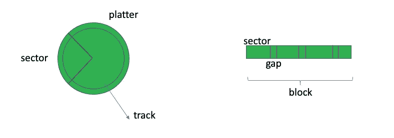
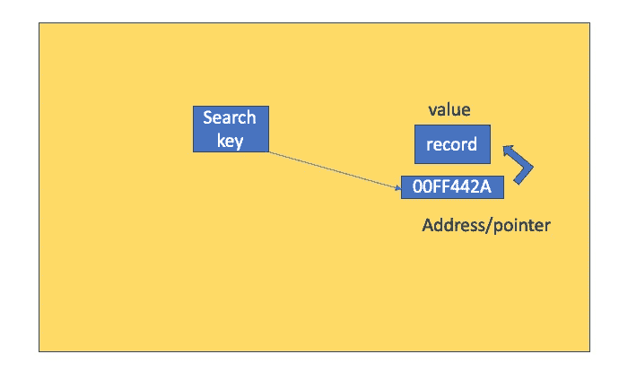
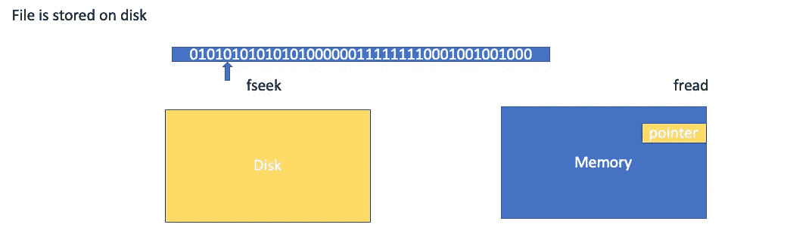

# 你的数据是如何存储在磁盘和内存中的？

> 原文：<https://towardsdatascience.com/how-your-data-is-stored-on-disk-and-memory-8842891da52?source=collection_archive---------11----------------------->

## [思想和理论](https://towardsdatascience.com/tagged/thoughts-and-theory)

## 当您操作 Excel 文件或数据框时，深入了解一下幕后发生的事情。


由[克里斯蒂安·威迪格](https://unsplash.com/@christianw?utm_source=medium&utm_medium=referral)在 [Unsplash](https://unsplash.com?utm_source=medium&utm_medium=referral) 上拍摄的照片

我认为自己是一名应用程序员，我使用像 Python 这样的高级编程语言来操作数据框架，构建简单的管道来促进某些任务的数据分析。然而，在原子层面上，计算机本身并不理解“pandas.read_csv()”是什么意思，也不理解“write.table()”函数实际上是做什么的。它让我想知道将我们的命令转换为 0/1 二进制位所涉及的中间步骤，并促使我写这篇文章。

在这篇文章中，我希望给你一个粗略而直观的图像，看看磁盘实际上是什么样子，你的数据是如何在磁盘上布局的，以及你的磁盘和内存之间的信息交换是怎样的。这并不意味着是一个严格的技术博客，而更像是放松的阅读材料。了解物理硬件结构有助于我们更好地理解工作中可能遇到的任务和问题:

> 内存泄露？索引文件？内存开销？输入输出流？

所以振作起来，让我们开始吧！

# 磁盘是什么样子的？

当您在 PC 或 Mac 上时，您打开电脑或 Finder，所有出现在那里的文件都存储在磁盘上，有时磁盘也称为存储器。现在，几乎大多数个人电脑都在使用固态硬盘(SSD)，然而，为了传达一些直觉，我将使用硬盘(HD)来说明磁盘的物理结构。


本杰明·雷曼在 [Unsplash](https://unsplash.com?utm_source=medium&utm_medium=referral) 上拍摄的照片

典型硬盘的结构看起来像 CD 播放器，它有一个可以旋转并切换到选定轨道的臂，臂的头部能够读取、写入或擦除存储在表面每个轨道上的数据。



盘片、磁道、扇区、间隙、数据块

表面也被称为盘片，盘片可以被分割成一组称为扇区的物理单元。每个扇区之间有间隙，几个扇区构成一个块，这个块就是**逻辑单元**。

如果我告诉你一个盘片中的一个磁道的最大容量是 1024Kb (1Mb)，那么你就知道你的 Excel 文件，我们假设是 2Mb，将占用两个盘片来存储它。

如果转速是已知的，那么你可以很容易地计算出文件/位从磁盘传输到内存的速度，反之亦然。同样清楚的是，为什么大文件需要更多的时间来读取，因为它需要更长的时间来旋转臂，并且臂也需要更长的时间来读取，因为存储区域将更大。

固态硬盘(SSD)将具有更快的访问时间，其架构与我在上面向您展示的硬盘(HD)示例有很大不同。但希望这能给你一个清晰的图像，你的文件在哪里，接下来我将向你展示数据是如何在磁盘上的。

# 数据是如何在磁盘上排列的？

在数据库管理系统(DBMS)中，每个记录(记录基本上是数据帧中的一行)以某种特定的方式位于磁盘上，以加速搜索、插入和删除。想象一下，如果每条记录都分散在磁盘上，没有任何规则或组织，将无法执行查询、索引和任何操作。



磁盘上的单个记录/数据

简单地说，您可以按行的方式存储所有数据，这意味着相似的记录/行将被收集在一起。这样做，按行索引可能非常有效，但会增加列操作的成本，或者按列索引可能相对较慢。如果按照列的方式，事情会变得完全相反。

让我们假设每一行都存储在磁盘上的一个合并空间中，如图所示。物理地址或指针与该记录相关联。除此之外，搜索关键字通常作为代理出现在**索引文件**中。索引文件基本上是一对搜索关键字和指针的组合。因此，拥有一个搜索关键字旨在加快搜索并避免开销。随着搜索关键字的出现，科学家们已经开发了大量有效的模式来表示和组织所有的搜索关键字。突出的例子包括:

1.  **B+树** : [自平衡树，使得从根到所有叶节点的距离相等。](https://www.youtube.com/watch?v=DqcZLulVJ0M)
2.  **B 树** : [类似于 B+树，但其记录存储在非叶节点上](https://www.youtube.com/watch?v=aNU9XYYCHu8)
3.  **可扩展哈希** : [一个目录连同桶，桶存储哈希表或哈希函数计算出的哈希关键字](https://www.youtube.com/watch?v=TtkN2xRAgv4)。
4.  **线性哈希** : [类似于没有目录的可扩展哈希，但是有多级哈希函数。](https://www.youtube.com/watch?v=h37Jhr21ByQ)

由于这不是一个技术博客，我想向您推荐一些精彩的 youtube 视频(上面的链接),它们解释了每个索引模式是什么，以及它们如何实现快速有效的插入和删除。但是从这一部分得到的信息是，**数据以一种设计良好的方式在磁盘上布局，使我们能够有效地获取和操作它们。**

# 如何从磁盘读取字节/文件到内存？

首先，我希望灌输一点非直觉的事实，即**文件实际上是一个位/字节流**。当你把一个文件读入内存时，你是在处理一系列的 0/1，你希望正确地载入文件的特定部分。



fseek 和 read 函数将文件流读入内存

现在我们必须使用一些低级语言，如 C:

```
# declare file pointer
File *fp;
# initialize file pointer with a binary file stored on disk
fp = fopen('./test_file.bin','r');
# set the reading pointer from starting point (SEEK_SET) to 4 bits forward (offset = 4)
fseek(fp,4,SEEK_SET);# declare a pointer to store the file in memory
ph = (char) malloc(128);
# read the file, read 128 bits to the pointer in memory
fread(ph,sizeof(char),128,fp)
# free the memory
free(ph)
```

如图和代码片段所示，`fseek`函数有一个内置变量`SEEK_SET`，它是文件流的起始位置。我们设置`offset=4`来指示函数从`SEEK_SET`前面 4 位的位置读取。然后，我们在内存中声明一个 char 指针，使用`fread`函数将 128 位文件流专门读入我们刚刚定义的特定内存空间。这就是从磁盘读取到内存的实际工作方式。

此外，确保首先使用 c 中的`malloc`函数分配内存空间。同样重要的是，无论何时使用`free`函数手动分配空间，都要释放内存空间。忽略此步骤会导致**内存泄漏**问题，这是由未正确释放的未使用内存引起的。

# 结论

就像我在开始所说的，在大多数情况下，作为一个应用程序员，底层实现并不是我们主要关心的。然而，我始终认为这不是阻止我们学习一点计算机系统基础知识的借口。我希望你觉得这篇文章有趣和有用，感谢阅读！如果你喜欢这篇文章，请在 medium 上关注我，非常感谢你的支持。在我的 [Twitter](https://twitter.com/FrankLI55917967) 或 [LinkedIn](https://www.linkedin.com/in/guangyuan-li-399617173/) 上联系我，也请让我知道你是否有任何问题或你希望在未来看到什么样的教程！