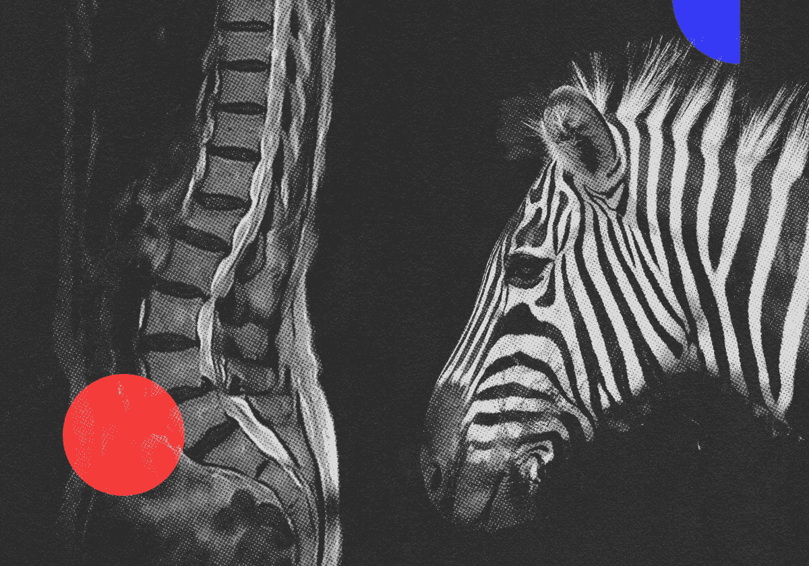
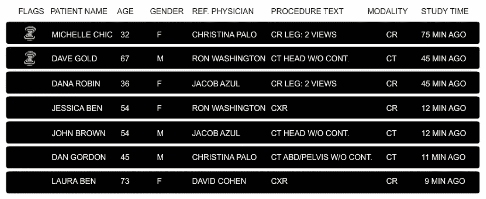
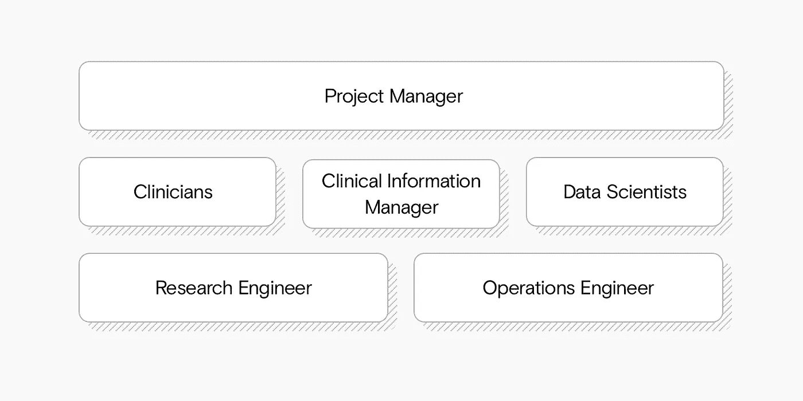

# 斑马医疗视觉如何开发临床人工智能解决方案

> 原文：<https://towardsdatascience.com/how-zebra-medical-vision-developed-clinical-ai-solutions-34b385617b65?source=collection_archive---------11----------------------->

## [行业笔记](https://towardsdatascience.com/tagged/notes-from-industry)

## Zebra Medical Vision 拥有 7 种 FDA 批准的解决方案——以下是他们是如何做到的

来源:作者

# 临床人工智能诊断解决方案的特殊缺乏

许多研究表明，机器学习模型在一系列任务上可以像训练有素的医生一样表现出色，特别是在放射学方面，甚至可以找到人类医生可能会错过的模式。

但多年来，人工智能支持的诊断解决方案并没有在医院实际使用。在其他领域，我们习惯于从研究到实践的快速转化:在面部检测技术取得突破后，你可能会看到脸书在不到六个月的时间里使用同样的技术来标记你的朋友。但是在医学诊断中，创新并没有转化为实践。为什么不呢？

这正是 Eyal Toledano 在 2014 年 Zebra Medical Vision 诞生时面临的情况:大量的突破性研究，诊断中对人工智能支持的明显需求，大量的人才，但在日常临床使用中几乎没有解决方案。

所以他们去寻找这个现实背后的原因。他们发现，在人工智能诊断应用于临床之前，单靠研究无法解决一些需要解决的关键挑战。医生和临床医生需要:

1.  在代表总体的数据集上训练的模型；
2.  无缝集成到临床工作流程中；
3.  连接研究和医院的技术平台。

# 挑战 1:构建代表性数据集

Eyal 和他的团队发现的第一个问题是大多数学术研究依赖于小数据集。它们不仅规模小，而且也不代表临床医生每天在医院看到的各种各样的病例。对于现实世界的诊断解决方案，代表性数据绝对至关重要。

因此，第一个挑战是获得一个大的、多样化的数据集，看起来就像你在医院里期望看到的那样。

这就是为什么在最初的两年里，斑马医疗视觉几乎没有进行任何机器学习。相反，他们专注于与以色列、美国和印度的 30 多家医院发展数据合作关系。

# 收集病人的全景

虽然许多研究可能只是使用一种类型的数据来比较医生和机器的诊断性能，但 Zebra Medical Vision 必须走得更远。他们收集了以下方面的数据:

*   许多不同形式的放射学图像(X 射线、CT、MRI、乳房 X 线照相术、PET 和核医学)；
*   实验室分析；
*   病人入院和出院；
*   医生的诊断；
*   临床结果(指患者出院后的情况，可能是几年后)。

这里的关键因素是 Zebra-Med 收集的样本必须代表医生每天在医院面临的完全相同的多样性和复杂性。

# 概念验证与临床诊断解决方案

假设您构建了一个系统，该系统可以拍摄放射学图像，然后正确判断图像是否显示肺癌迹象或指示健康患者。乍一看，这似乎非常有用。但在医院里没用。

到目前为止，这只是一个概念验证——你已经证明了一种算法可以处理放射学图像，并区分两组明确描述的患者。但是这种情况(肺癌对健康患者)真的代表了医生将面临的问题吗？

事实上，这不是医院里会出现的问题。更有可能的是，病人来找你是因为他们已经有了一些症状，你需要诊断原因:毛玻璃样阴影、肺栓塞、慢性阻塞性肺病、肺气肿和肺癌可能都呈现类似的症状。

如果机器学习模型对医生有任何用处，它需要能够区分有症状的患者的放射学图像，而不是健康和不健康的人。

换句话说:你训练诊断模型的数据需要**代表你期望在诊所看到的人群**。

但这并不是为日常医院诊断制作有用模型的唯一障碍。

# 挑战 2:无缝集成到临床工作流程中

Zebra 的人工智能预测直接集成到临床工作流程中:它会标记可疑的研究，医生可以轻松地将它们排在最前面。来源:作者

可以肯定的是，医生和其他人一样，希望新的解决方案能让他们的工作变得更简单，而不是更复杂。

但是学术研究没有解决这个问题。例如，您可能会开发一个非常准确的机器学习模型，该模型仅在使用特定的机器设置拍摄图像时表现良好，这些设置是医生通常不会在常规检查中使用的。

以这种方式解决问题当然是一个有价值的研究结果，但它仍然远远不是一个用于临床实践的可行的诊断模型，因为它需要一个非标准的工作流程。

在实践中，该模型必须无缝地适应现有的工作流程。这意味着:

# 使用标准工作流程中产生的数据

临床上有用的模型不应该要求临床医生执行任何额外的步骤。它应该只需要在医院的正常诊断工作流程中已经产生的精确数据(以精确的格式)。

# 使用医生已经使用的软件

Zebra Medical Vision 没有为医生建立一个新的软件工具来添加到他们的工作流程中。相反，他们与诊断工作站合作，将他们的预测直接整合到医生已经熟悉的软件工具中。

这种无缝集成是必不可少的——不仅因为要求医生改变他们的工作流程是不现实的，还因为使用人工智能的全部目的是节省时间，而不是增加额外的工作。

但这并不容易。有各种各样的工作站提供商和软件，以及不同种类的环境(例如，基于 web 的或基于 Windows 的)。再加上很多软件都很旧了。然而，Zebra-Med 必须与它们中的每一个集成。

# 将积分与计算分开

Zebra-Med 构建了一个智能基础设施，在最大限度减少重复工作的同时，提供了灵活性。医院只需在他们的本地系统中安装一次代理，该代理处理隐私、安全和匿名，并提供本地用户界面。

另一方面，所有繁重的工作和预测都发生在云中。这也使得 Eyal 和他的团队推出新版本的模型变得非常简单。他们只需更新他们这边的模型，安装在医院的代理与集中托管的模型进行通信。这意味着医院不需要做任何事情来接收更新。

此外，Zebra-Med 会提前计算预测，因此当医生点击图像时，他们可以立即看到结果。

假设您已经成功构建了一个模型，该模型能够准确地代表人群，无缝集成到诊断工作站中，并符合医生的工作流程。

即使这样，你仍然不能确定医生会从使用你的诊断模型中获益。原因如下。

# 节省医生的时间

假设每 1000 张乳房 x 光照片中有 6 例癌症诊断，并且你已经训练了一个可以实时评估图像的机器学习模型。医生现在可以在所有扫描结果旁边看到人工智能模型的评估，并可以对已标记的病例进行优先排序。

现在我们面临两个重要的考虑因素:

**假阴性率**。有多少次模型认为病人是健康的，而事实上他们并不健康？这种错误显然是非常危险的。如果医生因为系统显示病人健康而不看扫描，那么病人可能会错过接受治疗的机会。这是一个必须不惜一切代价避免的严重错误。

**假阳性率**。当患者实际上健康时，系统多久标记一次扫描？这个错误的问题要小得多——医生会交叉检查扫描，因为系统会标记它，并会发现这是一个错误的警报。

但总体来说，假阳性率还是决定了系统是否节省了医生的时间。假设您看到一个扫描被标记。你会努力检查它，试图理解为什么人工智能系统可能会认为它有问题，并花很多时间深思熟虑，然后得出结论:“不，人工智能犯了一个错误。这个病人其实是健康的。”假设每 50 次扫描中有 49 次是这种情况。

在这种情况下，如果医生不得不花额外的时间检查和反驳人工智能标记的大多数病例，人工智能可以更快地做出单个评估并不重要。

为了评估人工智能解决方案是否能够真正加速特定的诊断工作流程，您需要考虑:

*   **整合。**您的模型如何无缝集成到当前工具中？人工智能评估适合工作流程吗？
*   **陈述。**你能以一种对医生有意义的方式展示预测吗？
*   **临床患病率**。在给定的扫描次数下，你预计会有多少病例？还有能不能达到医生能容忍的假阳性率？

到目前为止，我们已经强调了获得真实的临床数据作为构建模型的基础的重要性，该模型可以对临床中存在的精确人群和数据执行操作。我们已经证明，简单地拥有一个自动化诊断模型并不一定意味着您节省了医生的时间——无缝集成和可管理的假阳性率是必不可少的。

但是如果我们想把研究和临床联系起来——以一种满足监管要求的方式——我们仍然缺少一些东西。

# 挑战 3:构建人工智能诊断解决方案的技术支柱

熟练的数据科学和研究团队是必不可少的，但这还不够。

一旦 Eyal 和他的团队拥有了数据和将解决方案送到临床医生手中的方法，他们就必须在这座桥的顶部建立一条高速公路:使其他一切成为可能的技术骨干。

# 大规模标注和管理数据

机器学习模型从数据集学习。因此，如果你的数据中有任何错误——比如错误的诊断——那么模型也会学习这些错误。在运行任何实验之前，您需要仔细检查并正确注释研究中的所有数据点。

对于他们的研究，Zebra Medical Vision 必须协调全球多达 60 名不同的专家注释者的支持，他们都在从事相同的临床任务。在这种规模下，Eyal 必须构建内部工具来收集、比较和整合所有这些注释。

# 一次运行数千个实验

在过去，研究人员可能会花时间设计完美的实验，实施它，然后评估他们的方法是否能解决问题。但这对机器学习不起作用:有太多的方法来分割数据和建立模型，你永远不会到达终点。

因此，Eyal[和他的团队]需要建立一个平台，让研究人员能够同时测试不是一个，而是数千个实验。他们还制作了工具来跟踪所有这些实验，然后比较结果。

# 分离研究和临床系统

许多公司谈论反馈循环——通过用户反馈改进模型。对于临床解决方案来说，这通常是不现实的，也是不负责任的。

诊断模型被认为是一种医疗设备，任何改变都必须经过监管部门的批准。

斑马医疗视觉的研究(模型训练和测试)和临床使用的两个系统是完全分开的。它们之间有防火墙，它们甚至托管在两个独立的物理位置。

当然，该团队仍然希望从医生那里获得反馈，这样他们就可以了解模型是如何执行的，并在未来的迭代中使用这些知识。

但这只是在监管环境中工作的障碍之一。

# 满足法规要求

与诊断模型的开发和使用相关的一切都需要是可追溯的，包括:

*   产品定义和系统要求；
*   设计；
*   数据监管；
*   研究、开发和工程；
*   测试；
*   发布流程；
*   顾客投诉。

Zebra Medical Vision 建立了一个全球质量管理系统，持续向 FDA 提供这些信息，通过透明度赢得信任。它们还遵循三种不同的 ISO 标准，以及第三方审计机构发布的 SOC 2 Type 2 内部控制报告，并接受了这些标准的测试。

这需要在安全方面进行大量投资，并确保所有事情都被记录在案。

现在我们讨论了伙伴关系、数据、集成和技术骨干。都是必须的。但是这些元素仍然不足以解决机器学习诊断问题——或者 Eyal 所说的临床任务。

# 乐队:一个具有临床使命的跨学科团体

Zebra Medical Vision 很快认识到，数据科学家无法完全依靠自己的力量制造出有用的医疗设备。此外，如果你将临床医生和数据科学家配对，你仍然会被卡住，因为即使他们认为他们在谈论同一件事，他们通常不是。需要有人来填补空缺。

# 两个世界之间的翻译:临床信息管理者的角色

Zebra Medical Vision 需要一个具有临床试验管理经验的人，一个既能说临床医生的语言，又能说数据科学家的语言的人。他们称这个角色为“临床信息经理”——这个人通常拥有生物医学工程或临床研究的博士学位。

每个临床任务还需要一名项目经理、一名研究工程师和一名操作工程师。

Eyal 称这个独特的跨学科团队为乐队:不同的才能，相同的临床使命。

乐队:Zebra-Med 用来成功解决临床任务并将 AI 诊断带入临床的跨学科团队。来源:作者

每个乐队成员都有特定的角色:

*   **项目经理**保持项目正常进行。
*   **的临床医生**带来了关于医院日常现实复杂性的知识。
*   **数据科学家和研究工程师**制定和测试对数据的假设，也知道如何训练和验证机器学习模型。
*   **临床信息经理**了解临床研究，并在临床医生和研究人员之间架起一座桥梁。
*   **运营工程师**以稳健和可扩展的方式实施临床解决方案。

有一个紧密合作的乐队意味着一切都可以更有活力。正如 Eyal 发现的那样，这种灵活性是绝对必要的。

# 动态解决问题:任务总是在不断变化

在大学研究中，你正在研究的问题通常是固定的。但是埃亚尔和乐队发现他们经常在途中有所发现。因为这些发现提高了他们对问题的理解，他们经常改变临床任务。

乐队非常适合适应这些变化。一个原因是 Zebra Medical Vision 的技术骨干，这使他们能够快速工作，轻松修改和重新运行实验——而无需从头开始。

有了这些基础设施和这个团队，斑马医疗视觉可以以令人眼花缭乱的速度前进。他们已经在开发第七种 FDA 批准的诊断解决方案，更多的方案即将推出。

现在让我们看看 Eyal 和他的团队开发的两个诊断解决方案的例子，看看他们在这个过程中学到了什么。

# 医学影像解决方案的真实世界和研究方法之间的差异

# 例 1:冠状动脉疾病的早期预警

一半的心血管相关死亡是由于冠状动脉疾病。细胞废物、蛋白质和钙粘附在血管壁上，并与脂肪结合形成斑块。如果这种情况发生在向心肌供血的动脉中，那么它会限制或停止向心脏供氧，导致心脏病发作。

不幸的是，冠状动脉钙化的积累通常只能在心脏病发作或类似心脏事件后被诊断出来(T4)。

**学术研究方法**:当 Zebra Medical Vision 研究这个问题时，他们发现一篇学术论文称**如果您**手动分割感兴趣的区域，进行门控 CT 扫描(仅聚焦于心脏的扫描)，并在特定协议中使用和不使用造影剂进行测量，**然后**您可以建立一个模型，该模型可以提供相当于 Agatston 评分(从 0(低风险)到 400(非常高风险)的风险测量)。

本质上这是一个分割问题:你分割冠状动脉中钙化的白云。

**这种方法的问题**:这种特殊的 CT 扫描协议只适用于已知有心脏病风险的病人。因此，这不能帮助所有其他处于危险中但还没有症状的患者。

考虑到很少有患者在心脏病发作前出现症状，找到一种方法来诊断更多的患者将会更有帮助。

**更实用的方法:** Zebra Medical Vision 意识到，患者需要为许多其他疾病进行 CT 扫描。这些所谓的无目标或无门控扫描可以包括许多器官，也包括心脏。Eyal 和他的团队发现了一种方法，在这种方法中，他们可以进行更频繁的扫描，同时仍然可以达到与研究人员为目标扫描建立的模型相似的准确性——在预测心脏病风险方面。

这意味着医生现在有一个心脏病预警系统在后台运行。如果患者是高风险患者，该系统会自动提醒他们——即使他们是出于另一个原因进行扫描，可能从未检查过心脏。因此，许多患者得到早期诊断并接受预防性治疗。

如今，这是 Zebra Medical Vision 的领先解决方案之一，并已被证明对大部分人群有效。它甚至优于其他只对门控 CT 扫描有效的解决方案。

# 例 2:脊椎压缩性骨折

骨质疏松症的早期诊断和治疗至关重要。但是脊椎压缩性骨折——骨质疏松症的一个可靠症状——在常规检查中经常被遗漏。

脊椎压缩性骨折(VCFs)——脊椎中部分脊椎骨塌陷的情况——经常被放射科医生忽视。这不是他们标准工作流程的一部分，诊断通常不是急性的，而且诊断起来很乏味:放射科医生必须检查扫描的另一部分，然后将每个椎骨的高度与其基线高度进行比较。最终，75%的 vcf 没有得到诊断或报告。

但是大多数高危人群已经在某个地方做了扫描。这意味着像素是存在的，压缩骨折已经在数据中捕捉到了——它们只是没有被报告。

尽管这个问题并不性感，也没有得到太多的关注，但诊断 VCFs 的好处——以及随之而来的骨质疏松症——对患者来说是巨大的。例如，50%的髋部骨折患者在未来 10 年内死于并发症。然后还有巨大的康复负担。

因此，Zebra Medical Vision 构建了一种算法来定位和识别这些压缩因素。这有助于真正关心骨质疏松症预防和治疗项目的临床医生识别 VCFs 患者。

现在，对有骨质疏松风险的患者进行筛查的医院可以在后台运行该模型，并自动提醒可能有骨折的患者。然后医生可以通过人工检查来确认这些病例。

正如埃亚尔所说，“有时候我们看的问题是有意义的，而不是性感的。”当你以一种探索的心态——一种数据科学家的心态——来看待大型数据集时，你会发现这种机会。

# 用天真的乐观完成不可能的事情

2014 年 5 月，在最开始的时候，Eyal 和他的同事去达拉斯参加了一个放射学会议。每个人都告诉他们:“放射学中永远不会有机器视觉这样的东西。那是幻想。你们是不错的以色列人。好好享受你的假期，回以色列去，找点别的事情做。”

但是他们天真的乐观拯救了他们。Eyal 和他的联合创始人认为他们可以解决这个问题，而且要快。最终，即使花费的时间稍长，这也将是一个极其有意义的挑战，项目的影响和价值是不可否认的。

这种心态推动他们通过无数的挑战。但正如埃亚尔所说，“你需要极其愚蠢——以一种积极的方式。”