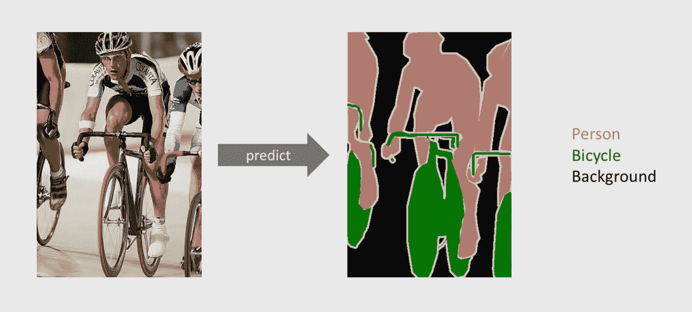
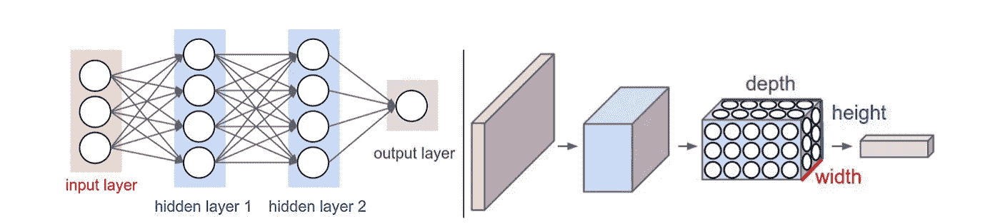
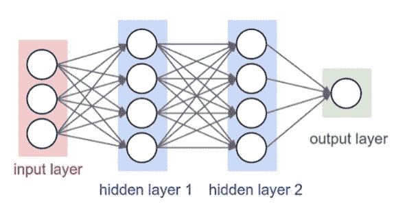
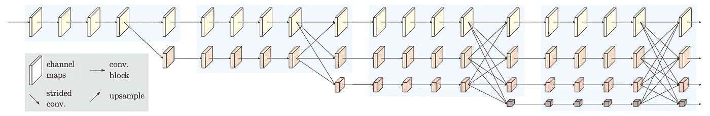
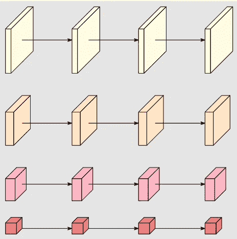
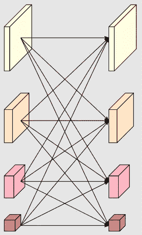
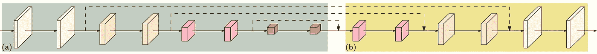
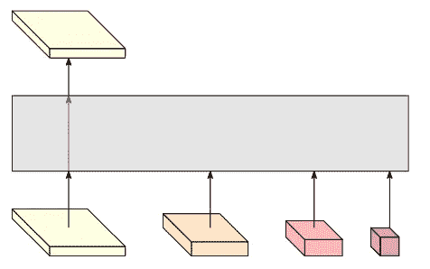
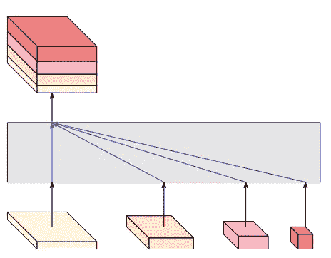
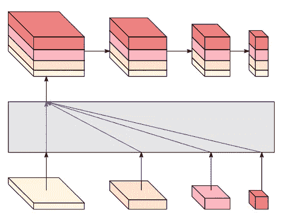

# HRNet 解释道:人体姿态估计、语义分割和物体检测

> 原文：<https://towardsdatascience.com/hrnet-explained-human-pose-estimation-sematic-segmentation-and-object-detection-63f1ce79ef82?source=collection_archive---------4----------------------->

## 揭示最先进的算法 HRNet 背后的东西

克里斯蒂安·卢在 [Unsplash](https://unsplash.com/s/photos/eye?utm_source=unsplash&utm_medium=referral&utm_content=creditCopyText) 上的照片

*HRNet 讲解概要:*

1.  什么是 **HRNet** ？(简短解释，再往下就是完整解释)
2.  **应用领域**
3.  让我们深入研究**卷积神经网络**
4.  人力资源网如何工作？
5.  **结论**

**如果你已经知道了基本知识(CNN +应用领域)，跳到第 3 节或第 4 节。**

# HRNet 是什么？

HRNet 是语义分割、面部标志检测和人体姿态估计领域中最先进的算法。它在 PASCAL Context、LIP、Cityscapes、AFLW、COFW 和 300W 等数据集上显示出优越的语义分割结果。

但首先让我们了解一下字段的含义，以及 HRNet 背后隐藏着什么样的算法。

# 应用领域

## 语义分割

语义分割**用于将图像的结构分类成特定的类别**。这是通过用某一类标记每个像素来完成的[3]。在下面的示例中，表示骑自行车的所有像素都是类 person，表示自行车的所有像素都是类 bicycle [3]。图像分割的目的是让算法将图像分割成类别，从而分割成特定的结构。

来源:[http://host.robots.ox.ac.uk/pascal/VOC/voc2012/#devkit](http://host.robots.ox.ac.uk/pascal/VOC/voc2012/#devkit)

语义分割是用来做什么的？

有各种各样的使用案例，图像分割才刚刚开始。它应用于自动驾驶、医学图像诊断、手写识别。

## 面部标志检测

面部标志检测**用于识别和定位面部的某些区域**，如鼻子、嘴、眼睛或眉毛【2】。在下图中，你可以看到使用 OpenCV 可以检测眉毛、鼻子和嘴(通过左图中的红点可以看到)。

来源:[https://learnopencv.com/face-swap-using-opencv-c-python/](https://learnopencv.com/face-swap-using-opencv-c-python/)

**面部标志检测**是用来做什么的？

你可能知道 Snapchat 或 Instagram 中的面部交换滤镜。或者其他一些改变你眼睛、鼻子或嘴巴的滤镜。所有这些过滤器与面部标志检测一起工作，以检测面部的某个部分位于何处。此外，它还用于人脸变形和头部姿态估计。

## 人体姿态估计

人体姿态估计类似于面部标志检测，除了它是应用于整个身体的**，并且它与运动有更多的关系。它检测的不是面部区域，而是**语义关键点**，如左肩、右膝等。[4].下图很好地描绘了线条如何绘制身体并识别某些点，通常是关节，如髋、膝、肩和肘。**

来源:https://arxiv.org/abs/2103.02440

**姿态估计**集成在哪些应用中？

它应用于训练机器人，例如人形机器人。为了学习某些动作，人的动作是可以学习的。就在几天前，特斯拉宣布，它希望成为人形机器人领域的重要参与者，这表明这是一个未来的重要话题，可能会改变整个行业。

再者，应用于交互式运动游戏，如微软 Kinect 或其他 VR 应用[4]。

**所有这些应用和方法都依赖于卷积神经网络，它是 HRNet 的基础。**

 [## 通过我的推荐链接加入 Medium-Hucker Marius

### 作为一个媒体会员，你的会员费的一部分会给你阅读的作家，你可以完全接触到每一个故事…

medium.com](https://medium.com/@hucker.marius/membership) 

## 让我们深入了解卷积神经网络

一个**卷积神经网络(常为 ConvNet 或 CNN)** 是计算机视觉领域经常应用的神经网络的特例。深度学习算法将图像作为输入，并为其对象分配重要性(由偏差和权重组成)[5]。

好吧，这很肤浅。让我们看看为什么 CNN 是最先进的。

## 正常的神经网络和 CNN 有什么区别？

首先，HRNet 中使用的卷积神经网络类似于普通的神经网络。两者都是基于神经元的，都有权重和偏差。主要区别在于架构。正常的神经网络不能很好地缩放，因此对图像没有用。图像并不像大多数人想象的那样平坦。图像是三维的，例如 32×32×3。32x32 是使图像成为二维的像素，x3 是每个通道的颜色(RGB)。在普通的神经网络中，一个(隐藏)层的每一个节点都与前一层或下一层的所有节点相连。对于大小为 32x32x3 的图像，这将导致 3072(=32x32x3)个权重。而往往图像并没有那么小，所以将其进一步缩放到高分辨率图像(如 1000x1000x3)，构建全连接神经网络的权值和连接数会爆炸，降低神经网络的速度[7]。

这就是卷积神经网络的用武之地。它不是构建平面层，而是将神经元排列成具有深度、高度和宽度维度的 3D 对象[7]。一个主要的优点是它保持了输出的尺寸。一个普通的神经网络会将维数减少到一个平坦的输出。

来源:[https://cs231n.github.io/convolutional-networks/](https://cs231n.github.io/convolutional-networks/)[7]

**conv net 有哪几层？**

*卷积层* —使用过滤器计算图像局部区域的输出

*池层* —沿空间维度执行缩减采样

*全连接层* —计算最终的班级分数

## CNN 的卷积层会发生什么？

出于演示目的，我们假设输入图像的大小为 5x5x1，如下图 gif 所示。卷积层的神奇之处在于过滤器(也称为内核)。在我们的示例中，过滤器的大小为 3x3x1。这个内核/过滤器在整个图像上一小步一小步地移动(在我们的例子中是 9 步)并建立一个卷积特征。这降低了维度，并产生了一个激活图[5]。

来源:[https://Daniel nouri . org/notes/2014/12/17/使用卷积神经网络检测面部关键点-教程/](https://danielnouri.org/notes/2014/12/17/using-convolutional-neural-nets-to-detect-facial-keypoints-tutorial/)

为了覆盖所有特征和形状，应用了不止一个而是不同的过滤器(例如，5 个不同的过滤器)。然后，网络将学习过滤器，当它们识别某种类型的视觉形状(例如，角或线)时，过滤器将激活。在分辨率更高的图像中，大小为 5x5x1 的滤镜可能会检测到其他形状，而大小为 30x30x1 的滤镜则不会。

每个过滤器产生一个激活图，识别某些形状和模式。所有这些激活图沿着深度维度堆叠，并产生输出矩阵[6]。

## 在池层中会发生什么？

通常在卷积层之间使用池层。它用于减少必要的参数和空间大小。这再次有助于降低所需的计算能力。有两种类型的池:最大池和平均池[7]。

最大池取过滤器/内核的最大值，而平均池计算内核所有值的平均值。

## 全连接层会发生什么？

这是一个层，你可能从传统的基本神经网络中知道它。完全连接的层与前一层的所有激活具有完全连接，并且在 CNN 中，它可以用作用于分类的最终层[7]。

来源:[https://cs231n.github.io/convolutional-networks/](https://cs231n.github.io/convolutional-networks/)[7]

现在你应该知道深入 HRNet 的基本知识了。

# 人力资源网是如何工作的？

HRNet 代表高分辨率网络，指的是正在处理的图像的高分辨率。*强高分辨率表示在像素和区域标记问题中起着重要作用，例如语义分割、人体姿态估计、面部标志检测和物体检测[1]随着像素的增长和更多基于视频的问题，高分辨率在未来可能会发挥越来越大的作用。*

HRNet 背后的网络称为 HRNetV1，它“通过并行连接高分辨率到低分辨率的卷积来保持高分辨率的表示，其中并行卷积之间存在重复的多尺度融合。”*【1】*

## 那么，这意味着什么呢？

为了回答这个问题，让我们仔细看看下图。

来源:[https://arxiv.org/pdf/1904.04514.pdf](https://arxiv.org/pdf/1904.04514.pdf)

你可以看到四个浅蓝色的方块。每个表示如上所述的多分辨率块，一个连接“高到低分辨率卷积***【1】*”的块。并行处理由多个通道映射线在彼此下方展示。黄色通道图代表最高分辨率，而红色小通道图代表最低分辨率。第四个模块并行处理 4 个分辨率。**

****

**资料来源:https://arxiv.org/pdf/1904.04514.pdf**

****多分辨率群卷积会发生什么？****

**它*"是组卷积"*[这将是单行的方框，例如只有黄线] *"的简单扩展，它将输入通道分成几个通道子集，并分别在不同的空间分辨率上对每个子集执行常规卷积。"[1]***

****

**来源:https://arxiv.org/pdf/1904.04514.pdf**

**在每个阶段结束时，您可以看到**与下一阶段的多分辨率组**的完全连接，看起来就像左侧的图像。HRNet 的这一部分称为多分辨率卷积。**

***“类似于规则卷积的多分支全连接方式。”[1]***

**换句话说，它将一级的规则盘旋(可能只是一条线)与下一级的所有平行盘旋连接起来。**

****HRNet 的优势是什么，为什么它的性能优于以前的模型(AlexNet、GoogleNet、VGGNet、ResNet、DenseNet)？****

**语义强大且空间精确:**

1.  **诸如低分辨率网络的传统卷积神经网络串联工作，因此从低分辨率恢复高分辨率。**
2.  **HRNet 的并行方法允许在整个神经网络中保持高分辨率，因此表示更加精确。**
3.  **其他方法聚集高分辨率和上采样的低分辨率表示。HRNet 重复多分辨率并在语义上加强由高到低的表示。**

****

**以前的 CNN 有串行卷积，没有并行。来源:[https://arxiv.org/pdf/1904.04514.pdf](https://arxiv.org/pdf/1904.04514.pdf)**

# **HRNet 及其变体**

**在 HRNetV1 中，只有高分辨率表示会产生输出(如下所示)。因此，低分辨率卷积的子集会丢失，并且不会完全包含在输出中。**

****

**HRNetV1 插图。资料来源:https://arxiv.org/pdf/1904.04514.pdf**

**这就是为什么 HRNet 的发明者进行了修改，允许输出从高到低分辨率的所有子集。**

**“好处是充分利用了多分辨率卷积的能力。”*【1】***

**这是通过将低分辨率表示上采样到最高分辨率并连接所有结果子集来实现的。这个模型叫做 **HRNetV2** ，主要用于估计分割图/面部地标热图。**

****

**HRNetV2 图示。来源:[https://arxiv.org/pdf/1904.04514.pdf](https://arxiv.org/pdf/1904.04514.pdf)**

**另一个模型是 HRNetV2，它是为对象检测而制造的。在这里，作者增加了一个步骤:“我们通过对多级平均汇集的高分辨率表示进行下采样来构建多级表示。”*【1】***

****

**HRNetV2p 图解。来源:https://arxiv.org/pdf/1904.04514.pdf**

# **结论**

**HRNet 及其变体(HRNetV1、HRNetV2、HRNetV2p)是计算机视觉领域中许多机器学习学科的最先进技术。作者将传统的串行卷积结构改为多组卷积的并行结构。这种架构允许高分辨率，并提高精度和语义连接。**

**人力资源网再次表明，打破常规的思维是实现最先进成果的必要条件。作者没有试图像 AlexNet 和 co .那样改进现有的串行方法，但他们试图用一种更智能的方法彻底重建它，从而获得更高的结果。我很确定这只是将来有一天会取代 HRNet 的更复杂架构的开始。**

** [## 通过我的推荐链接加入 Medium-Hucker Marius

### 作为一个媒体会员，你的会员费的一部分会给你阅读的作家，你可以完全接触到每一个故事…

medium.com](https://medium.com/@hucker.marius/membership) 

## [阅读更多像这样的](https://medium.com/@hucker.marius/membership)** 

*****来源*****

1.  **王等(2020)。用于视觉识别的深度高分辨率表征学习。[https://arxiv.org/pdf/1908.07919.pdf](https://arxiv.org/pdf/1908.07919.pdf)**

**2.Shakhadri，S. (2021 年)。用 Opencv 简化面部标志检测。[https://www . analyticsvidhya . com/blog/2021/07/face-landmark-detection-simplified-with-opencv/](https://www.analyticsvidhya.com/blog/2021/07/facial-landmark-detection-simplified-with-opencv/)**

**3.Jordan，J. (2018)。语义图像分割综述。[https://www.jeremyjordan.me/semantic-segmentation/](https://www.jeremyjordan.me/semantic-segmentation/)**

**4.奥德梅金德，E. (2021)。利用深度学习进行人体姿态估计——2021 年终极概览。[https://viso . ai/deep-learning/pose-estimation-ultimate-overview/](https://viso.ai/deep-learning/pose-estimation-ultimate-overview/)**

**5.萨哈，S. (2018)。卷积神经网络综合指南 ELI5 方法。[https://towards data science . com/a-comprehensive-guide-to-convolutionary-neural-networks-the-Eli 5-way-3bd2b 1164 a53](/a-comprehensive-guide-to-convolutional-neural-networks-the-eli5-way-3bd2b1164a53)**

**6.微软研究博客(2020)。高分辨率网络:用于视觉识别的通用神经结构。[https://www . Microsoft . com/en-us/research/blog/high-resolution-network-a-universal-neural-architecture-for-visual-recognition/](https://www.microsoft.com/en-us/research/blog/high-resolution-network-a-universal-neural-architecture-for-visual-recognition/)**

**7.无作者(未注明)。卷积神经网络【https://cs231n.github.io/convolutional-networks/ **