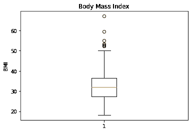
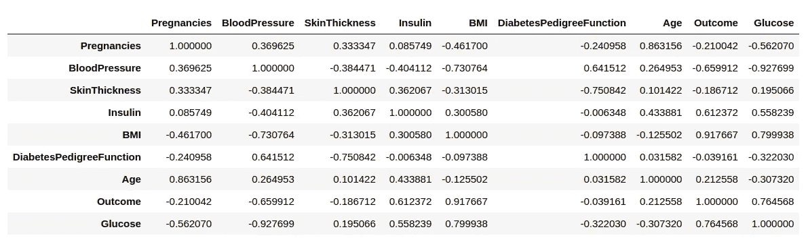
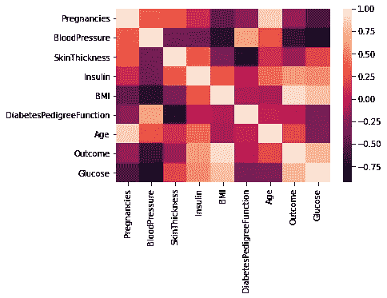
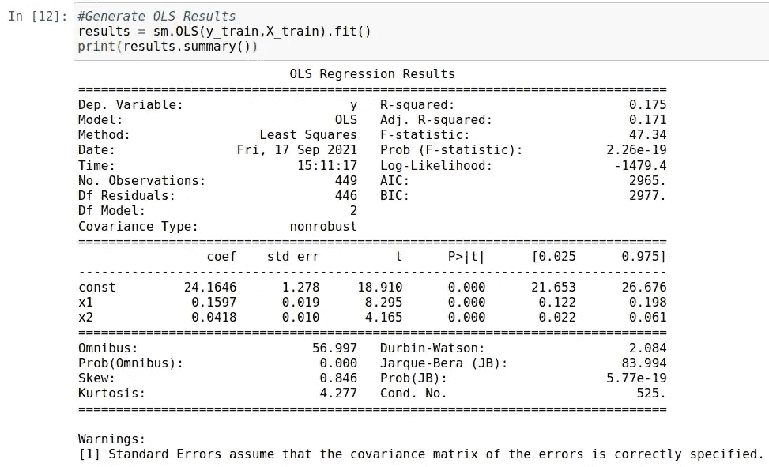

# Python 中的 Huber 和 Ridge 回归:处理异常值

> 原文：<https://towardsdatascience.com/huber-and-ridge-regressions-in-python-dealing-with-outliers-dc4fc0ac32e4?source=collection_archive---------14----------------------->

## 如何处理数据集中的异常值


来源:照片由 [Natalia_Kollegova](https://pixabay.com/users/natalia_kollegova-5226803/) 来自 [Pixabay](https://pixabay.com/photos/mountains-ridge-ascent-spaciousness-2449967/)

当处理一组数据中的异常值时，传统的线性回归被证明有一些缺点。

具体来说，如果一个数据点距离该组中的其他点非常远，这可能会显著影响最小二乘回归线，即，接近该组数据点的总体方向的线将因异常值的存在而偏斜。

为了防止这一缺点，可以使用对异常值稳健的修正回归模型。在这个特殊的例子中，我们将看看**胡伯**和**岭**回归模型。

# 背景

在这种情况下使用的数据集是皮马印第安人糖尿病[数据集](https://www.kaggle.com/uciml/pima-indians-diabetes-database)，其最初来自国家糖尿病、消化和肾脏疾病研究所，并根据 [CC0 1.0 通用版(CC0 1.0)
公共领域专用许可证](https://creativecommons.org/publicdomain/zero/1.0/)提供。

对于这种特殊情况，将建立一个回归模型来预测患者的体重指数(身体质量指数)水平。

当查看身体质量指数的箱线图时，我们可以看到存在明显的异常值，如图表上半部分的数据点所示。

```
# Creating plot
plt.boxplot(bmi)
plt.ylabel("BMI")
plt.title("Body Mass Index")
# show plot
plt.show()
```



来源:Jupyter 笔记本输出

然后创建数据的相关矩阵:

```
corr = a.corr()
corr
```



来源:Jupyter 笔记本输出

这是一个使用 seaborn 的视频:

```
sns.heatmap(a.corr());
```



来源:Jupyter 笔记本输出

# 线性回归分析

在自变量中，**皮肤厚度**和**葡萄糖**被选为假设对身体质量指数有显著影响的两个变量。

对训练数据进行回归分析，得出以下结果:



来源:Jupyter 笔记本输出

根据以上结果:

*   皮肤厚度增加 1 个单位导致身体质量指数增加**0.1597**——保持所有其他变量不变。
*   葡萄糖水平增加 1 个单位会导致身体质量指数增加 0.0418 个单位——保持所有其他变量不变。

我们看到这两个变量在所有水平上都非常显著(假设 p 值为 0)。虽然 17.5%的 R 平方很低，但这并不一定意味着这个模型不好。鉴于影响身体质量指数波动的变量范围很广，这只是表明有许多变量是这个模型没有考虑到的。然而，使用的两个独立变量显示了高度显著的关系。

通过验证集生成预测，并计算均方根误差(RMSE)值。在这种情况下使用 RMSE，因为分数对异常值更敏感。分数越高，预测的误差越大。

```
>>> olspredictions = results.predict(X_val)
>>> print(olspredictions)[36.32534071 31.09716546 28.67493585 34.29867119 35.03070074
...
 36.50971909 35.97416079 36.57591618 35.10923948 34.3672371]
```

均方根误差的计算方法如下:

```
>>> mean_squared_error(y_val, olspredictions)
>>> math.sqrt(mean_squared_error(y_val, olspredictions))5.830559762277098>>> np.mean(y_val)
31.809333333333342
```

相对于整个验证集的平均值 **31.81** ，均方根误差的值为 **5.83** 。

现在，我们将生成 Huber 和岭回归模型。同样，将使用这些模型对验证集进行预测，并计算均方根误差。

# 胡伯对里奇

Huber 回归和岭回归都是为了生成一条比标准线性回归对异常值更不敏感的回归线。

然而，这些模型的工作方式略有不同。

具体来说，Huber 回归依赖于所谓的 *M-estimat* e，或者对异常值的敏感度低于平均值的位置度量(如牛津统计词典(Upton 和 Cook，2014 年)所述)。

岭回归使用所谓的 L2 [正则化](https://quick-adviser.com/what-does-l2-regularization-do/#Is_weight_decay_same_as_L2_regularization)-使异常值的权重更小，从而对回归线的影响更小。此外，L2 正则化试图估计数据的平均值以避免过度拟合，而 L1 正则化(如在套索回归中使用的)试图估计数据的中位数。

在本例中，将使用 Huber 和岭回归进行预测，以便根据验证集计算预测的 RMSE。然后，性能最佳的模型将用于对整个测试集进行预测。

## 胡伯回归

这是一个 Huber 回归的例子:

```
hb1 = linear_model.HuberRegressor(epsilon=1.1, max_iter=100, alpha=0.0001, warm_start=False, fit_intercept=True, tol=1e-05)
```

具体而言，[ε](https://scikit-learn.org/stable/modules/generated/sklearn.linear_model.HuberRegressor.html)的值测量应该被分类为异常值的样本的数量。该值越小，模型对异常值越稳健。

从这个观点出发，计算了五个不同ε值的独立 Huber 回归。

```
hb1 = linear_model.HuberRegressor(epsilon=1.1, max_iter=100, alpha=0.0001, warm_start=False, fit_intercept=True, tol=1e-05)hb2 = linear_model.HuberRegressor(epsilon=1.8, max_iter=1000, alpha=0.0001, warm_start=False, fit_intercept=True, tol=1e-05)hb3 = linear_model.HuberRegressor(epsilon=2.5, max_iter=1000, alpha=0.0001, warm_start=False, fit_intercept=True, tol=1e-05)hb4 = linear_model.HuberRegressor(epsilon=3.2, max_iter=1000, alpha=0.0001, warm_start=False, fit_intercept=True, tol=1e-05)hb5 = linear_model.HuberRegressor(epsilon=3.9, max_iter=1000, alpha=0.0001, warm_start=False, fit_intercept=True, tol=1e-05)
```

根据验证集对五个模型进行预测。以第一个模型为例:

```
>>> hubermodel1 = hb1.fit(X_train,y_train)
>>> huberpredictions1 = hb1.predict(X_val)
>>> print(huberpredictions1)[35.67051275 29.43501067 27.18925225 33.91769821 34.47019359
...
 31.52694684 31.0940833  35.37464065 30.99181107 36.11032014]
```

计算的均方误差如下:

*   hb1 = 5.803
*   hb2 = 5.800
*   hb3 = 5.816
*   hb4 = 5.825
*   hb5 = 5.828

我们看到，RMSE 值都略小于使用 OLS 回归时计算出的 5.83。hb2，或者ε值为 1.8 的模型，表现出最好的性能——尽管微不足道。

## 里脊回归

以与前面相同的方式，使用[岭](https://scikit-learn.org/stable/modules/generated/sklearn.linear_model.Ridge.html)回归进行预测，随后计算 RMSE:

```
>>> rg = Ridge(fit_intercept=True, alpha=0.0, random_state=0, normalize=True)
>>> ridgemodel = rg.fit(X_train,y_train)
>>> ridgepredictions = rg.predict(X_val)[36.32534071 31.09716546 28.67493585 34.29867119 35.03070074
...
31.79765405 36.18771132 31.86883756 36.98120033 35.68182273]
```

均方差实际上与使用 OLS 回归计算的结果相同:

```
>>> mean_squared_error(y_val, ridgepredictions)
>>> math.sqrt(mean_squared_error(y_val, ridgepredictions))5.8305
```

# 针对测试集的性能

假设ε= 1.8 的 Huber 回归显示了对验证集的最佳性能(尽管是边缘的)，让我们看看它对测试集的性能如何。

在这种情况下，Pima Indians 糖尿病数据集的一部分与其余数据在物理上是分开的，以便检查模型在看不见的数据中的表现。

以下是预测:

```
>>> btest = t_bmi
>>> btest=btest.values
>>> bpred = hb2.predict(atest)
>>> bpredarray([33.14957023, 30.36001456, 32.93500157, 28.91518701, 
...
34.72666166,36.29947658, 39.13505914, 33.77051646])
```

计算测试集的 RMSE 和平均值:

```
>>> math.sqrt(mean_squared_error(btest, bpred))
5.744712507435319>>> np.mean(btest)
32.82418300653595
```

由于 RMSE 值仅占平均值的 17%多一点，该模型在预测整个测试集的身体质量指数值方面表现相当不错。

正如我们所看到的，所有模型的 RMSE 值或多或少是相似的——休伯回归提供了略低的 RMSE 值。然而，根据异常值的大小，在某些情况下，休伯回归和岭回归可以明显优于 OLS 回归。

# 结论

在本例中，您看到了:

*   如何直观地检测数据样本中的异常值
*   Huber 回归和岭回归的区别
*   如何修改 Huber 回归中的异常值敏感度
*   使用 RMSE 确定模型精度

非常感谢您的宝贵时间，非常感谢您的任何问题或反馈。你可以在 michael-grogan.com 的[找到更多我的内容。](https://www.michael-grogan.com/)

*免责声明:本文是在“原样”的基础上编写的，没有担保。它旨在提供数据科学概念的概述，不应被解释为专业建议。本文中的发现和解释是作者的发现和解释，不被本文中提到的任何第三方认可或隶属于任何第三方。作者与本文提及的任何第三方无任何关系。*