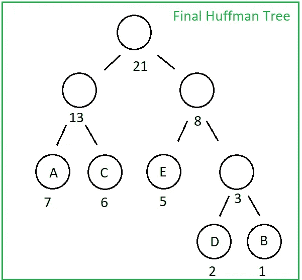
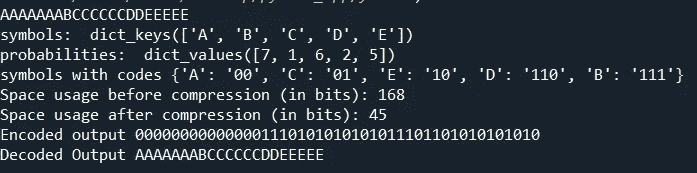

# 霍夫曼解码

> 原文：<https://towardsdatascience.com/huffman-decoding-cca770065bab?source=collection_archive---------11----------------------->

## 解压缩您的霍夫曼编码数据，以获得您的初始数据

我们已经在[霍夫曼编码& Python 实现](https://medium.com/data-structures-and-algorithms-with-python/huffman-encoding-python-implementation-8448c3654328)帖子中看到了如何使用霍夫曼编码对给定数据进行编码。现在我们将研究如何解码霍夫曼编码的数据，以再次获得初始的未压缩数据。

有了我们在编码阶段获得的二进制霍夫曼树，解码是一个非常简单的过程。

让我们考虑我们有与霍夫曼编码 post 相同的例子，因此我们有 AAAAAAABCCCCCCDDEEEEE 作为我们的初始数据，000000000000110101010101110110101010101010101010101010101010 作为具有以下霍夫曼树的编码输出:



“作者提供的图像”

现在我们唯一要做的就是从哈夫曼树的头部开始，从编码数据的开始，每次我们遇到 1 就向右走，遇到 0 就向左走，穿过哈夫曼树。当我们到达一个叶节点时，我们获得符号！然后，我们只是从哈夫曼树的头部重新开始，同时向前移动编码数据。

通过在 huffman.py 中添加几行来自 [Huffman 编码& Python 实现](https://medium.com/data-structures-and-algorithms-with-python/huffman-encoding-python-implementation-8448c3654328)的代码，我们可以轻松实现 Huffman_Decoding，结果如下:

```
def Huffman_Decoding(encoded_data, huffman_tree):
    tree_head = huffman_tree
    decoded_output = []
    for x in encoded_data:
        if x == '1':
            huffman_tree = huffman_tree.right   
        elif x == '0':
            huffman_tree = huffman_tree.left
        try:
            if huffman_tree.left.symbol == None and huffman_tree.right.symbol == None:
                pass
        except AttributeError:
            decoded_output.append(huffman_tree.symbol)
            huffman_tree = tree_head

    string = ''.join([str(item) for item in decoded_output])
    return string
```



“作者提供的图像”

一切似乎都没问题！可以查看 [**github**](https://github.com/YCAyca/Data-Structures-and-Algorithms-with-Python/tree/main/Huffman_Encoding) 链接到达代码，自己试试💁

数据压缩是许多应用的主题，除了“基于频率”的霍夫曼算法之外，它还有各种不同类型的算法。你可以检查“基于字典”的方法，如 LZ77·LZ78**LZW**对图像压缩特别有用。

如果你想进一步了解霍夫曼，你可以搜索一下**自适应霍夫曼**编码和解码，这是一种更新更复杂的数据压缩算法，以霍夫曼算法**为基础，在编码的同时更新霍夫曼树**，不像传统的霍夫曼编码是一步一步进行的🍀