# 霍夫曼编码和 Python 实现

> 原文：<https://towardsdatascience.com/huffman-encoding-python-implementation-8448c3654328?source=collection_archive---------0----------------------->

## 用 Python 实现的一种古老而有效的压缩技术

霍夫曼编码是一种用于压缩数据的无损压缩算法。这是一种由大卫·A·霍夫曼在麻省理工学院攻读博士学位时开发的算法，并发表在 1952 年的论文《最小冗余码的构造方法》中。[1]

从“压缩技术”可以理解，目的是以占用更少空间的方式对相同的数据进行编码。因此，当用霍夫曼编码对数据进行编码时，我们为数据中的每个符号获得唯一的代码。例如，字符串“ABC”占用 3 个字节，没有任何压缩。假设字符 A 被赋予代码 00，字符 B 被赋予代码 01，作为编码的结果，字符 C 被赋予代码 10。为了存储相同的数据，我们只需要使用 6 位而不是 3 个字节。在考察霍夫曼编码的工作原理之前，希望我说的 ***压缩*** 是什么意思更好理解！

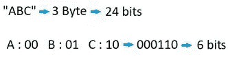

“作者提供的图像”

## **算法**

霍夫曼编码是一种利用符号的*(或*)频率特征和二叉树结构的算法。它包括以下 3 个步骤:**

*   **概率计算和符号排序**
*   **二叉树变换**
*   **给符号分配代码**

****概率计算&排序符号****

**我们计算整个数据中每个符号的数量，然后通过将该数量除以数据中的字符总数来计算每个符号的“概率”。由于这是一种使用概率的算法，所以更常见的符号(概率更高的符号)通常比不太常见的符号使用更少的比特来表示。**这是霍夫曼编码的** **优势之一**。**

**作为一个例子，下面的数据有 5 个不同的符号作为 A B C D E，我们的概率如右图所示:**

**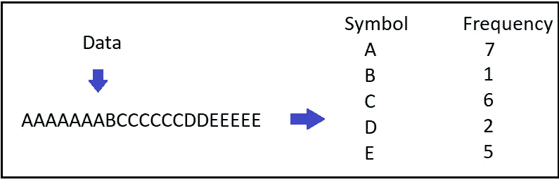**

**“作者提供的图像”**

**然后，我们很容易地根据将每个符号表示为一个节点的概率对符号进行排序，并将其称为我们的“集合”。现在，我们准备通过下一步。**

**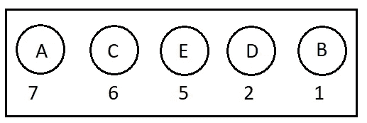**

**“作者提供的图像”**

****二叉树变换****

1.  **从集合中，我们**挑选出具有最小概率和**的两个节点，并将它们组合成一棵新树，其根的概率等于该和。**
2.  **我们将新树添加回集合中。**
3.  **我们**重复**这个过程，直到构建了一个包含所有输入概率的树。**

**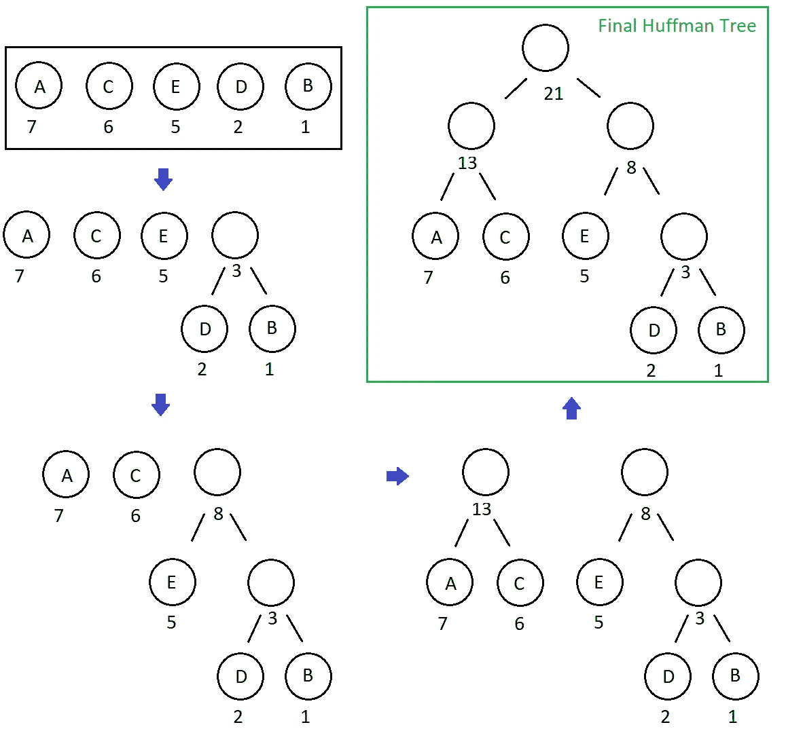**

**“作者提供的图像”**

****给符号分配代码****

**在得到这个二叉树——所谓的 ***哈夫曼树*** 之后，我们唯一要做的事情就是为我们每次向右**子**分配 **1** ，为我们每次向左**子**分配 **0** 。**

**最后，我们有符号和他们的代码获得霍夫曼编码！**

**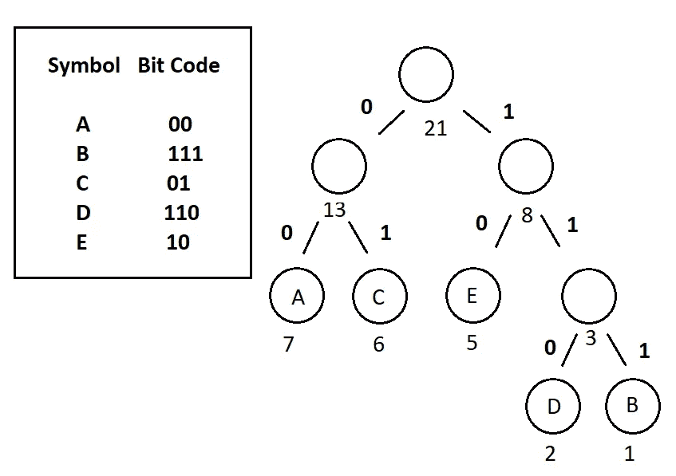**

**“作者提供的图像”**

**我们可以快速看一下，即使只有 21 个字符，压缩和非压缩数据之间的差异也是不小的。**

**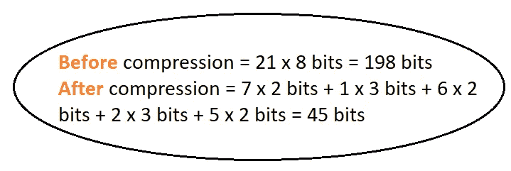**

**“作者提供的图像”**

## **用 Python 实现**

**为了实现霍夫曼编码，我们从一个节点类开始，它指的是二进制霍夫曼树的节点。本质上，每个节点都有一个符号和相关概率变量，一个左右子变量和代码变量。当我们根据我们选择的边(左 0，右 1)遍历霍夫曼树时，代码变量将是 0 或 1**

**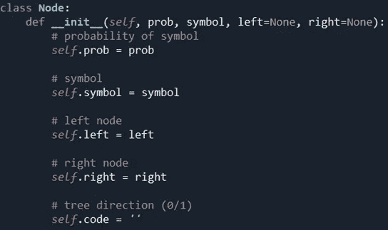**

**“作者提供的图像”**

**我们有 3 个帮助函数，第一个用于计算给定数据中符号的概率，第二个用于获得符号的编码，这些编码将在拥有霍夫曼树后使用，最后一个用于获得输出(编码数据)。**

**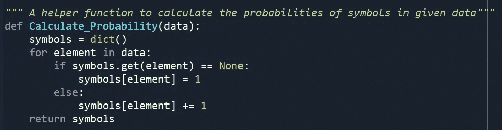**

**“作者提供的图像”**

**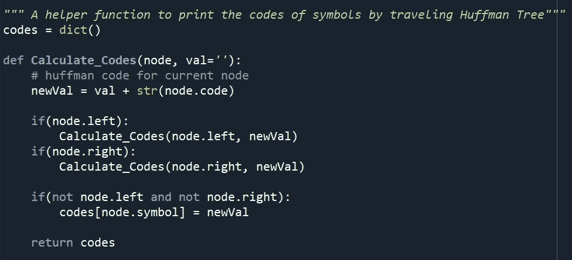**

**“作者提供的图像”**

**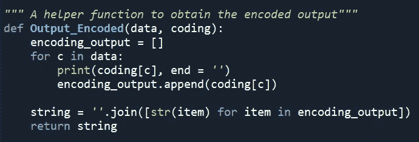**

**“作者提供的图像”**

**此外，我们有一个 Total_Gain 函数，它获取初始数据，字典来自 Calculate_Code，将符号及其代码保存在一起。该函数计算压缩和非压缩数据的比特大小之差。**

**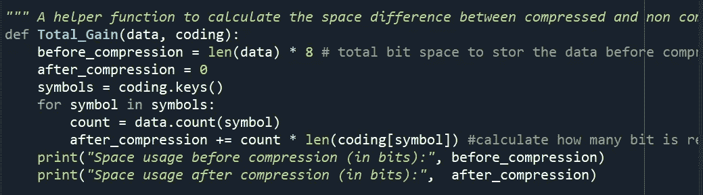**

**“作者提供的图像”**

**最后，我们有 Huffman_Encoding 函数，它仅将数据作为参数，并使用这 4 个函数给出结果编码和总增益。**

**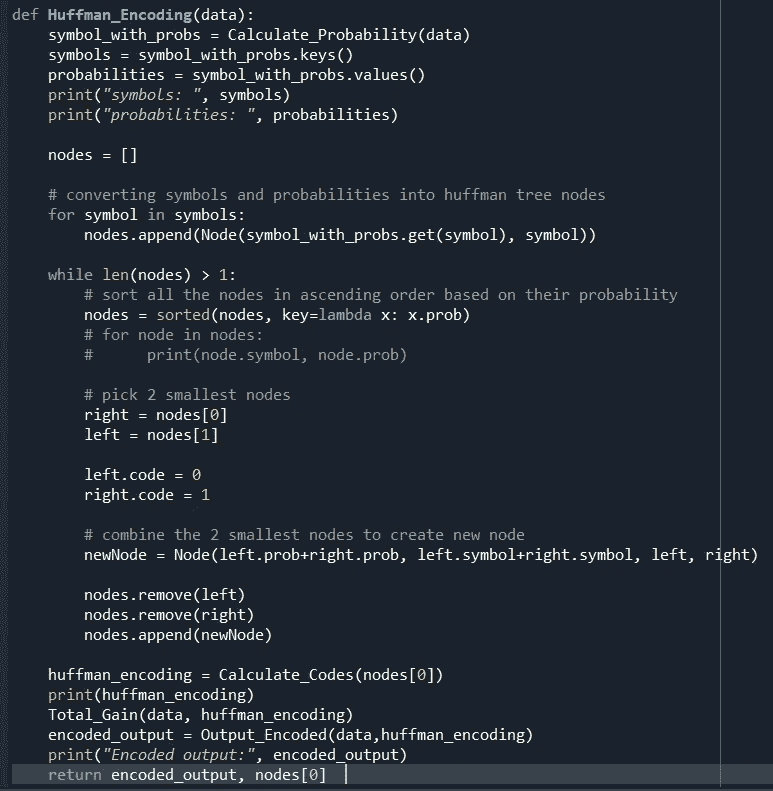**

**“作者提供的图像”**

**让我们看看代码是如何工作的，以及我们已经检查过的案例的输出！**

**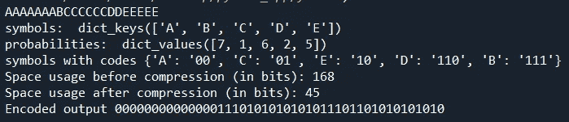**

**“作者提供的图像”**

**另一个例子比我们简单的例子要大得多。我创建了一个 demo_file.txt，复制了一些关于数据压缩的随机信息，有 1579 个字。对于这个例子，我注释掉了 Print_Encoded 函数，因为不可能在一个图像中截取整个输出的屏幕截图。**

**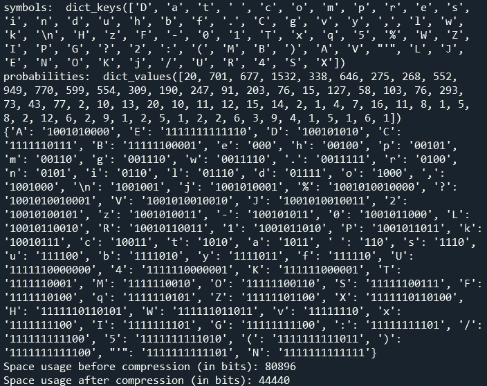**

**“作者提供的图像”**

**作为结论，我们看到压缩比并不随着数据量的增长而变化，这个比值接近 2:1。我们可以说霍夫曼编码是一种将数据压缩到一半大小的算法。虽然老了，但依然是有效的压缩算法！**

**你可以点击 [**github**](https://github.com/YCAyca/Data-Structures-and-Algorithms-with-Python/tree/main/Huffman_Encoding) 链接进入我的代码，用你自己的例子试试。**

**此外，如果您想了解如何解压缩霍夫曼编码数据以获得原始数据，请点击 [**此处**](https://medium.com/data-structures-and-algorithms-with-python/huffman-decoding-cca770065bab) ！**

**[1][https://en.wikipedia.org/wiki/Huffman_coding](https://en.wikipedia.org/wiki/Huffman_coding)**