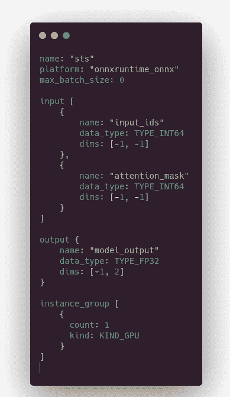

# 1 毫秒延迟下的拥抱面部变形推断

> 原文：<https://towardsdatascience.com/hugging-face-transformer-inference-under-1-millisecond-latency-e1be0057a51c?source=collection_archive---------0----------------------->

## [行业笔记](https://towardsdatascience.com/tagged/notes-from-industry)

## 使用微软和 Nvidia 开源工具投入生产


“哦，我的皮毛和胡须！我迟到了，我迟到了，我迟到了！”(来自[https://Commons . wikimedia . org/wiki/File:The _ White _ Rabbit _(Tenniel)_-_ The _ Nursery _ Alice _(1890)_-_ bl . jpg](https://commons.wikimedia.org/wiki/File:The_White_Rabbit_(Tenniel)_-_The_Nursery_Alice_(1890)_-_BL.jpg)、 [Creative Commons](https://en.wikipedia.org/wiki/en:Creative_Commons) CC0 1.0 通用公共领域专用)

最近，🤗拥抱脸([变形金刚](https://github.com/huggingface/transformers)库背后的初创公司)发布了一款名为“Infinity”的新产品。[将](https://huggingface.co/infinity)描述为在“企业规模”执行推理的服务器。YouTube 上有一个[公开演示](https://www.youtube.com/watch?v=jiftCAhOYQA)(下面是演示中使用的时间和配置截图)。交流围绕着产品可以在 GPU 上以 1 毫秒的延迟执行变压器推理的承诺。根据演示者的说法，拥抱 Face Infinity 服务器的成本至少为💰部署在单台机器上的单一型号每年 20，0 00 美元(没有公开的价格可扩展性信息)。

这让我很好奇，想挖掘一下并检查一下**使用微软和 Nvidia 的开源工具，是否有可能使用演示**中使用的相同 AWS VM/model/input 达到那些性能(详情见下面的截图)？**剧透:是的，有了这个教程，很容易重现和适应你的现实生活项目**。

> *💻*项目源代码可从以下地址获得:
> 
> [https://github.com/ELS-RD/transformer-deploy](https://github.com/ELS-RD/transformer-deploy)
> 
> 自述文件提供了如何运行代码的说明，并在带有深度学习图像版本 44 的 AWS VM 和带有 Nvidia 3090 GPU 的裸机服务器上进行了测试(文中发布的测量值来自 AWS 机器)。
> 
> 如果你对这个话题感兴趣，在推特上关注我:[https://twitter.com/pommedeterre33](https://twitter.com/pommedeterre33)


*在 2 种输入尺寸的公开演示期间，执行了相当稳定的措施(来自 https://www.youtube.com/watch?v=jiftCAhOYQA*，作者截图)

我在 [Lefebvre Sarrut](https://www.lefebvre-sarrut.eu/) R & D 工作，这是一家领先的欧洲法律出版商，我的团队在生产中部署了相当多的模型，包括几个变形金刚，从小型蒸馏模型到大型模型，以执行法律文件的各种任务。这些作品中的一些已经在这里[和那里](/why-we-switched-from-spacy-to-flair-to-anonymize-french-legal-cases-e7588566825f)被描述过[和](/benchmark-ner-algorithm-d4ab01b2d4c3)。

在本文中，我们将了解如何在工业环境中部署现代 NLP 模型。关于这个主题有几十个教程，但是，据我所知，它们不是针对生产的，也没有涵盖性能、可伸缩性、CPU 和 GPU 任务的解耦或 GPU 监控。其中一些看起来像这样:1/采用 FastAPI HTTP server，2/添加 Pytorch，和 voilà🤪

> 如果你有*有趣的*内容想让我链接到，请发表评论…

本教程的目的是解释如何从 Hugging Face 大量优化一个转换器，并将其端到端地部署在一个**生产就绪的**推理服务器上。你可以从 Nvidia 和微软那里找到一些有趣的技术内容，关于这个过程的一些具体部分。

最接近的匹配和对我的一个启发是[这篇文章](https://medium.com/nvidia-ai/how-to-deploy-almost-any-hugging-face-model-on-nvidia-triton-inference-server-with-an-8ee7ec0e6fc4)。它仍然错过了两个关键点，推理服务器端的重要优化和标记化(否则你不能*轻松地*在 Python 之外调用推理服务器)。我们将讨论这两点。

这个过程带来的性能改进适用于所有场景，从短序列到长序列，从大小为 1 的一批到大批量。当架构符合工具的期望时，与普通 PyTorch 相比，该过程总是带来显著的性能提升。

该过程分为 **3 个步骤:**

*   将 Pytorch 模型转换成图形
*   优化图表
*   在一个高性能的推理服务器上部署图

最后，我们将我们的推理服务器的性能与演示期间 humping Face 显示的数字进行比较，并将看到**对于批量大小为 1** 的 16 和 128 令牌输入序列，我们都更快(据我所知，humping Face 尚未公开分享其他场景的信息)。

更重要的是，更多的机器学习实践者将能够做一些比在非推理专用 HTTP 服务器上部署开箱即用 Pytorch 模型更可靠的事情。

# 从 Pytorch 到 ONNX 图

你大概知道吧，Pytorch 相比 Tensorflow 1 的一大卖点。x 的易用性:你只需编写熟悉的命令式代码，而不是构建一个图表。感觉你在写以 GPU 速度运行的 numpy 代码。

让用户开心很棒，更棒的是让优化工具也开心。与人类不同，这些工具喜欢用图表来执行(有时是离线)分析。这很有意义，图形提供了从数据点到模型输出的整个过程的静态完整视图。此外，该图提供了若干机器学习框架可能共有的中间表示。

我们需要一种方法将我们的命令式 Pytorch 代码转换成图形。有几种选择，但我们感兴趣的是 ONNX。*“ONNX 是为表示机器学习模型而构建的开放格式。ONNX 定义了一组通用的运算符——机器学习和深度学习模型的构建模块——和一种通用的文件格式，使人工智能开发人员能够将模型与各种框架、工具、运行时和编译器一起使用。”*(【https://onnx.ai/】T4)。这种格式最初是由脸书和微软创建的，目的是在 Pytorch(研究)和 Caffee2(生产)之间架起一座桥梁。

Pytorch 包括一个导出到 ONNX 的工具。导出工具背后的原理非常简单，我们将使用“跟踪”模式:我们向模型发送一些(虚拟)数据，工具将在模型内部跟踪它们，这样它将猜测图形看起来像什么。

跟踪模式并不神奇，例如它看不到你在 numpy 中做的操作(如果有的话)，图形将是静态的，一些 if/else 代码将永远固定，for 循环将展开，等等。这没什么大不了的，因为拥抱脸和模型作者注意到主要/大多数模型是跟踪模式兼容的。

供您参考，还有另一种称为“脚本”的导出模式，它需要以某种方式编写模型才能工作，其主要优势是动态逻辑保持不变[，但它会在模型编写方式中添加太多约束，而没有明显的性能增益](https://github.com/huggingface/transformers/pull/6846#issuecomment-690363367)。

以下注释代码执行 ONNX 转换:


Pytorch 到 ONNX 的转换代码(图片由作者提供)

特别的一点是，我们将某个轴声明为动态的。如果我们不这样做，图形将只接受与我们用来构建它的张量形状完全相同的张量(虚拟数据)，因此序列长度或批量大小将是固定的。我们赋予输入和输出字段的名称将在其他工具中重用。

> 请注意，ONNX export 也可以像在句子变形库中一样进行特征提取，但在这种情况下，它需要一些小技巧。

🥳*félications*，你知道如何准备一个图形进行优化！

# 图形优化:2 个工具，1 个任务

我们将重点介绍 2 款优化 Pytorch 模型的工具:来自微软的 [ONNX Runtime](https://onnxruntime.ai/) (麻省理工学院许可下的开源)和来自英伟达的[TensorRT](https://developer.nvidia.com/tensorrt)(Apache 2 许可下的开源，优化引擎为闭源)。

他们可以单独或一起工作。在我们的例子中，我们将一起使用它们，这意味着通过 ONNX 运行时 API 使用 TensorRT。

> > #protip:如果你想听起来像个 MLOps，就不要说 ONNX Runtime / TensorRT，而要说 ORT 和 TRT。另外，你可能会在 Github issues/PR 中找到这些名字。

这两个工具执行相同类型的操作来优化 ONNX 模型:

*   **找出并移除多余的操作**:例如，在训练循环之外，dropout 没有任何用处，它可以被移除，而不会对推理产生任何影响；
*   **执行常数折叠**:意思是找到由常数表达式组成的图的某些部分，在编译时而不是运行时计算结果(类似于大多数编程语言编译器)；
*   **将一些操作合并在一起**:避免 1/加载时间，2/共享内存避免与全局内存来回传递。显然，它将主要有利于内存绑定操作(像乘法和加法操作，深度学习中非常常见的模式)，它被称为“内核融合”；

他们可以有选择地将模型权重一次性转换为较轻的表示(从 32 位浮点到 16 位浮点，甚至在量化的情况下转换为 8 位整数)。

[Netron](https://github.com/lutzroeder/netron) 可以产生优化前后 ONNX 图的显示:


来自 [ONNX 运行时——在 GPU 和 CPU 上实现变压器推理的突破性优化](https://wiki.lfaidata.foundation/download/attachments/22249690/2.3%202020_Apr_ONNX%20MEETUP_ORT%20breakthrough%20optimizations%20for%20transformer%20inference%20on%20GPU%20and%20CPU.pdf?version=1&modificationDate=1586564917000&api=v2)

这两种工具有一些基本的区别，主要是:

*   **易用性** : TensorRT 是为高级用户打造的，实现细节没有被它主要面向 C++的 API 所隐藏(包括 Python 包装器，它的工作方式与 C++ API 完全一样，如果你不是 C++开发人员，可能会感到惊讶)。另一方面，ONNX 运行时文档很容易理解，即使你不是机器学习硬件专家，它提供了 Pythonic API 和许多这种语言的示例，你会发现更多 NLP 专用的示例和工具。
*   **优化范围**:tensort 通常提供最佳性能。这个过程有点复杂，我不会在这里提供细节，但是基本上你可以为不同的硬件、模型和数据形状建立“配置文件”。TensorRT 将在您的硬件上执行一些基准测试，以找到最佳的优化组合(因此一个模型与一个特定的硬件相关联)。有时这有点太激进，特别是在混合精度中，你的变压器模型的精度可能会下降。最后，让我们补充一点，这个过程是不确定的，因为它取决于内核执行时间。简而言之，我们可以说 TensorRT 带来的额外性能是有学习曲线成本的。ONNX 运行时有两种优化，一种称为“在线”优化，在模型加载后自动应用(只需要使用一个标志)，另一种称为“离线”优化，特定于某些模型，尤其是基于 transformer 的模型。我们将在本文中使用它们。根据模型、数据和硬件的不同，ONNX 运行时+离线优化有时与 TensorRT 不相上下，其他时候我见过 TensorRT 在真实场景中快 33%。TensorRT API 比 ONNX 运行时提供的更完整，例如，您可以判断哪个张量形状是最佳的，并固定一些尺寸限制，因此它将生成所有需要的轮廓。**如果你真的需要最好的性能，你需要学习 TensorRT API。**
*   **多后端** : ONNX 运行时有自己的 CUDA 和 CPU 推理引擎，但它也可以将推理委托给第三方后端……包括 TensorRT、TVM 或 openVINO！在这种情况下，ONNX 运行时是一个很好的、文档完善的 API，可以利用一个更复杂的工具。你猜怎么着我们将在下面进行测试！
*   **多个硬件目标** : TensorRT 专用于 Nvidia 硬件(很多 GPU 和 Jetson)，ONNX 运行时目标 GPU (Nvidia CUDA 和 AMD RocM)，CPU，包括浏览器部署在内的边缘计算等。

> 如果你没有得到它，ONNX 运行时是你足够好的 API 来完成大多数推理工作。

关于所支持的转换器架构，您可以通过查看本页了解 ONNX 运行时的基本功能。包括伯特、罗伯塔、GPT-2、XLM、layoutlm、巴特、T5 等。关于 TensorRT，我已经尝试了许多架构，没有任何问题，但据我所知，没有测试模型的列表。至少你可以在那里找到 T5 和 GPT-2 笔记本，与 vanilla Pytorch 相比，它的推理速度快了 5 倍。

根据这个[自述](https://github.com/NVIDIA/TensorRT/tree/main/demo/HuggingFace/NNDF)，Nvidia 正在努力减轻变形金刚在其框架上的加速，这对我们所有人来说都是一个好消息！

# 离线优化

如前所述，一些优化是在将模型加载到内存中之后应用的。也有可能在执行图形的静态分析时应用一些更深层次的优化，以便更容易管理动态轴或删除一些不必要的转换节点。此外，更改模型精度(从 FP32 到 FP16)需要离线。查看本[指南](https://github.com/microsoft/onnxruntime/blob/master/onnxruntime/python/tools/transformers/Dev_Guide.md)了解更多关于这些优化的信息。

ONNX 运行时在其[工具文件夹](https://github.com/microsoft/onnxruntime/tree/master/onnxruntime/python/tools/transformers)中提供了这样的东西。支持大多数经典变压器架构，包括 miniLM。您可以通过命令行运行优化:

```
*python -m onnxruntime.transformers.optimizer ...*
```

在我们的例子中，我们将在 Python 代码中执行它们，以便执行一个命令。在下面的代码中，我们启用了所有可能的优化，并执行了到浮点 16 精度的转换。


ONNX 运行时离线优化代码(图片由作者提供)

性能改进的一部分来自于在 CUDA 级别执行的一些近似:在激活层(GELU)和注意屏蔽层。这些近似值可能对模型输出有很小的影响。根据我的经验，与在训练期间使用不同的种子相比，它对模型准确性的影响更小。

关于 TensorRT，没有离线优化，但是在 ONNX 运行时文档中建议在普通 ONNX 模型上执行符号形状推理。这很有用，因为 ONNX 运行时可能会将图形分割成几个子图，因此 tensort 的(张量)形状信息会丢失。符号形状推理将把信息放回任何需要的地方。如果你和我一样，想知道为什么它被称为符号，那是因为它真的会用一个叫做 [sympy](https://www.sympy.org/en/index.html) 的 Python 库来执行符号计算，这个库致力于……一般的符号计算。


ONNX 形状推理代码(图片由作者提供)

# 关于 GPU int-8 量化的一句话

CPU 量子化开箱即用，GPU 则是另一个故事。你可能已经看到 Nvidia 的基准测试显示了与 FP16 精度相比 int-8 量化的惊人性能，并且可能想知道，为什么你找不到任何 NLP 教程来做同样的事情(在 CV 中有很多)。

原因有几个:

*   首先，自去年夏天发布的 TensorRT 8 以来，变形金刚量化已全面启用。
*   第二，现有的工具(至少是我尝试过的那个)有问题，文档并不总是最新的，并且它不能很好地与 Pytorch 的上一个版本一起工作(我在导出包含 QDQ 节点的图形时遇到了一个问题)。不过，如果您深入研究 Pytorch 代码，您可以用一个脏补丁来解决这个错误。
*   第三，结果取决于硬件，这意味着对不同的形状/模型/硬件组合进行了大量的实验。
*   第四，根据你的量化方法，它可以通过添加大量的“重新格式化”节点，使你的模型比 FP16 中的模型慢。

量化为各种转换器架构带来了最佳性能，因为除了减少计算，它还减少了许多权重的内存传输，这是任何内核融合都无法达到的。

另一件要记住的事情是，不是所有的模型都可以开箱即用 int-8 量化，有时你会得到一些“找不到节点的任何实现…”的错误消息，这意味着你可以重做模型，等待 tensort 的新版本，或者，如果你有很多空闲时间，像这里的[一样分叉 tensort](https://paulbridger.com/posts/tensorrt-object-detection-quantized/)。香草伯特效果很好。miniLM 可以在一些工具上工作，但不是全部，不知道为什么。

不是所有的层都应该被量化。训练后量化将量化所有图层，并注重性能(但精度可能会下降)，这取决于用户选择他想要排除的图层以保持高精度。查询感知训练只量化特定的层，例如在 Bert 情况下，你会发现注意力层，因此它通常是准确性和性能之间的权衡。

最后，校准(将浮点数转换为整数和小数位数的必要操作)仍然是一个未解决的问题，有几个选项，您需要再次试验，以找到适合您的模型和任务的选项。

> 关于量化的更多信息，你可以查看 Nvidia 的这篇非常好的论文:[https://arxiv.org/abs/2004.09602](https://arxiv.org/abs/2004.09602)

当你在像微软、[这样的互联网规模工作时，投资这项技术](https://blogs.bing.com/Engineering-Blog/october-2021/Bing-delivers-more-contextualized-search-using-quantized-transformer-inference-on-NVIDIA-GPUs-in-Azu)是有意义的。对于我们大多数人来说，直到软件部分改进后才明显。

# ⌛Inference 基准(本地执行)

好了，现在是时候基准测试了。为此，我们将使用一个简单的装饰函数来存储每个计时。代码的其余部分非常简单。**脚本末尾的度量是用 16 个令牌输入来执行的(就像 Infinity 演示中的一个度量)。**


推理基准代码(图片由作者提供)

结果如下:


针对 16 个令牌输入的每个 ONNX 运行时提供程序的度量(图片由作者提供)

> 💨TensorRT(第 1 行)的 **0.64 ms** ，优化 ONNX 运行时的 **0.63 ms** (第 3 行)，比 vanilla Pytorch 快了近 10 倍！**我们远远低于 1 毫秒的限制。**

我们得救了，这篇文章的标题很荣幸:-)

有趣的是，在 Pytorch 上，16 位精度(5.9 毫秒)比全精度(5 毫秒)慢。这是由于我们的输入，没有批处理，序列非常短，并且在一天结束时，从 FP32 到 FP16 的转换增加了比它所暗示的计算简化更多的开销。

> 当然，我们已经检查过**所有的模型输出都是相似的**(如上所述，由于小的近似，它们不会相等，加上不同的后端在图中执行舍入略有不同)。

除了基准或极限用例之外，并不是每天都要在 GPU 上的一个非常小的模型上对单个 16 序列令牌执行推理，因为它没有利用 GPU 的主要优势。此外，即使您的查询以单个序列的形式出现，大多数严肃的推理服务器都有一个特性，可以成批地将单个的推理请求组合在一起。其目的是以增加的吞吐量换取几毫秒的延迟，这可能是您在尝试优化硬件总拥有成本时所寻求的。

**仅供参考，与拥抱脸演示**无关，请查看以下在同一虚拟机(T4 GPU)上针对`bert-base-uncased`、384 个令牌的序列和 32 个大小的批次(这些是我们在 Lefebvre Sarrut 的用例中使用的常用参数)的测量结果:


在 bert-base 上的性能-在大批量数据的情况下(图片由作者提供)

可以看到，TensorRT 和 ONNX 运行时带来的延迟降低非常显著， **ONNX 运行时+TensorRT 延迟(4.72 ms)比 vanilla py torch fp32(25.9 ms)**⚡️低 5 倍以上🏃🏻💨💨**！**对于 TensorRT，在百分位数 99 时，我们仍低于 5 毫秒阈值。正如所料，Pytorch 上的 FP16 大约比 FP32 快 2 倍，ONNX 运行时(CUDA 提供程序)的表现与 TensorRT 提供程序非常相似。

这些结果不会让我们感到惊讶，因为我们似乎使用了与拥抱脸相同的工具:

# 🍎相对🍎:第一次尝试，ORT+FastAPI vs 拥抱脸无限

将前面部分的计时与拥抱脸演示的计时进行比较是不公平的:我们没有服务器通信，没有令牌化，没有任何开销，我们只是执行推理。

所以，我们将再次这样做，但这一次使用一个简单的 HTTP 服务器:FastAPI(就像你可以在人工智能创业博客上找到的几十个营销内容一样)。

> 请注意，无论 FastAPI 的性能如何，它都不是继续生产的好的推理服务器选择，它缺少基本的东西，如 GPU 监控、高级 ML 性能工具等。


至少，它很容易写:-)(图片由作者提供)

时间看起来是这样的:


简单基准 ONNX 运行时+ FastAPI 基准(如果用请求库替换 curl，则采用类似的方法)(图片由作者提供)

**【讥讽开】**whhhhhhhaaaaat？？？？在 fastAPI 内部执行推理比本地推理慢 10 倍？真令人吃惊，谁会料到呢？**【讥讽关】**

如果我们检查一个[著名的 web 框架基准](https://www.techempower.com/benchmarks/?utm_source=pocket_mylist#section=data-r20&hw=ph&test=db)，我们可以看到，与其他语言的其他选项相比，FastAPI 并没有那么快。在单个查询延迟方面，它甚至是最慢的(比 fasthttp Go 服务器慢 38 倍以上)。这并不意味着它是一个糟糕的软件，当然，凭借其自动打字等功能，它确实是一个很好的工具。，但这不是我们这里需要的。

> 拥抱脸仅在批量大小为 1 的非常短(16)和短(128)的序列上通信。该模型可以用现成的工具进行优化，但是如果我们停留在 Python 世界中，端到端的性能是无法达到的。**在其他一些场景中(大批量、长序列)，几毫秒的开销差异可能是微不足道的。**

那么，如果不是 fastAPI，我们用什么呢？

# 🍎相对🍎:第二次尝试，Nvidia Triton vs 拥抱脸无限

Nvidia 发布了一款漂亮的推理服务器，名为 [Triton](https://github.com/triton-inference-server/server) (之前被称为 TensorRT，非常混乱)。

它提供了你可能需要的几乎所有东西，GPU 监控，漂亮的文档，我见过的最好的错误消息(说真的，就像他们把某人放在里面告诉你要修复什么和如何修复)。它有很多非常强大的可能性(我们不会在这个已经太长的教程中详述)，并且对于简单的情况仍然易于使用。它提供了一个 GRPC 加一个 HTTP API，一个相当好的 Python 客户端(请求库就像 FastAPI，简单的 API，接近完美的文档，但是性能一般)和一个好的 C++客户端。它附带了一系列重要的工具来优化硬件的使用。为了更好地理解什么是一个好的推理机，查看一下[https://arxiv.org/pdf/2011.02327.pdf](https://arxiv.org/pdf/2011.02327.pdf)

出于我不明白的原因，它在 NLP 社区中不是一个非常知名的工具(在 CV 社区中情况稍微好一点)。

## 1/在 Triton 推理服务器上设置 ONNX 运行时后端

推断海卫一很简单。基本上，你需要准备一个文件夹，里面有我们生成的 ONNX 文件和一个配置文件，如下所示，给出了输入和输出张量的描述。然后你启动 Triton Docker 容器…就这样！

这里是配置文件:



它闻起来像 json，但它不是(图片由作者提供)

2 条评论:

*   **max_batch_size: 0** 表示没有动态批处理(上面描述的用吞吐量交换延迟的高级特性)。
*   **-1** 在形状上表示动态轴，也就是这个维度可能会从一个查询改变到另一个

## 2/设置客户端

在与本文相关的 repo(开头的链接)中，有 2 个 Python 客户端脚本，一个基于 [tritonclient](https://github.com/triton-inference-server/client) 库(performant)，一个基于请求库(不是 performant，但是如果需要在 Python 之外调用 Triton，它可以作为草稿使用)和一个简单的 curl 调用(在存储库自述文件中)。

我们用于查询 Triton 推理服务器的基于 tritonclient 的脚本:


不是最 pythonic 化的 API🐍(图片由作者提供)

客户端库中的微妙之处在于，首先声明输入和输出变量，然后将数据加载到它们中。

> *注意，输入 ids 张量是* ***为每个请求随机生成*** *，避免任何缓存效应(据我所知，默认没有缓存但总是好查的)。*

16(第一次测量)和 128(第二次测量)令牌输入长度的结果:


基准 ONNX 运行时+ Triton 推理服务器(图片由作者提供)

太棒了，我们发现了一些东西:对于 16 和 128 令牌序列长度，我们仍然低于拥抱脸基线。在 128 个令牌情况下，裕量相当大。

我们仍然在 GPU 上做纯模型计算，为了有一些我们可以与拥抱无限相比较的东西，我们仍然需要将令牌化部分移动到服务器。

## 3/在服务器端添加令牌化

**我跟你说过英伟达 Triton 服务器很牛逼吗？**正是。它支持几个后端，包括一个叫做“Python”的后端。在 Python 后端，我们可以调用免费的 Python 代码，例如准备我们的数据(在我们的例子中是标记化)。

> 在实现这一部分之前，您需要在 Triton Docker 容器中安装变压器。有关更多信息，请查看与本文相关的存储库的自述文件。

Python 代码看起来像什么:


非常简单的 Python 代码(图片由作者提供)

基本上，有一种`__init__()`函数供我们下载标记化器，还有一种`execute`函数执行标记化本身。for 循环是因为动态批处理功能。非常简短的代码。

我们需要一个配置来告诉 Triton 输入和输出是什么。


类似于之前的配置(图片由作者提供)

现在我们想将标记器插入到模型中，我们需要第三个配置。


将标记器输出插入模型输入的配置文件(图片由作者提供)

第一部分声明整个过程的输入和输出，第二部分将所有内容连接在一起。基本上，它说接收一个字符串，把它发送给记号赋予器，从记号赋予器得到输出，并把它作为模型的输入传递，返回模型输出。

如前所述，服务器文档写得很好。很容易使用错误的类型，错误的维度，或者在张量名称中插入一个错别字，Triton 错误消息会告诉你到底要修复什么和在哪里。

## 4/ 👀最终基准！

最后，这里是最终基准的时间。下面你可以看到我们最终的客户端脚本。与之前的客户端脚本的主要区别在于，我们现在的目标是整个流程，而不仅仅是模型。我们不发送整数张量，只发送字符串(存储在 numpy 数组中，这是与 Triton 通信的方式)。


*本文中最重要的基准脚本。简单，就够了。tritonclient 提供了更好的工具(不幸的是，这个工具需要编译才能在 Ubuntu 18.06 上工作。2021 年不要像 AWS 一样，用最新发布的 Ubuntu！)(图片由作者提供)

以及 16(第一度量)和 128(第二度量)令牌的度量:


最终的结果，目标达到了！(图片由作者提供)

> 🎯我们成功了！**1.5 毫秒**用于 16 个令牌(相对于 1.7 毫秒拥抱脸无限)，以及**2 毫秒**用于 128 个令牌长度(相对于 2.5 毫秒拥抱脸无限)。

我们已经构建了一个快速推理服务器，准备部署在我们的集群中。我们现在将欣赏 GPU 监控如何使自动扩展更容易设置，或者成熟的性能测量工具如何帮助我们修复管道中的瓶颈。**对于机器学习从业者、初创公司和企业来说，这绝对是令人敬畏的。**

那么现在，我们能对未来有什么期待呢？

# 结尾部分

与你将在一些媒体上读到的不同，许多人认为机器学习社区仍处于起步阶段。特别是，有一个话题一再出现，即大多数机器学习项目从未在生产中部署，它只是机器学习爱好者的营销内容和帖子，就像在[为什么 90%的机器学习模型从未进入生产](/why-90-percent-of-all-machine-learning-models-never-make-it-into-production-ce7e250d5a4a#:~:text=The%20data%20speaks%20for,something%20useful%20for%20the%20company)或[为什么 87%的数据科学项目从未进入生产？](https://venturebeat.com/2019/07/19/why-do-87-of-data-science-projects-never-make-it-into-production/)或[为什么 ML 车型很少投产，你能做些什么](https://www.wallaroo.ai/blog-posts/production-ml)等。

> 很明显，有人用 GPT-9 生成了这些内容。如果你知道哪里可以下载 GPT-9 的重量，请给我一个下午:-)

我怀疑是否有人能真正衡量它，但可以肯定的是，关于 NLP 模型部署的严肃文章太少了。我希望你喜欢这个，并且我希望，如果你有时间，也许你可以在 Medium 或其他地方与社区分享你的优化/部署经验。在 NLP 中有如此多的其他重要事情需要解决，CPU/GPU 部署在 2021 年应该不是一个挑战。

作为一个社区，我们还需要关键人物的适当沟通，即使是在向企业销售产品时。例如，像*“部署和加速 20 毫秒延迟下的 BERT 模型需要 2 个月 x 3 名高技能 ML 工程师”*这样的消息错过了关键的技术细节(模型、输入大小、硬件)，使得任何比较都不可能。此外，称这些工程师“技术高超”，但在几个月的工作后仍然无法实现他们的目标，这意味着恐惧、不确定性和对我们自己做同样事情的能力的怀疑。

最后，我们需要更多针对开源工具中 NLP 模型的推理优化！

在双 LSTM/GRU &朋友时代，在几年时间里，好像每个月都有一个大的架构变化。然后变形金刚来了，吃了大部分 NLP 任务。仍然有一些架构变化，拥抱脸变形金刚库在这里帮助机器学习从业者跟随炒作，而无需在代码重写方面进行大量投资。

> 我有一种感觉，模型架构现在已经稳定下来，社区中对错过最新流行架构的担心正在减少。

换句话说，如果您的工具箱中已经有一个 Roberta、一个像 miniLM 这样的提炼模型，以及一个像 T5 或 Bart 这样的生成模型，那么您可能可以使用大多数工业 NLP 用例 1 或 2 年。

这对机器学习从业者来说是个好消息，因为这种稳定为微软、英特尔、英伟达和其他公司优化 NLP 模型的努力打开了大门。延迟时间的大幅减少或吞吐量的大幅增加不仅会转化为更低的成本推断，还会带来新的用途和新产品。我们还可能希望有一天，我们甚至可以使用那些据称能够做许多令人敬畏的事情的非常大的语言模型(那些有数千亿个参数的模型)。我个人相信这将会发生，因为开发 NLP 用途符合硬件制造商和云提供商的利益，并且他们有资源和知识来做这些事情。