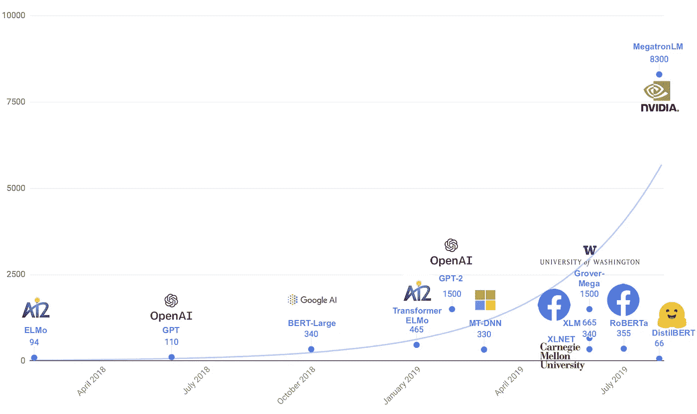
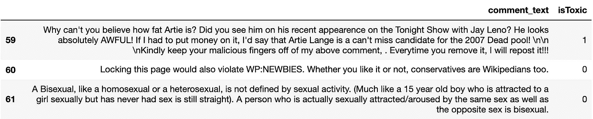
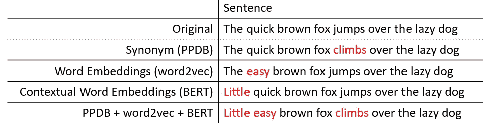
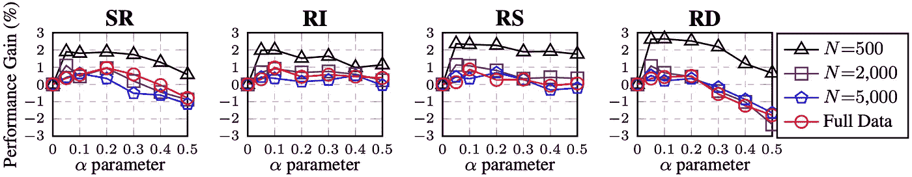
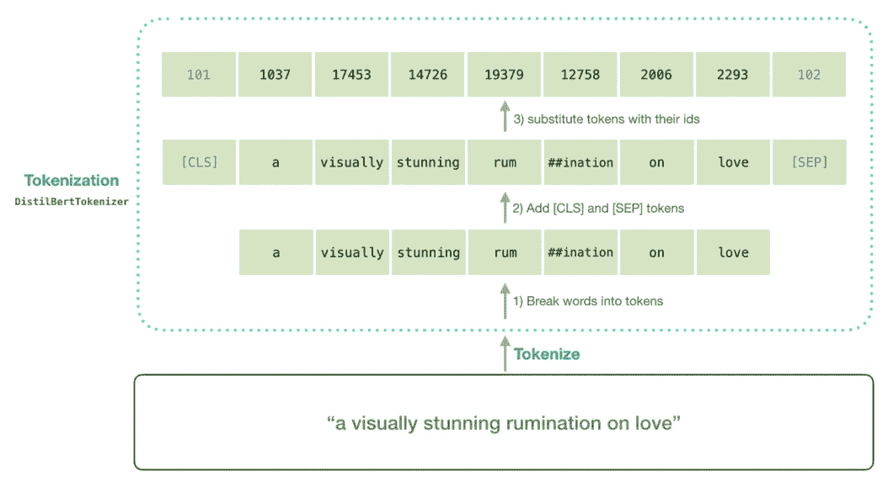
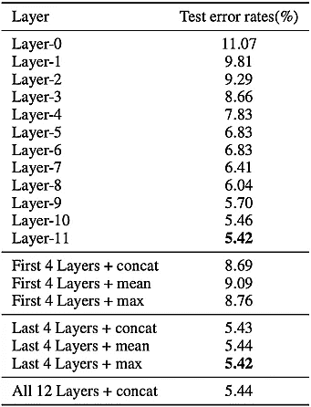
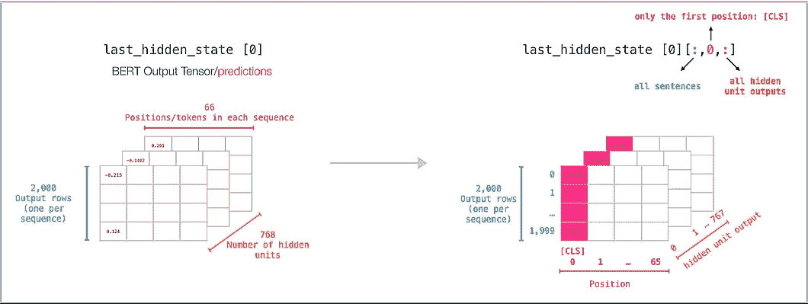
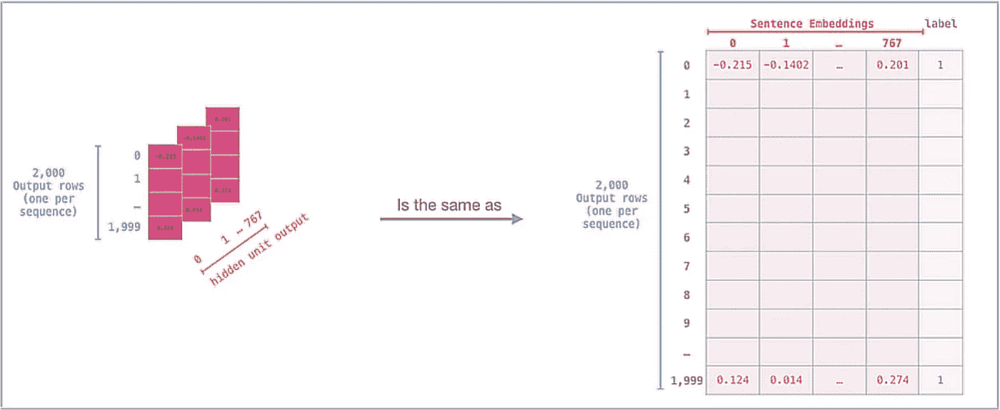
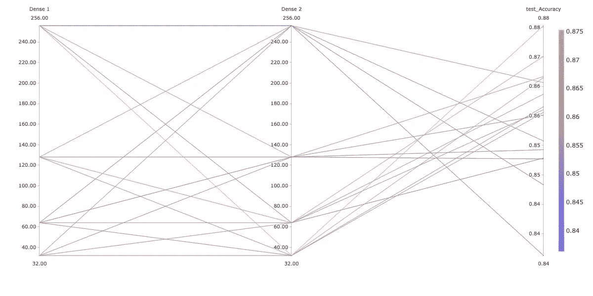

# 拥抱面部变形金刚:为二进制分类任务微调蒸馏瓶

> 原文：<https://towardsdatascience.com/hugging-face-transformers-fine-tuning-distilbert-for-binary-classification-tasks-490f1d192379?source=collection_archive---------0----------------------->

## TF 2.0 中 NLP 和迁移学习的初学者指南


抱脸和 TensorFlow 2.0。[来源](https://medium.com/tensorflow/using-tensorflow-2-for-state-of-the-art-natural-language-processing-102445cda54a)

# 1.0)简介

创建高性能的自然语言模型既耗时又昂贵。毕竟，谷歌大脑背后的团队花了 3.5 天在 8 个特斯拉 P100 GPU 上训练了著名的 BERT-large 模型的所有 3.4 亿个参数，自 2018 年成立以来，自然语言模型的复杂性只增不减。



最近的自然语言模型的大小，以百万计的参数。[来源](https://medium.com/huggingface/distilbert-8cf3380435b5)

但是如果一个公司没有培养如此庞大的庞然大物所需的资源呢？嗯，由于迁移学习的最新进展(这种技术以前在计算机视觉中得到了很好的确立，只是最近才在 NLP 中得到应用)，公司可以通过简单地将预训练的模型用于自己的自然语言任务来更容易地实现最先进的性能。

在这篇文章中，我想分享一个实际的例子，告诉你如何使用 Tensorflow 2.0 和优秀的[拥抱面部变形器库](https://huggingface.co/transformers/)，通过指导你如何在你自己独特的数据集上微调 DistilBERT 进行序列分类任务。

是的，我可以使用拥抱脸 API 来选择一个更强大的模型，如[伯特](https://huggingface.co/transformers/model_doc/bert.html)、[罗伯塔](https://huggingface.co/transformers/model_doc/roberta.html)、[伊莱克特拉](https://huggingface.co/transformers/model_doc/electra.html)、 [MPNET](https://huggingface.co/transformers/model_doc/mpnet.html) 或[艾伯特](https://huggingface.co/transformers/model_doc/albert.html)作为我的起点。但是我为这个项目选择了 DistilBERT，因为它占用的内存更少，推理速度更快。与它的堂兄弟相比， **DistilBERT 的 6600 万个参数使它比 BERT-base 小 40%，快 60%，同时保留了 BERT 95%以上的性能**。这使得 DistilBERT 成为寻求在生产中扩展其模型的企业的理想候选，甚至高达[超过 10 亿的每日请求](https://robloxtechblog.com/how-we-scaled-bert-to-serve-1-billion-daily-requests-on-cpus-d99be090db26)！正如我们将看到的，DistilBERT 通过适当的微调可以表现得相当令人钦佩。说完了，让我们开始吧！

# 2.0)数据

对于这个项目，我将使用 Kaggle 上找到的 [Jigsaw 毒性评论](https://www.kaggle.com/c/jigsaw-toxic-comment-classification-challenge)数据集的个人修改版本(我将数据集从多标签分类问题转换为二进制分类问题)，来对评论是*有毒*还是*无毒*进行分类。



修改的 Jigsaw 毒性评论数据集的数据预览。图片由作者提供。

转换后，数据集表现出类别不平衡，有毒评论占所有数据的 9.58%。这是一个问题，因为任何天真的模型都可以简单地“学习”类分布，并且每次都预测大多数类，并且仍然获得 90.42%的准确性。因此，虽然这看起来像我们的模型是成功的，但它实际上在预测有毒评论(少数群体)方面完全无效，这根本不是我们想要的！


处理班级失衡的方法。[来源](/having-an-imbalanced-dataset-here-is-how-you-can-solve-it-1640568947eb)

为了解决这个问题，我们将结合欠采样和过采样来平衡我们的类分布。

(*注意:请确保事先分割您的数据，并且只对训练集进行过采样，以确保您的评估结果尽可能保持公正！*

## 2.1)“不平衡”数据集

然而，重要的是要注意，当对多数类进行欠采样时，必须达到良好的平衡。如果我们欠采样太多，我们可能会因丢失有价值的训练数据而损害模型性能。但是如果我们采样过少(或者根本不采样)，模型的预测可能偏向多数阶级，而无法预测少数阶级。

记住这一点，我试图通过对修改后的数据集进行欠采样来找到正确的平衡，直到有害评论占所有训练数据的 20%左右。这个数据集此后将被称为`unbalanced dataset`，它是我在这个特定问题上获得最佳实证结果的数据集。


“不平衡数据集”的类别分布。*作者图片*。

## 2.2)“平衡”数据集

伴随着数据科学而来的是实验之美，我认为在完全平衡的数据集上微调 DistilBERT 也是富有成效的。这样做不仅可以完全消除不平衡的分类问题，而且我还希望将合成数据添加到我们的训练集中，可以让我们的模型推广到以前看不到的数据。

为此，我采用了`unbalanced dataset`的训练集，并对少数民族类进行了过采样，直到两个类都有大约 48，000 个代表性文本，从而创建了`balanced dataset`。



通过单词替换的文本扩充的各种实现。[来源](https://github.com/makcedward/nlpaug)

对于过采样，我使用 [nlpaug](https://github.com/makcedward/nlpaug) 库通过使用 BERT 上下文嵌入的单词替换来执行**数据扩充**。根据您选择的语言模型，生成这种数据可能是一个缓慢的过程(该库目前支持 DistilBERT、BERT、RoBERTa 和 XLNet 的实现)，但是该库提供了数据扩充的其他方法，分为三类:

1.  **字符级增强** ( *可以模拟文字中的错别字，同时考虑键盘距离*
2.  **单词级扩充** ( *可以应用回译、随机插入或删除、单词拆分或基于同义词库的同义词替换)*
3.  **句子级扩充** ( *可以使用下一句预测或抽象文本摘要生成句子)*



不同训练集大小(N)的五个文本分类任务的平均性能增益。α参数的大致意思是“句子中每次扩充所改变的单词的百分比” **SR:** 同义词替换， **RI** :随机插入， **RS:** 随机互换， **RD:** 随机删除。[来源](https://arxiv.org/pdf/1901.11196v2.pdf)

此外， [nlpaug](https://github.com/makcedward/nlpaug) 不仅允许您控制*如何*生成新文本，而且还允许您控制*所提供文本的多少、*或百分之多少应该被修改以产生新生成的文本。

正因为如此，知道从哪里开始可能会有点混乱，但在 2019 年的论文“ [EDA:提高文本分类任务性能的简单数据增强技术](https://arxiv.org/abs/1901.11196)”中，作者提供了上图，供您的数据增强管道参考。出于我的目的，我选择通过替换给定文本字符串中大约 10%的单词来生成新句子(α = 0.1)，但是超参数的最佳选择可能因您的特定数据集而异。尝试一下，看看效果如何！

要了解更多关于文本增强的信息，请阅读这篇文章:[链接](https://neptune.ai/blog/data-augmentation-nlp)。

注:使用。append()方法实际上效率很低，因为每次调用方法都要重新复制整个数据帧。相反，迭代地构建一个包含数据的字典，并调用。from_dict()方法来构造最终的数据帧。您可以在第 47–54 行看到我这样做。) [来源](https://stackoverflow.com/questions/57000903/what-is-the-fastest-and-most-efficient-way-to-append-rows-to-a-dataframe)

不幸的是，在我的例子中，在`balanced dataset`上的训练实际上导致了*更差的*性能(可能是由于文本增强在小数据集上表现更好的事实)，所以本文接下来的部分中的所有实验都将在`unbalanced dataset`上进行。

# 3.0)抱脸迁移学习

既然我们已经有了有序的数据集，是时候开始构建我们的模型了！为此，我们将充分利用迁移学习的力量，为我们的基础选择一个预训练模型，并在其上添加额外的层，因为它适合我们的分类任务。这是有效的，因为预训练模型的权重包含代表对英语的高级理解的信息，所以我们可以通过添加额外的层来建立这种一般知识，这些层的权重将代表对特定任务的理解，即什么使得评论*有毒*与*无毒*。

正如我们将看到的，拥抱脸变形金刚库使迁移学习变得非常容易，因为我们的一般工作流程可以分为四个主要阶段:

1.  标记文本
2.  定义模型架构
3.  训练分类层权重
4.  微调蒸馏瓶并训练所有重量

## 3.1)标记文本

一旦我们选择了一个预先训练好的模型，就该把人类可读的文本字符串转换成我们的模型可以解释的格式了。这个过程被称为**记号化**，直观的拥抱脸 API 使转换单词和句子→记号序列→可以转换为张量并馈入我们模型的数字序列变得极其容易。



伯特和蒸馏伯特记号化过程。特殊的[CLS]符号代表“分类”,并且将包含序列的句子级表示的嵌入。特殊的[SEP]标记代表“分离”,用于划分序列之间的界限。[来源](http://jalammar.github.io/a-visual-guide-to-using-bert-for-the-first-time/)

一般来说，不同的预训练模型使用不同的方法来标记文本输入(在上图中，可以看到 DistilBERT 的 tokenizer 如何在其标记化方案中包括特殊的标记，如[CLS]和[SEP])，因此有必要实例化一个特定于我们选择的模型的标记化器对象。为了获得`distilbert-base-uncased`使用的记号赋予器，我们将模型的名称传递给`DistilBertTokenizerFast`类的`.from_pretrained()`方法。

(*注意:拥抱脸提供了其标记化器的“慢”和“快”版本。“慢”版本是用 Python 编写的，而“快”版本是用 Rust 编写的，在执行批量令牌化时可以显著提高速度。在本文中，我们使用“快速”版本来利用这些性能优势。)*

一旦我们实例化了我们的 tokenizer 对象，我们就可以使用 tokenizer 的`.batch_encode_plus()`方法批量编码我们的训练、验证和测试集。

我们可能希望设置的重要[参数](https://huggingface.co/transformers/main_classes/tokenizer.html#transformers.PreTrainedTokenizer.__call__)包括:

*   `max_length` →控制给定文本中要标记的最大字数。
*   `padding` →如果设置为“最长”，则填充到批次中最长的序列。
*   `truncation` →如果*为真*，则根据`max_length`设置的值截断文本。
*   `return_attention_mask` →如果*为真*，则返回[注意屏蔽](https://huggingface.co/transformers/glossary.html#attention-mask)。这是可选的，但是注意掩码会告诉您的模型注意哪些标记，忽略哪些标记(在填充的情况下)。因此，将注意力屏蔽作为模型的输入可以提高模型的性能。
*   `return_token_type_ids` →如果*为真*，则返回[令牌类型标识](https://huggingface.co/transformers/glossary.html#token-type-ids)。对于一些需要多个序列作为输入的任务(例如，问题回答需要一个“问题”和一个“回答”序列)，这是必需的，因为令牌 id 通知模型一个输入序列在哪里结束，另一个序列在哪里开始。然而，出于我们的目的，这是可选的，因为我们的分类任务只需要一个序列作为输入(潜在有毒的注释)。

如上面的代码所示，我创建的`batch_encode`函数最终返回:

1.  `input_ids` →编码为数字序列的文本单词。
2.  `attention_mask` →一个二进制序列，告诉模型注意`input_ids`中的哪些数字，忽略哪些数字(在填充的情况下)。

`input_ids`和`attention_mask`都已经转化为 Tensorflow tf。张量对象，因此它们可以很容易地作为输入输入到我们的模型中。

## 3.2)定义模型架构

既然我们已经对训练、验证和测试集进行了编码，那么是时候定义我们的模型架构了。因为我们将使用 DistilBERT 作为我们的基础模型，我们从拥抱面部库导入`distilbert-base-uncased`开始。

**初始化基础模型**

重要的是，我们应该注意到拥抱脸 API 为我们提供了通过改变 DistilBERT 的配置类中的几个参数来调整基本模型架构的选项。这里，我们通过将`dropout`和`attention_dropout`从默认值 0.1 增加到新值 0.2 来实例化一个新的`config`对象，但是还有许多其他选项可供选择，所有这些都可以在特定于您所选模型的[配置类的文档](https://huggingface.co/transformers/v3.0.2/model_doc/distilbert.html#distilbertconfig)中找到。

在(可选地)修改了 DistilBERT 的配置类之后，我们可以将模型名称和配置对象传递给`TFDistilBertModel`类的`.from_pretrained()`方法，以实例化没有任何特定头部的基本 DistilBERT 模型(与其他类(如`TFDistilBertForSequenceClassification`)相反，这些类添加了分类头部)。我们不希望附加任何特定于任务的标题，因为我们只是希望基础模型的预训练权重提供对英语的一般理解，并且我们的工作将是在微调过程中添加我们自己的分类标题，以便帮助模型区分有毒评论。

因为 DistilBERT 的预训练权重将作为我们的模型的基础，所以我们希望在训练的初始阶段，当我们的模型开始为我们添加的分类层学习合理的权重时，保留并防止它们更新。要暂时冻结 DistilBERT 的预训练权重，请为 DistilBERT 的每个层设置`layer.trainable = False`，稍后一旦模型性能收敛，我们可以通过设置`layer.trainable = True`来解冻它们。

**增加一个分类头**

当我们构建我们的模型架构时，我们将在 DistilBERT 的嵌入层上添加一个分类头，我们在`line 35`中得到这个嵌入层作为模型输出。实际上，模型的输出是一个元组，包含:

1.  `last_hidden_state` →形状的词级嵌入( *batch_size* ， *sequence_length* ， *hidden_size* =768)。
2.  `hidden_states` →【可选】tf 的元组。形状( *batch_size* ， *sequence_length* ， *hidden_size* =768)的张量(一个用于嵌入的输出+一个用于每层的输出)。当我们在配置文件中设置`output_hidden_states=True`时返回。
3.  `attentions` →【可选】attention softmax 之后的 Attention 权重，用于计算自我关注头部的加权平均值。当我们在配置文件中设置`output_attentions=True`时返回。

我们选择这个元组的索引 0 来访问`last_hidden_state`，而不是访问其他层的隐藏状态，因为建立这种嵌入通常会导致最佳的经验结果。⁴



微调 IMDb 电影评论数据集上不同层的伯特。[来源](https://arxiv.org/abs/1905.05583)

每个隐藏状态都是一个 tf。形状张量( *batch_size* ， *sequence_length* ， *hidden_size* =768)，包含 DistilBERT 的 12 层之一的单词级嵌入输出。因此，在我们的例子中，最后一个隐藏状态将是(64，128，768)的形状，因为我们设置了`BATCH_SIZE=64`和`MAX_LENGTH=128`，并且 DistilBERT 的隐藏大小为 768。



带有以红色突出显示的[CLS]标记的“最后隐藏状态”的形状。[来源](http://jalammar.github.io/a-visual-guide-to-using-bert-for-the-first-time/)

我应该强调的是，嵌入中的所有 128 个序列标记提供了一种*单词级的*理解，并且人们可能能够从 3D 嵌入中提取大量信息，也许使用双向 LSTM 和 max-pooling 层，如本文中所执行的。

然而，出于我们的目的，我们将通过只查看这 128 个记号中的第一个:[CLS]记号来利用 DistilBERT 的 T20 句子级的对序列的理解。代表“分类”，[CLS]令牌起着重要的作用，因为它实际上存储了一个句子级嵌入，这对预训练阶段的*下一个句子预测* (NSP)很有用。因此，我们可以通过截取一段`last_hidden_state`来访问第 41 行中的句子级嵌入，这样我们就剩下一个代表整个文本序列的 2D 张量。



[CLS]标记的句子级嵌入。[来源](http://jalammar.github.io/a-visual-guide-to-using-bert-for-the-first-time/)

为了获得我们模型的性能基线，我们可以从在[CLS]令牌的句子级嵌入之上添加一个带有*sigmoid 激活函数*的单个密集输出层开始。最后，我们编译模型，将 *adam optimizer* 的学习速率设置为 5e-5(原始 BERT 论文的作者推荐 3e-4、1e-4、5e-5 和 3e-5 的学习速率作为良好的起点)，并将损失函数设置为*焦点损失*而不是二进制交叉熵，以便正确处理我们数据集的类不平衡。

(*注意:tf.keras 不提供焦损作为你可以使用的内置函数。相反，您必须将焦点损失实现为您自己的自定义函数，并将其作为参数传入。请看* [*这里*](https://paperswithcode.com/method/focal-loss) *了解焦损如何工作，看* [*这里*](https://gist.github.com/RayWilliam46/07e8718b2e7b102b9617e06c9faca27c/edit) *了解我使用的焦损功能的实现。)*

## 3.3)训练分类层权重

好了，我们终于建立了我们的模型，所以我们现在可以开始训练分类层的随机初始化权重，直到模型性能收敛。在只有一个输出层的简单基线模型的情况下，在 6 个时期内训练所有 768 个可用权重(因为所有 DistilBERT 的权重都是冻结的)会导致测试集上的**准确度为 85.7%** 和 **AUC-ROC 得分为 0.926** 。对于一个只用几行代码训练出来的模型来说，这已经不错了！

然而，我们肯定可以做得更好，在这个阶段我们可以考虑的一件事是改变我们的模型架构。毕竟，我们的模型在这一点上非常简单，只有一个单一的输出层在 DistilBERT 之上，所以在它们之间添加额外的密集和/或下降层可能是一个好主意。

我通过使用 [Comet.ml](https://www.comet.ml/) API 执行网格搜索，对两个密集层执行此操作，并发现针对我的特定分类问题的最佳模型架构如下所示:

```
[DistilBERT CLS Embedding Layer] + [Dense 256] + [Dense 32] + [Single-node Output Layer]
```

每层之间的压差为 0.2。



网格搜索每个密集层中的节点数。图片由作者提供。

由于这一变化，我们的新模型通过仅训练添加的分类层，在测试集上获得了 87.3% 的**准确度和 0.930** 的 **AUC-ROC。**

## 3.4)微调蒸馏器并训练所有权重

一旦我们完成对添加的分类层的训练，我们可以通过解冻 DistilBERT 的嵌入层并以较低的学习速率微调所有权重(以防止对预训练的权重进行重大更新)来从我们的模型中挤出更多的性能。注意**在解冻层权重**后，有必要重新编译我们的模型，但是除此之外，训练过程看起来与上一步相同。

作为微调 DistilBERT 预训练权重的结果，我们的模型在测试集🥳上实现了 92.18% 的最终**准确度和 0.969** 的 **AUC-ROC🔥🎉。**

# 4.0)结论

正如[两分钟论文](https://www.youtube.com/channel/UCbfYPyITQ-7l4upoX8nvctg)中的卡罗里·佐尔奈-费尔博士所说…

> “活着是多么美好的时光啊！”

正如你所看到的，激动人心的时刻即将到来，因为任何人只要有机会接触计算机，就可以利用最先进的、价值数百万美元的预训练模型，只需相对较少的几行代码。这种易用性是快速开发和模型部署的关键，小型模型(如 DistilBERT)的紧凑特性使它们可以扩展并能够产生实时结果，同时仍然保持高水平的性能。

如果 DistilBERT 还不够快，那么可以使用*权重量化*和使用 [ONNX 运行时](https://www.onnxruntime.ai/)的模型服务来进一步优化推理速度，但是，唉，我太超前了，因为这是未来文章的主题。

无论如何，我希望本文中的代码和解释是有帮助的，我希望你现在和我一样对 NLP 和拥抱脸变形金刚库感到兴奋！如果您喜欢这些内容，请随时在 [LinkedIn](https://www.linkedin.com/in/raywilliam/) 上与我联系，在 [Kaggle](https://www.kaggle.com/raywilliam) 上找到我，或者在 [GitHub](https://github.com/RayWilliam46/FineTune-DistilBERT) 上查看代码。

祝你在 NLP 领域好运，并祝你编码愉快！

# 5.0)参考文献

[1] A. Vaswani 等人，[注意力是你所需要的全部](https://arxiv.org/abs/1706.03762) (2017)，arXiv:1706.03762

[2] V. Sanh 等人，[蒸馏伯特，伯特的蒸馏版:更小、更快、更便宜、更轻](https://arxiv.org/abs/1910.01108) (2019)，arXiv:1910.01108

[3]魏军，邹凯， [EDA:提高文本分类性能的简易数据增强技术](https://arxiv.org/abs/1901.11196) (2019)，arXiv:1901.11196

[4] C. Sun 等，[如何微调用于文本分类的 BERT？](https://arxiv.org/abs/1905.05583) (2019)，arXiv:1905.05583