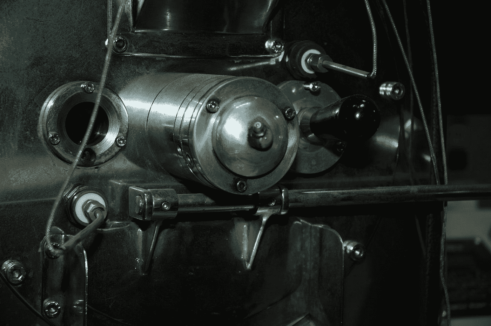
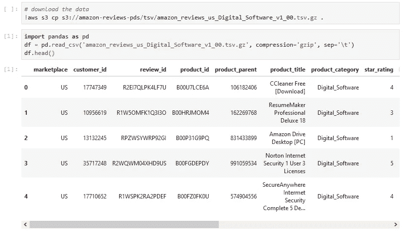
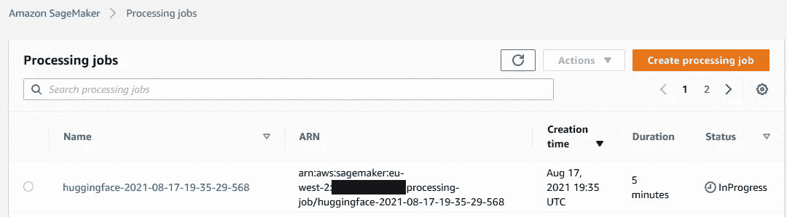
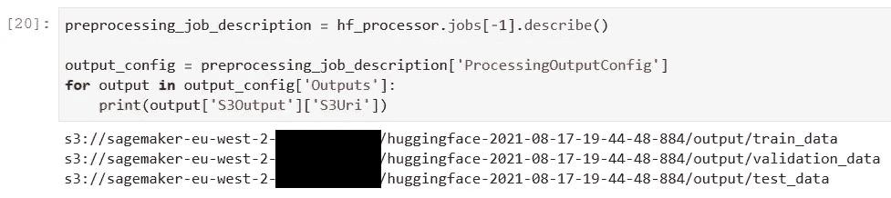

# 亚马逊 SageMaker 上的拥抱脸处理工作

> 原文：<https://towardsdatascience.com/huggingface-processing-jobs-on-amazon-sagemaker-b1f5af97b663?source=collection_archive---------29----------------------->

## 以可扩展和可再现的方式为 NLP 管道准备文本数据

在 [Unsplash](https://unsplash.com?utm_source=medium&utm_medium=referral) 上 [Wonderlane](https://unsplash.com/@wonderlane?utm_source=medium&utm_medium=referral) 拍摄的照片

# 这是怎么回事？

最新版本的[SageMaker Python SDK](https://github.com/aws/sagemaker-python-sdk)(v 2 . 54 . 0)引入了 HuggingFace 处理器，用于[处理作业](https://sagemaker.readthedocs.io/en/stable/amazon_sagemaker_processing.html)。这些处理作业可用于在 Amazon SageMaker 上运行数据预处理或后处理、特征工程、数据验证或模型评估的步骤。

HuggingFace 处理器对于基于 HuggingFace 的 Transformer 模型的 NLP 管道非常有用。深度学习容器(DLC)预装了所有必需的依赖项，并针对典型的 HuggingFace 数据转换(如标记化)进行了优化。在本教程中，我们将看看这些处理器，并了解如何利用它们来准备文本数据，以训练变压器模型。

和往常一样，本教程的[代码](https://github.com/marshmellow77/sm-hf-processor)可以在 GitHub 上获得。

# 拥抱脸+ SageMaker:简要概述

2021 年 3 月，Huggingface 和 AWS 宣布了一项[合作伙伴关系](https://huggingface.co/blog/the-partnership-amazon-sagemaker-and-hugging-face)，这使得在亚马逊 SageMaker 上训练最先进的 NLP 模型变得更加容易。有了新的拥抱脸训练 DLCs，训练基于变形金刚的 NLP 模型变得简单多了。7 月，这种集成[得到了扩展](https://huggingface.co/blog/deploy-hugging-face-models-easily-with-amazon-sagemaker),在 SageMaker 上增加了变形金刚模型的简单部署和推断。现在，在 2021 年 8 月，Sagemaker Python SDK 为这种集成添加了另一个构件， [Huggingface 处理器](https://github.com/aws/sagemaker-python-sdk/blob/master/src/sagemaker/huggingface/processing.py)。

# 为什么这很重要？

HuggingFace 处理器允许我们在容器化的图像中准备文本数据，该图像将在专用的 EC2 实例上运行。这有两个主要好处:(1)对于大型数据集，数据准备可能需要很长时间。选择专用的 EC2 实例允许我们为手头的任务选择合适的处理能力。(2)通过处理作业对数据准备进行编码，使我们能够以可扩展和可再现的方式将数据处理步骤集成到用于 NLP 任务的 CI/CD 管道中。

# 下载和检查数据集

既然已经说了，让我们开始吧！我们的目标是准备一个数据集，以便在稍后的某个时刻，可以用这个数据训练一个二元情感分类器。该分类器将文本作为输入，并预测文本中的情感是积极的还是消极的。为此，我们将在本教程中利用[亚马逊客户评论数据集](https://s3.amazonaws.com/amazon-reviews-pds/readme.html)。

该数据集包含各种类别的评论，在本教程中，我们将使用数字软件的评论。我们可以从一个公开的 S3 文件夹中下载数据，先看一看:

作者图片

我们可以看到在这个数据集中有相当多的列，其中大部分在我们的模型中并不需要。这意味着我们将不得不丢弃这些列。由于我们希望训练一个二进制分类器，我们还需要将星级转换为二进制值，即 0 和 1，它们将分别代表负面和正面的评论。在本教程中，我们将使用 4 颗星的阈值将评级转换为二进制值。这意味着，每一个 4 或 5 星的评分将被标记为正面评价，而每一个低于 4 星的评分将被视为负面评价。为了准备 Transformers 模型的数据，我们还想对数据进行标记。最后，我们希望将数据分成训练、验证和测试数据。

所有这些逻辑都将被捕获到处理脚本中，你可以在这里找到。本教程的重点是利用 HuggingFace 处理器，而不是数据准备本身，所以我不会深入讨论处理脚本的细节。但是，如果你对剧本有任何疑问，请随时联系我们！

# 使用 HuggingFace 处理器

既然我们已经开发了处理脚本，我们可以使用 Sagemaker Python SDK 来启动处理作业。首先，我们需要定义处理作业

我们定义要运行它的实例，以及需要多少个实例。如果数据处理任务繁重，并且有大量数据，那么提供多个实例可能是有意义的。

接下来，我们需要定义处理作业的输入和输出，以及作业的参数:

最后，我们可以开始培训工作了:

作业启动后，我们可以在 Sagemaker 控制台中看到它正在运行:

作者图片

几分钟后，工作完成了。控制台将提供关于处理作业的许多细节，例如使用了哪个容器映像，以及处理后的数据存储在 S3 的什么位置。我们还可以通过 SageMaker Python SDK API 以编程方式收集这些数据点。例如，我们可以轻松地检索已处理数据的 S3 位置:

作者图片

# 结论

在本教程中，我们成功地利用 Sagemaker 处理作业来处理 Transformer 模型的数据。这个处理作业现在可以合并到 NLP 管道中，每次新的训练数据到达时，处理作业就开始。现在，数据已经过处理和标记化，可以很容易地用于训练 HuggingFace Transformer 模型。