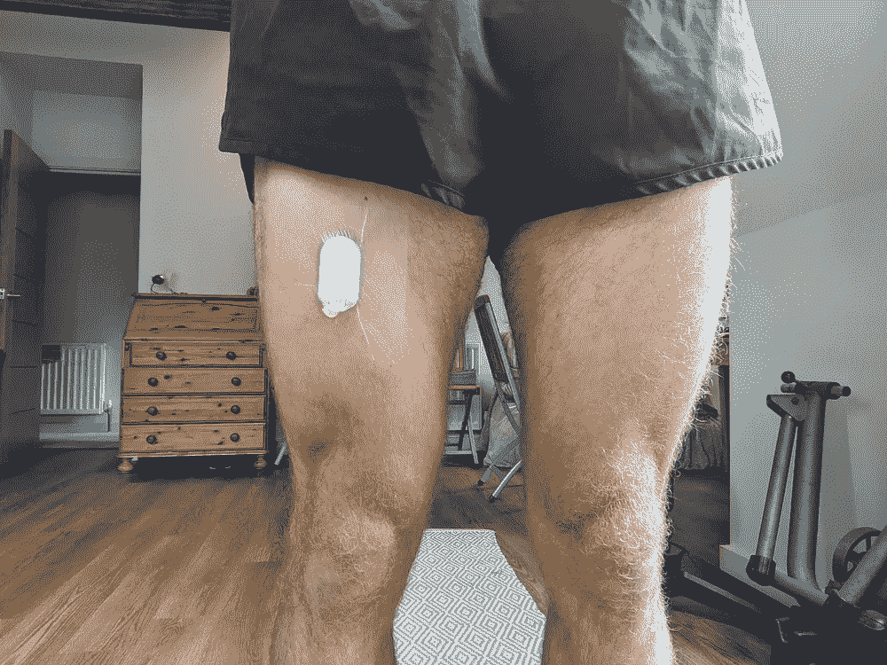

# 用张量流进行活动分类

> 原文：<https://towardsdatascience.com/human-activity-recognition-with-tensorflow-4e5c040208e2?source=collection_archive---------21----------------------->

## [实践教程](https://towardsdatascience.com/tagged/hands-on-tutorials)

## 用六周时间利用深度学习创建一个身体行为分类模型。


由[丁满·斯图德勒](https://unsplash.com/@derstudi?utm_source=medium&utm_medium=referral)在 [Unsplash](https://unsplash.com?utm_source=medium&utm_medium=referral) 上拍摄的照片

# 开始:为期 42 天的项目

几个月前，我读了丹尼尔·伯克的一篇文章，内容是关于使用 Detectron 2 复制 Airbnb 的舒适度检测系统。

这篇文章概述了 Daniel 运行 42 天(6 周)的短期项目的过程，最初是由 [Basecamp](https://basecamp.com/) 开发的，目的是尝试快速发布有用的软件。

<https://basecamp.com/shapeup/webbook>  

为什么是 6 周？

因为 42 天的时间足够完成一些有用的事情，但也不会长到如果没有效果，你就浪费了大量的时间。

我喜欢这个主意。

很长一段时间以来，我一直试图在我的研究工作之外学习数据科学和机器学习，我一直在努力寻求学习和实践之间的平衡。我一直试图通过完成课程来提高我的技能，但我的努力没有任何表现。我知道我需要离开单调的教程，开始构建展示我的数据科学知识的项目。

所以我给自己设定了开发深度学习模型的任务。

我是深度学习的新手。我知道神经网络如何工作的基础，但我不太了解开发这些模型的工具和技术。我决定使用 [TensorFlow](https://www.tensorflow.org/) 。之前听说过，知道是深度学习社区里用的比较好的库。

但是我需要一个创建模型的理由…

最近，我一直在从事一项人类活动识别研究项目，试图利用小腿上的加速度计数据对下肢截肢者的姿势进行分类。传统的方法是使用来自大腿的加速度数据。当你可以使用重力加速度来区分关键姿势时，区分坐姿和站姿要容易得多。但小腿是安装加速度计的最佳位置，因为它可以放在假肢内。这样做的问题是，小腿数据使得很难区分坐和站，因为设备的方向对于两种姿势是相同的。



*作者图片:*传统加速度计大腿佩戴位置与新型小腿佩戴位置的对比

作为研究项目的一部分，我尝试使用浅层机器学习模型、k-最近邻算法和手工制作的特征来区分姿势。

学者喜欢他们能解释的模型！

但是这个模型很难区分坐着和站着。很明显，我的特征不能区分这两种姿势。

所以这是一个完美的机会来尝试深度学习，看看它是否能解决我的问题。我已经收集了一些关于我自己和一些朋友的数据，所以我知道我可以马上开始做事。

我打开 idea，开始制作项目模板。除了正常的工作日，我估计每个工作日我会花大约 2 个小时在这个项目上。

最坏的情况是，我不能让模型工作，我会知道这是我需要关注的事情。

最好的情况是，我会做一个模型，打破我以前的研究成果，并有一个新的项目要写。

不管怎样，比起继续做教程，6 周的工作会让我有更多的东西可以展示。

> 给读者一个提示，这篇文章是对所发生的事情的高层次叙述，其中掺杂了一些技术。对于像我这样的书呆子来说，代码可以在 [Github 仓库](https://github.com/Ben-Jamin-Griff/AmputeePostureClassification)中找到。

# 分解项目

[观念](https://www.notion.so/)是我管理项目的首选工具。很容易定制页面以适应任何应用程序，并有大量的项目管理内置功能。

我在整个项目生命周期中使用它来保持我的进度和组织性。看看我的项目结构和每日日志:[观念页](https://www.notion.so/Project-1-Using-Deep-Learning-to-Classify-Amputee-Postures-04dbcaef152148fb80616598af8ad004)

鉴于我有 6 周的时间来做这个项目，我决定把它分成以下几个阶段:

1.  开始:计划和探索问题。
2.  创建数据处理软件。
3.  获得使用 TensorFlow 的基本模型。
4.  使用研究论文创建最佳模型。
5.  部署模型，以便其他人可以使用它。
6.  评估工作，清理代码，写这篇文章。

所以，我们已经讨论了项目的规划和组织。让我们开始写一些代码。

# **处理数据**

像所有好的机器学习项目一样，它始于数据，止于数据。

幸运的是，我已经从一些愿意的朋友那里收集到了数据，他们很乐意让我使用这些数据，并为本文提供这些数据。

数据是从戴在小腿上的三轴加速度计和戴在大腿上的活动监视器收集的。我的计划是使用戴在大腿上的设备在整个数据收集期间给我准确的姿势测量，并尝试使用小腿加速度来预测姿势。

我需要将数据分成 15 秒的窗口，每个窗口有 3 个轴的加速度数据和相应的真实姿态代码。这可能是四种姿势中的一种；坐着、站着、走着或躺着。

为此，我想创建一个面向对象的系统。

我是一个自学成才的程序员。我学会了编码，这样我就可以为研究项目处理数据，我对它的热情也从那时开始增长。

所以我不得不艰难地学习。

使用不同编程方法的缺点，通过正规教育学习时你被教导要避免的常见错误。

但是尽管我以前涉足过 OOP，我从来没有做过一个我认为真正需要 OPP 的系统。然而，这是一个很好的机会。我可以想象不同的“对象”,它们负责处理的各个阶段，它们的方法和属性。

我创建了一个代表设备本身的对象，一个负责数据标签(如果存在)的“姿态堆栈”，一个负责分离出原始数据的数据集，以及一个能够进行预测和评估准确性的模型。

这些对象很容易扩展，例如，创建不同长度的窗口或使用不同的模型根据数据进行预测。

现在我所需要担心的是数据的加载。

不幸的是，设备将文件导出为 CSV 格式，每 20 秒采样一次的 5 天 3 轴加速度数据的问题是，您会留下一些大型 CSV。

我尝试了几种不同的导入数据的方法，但我唯一的选择是使用 pandas 将数据分成块。这太慢了…非常慢。

如果有人有更快的方法导入这些数据，请告诉我。

这里也有逻辑来处理我在 CSV 头中观察到的一个奇怪的问题。

总之，经过 12 个多小时的处理后，我已经准备好开始玩 TensorFlow 了。

# **学习深度学习**

我将数据保存为 2 个 numpy 数组；1 包含带有形状的原始加速度数据…

```
(number of epochs, 295, 3)
```

其中 295 代表原始加速度数据(15 秒* 20 个样本，其中 5 个样本被丢弃，以确保所有的时间点具有相同的形状)，3 代表 3 个加速度数据通道。另一个数组包含相应的姿势代码，可能是 4 个值(0-3)中的一个。

为了让事情进行下去，我建立了一个[谷歌实验室](https://colab.research.google.com/)笔记本，并输入我的数据开始实验。

首先，我需要确保我的数据格式正确。幸运的是，在看了一些教程后，我知道我需要将我的数据转换成张量。据我的理解，张量是 x 维 numpy 数组，便于 CPUs & GPUs 进行深度学习的接口，这就是为什么我确保将我的数据保存为 numpy 数组，以便于转换。

我还需要确保我的姿态代码是一个热编码，我的加速度数据是正常的，我删除了任何姿态代码和相应的数据，我不想在我的模型。如果您对额外处理的细节感兴趣，或者想要进行自己的实验，请查看 collab 笔记本。

<https://colab.research.google.com/github/Ben-Jamin-Griff/AmputeePostureClassification/blob/main/notebooks/amputee_posture_classification_experiments_deep.ipynb> [## 姿势分类实验

colab.research.google.com](https://colab.research.google.com/github/Ben-Jamin-Griff/AmputeePostureClassification/blob/main/notebooks/amputee_posture_classification_experiments_deep.ipynb) 

现在是试验不同模型的时候了。

我尝试复制了一个在 TensorFlow 教程中找到的模型，并很快了解到确保数据具有正确的形状并正确输入到输入层非常重要。程序不仅会在训练时抛出错误，还会影响模型的准确性。

```
INPUT_SHAPE = X_train.shape[1:]INPUT_SHAPE_RESHAPED = X_train_reshaped.shape[1:]OUTPUT_SHAPE = len(unique_classes_train)input shape: (295, 3) 
input shape reshaped: (1, 295, 3) 
output shape: 4
```

在这里，我创建了两个不同形状的不同输入数据集，您马上就会明白为什么。

我设法让我的第一个基本模型工作。

```
dnn_model = tf.keras.Sequential([
tf.keras.Input(shape=INPUT_SHAPE_RESHAPED),
tf.keras.layers.Dense(100, activation=’relu’),
tf.keras.layers.Dense(100, activation=’relu’),
tf.keras.layers.Dense(100, activation=’relu’),
tf.keras.layers.Flatten(),
tf.keras.layers.Dense(OUTPUT_SHAPE, activation=’softmax’)],
name=’DNN-Model’)
```

我想比较我的所有模型，所以我创建了一个函数，使用相同的参数来训练和保存模型。

```
callback = tf.keras.callbacks.EarlyStopping(monitor='val_accuracy', patience=3)EPOCHS = 50model_to_train.compile(loss='categorical_crossentropy',
optimizer='adam',
metrics=['accuracy'])history = model_to_train.fit(X_train, y_train, epochs=EPOCHS, validation_split=0.2, batch_size=32, callbacks=[callback], verbose=1)
```

我使用了 50 个历元和一个早期停止回调来防止过度拟合。分类交叉熵是多类分类的标准损失函数，adam 优化器是典型的优化函数。

该模型工作得相当好，并在训练集上实现了 87%的准确度(f1 分数)。

对于第一次尝试来说还不错。让我们来看看混淆矩阵


*图片作者:*第一个深度神经网络的混淆矩阵

我们可以看到，该模型在踩踩中工作良好，正如我们所预期的那样，因为信号非常不同。然而，它更难区分坐着和站着，因为姿势是静态的，设备的方向也是一样的。

我们可以做些什么来改进这种模式？嗯，我挖了一些关于人类活动识别的研究论文，发现卷积神经网络(CNN)被频繁使用。

CNN 通常与图像分类相关联，并对像素值执行卷积和汇集阶段，以便更容易识别图像中的特定特征。这似乎可以转化为多轴传感器数据，并比单独的 DNNs 做出更好的模型。

在浏览了一些在线教程后，我设法安装并运行了一个。

```
cnn_model = tf.keras.Sequential([tf.keras.layers.Conv2D(32, kernel_size = (1, 12), strides = (1, 1), input_shape=INPUT_SHAPE_RESHAPED, padding=”valid”),
tf.keras.layers.MaxPooling2D((1,4), (1, 2)),tf.keras.layers.Conv2D(64, kernel_size = (1, 4), strides = (1, 1), input_shape = (1, 295, 3), padding=”valid”), tf.keras.layers.MaxPooling2D((1,4), (1, 2)), tf.keras.layers.Flatten(),
tf.keras.layers.Dense(128, activation=’relu’),
tf.keras.layers.Dense(OUTPUT_SHAPE, activation=’softmax’)],
name=’CNN-Model’)
```

这就是为什么我创建了一个经过改造的训练数据版本。卷积需要一个四维张量，所以我需要稍微不同地安排我的数据。

其余的参数取自 CNN 模型的前几个例子，我仍然不确定除了实验之外，你是如何做出这些决定的。

如果任何人有这方面的信息，那么我很乐意听到它。

反正这个模型比我之前 84%准确率的模型略差。

非常令人失望，因为我认为这将使我的模型更好，我只能假设我没有优化参数，或者我的数据不需要优化这种类型的模型。

然而，我还想尝试最后一件事。

在我寻找论文的过程中，我可以看到一些关于循环神经网络(RNN)的信息。这些方法利用时间事件来改进未来的预测。它们经常用在自然语言处理(NLP)中，其中每个前面的单词都可以用来提高对下一个单词的预测，因为它们密切相关。

这对于我的模型非常有意义，因为前一个活动与下一个活动密切相关。如果你坐着，除非你站起来，否则你不能开始走路，反之亦然。

我开始建造另一个模型。幸运的是，TensorFlow 很容易就创建了这个，因为他们有一个专门针对长短期记忆(LSTM) RNNs 的层。

```
lstm_model = tf.keras.Sequential([
tf.keras.layers.LSTM(128, input_shape=INPUT_SHAPE),
tf.keras.layers.Dense(100, activation='relu'),
tf.keras.layers.Dense(OUTPUT_SHAPE, activation='softmax')],
name='LSTM-Model')
```

该模型的准确率比前三个模型提高了 88%。成功！🥳

我成功创建了 3 个模型，使用了 3 种不同类型的深度学习。

但是我已经非常接近难以捉摸的 90%的准确率了。

是时候求助于专业人士了，看看他们是否能帮我改进我的模型。

# **站在巨人的肩膀上**

我需要了解其他人如何将这些不同的深度学习模型应用到我的应用程序中。

我已经查看了一些以前与 HAR 相关的研究论文，但这些论文没有提供我用 TensorFlow 复制他们的模型所需的详细程度。

在网上搜索代码示例和教程后，我看到了这篇关于[机器学习大师](https://machinelearningmastery.com/how-to-develop-rnn-models-for-human-activity-recognition-time-series-classification/)的文章。

Jason 详细介绍了他用来训练活动分类模型的开放访问数据集，以及可用的不同算法、它们如何工作的一些信息和代码示例。

这太完美了！

它们与我已经使用过的算法非常相似，但是扩展到结合了各自的特性。

我开始写代码，在我的数据上尝试这些模型。查看下面的新笔记本。

<https://colab.research.google.com/github/Ben-Jamin-Griff/AmputeePostureClassification/blob/main/notebooks/amputee_posture_classification_experiments_deep_mlm.ipynb> [## 姿势分类实验-MLM

colab.research.google.com](https://colab.research.google.com/github/Ben-Jamin-Griff/AmputeePostureClassification/blob/main/notebooks/amputee_posture_classification_experiments_deep_mlm.ipynb) 

我决定坚持使用相同的训练超参数，这样我就可以将它们与我以前的模型进行比较。

新模型包括另一个具有不同参数的 LSTM 模型、一个组合的 CNN-LSTM 模型和一个卷积 LSTM 模型。

需要一些额外的预处理来将我的数据变成正确的形状以执行卷积，这可能是为什么我以前的 CNN 模型在提高最佳精度方面不成功的原因。

```
mlm_lstm_model = tf.keras.Sequential([
tf.keras.layers.LSTM(100, input_shape=INPUT_SHAPE),
tf.keras.layers.Dropout(0.5),
tf.keras.layers.Dense(100, activation=’relu’),
tf.keras.layers.Dense(OUTPUT_SHAPE, activation=’softmax’)],
name=’MLM-LSTM-Model’)mlm_cnn_lstm_model = tf.keras.Sequential([
tf.keras.layers.TimeDistributed(tf.keras.layers.Conv1D(filters=64,kernel_size=3, activation=’relu’),input_shape=INPUT_SHAPE_RESHAPED_1),
tf.keras.layers.TimeDistributed(tf.keras.layers.Conv1D(filters=64, kernel_size=3, activation=’relu’)),
tf.keras.layers.TimeDistributed(tf.keras.layers.Dropout(0.5)),
tf.keras.layers.TimeDistributed(tf.keras.layers.MaxPooling2D(pool_size=2)),
tf.keras.layers.TimeDistributed(tf.keras.layers.Flatten()),
tf.keras.layers.LSTM(100),
tf.keras.layers.Dropout(0.5),
tf.keras.layers.Dense(100, activation=’relu’),
tf.keras.layers.Dense(OUTPUT_SHAPE, activation=’softmax’)],
name=’MLM-CNN-LSTM-Model’)mlm_convlstm_model = tf.keras.Sequential([
tf.keras.layers.ConvLSTM2D(filters=64, kernel_size=(1,3), activation=’relu’, input_shape=INPUT_SHAPE_RESHAPED_2),
tf.keras.layers.Dropout(0.5),
tf.keras.layers.Flatten(),
tf.keras.layers.Dense(100, activation=’relu’),
tf.keras.layers.Dense(OUTPUT_SHAPE, activation=’softmax’)],
name=’MLM-ConvLSTM-Model’)
```

LSTM 模型和我自己的版本有同样的性能，88%的准确率…没有任何改进。

然而，合并后的 CNN 和 ConvLSTM 分别取得了 90%和 91%的进一步改善。

来源: [Giphy](https://media.giphy.com/media/xTiTnHRBrb8wbSof28/source.gif) 。机器学习大师坦克弗兰克

成功了！我设法超过了 90%的准确率。查看混淆矩阵，我们可以看到每个类的预测准确性都有很大的提高。


*图片作者:最终混乱矩阵*

我认为我还可以对这个模型进行改进。我本可以探索加速度数据的进一步预处理，或者我本可以尝试更多地调整我的超参数。

但我决定今天就到此为止，并开始思考如何让其他人也能接触到这种模式。

# 做预测

当我决定开始这个项目时，我知道我不能让我的模型死在 Colab 笔记本里。

我看过太多机器学习工程师的 youtube 视频，他们谈论创建端到端项目以在此结束有多么重要。

所以我需要思考如何让其他人也能使用这个模型。

在这个项目的开始，当我创建我的 OOP 软件时，我考虑了这个模型的潜在用户，并意识到他们可能只包括我和其他研究人员。

工具和数据太专业了，以至于不能让每个人都可以使用。

因此，尽管我很想尝试在 [Streamlit](https://streamlit.io/) 应用程序上运行我的模型，我还是决定将我最好的模型整合到我的 OOP 软件中。这样，任何想要使用该软件对未标记的小腿数据进行预测的研究人员都可以从 GitHub 下载该软件并运行示例脚本。

正如所言，这相当简单，我可以简单地将 TensorFlow 导入到我的模型类中，选择我想要进行预测的模型，并向它显示新的加速度数据。

然而，这些预测的结果相当无聊。我想创造一些东西，在一个简单的情节中可视化几天的姿势预测。

我的一个同事最近完成了一个类似的项目，研究上肢假肢的使用，并探索使用螺旋图来可视化加速度数据。

这非常有意义，螺旋的每个周期可以代表一天，我可以用不同的颜色来代表姿势。

我求助于可靠的 StackOverflow，发现了一个非常有用的帖子，是关于使用 Matplotlib 实现不同螺旋图的例子。

我将它添加到一个新的绘图类中，该类可以被其他类继承以满足一系列绘图需求。

这是一种享受🍰

现在，我可以查看我的姿势分类器的输出，并分析多天内的不同姿势。


图片作者:姿势:蓝色=躺下，绿色=坐着，黄色=站着，红色=迈步

我做到了！我实现了这个项目开始时设定的目标。

我有一个系统来创建深度学习模型，并做出比我之前的研究更好的姿势分类预测。

# 我学到了什么？

那是有趣的 6 周！

42 天项目想法是一个很好的大纲，让你有足够的时间来完成一个小项目，而不必在一个想法上投入几个月的时间。这对我非常有用，因为我有很多东西想在机器学习中尝试和学习。

以前，我试图通过教程学习，并将重点放在个别主题上，如数据库或图书馆，如熊猫。

基于项目的工作是以应用的方式学习所有这些东西的更好的方式，并帮助你记住它们为什么有用以及它们是如何实现的。

此外，在项目结束时，您会留下一个原始代码库，并且可能会留下一个您自己创建的产品。这比完成一个教程更好地展示了你的技能，在这个教程中，你生成的代码和其他跟随教程的人是一样的。

我肯定会在我的下一个想法中使用 42 天项目计划，我甚至会尝试将它融入到我生活的其他领域，比如健身训练或学习新技能。

在过去的 6 周里，我学到了很多，包括:项目管理，构建 OOP 软件，处理数据，为深度学习准备数据，构建 TensorFlow 模型，评估模型，调整模型，最后在项目内实现深度学习。

我也学到了很多关于记录和写作我的作品的知识，我计划在我所有的副业项目中继续这样做。

我希望这是一个有趣的阅读，这将是伟大的工作得到您的反馈。

# 下一步是什么？

是时候进入下一个项目了！

遵循 [42 天项目指南](https://basecamp.com/shapeup/webbook)，我将花一周时间冷静下来，清理一些代码，并开始思考我想为下一个项目做些什么。

我已经有一些想法了。

我想探索计算机视觉，以及如何使用机器学习来解读图像和视频数据。

真的，我只想买一个这样的…

<https://store.opencv.ai/products/oak-1>  

如果任何人有任何有趣的想法，然后让我知道。

干杯🤙