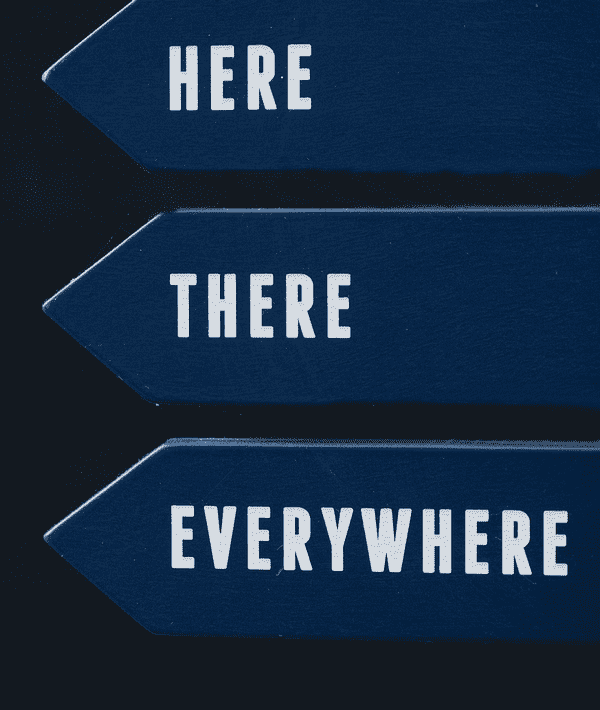
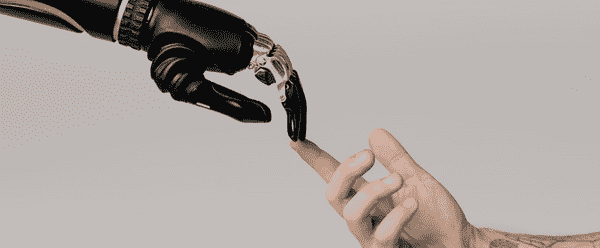
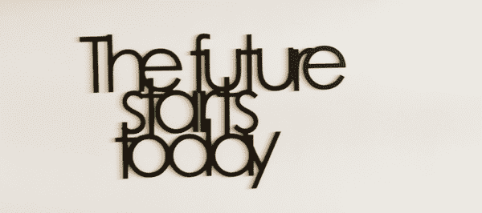

# 以人类为中心的人工智能宣言:或者如何尝试不造成伤害

> 原文：<https://towardsdatascience.com/human-centric-ai-manifesto-or-how-to-try-and-do-no-harm-4559a6def9be?source=collection_archive---------27----------------------->

最近，我告别了学术生涯，回到了工业界。虽然我从未对这一举动感到后悔，但我开始担心，既然我的工作变得更加务实，我的自主权减少了，我是否还能继续反思我工作的道德方面。总的来说，我认为我们作为一个数据科学社区没有做足够的工作来保证我们的工作不会伤害或不利于那些与我们创造的任何东西进行交互的人。在这篇文章中，我试图通过采用一种更加以人为本和价值敏感的方法，来整合我的观察和想法，如何做得比我们目前做的更好。

# 数据科学和人工智能

罗伯特·奥本海默在为研制原子弹做出贡献后说:“我已经成为死亡，世界的毁灭者”。虽然可以说数据科学家并没有促成任何像原子弹那样令人发指的影响，但他们确实创造了影响数百万或数十亿人日常生活的模型和系统。这让我想知道:我怎么能保证在 5 到 10 年后我会得出类似的结论呢？进一步加剧这种担忧的是我的观察，即数据科学和人工智能社区中有相当多的人不重视或不具备对其工作的道德影响进行批判性反思的技能或背景。

这个“宣言”是我开始从事数据科学工作以来形成的思想的整合。它包含对数据科学研究如何完成以及这如何导致影响方面的盲点的观察。它描述了我在博士期间的研究如何通过考虑用户如何体验人工智能应用来避免盲点。它反思了为什么即使是这种方法也不够，因为并非所有的人工智能应用都是用户有意识使用的系统(浏览互联网的人可能没有意识到他们看到的内容是基于算法预测的个性化内容，或者公民可能没有意识到警察巡逻队是基于历史数据被派往他们的社区)。总之，我有一些想法，尽管我对我们作为一个社区应该如何前进只有一个模糊的想法，以确保十年后我们不必在尴尬、羞愧或内疚中回顾我们所建立的一切。

# 数据科学

照片由 [Unsplash](https://unsplash.com/photos/C2zhShTnl5I) 上的[尼克·费因斯](https://unsplash.com/@jannerboy62)拍摄

我们作为数据科学社区贡献的人工智能应用正变得越来越普遍。我们现在的情况是，任何人接触到的大部分信息在某种程度上都是人工智能的结果。这是巨大的。与此同时，我们根本不知道我们所创造的技术是如何影响接触它的人们，或者整个社会的。有大量的例子表明，人工智能并没有提高，反而降低了人们的生活质量。通读凯茜·奥尼尔(Cathy O'Neil)的《数学毁灭的武器》(Weapons of Math Destruction)给出了大量例子，说明算法通过负反馈循环伤害或不利于人们，从将多媒体平台用户归类为阴谋论或回音室的过滤气泡，到不断分配警力资源以巡逻发生轻微犯罪的弱势地区并从防止更大犯罪中夺走资源的预测性警务算法。

我自己的背景是推荐系统，所以在整篇文章中，我将使用推荐系统作为例子。推荐系统是拥有大量内容的网站所使用的软件，例如电子商务网站中的电影或产品。推荐系统的目的是帮助网站用户找到相关的项目。他们通过分析和比较所有访问者之间的互动行为来实现这一点，根据访问者的历史互动行为，他们可以使用这些模式来预测访问者最有可能购买或消费的东西。

人工智能应用未能实现改善人们生活的目标的根本原因之一是，这些应用的设计和开发往往是条块分割的。就设计而言，这些系统已经存在于不同的抽象层次上。目标是在战略层面上制定的，从战略层面上制定可客观衡量的关键绩效指标，并选择解决方案的数据。对于我们的多媒体流媒体网站，我们希望提高访问者的参与度，我们打算通过检查人们观看视频的数量来衡量这一点。

这为我们提供了足够的信息来创建一个算法，该算法将产生一个预测模型，作为我们智能系统的基础，随着时间的推移，原始指标方面的性能会得到改善。太好了！因此，我们多媒体流媒体平台的观众花在搜索电影上的时间更少了(这对他们有好处)，他们看的电影更多了(对他们和我们都有好处)。

一个棘手的问题是，当你进入数字和数据的更精细的层次时，你会远离背景、战略目标以及接触到它的人。算法不关心我们是在开发一个推荐系统还是一个欺诈检测系统；同样的数字，规则，参数适用。因此，构建算法、训练和实现模型的人甚至不必理解他们的模型输出是用来做什么的，只要他们能够将问题公式化为机器学习或数据科学问题。如果忽略你的模型将被使用的环境，事情会变得很奇怪。当然，我们可以假设让人们观看更多电影的系统表现良好，我们可以训练我们的模型来优化这一指标。但是，如果走极端，这可能会导致人们一天 24 小时观看电视的不良后果？理论上，这是一个完美的模型。但实际上，这根本不是一个理想的、可持续的解决方案。换句话说，重要的是将范围从预测扩大到应用程序的原始上下文，以及预测将如何影响系统、用户、人和世界。

# 以用户为中心

由 [cottonbro](https://www.pexels.com/@cottonbro) 在 pexels.com[拍摄的照片](https://www.pexels.com/photo/person-holding-black-and-silver-hand-tool-6153354/)

我有一个人机交互的学位，这允许或迫使我在整个博士学位期间采用以用户为中心的方法。我被告知，当一个人工智能解决方案仅仅改善了一个客观的行为指标，如持续时间或点击次数时，我不会感到满意，而是要始终包括主观的用户体验。即使推荐系统让人们连续 24 小时观看视频，他们真的会满意吗？因为这是我们系统的最终目标，你不能满足于使用一些满意度的代理，比如点击次数和点击越多的人越满意的假设。你得问他们！更重要的是，人们都很古怪。当他们观看由算法推荐给他们的项目时，他们真的会满意吗？或者当他们进行人工搜索时，或者当他们可以依赖电视台董事会做出的节目决策时，或者当他们观看朋友推荐的节目时，他们会更满意吗？甚至可能是，如果所有四种方法都有相同的结果，人们会有不同的满意度。

更糟糕的是，并不是所有的用户都一样。在研究如何自动执行用户经常执行的任务的系统时，如谷歌的 Nest 智能恒温器，我们可以使用人工智能开发一个系统，随着时间的推移，该系统可以学习通过完全自动化来将完成任务所需的用户努力降至最低，甚至为零。但是对以前做这个任务的人有什么影响呢？那些甚至喜欢摆弄恒温器时控制感的人呢？

所有这些都可以通过某种形式的以用户为中心的评估来解决。超越人工智能应用程序如何影响客观的用户交互，将用户体验放在评估人工智能应用程序的更中心位置，已经降低了你创建一些伤害他们的东西的可能性。但是有些事情超越了用户体验。我们的系统对用户背后的人有什么影响？推荐系统如何帮助人们发展他们的品味和偏好，甚至性格？不得不寻找电影看或音乐听，并形成一个观点，这不是我们个人发展的一部分吗？推荐系统不会剥夺我们发展自己的机会吗？

# 为什么用户中心性不够？

我在马斯特里赫特大学任教期间，与其他院系的同事交流，我慢慢得出结论，这种以用户为中心的观点是不够的，原因有二。第一个原因是，用户不一定是对他们有利的最佳判断者。每个吸烟者都会说他们对自己的香烟很满意，然而我们可以相当客观地说香烟对他们有害。类似地，用户可能表示他们对人工智能应用程序的输出感到满意，但从长远来看，这个系统实际上可能正在伤害他们。第二个原因是，并不是每个接触到人工智能应用程序动作的人都是真正的、有意识的用户。在某些情况下，人们没有权力决定他们是否会接触到应用程序，例如当政府使用人工智能应用程序时。在其他情况下，他们可能会与他们不理解的东西进行交互，并迫使他们理解评估他们的用户体验是不现实和不可取的。

# 没有(或者不是所有)用户能够判断什么对他们有益

当看到人们的满意度可能不符合他们的利益时，我们可以看看过滤气泡推荐系统。当推荐系统对用户的兴趣做出推断时，就会出现过滤气泡。一个系统意识到有人可能对某一类内容感兴趣，并开始提供更多的内容。其结果是，用户查看任何其他内容并向系统提供推断是错误的证据变得更加困难。最终的结果是，用户可能会被归类到例如自行车视频(相当无辜)或阴谋论(不那么无辜)。如果一个人被归类，只要他们对此感到高兴/满意，我们能认为这是“好的”(在道德意义上)吗？

我认为人工智能不仅应该考虑与之互动的人们的需求/愿望，还应该考虑我们作为一个社会所努力追求的价值观。不是我们做的每件事都是我们想要的。在某些情况下，我们作为一个社会设定了一些价值观，比如“每个人都需要对数学有一个基本的了解”。我们需要承认我们有价值观，这些价值观根植于我们的解决方案中。这些价值观可能已经被有意识或无意识地植入，现在是时候确保我们反思我们植入的价值观了。

# 并非所有用户都在有意识或自愿地使用人工智能

除了不是所有的人都能判断什么对自己好之外，这些价值也是不足的，因为不是所有的用户实际上都是‘用户’。暴露于例如目标广告的人可能不知道这些广告是基于算法预测而显示给他们的。当广告网络(如谷歌的 Adwords)使用人们的网络浏览行为来推断他们的兴趣，并使用这些推断为他们提供最有可能与他们相关的广告时，就会发生定向。现在有些人是那些系统的用户。我绝对是一个用户:我了解个性化是如何工作的，我控制我何时分享什么信息，我在我想要的时候屏蔽个性化广告。我母亲与其说是一个用户，不如说是一个系统及其输出。她甚至可能错误地认为，她在脸书 feed 上看到的帖子是马克·扎克伯格自己选择的，值得她关注，而不是基于算法预测(这带来了一个全新的问题)。

同样，当涉及到其他类型的决策时，人们可能没有意识到他们正在使用一个系统，他们可能没有选择不受算法输出的影响。这方面的例子可以是学校招生部门或人力资源部门雇用人工智能来帮助招聘。或者雇用人工智能来权衡或决定接受或拒绝申请的抵押贷款提供商。

# 未来:以人为本，重视价值

我们如何确保在十年后，我们不会把过去十年的努力视为一个错误？目前正在努力确保我们所做的工作经得起一些道德审查，既来自数据科学/人工智能社区本身，也来自监管机构。并且这两种努力仍然有它们的缺点。

# 目前的努力

老实说，人们努力制定普世价值。公平、问责和透明(或 FAccT)正在成为机器学习社区现在努力追求的价值观。任何机器学习应用都应该产生公平、透明且有人可以负责的决策/预测/输出。与此同时，我个人并不认为这些具体的问题应该是普遍的。当然，问责制是有意义的。没有人应该成为他们不能质疑的决定的主体，我们也不希望人工智能系统地偏袒一个群体而反对另一个群体。但是，透明度是我们必须争取的价值吗？我认为透明度本身符合人们能够理解他们正在交互的东西的价值，但同时它可能与易用性的价值不一致。获得了为什么会做出这样的决定的额外信息，迫使人们投入时间和精力去阅读(或至少决定是否阅读)这些额外信息。

这些社区价值的主要缺点是，这些价值也不是以用户或人为中心的。很难说，透明度是接触到人工智能系统输出的人会重视的东西。是时候调查一下与我们的应用程序交互的人们看重什么了，老实说，我很难期望“透明”是这次调查的结果。我认为在开发人工智能时，一个很重要且应该考虑的价值观是“自主性”。如果我重新开始学术生涯，这将是我的研究方向之一。

另一个确保我们不造成伤害的努力是将希波克拉底誓言改编为数据科学家的希波克拉底誓言。虽然原则上这正是我们需要争取的交战规则和原则的类型，但遗憾的是，它还没有得到 AI/数据科学界的广泛认可。

# 为什么仅仅遵从是不够的

在某种程度上，法规旨在作为法律界限，确保人工智能不会伤害或不利于人们。随着人工智能变得越来越普遍，更多的边界被设置到位。但是，目前的监管以及可能所有的监管都存在一些缺点。

由于人工智能的发展如此之快，监管往往发生在事后。出了问题(如剑桥分析)，制定法律以避免再次发生(如 GDPR)。因此，法律界限定义了我们能做什么和不能做什么，这是基于我们过去判断为错误的事情。

另一个缺点是，在没有充分了解技术要求或对用户/公民的影响的情况下，常常制定规章。这方面的一个例子是 2009 年推出的欧洲电子隐私指南，也称为 cookie 法。这些指导方针是向数据所有权迈出的第一步，而数据所有权是 GDPR 的核心，并描述了公司如何有义务请求其网站上的访问者同意使用 cookies 来识别和跟踪他们。一件很棒的事情是，人们获得了对数据的控制权和所有权。与此同时，他们被迫做出一个决定，这个决定实际上要求他们在某种程度上理解 cookies 的作用。

这违背了“不造成伤害”的主要设计原则之一。在这种情况下，伤害可以而且应该从这个词最广泛的意义上来理解:我们不应该设计会主动伤害人的系统，也不应该设计会给公司、用户和地球带来超出绝对必要的资源成本的系统。不得不自学 cookies 在有意识地决定接受或拒绝它们时的作用，这意味着欧盟正在给其公民施加负担。通过规定在什么情况下可以和不可以跟踪访问者，他们可以相对容易地承担起这个负担。

为了确保你的行为不会导致将来的法律，你所能做的最大努力不是在法律的范围内，而是在一系列道德的范围内。它们在任何地方都不是一成不变的，除了某些行业，如新闻业和银行业，它们的行为准则是一致的。即便如此，它们也可能是含糊不清的，可以有多种解释。过去，我的一套界限是确保我所创造的一切都是以用户为中心的，把用户和他们的体验放在第一位。我可以非常自信地说，我没有创造出任何我没有评估过或者没有打算通过用户研究来评估的东西。

由[安娜斯塔西娅·弗拉戈娃](https://www.pexels.com/@anastasiya-vragova-22991246)在[像素](https://www.pexels.com/photo/adorable-purebred-dog-standing-at-wooden-table-and-looking-away-6753642/)上拍摄的照片

# 走向未来:以人为中心的人工智能

负责任的 AI 和有道德的 AI 是看似相似事物的两个名称。在我看来，确保我们不会伤害受我们作为数据科学家所做工作影响的人们的唯一方法是采取以人为本的方法。我们不能只考虑我们的人工智能应用程序采取的行动如何影响客观行为，我们必须考虑这些应用程序如何影响那些与我们的系统交互的人的体验和人类生活。通过这种方式，我们可以再次降低我们伤害他们的可能性，甚至确保我们确实通过我们的工作改善了生活。更进一步，我们可以将嵌入我们系统的价值观与我们作为向世界发布人工智能应用程序的人所拥有的价值观，我们作为人工智能应用程序的用户所拥有的价值观，甚至与我们作为社会所拥有的价值观相一致。但这确实需要我们意识到并考虑这些价值。

任何从事人工智能工作的人都不能再使用“我只是制作算法，它们的用途是别人的责任”这样的话。从产品负责人到数据科学家，再到数据工程师，链条中的任何人都需要分担责任，确保我们开发的东西以帕累托最优的方式改善世界:不造成伤害或损害任何人。要做到这一点，需要做的不仅仅是询问暴露在这些系统中的人们是否对这些系统满意。在某些情况下，它需要我们真正代表他们思考和决定。虽然这让一些人感到害怕，但这并没有错。但是有很多方法可以做到这一点，数据科学家应该接受这一点，并利用它来增强他们自己的工作，而不是将其视为分散工作的注意力。

# 创新研究

有大量关于创新研究的文献，或者关于创新是如何产生的思考。创新研究的关键方面是如何进行和衡量创新、技术创新系统(或创新建模的方法)、创新和政治，与本文最相关的是:创新对经济、社会和环境的影响。在这种方法中，研究人员试图通过研究新技术的客观属性和环境之间的关系来解释创新对其环境的影响。

# 价值敏感设计

另一个重要的方面是对价值敏感的设计。由于人工智能应用程序是由人创建的，并且它们是基于从人那里收集的数据，因此如前所述，我们创建的应用程序中总是嵌入了价值。它们要么嵌入在我们使用的数据中，要么嵌入在我们选择优化的指标中，要么嵌入在我们根据预测选择采取的行动中。确保在构建应用程序时考虑价值的一种方法是遵循一种叫做价值敏感设计的方法。这种方法通过考虑利益相关者和他们的价值，允许设计考虑人类价值的技术。其中，人种学方法被用来了解什么价值是相关的，以及它们是如何被设计的技术考虑进去的。

# 我将如何保持以人为本

我目前正在为 Obvion 编写数据科学路线图。在创建和实施该路线图的过程中，我将努力确保资源分配到我们工作的道德部分。作为一家金融机构，我们有很多关于如何开展工作的规定，但合规应该是最起码的要求。我的目标是超越这一点，确保我们公平对待与我们交往的人，改善他们和我们的生活。作为抵押贷款提供商，我们的行动和决定影响着任何人一生中最大的一次购买。我的主要目标是确保我们的行为和决定不会伤害、损害或不公平地对待任何人。

这将首先在发展团队中完成，我的目标是创建一个不仅仅关注数字的团队。我们每个人都应该了解和理解我们正在帮助解决方案的流程和客户、顾问和同事。我们将挑战自己，被要求接受挑战，挑战那些向我们寻求解决方案的人。其次，我们将沿着两条轴线同心地开发和推出人工智能应用。第一个轴是提供决策支持与自动化决策。我们从提供决策支持的应用程序开始，而不是自己完成决策。随着我们了解的越来越多，我们将慢慢转向可以自动完成决策的应用程序。我们将改变的第二个轴心是让我们的解决方案从内部焦点开始，着眼于影响我们内部组织的决策和行动，并慢慢转向影响我们的客户和顾问的决策和行动。

没有保证，但这是我们试图将负面影响我们交往对象的可能性降到最低。

# 感谢

感谢大卫·范·科克霍夫的精彩反馈！

# 背景

去年，我是马斯特里赫特大学商业和经济学院的数据科学助理教授。今年，我是荷兰抵押贷款提供商 Obvion 的首席数据智能。我意识到，除了一系列出版物和一些仍在进行的项目，我还没有整合我在学术界的经验、想法和观点。尽管事实上我被 Obvion 雇佣部分是因为我的经历、想法和观点。因此，我试图在我所谓的“以人为中心的人工智能宣言”中写下我所做的事情。

# 脚注

过滤泡在科学文献中仍然是一个争论，既有证据支持也有证据反对它的存在。这表明有一些外部因素影响过滤器气泡是否影响用户消费，因此不能忽略它们。如果有什么不同的话，这表明我们应该注意到技术可以影响我们的思维和行为这一事实。

[https://www . nap . edu/catalog/25104/data-science-for-substantials-opportunities-and-options # TOC](https://www.nap.edu/catalog/25104/data-science-for-undergraduates-opportunities-and-options#toc)

我认为透明度不应该成为一种普世价值的另一个原因。

*原载于*[*https://aigents.co*](https://aigents.co/blog/publication/human-centric-ai-manifesto-or-how-to-try-and-do-no-harm)*。*