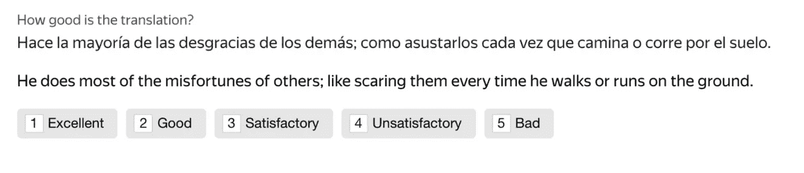
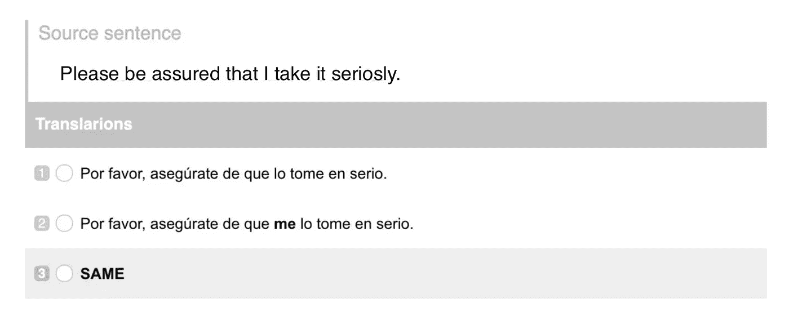
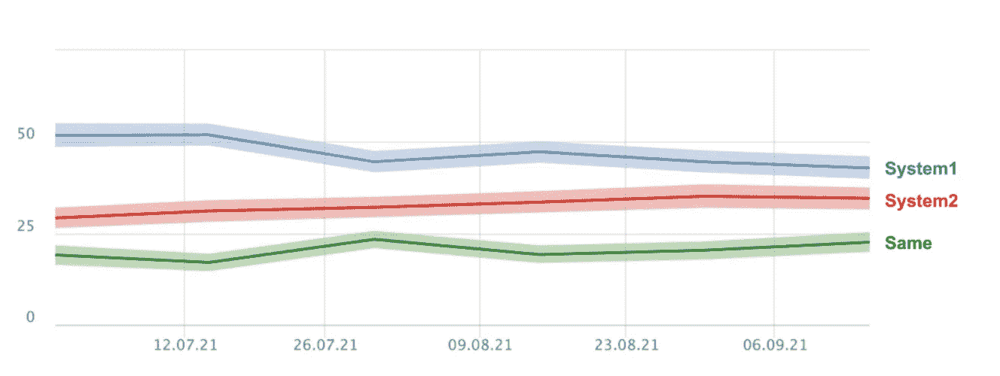
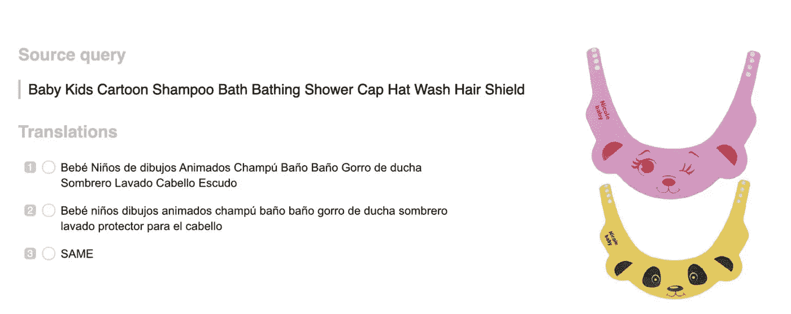

# 机器翻译系统中的人在回路

> 原文：<https://towardsdatascience.com/human-in-the-loop-in-machine-translation-systems-bdf3fe82bfa3?source=collection_archive---------33----------------------->

## 使用众包评估机器翻译质量

图片由来自 [Pixabay](https://pixabay.com/?utm_source=link-attribution&utm_medium=referral&utm_campaign=image&utm_content=600497) 的 [stokpic](https://pixabay.com/users/stokpic-692575/?utm_source=link-attribution&utm_medium=referral&utm_campaign=image&utm_content=600497) 拍摄

**简介**

近年来，由于深度学习和人工神经网络的进步，机器翻译已经卷土重来。2015 年，机器翻译系统开始从基于统计的模型转向神经网络，这大大提高了大多数语言对的翻译质量。这些改进伴随着翻译系统评估方式的变化，机器翻译工程师开始更加关注他们创建的系统的人工评估。

在本文中，您将根据 Yandex Translate 的经验，了解如何使用众包来评估机器翻译系统，Yandex Translate 是市场上最好的机器翻译系统之一。

**传统机器翻译评估指标**

传统上，机器翻译质量是使用自动化指标进行评估的，如 BLUE、METEOR、LEPOR 和 BLEURT，这些指标在业界都是众所周知的。然而，自动化指标并不能为当前系统提供足够准确的评估。此外，这些方法成本高昂，因为它们需要高薪聘请专业人士来创造黄金组合。近年来，已经投入了大量的努力来探索作为替代方案的人类评估。

**众包人工评估**

人类评估者必须会说目标语言对中的两种语言，但他们不必是专业翻译。因此，使用这种类型的评估更便宜且更具可扩展性。这个过程可以通过众包平台来建立和自动化，比如 Toloka。从西班牙语翻译成英语的评估任务可能是这样的:

评价 ES-EN 翻译的例子，作者照片

这个任务被设置在一个众包平台上，并发送给说两种语言的人。按照机器翻译模型的建议，存在源语言的文本及其英语翻译。执行这项任务的人被问到*“翻译有多好”？*他们从不同的回答中选择:*优秀、良好、满意、不满意、糟糕。*

通过收集不同表演者对各种句子的反应，我们可以了解翻译系统的表现。这种评估通常比自动度量更准确。

**并排比较**

当我们想要评估一个机器翻译模型时，我们通常会将其与一个基准、另一个模型或者只是我们自己模型的以前版本进行比较。在这种情况下，比较两个系统的最佳方法之一是使用并排比较。下面的截图说明了这样一个例子。

并列式 MT 评测示例，作者照片。

在上面的截图中，你可以看到两个不同的模型提出的一个英语源句子和两个西班牙语翻译。任务执行者被要求选择哪个翻译更好，或者如果两个版本同样好，则指出*相同*。

作为系统评估的结果，我们可以比较这两个系统在一段时间内的表现。在下面的屏幕截图中，您可以看到系统 1 一直在降级，而系统 2 一直在改进。

一段时间内的机器翻译系统比较，作者提供的照片

**挑战**

人工翻译比自动度量更准确的事实并不意味着它没有挑战。在上面的设置中，您看到任务执行者被给予一个句子来评估，并且没有提供上下文。这有时可能会导致错误的选择。

此外，为了评估语言对的翻译，我们需要任务执行者说两种语言。理想情况下，这个人应该是目标语言的母语使用者，并且应该能够流利地使用源语言。虽然如果我们使用众包，大多数流行语言都不是问题，但为一些更模糊的语言对找到表演者可能是一个挑战。

还有一些特殊类型的翻译需要稍微不同的设置。例如，电子商务的翻译通常必须附有一张照片，如下图所示。

电商 MT 实例，作者照片

没有额外的图片，就不可能对源查询*“婴儿儿童卡通洗发沐浴浴帽洗发罩”*的翻译做出正确的评价。

一个类似的例子是网页翻译。由于网页的结构由文本、HTML 标签和不同的组件组成，很难脱离上下文翻译一个句子或单个短语。在这种情况下，翻译往往伴随着网页本身，以提供更多的信息。

**总结**

在本文中，我们已经了解了使用众包对机器翻译系统进行人工评估的不同方法。更多详情，请观看玛利亚·什马托娃的[演讲](https://www.youtube.com/watch?v=PYLlR25on4Q&t=1076s)，了解她的团队在 Yandex 翻译公司是如何做的。此外，如果你想了解更多关于如何自动化模型评估过程，你可以加入这个数据授权的[社区](https://tolokacommunity.slack.com/join/shared_invite/zt-sxr745fr-dvfZffzvQTwNXOE0gEqysg#/shared-invite/email)。

*PS:我正在 Medium 和*[***aboutdatablog.com***](https://www.aboutdatablog.com/)*上撰写深入浅出地解释基本数据科学概念的文章。你可以订阅我的* [***邮件列表***](https://medium.com/subscribe/@konkiewicz.m) *每次我写新文章都会收到通知。如果你还不是中等会员，你可以在这里加入*<https://medium.com/@konkiewicz.m/membership>**。**

*下面还有一些你可能喜欢的帖子*

*</moderation-pipeline-for-user-generated-content-59e7f3c320e0>  </jupyter-notebook-autocompletion-f291008c66c>  </how-to-successfully-add-large-data-sets-to-google-drive-130beb320f1a>  </9-things-you-did-not-know-about-jupyter-notebook-d0d995a8efb3> *