# 人类学习:通过绘图创建人类学习模型

> 原文：<https://towardsdatascience.com/human-learn-create-rules-by-drawing-on-the-dataset-bcbca229f00?source=collection_archive---------8----------------------->

## 使用您的领域知识来标记您的数据

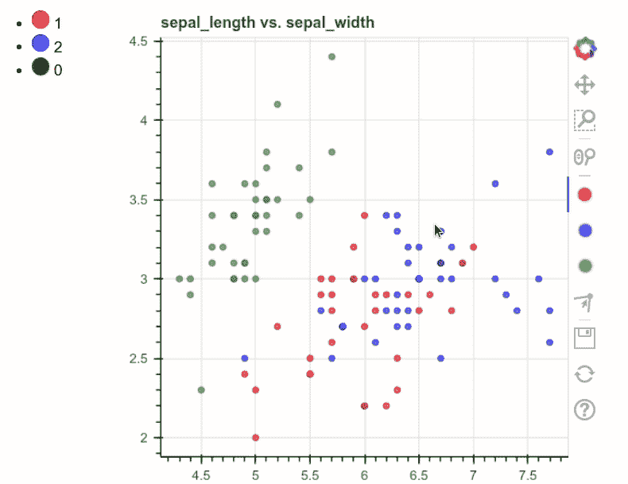

作者 GIF

现在，数据科学家经常给机器学习模型数据加上标签，以便它能够找出规则。这些规则可用于预测新数据的标签。

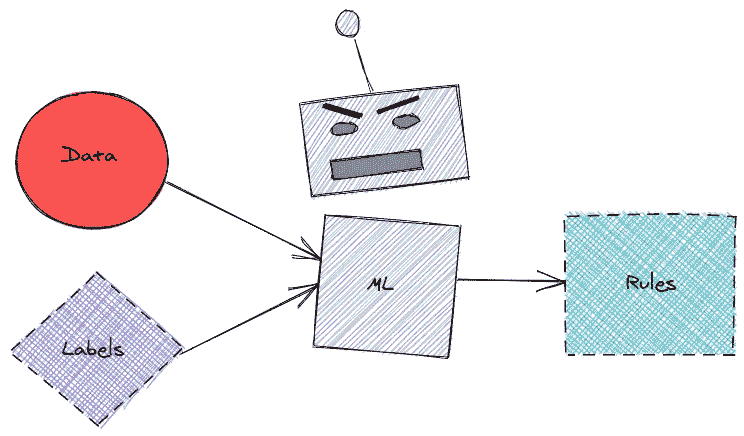

作者图片

这很方便，但是在这个过程中可能会丢失一些信息。也很难知道引擎盖下发生了什么，以及为什么机器学习模型会做出特定的预测。

除了让机器学习模型解决所有问题，有没有一种方法可以让我们使用我们的领域知识来设置数据标签的规则？

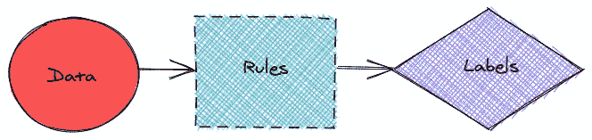

作者图片

是的，这可以通过人类学习来完成。

# 什么是人类学习？

[Human-learn](https://github.com/koaning/human-learn/) 是一个工具，允许您使用交互式绘图和定制模型来设置数据标签的规则。在本文中，我们将探讨如何使用 human-learn 创建一个具有交互式绘图的模型。

要安装 human-learn，输入

```
pip install human-learn
```

我将使用 sklearn 的虹膜数据来展示 human-learn 是如何工作的。

# 交互式绘图

## 图画

Human-learn 允许您在数据集上绘图，然后使用您的绘图将它们转换为模型。为了演示这是如何有用的，假设您创建了一个数据集散点图，如下所示:

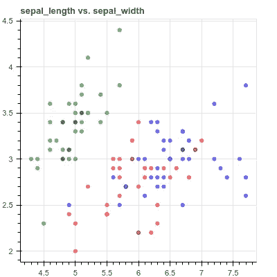

作者图片

当查看上面的图时，您可以看到如何将它们分成 3 个不同的区域，如下所示:

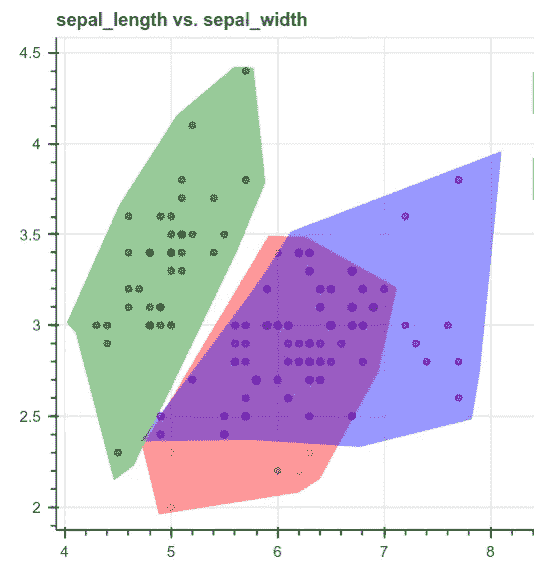

作者图片

然而，将您的绘图写成规则并将其放入函数中可能会很困难。这时，human-learn 的交互式绘图就派上了用场。

现在你可以像下面这样开始绘制你的图表了！


作者 GIF

**绘制指令**:双击开始绘制多边形。然后单击以创建多边形的边。再次双击可停止绘制当前多边形。如果你不清楚这一点，你可以在这里看一个视频。

我们也对其他色谱柱做同样的事情:

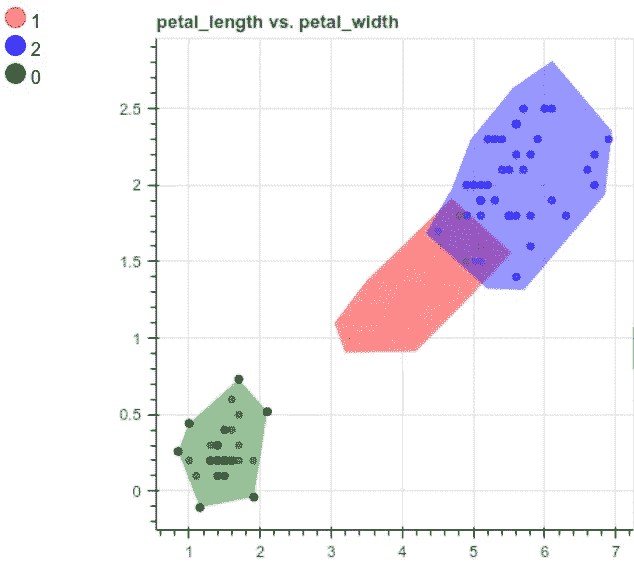

作者图片

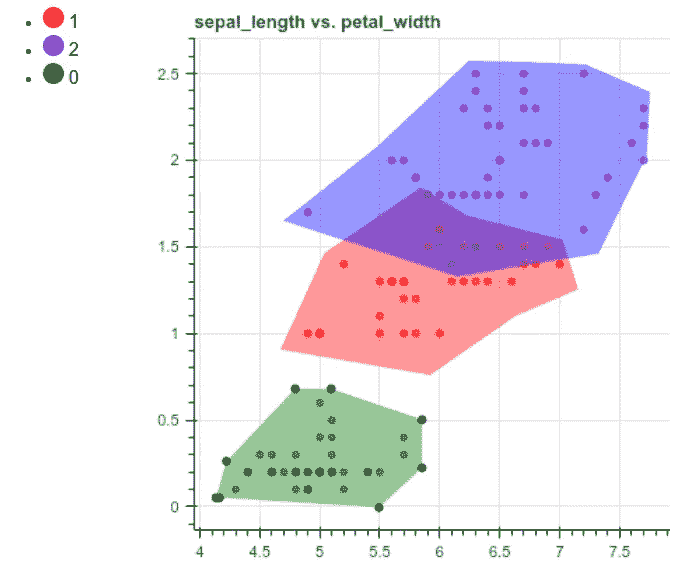

作者图片

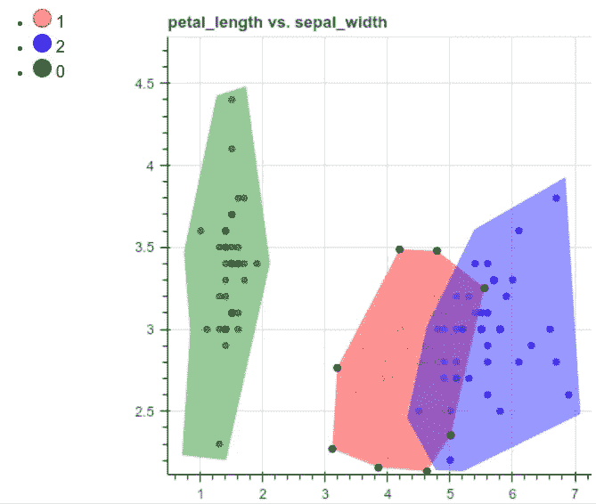

作者图片

## 创建模型并预测

完成数据集的绘制后，我们可以使用这些绘图创建一个模型:

酷！通过将我们的图纸提供给`InteractiveClassifier`类，我们能够使用类似于 sklearn 模型的方法，例如`fit`和`predict_proba`。

预测的形状`preds`是`(150, 3)`。让我们来看看`preds`的前 5 行:

注意`predict_proba`给出了样本具有特定标签的概率。例如，`[5.71326574e-01 4.28530630e-01 1.42795945e-04]`的第一次预测意味着样本有 57.13%的机会具有标签 1，有 42.85%的机会具有标签 2，有 0.014%的机会具有标签 0。

## 预测新数据

现在，让我们使用我们的模型来预测新数据，并将预测与真实标签进行比较。

输出:

```
The prediction is 0
The real label is 0
```

不错！预测和真实标签一样！

## 解释结果

为了理解模型是如何得出预测的，让我们想象一下我们的新样本在之前绘制的散点图中的位置。

首先创建一个函数来可视化我们的新样本。

使用上面的函数在`petal_length`对`petal_width`图上绘制一个新的样本，其点以其标签为 0 的概率着色。

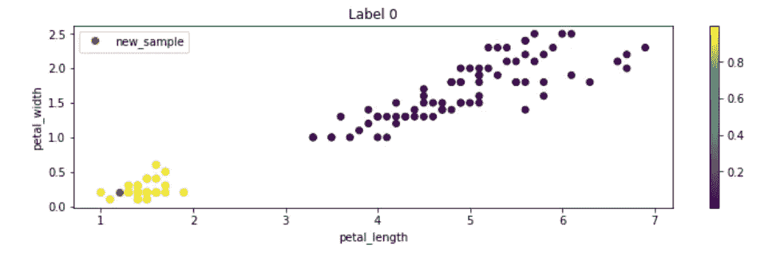

作者图片

请注意，**黄色圆点**表示这些圆点有**标签 0** 的**高概率**。点越是紫色，这些点越不可能有标签 0。

我们可以看到红点(新样本)在有许多黄点的区域。但是在其他的情节中有类似的模式吗？让我们通过将相同的函数应用于其他列对来找出答案。

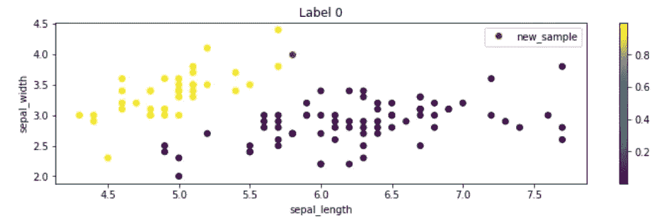

作者图片

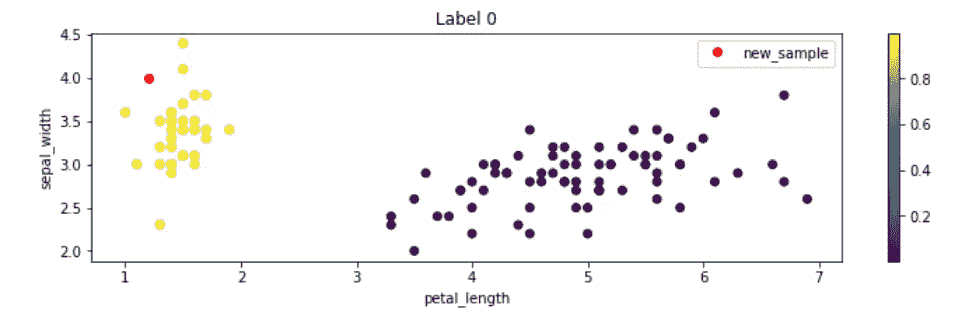

作者图片

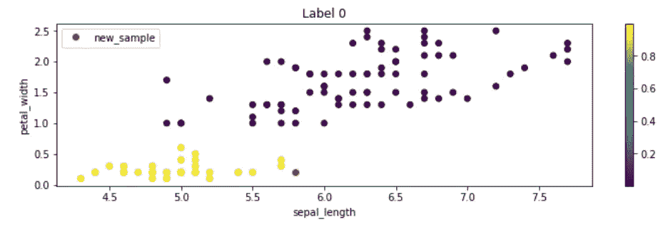

作者图片

在所有的图中，我们可以看到红点在有许多黄点的区域！这解释了为什么模型预测新样本的标签为 0。很酷，不是吗？

## 预测和评估测试数据

现在让我们使用该模型来预测测试数据中的所有样本，并评估其性能。使用混淆矩阵开始评估:

```
array([[13,  0,  0],
       [ 0, 15,  1],
       [ 0,  0,  9]])
```

哇酷！有 37 个真预测，只有 1 个假预测。

我们还可以使用 F1 分数来评估结果:

```
0.9736842105263158
```

不错！

# 结论

恭喜你！您刚刚学习了如何通过在数据集上绘图来生成标记数据的规则。这并不是说你应该完全消除机器学习模型，而是在处理数据时加入某种人类监督。

我希望 human-learn 将鼓励你在应用任何机器学习算法之前可视化你的数据。在下一篇文章中，我将向您展示使用 human-learn 创建规则的其他方法。

本文的源代码可以在这里找到:

[](https://github.com/khuyentran1401/Data-science/blob/master/machine-learning/human_learn_examples/human-learn%20examples.ipynb) [## khuyentran 1401/数据科学

### 有用的数据科学主题以及代码和文章的集合- khuyentran1401/Data-science

github.com](https://github.com/khuyentran1401/Data-science/blob/master/machine-learning/human_learn_examples/human-learn%20examples.ipynb) 

我喜欢写一些基本的数据科学概念，并尝试不同的算法和数据科学工具。你可以在 LinkedIn 和 T2 Twitter 上与我联系。

星[这个回购](https://github.com/khuyentran1401/Data-science)如果你想检查我写的所有文章的代码。在 Medium 上关注我，了解我的最新数据科学文章，例如:

[](/introduction-to-weight-biases-track-and-visualize-your-machine-learning-experiments-in-3-lines-9c9553b0f99d) [## 权重和偏差介绍:用 3 条线跟踪和可视化你的机器学习实验…

### 无缝比较不同的实验，并使用 Python 重现您的机器学习实验

towardsdatascience.com](/introduction-to-weight-biases-track-and-visualize-your-machine-learning-experiments-in-3-lines-9c9553b0f99d) [](/introduction-to-yellowbrick-a-python-library-to-explain-the-prediction-of-your-machine-learning-d63ecee10ecc) [## Yellowbrick 简介:可视化机器学习预测的 Python 库…

### 您将 f1 分数提高到了 98%！但这是否意味着你的模型表现更好呢？

towardsdatascience.com](/introduction-to-yellowbrick-a-python-library-to-explain-the-prediction-of-your-machine-learning-d63ecee10ecc) [](/introduction-to-datapane-a-python-library-to-build-interactive-reports-4593fd3cb9c8) [## Datapane 简介:构建交互式报表的 Python 库

### 创建精美报告并与您的团队分享分析结果的简单框架

towardsdatascience.com](/introduction-to-datapane-a-python-library-to-build-interactive-reports-4593fd3cb9c8) [](/introduction-to-ibm-federated-learning-a-collaborative-approach-to-train-ml-models-on-private-data-2b4221c3839) [## IBM 联邦学习简介:一种在私有数据上训练 ML 模型的协作方法

### 在训练来自不同来源的数据时，如何保证数据的安全？

towardsdatascience.com](/introduction-to-ibm-federated-learning-a-collaborative-approach-to-train-ml-models-on-private-data-2b4221c3839)