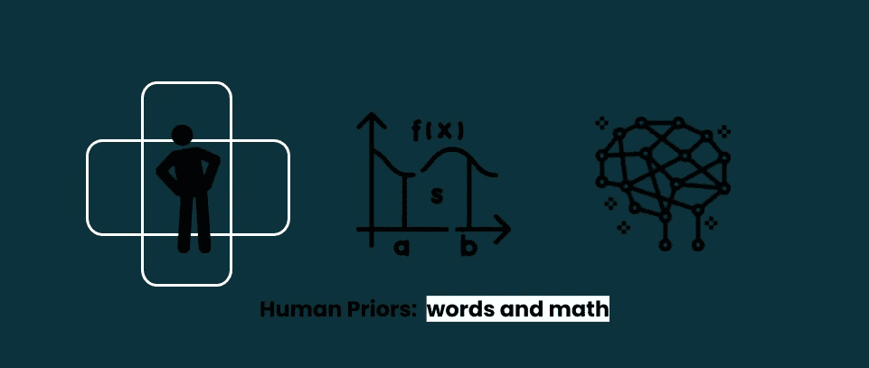

# 目标检测中的人类先验

> 原文：<https://towardsdatascience.com/human-priors-in-object-detection-5d1b6de42f82?source=collection_archive---------31----------------------->

作者图片

## *我们告诉人工智能的东西决定了它如何学习*

在我处理过的所有计算机视觉问题中，最具挑战性的是目标检测。这并不是因为问题本身很难理解或者表述不当(图 1)。而是因为我们需要注入一些强有力的先验知识，关于*我们认为*我们如何理解这个世界。

图 1:目标检测问题公式(图片由作者提供)

这意味着我们注入到人工智能设计中的先验越强，人工智能学习就越有偏见。请注意，我说的是人工智能学习过程中的偏见，而不是人工智能学习什么的偏见，那是一个完全不同的话题。好吧，那么什么是先验知识呢？

> 先验是一种“先验”知识，它表达了一个人在解决问题之前对问题的信念。

为了说明我所说的注入一些强先验是什么意思，让我们考虑物体检测中最广为人知的人类先验:锚*。*

## *锚作为先验*

*如果你在过去几年里一直从事物体检测工作，你可能听说过*锚*。从技术上讲，锚点是一组具有预定义纵横比和比例的*边界框*。所以基本上有两种类型的锚:*

*   *纵横比预定义锚点:具有预定义纵横比的边界框，例如 1:1、1:2、2:1 等。*
*   *缩放预定义的锚点:根据不同的缩放比例，如 x1、x2、x3 等，使用预定义大小的边界框。*

**

*图 2:锚点类型(图片由作者提供)*

*对象检测中的锚注入提出了以下过程。给定一个*【H，W】*的图像，将其拆分成一个*【Gh，Gw】*的网格。如果要预测的目标对象的中心落在网格的给定单元内，则该单元负责预测该对象。由于我们不知道目标对象的大小，我们用不同的比例和纵横比为每个单元格重叠*和*锚点。然后，具有与对象背景真值框更高的 [*IoU*](https://en.wikipedia.org/wiki/Jaccard_index) (更高重叠)的锚将是目标锚，AI 将基于该目标锚进行学习。*

*为了说明这一点，请考虑下面这张我的未婚妻凝视着群山的照片(也许是我不停说话的短暂休息)，其中:*

*   *地面真相是绿色的边界框。*
*   *负责预测地面实况的单元格是黄色网格单元格。*
*   *锚点是蓝色的边界框，它们对应于 2:1 和 1:2 的纵横比，两者的比例都是 1(基本比例是网格单元大小)。*

**

*图 3:阿尔卑斯山之旅，也是人工智能如何看待我的未婚妻*

*在这个例子中，AI 被告知开始从纵横比为 2:1(较高的重叠，IoU，具有基本事实框)的锚学习，并适应基本事实绿色框的大小。所以 AI 必须从 anchor 2:1 开始学习，学会缩小宽度和移动高度(红色箭头)。*

> *在图中，仅出于可视化的目的，示出了 2 个锚，但是实际上，根据网络的不同，每个单元网格有大约 12 个锚**:efficient det[[锚参数](https://github.com/xuannianz/EfficientDet/blob/master/utils/anchors.py#L8)[[锚计算](https://github.com/xuannianz/EfficientDet/blob/master/utils/anchors.py#L221) ]，YOLO [ [锚点](https://github.com/pjreddie/darknet/blob/master/cfg/yolov3-voc.cfg#L610)***

*让我们停下来想一想:这里到底发生了什么？有人可能会想，嗯，没什么不寻常的，我们只是告诉人工智能如何在图像中找到物体。我们知道物体有一些预定义的长宽比和比例，所以我们告诉 AI: *“嘿，学会在图像中找到物体！哦！顺便说一句，物体通常有 1:1、2:1、1:2 的长宽比，以及 x1、x2、x3 的比例，所以任何物体都应该接近这个比例”。**

*好吧，这似乎是一个很好的起点。我们都同意，总的来说那是真的。正因为如此，这是*之前的*支持锚方法。换句话说，锚点方法基于以下人类先验:一般来说，所有对象在合理的范围(x1，x2，x3…)内具有共同的纵横比(1:1，2:1，1:2…)。所以我们只是让人工智能知道这一点。*

*然而，如果我们详细回顾锚定或先前的注入过程，我们可以看到我们真正告诉人工智能的是:*“嘿，学会在图像中寻找物体！哦！顺便说一下，对象位于网格内，并以网格单元为中心……嗯，老实说，一个对象可以填充多个网格单元，但可以想象它只以一个单元为中心。好吧，也许不是居中，它更像是位于一个细胞中。但当然，对象的宽度和高度可以跨越其他单元格，顺便说一句，不要和对象所在的单元格混淆，因为只能有一个…话虽如此，但对象在合理的比例(x1，x2，x3…)内有共同的长宽比(1:1，2:1，1:2…)。希望一切都有意义，如果没有……好吧，你只要看看地面的真相就行了”。**

*现在看起来像是注射前的一吨重的复合物，不是吗？然而，这并不意味着这是一个坏方法。截至 2020 年，大多数物体检测研究都是基于这一先验。巨大成功的人工智能架构是基于锚:YOLOv3，RetinaNet，FPN，Efficient-Dets，MobileNets…但它仍然太复杂了，是的，这意味着更多的编码和调试时间。*

## *无锚前科*

*那么，对于物体检测先验，还有其他的选择吗？是的，他们是。人工智能社区正在考虑绕过这种方法。以下是一些例子:*

*   *CenterNet :提议忘掉网格，教人工智能只预测盒子坐标和类别概率。*
*   *[ExtremeNet](https://arxiv.org/abs/1901.08043) :建议教 AI 一个物体的极值点(这样就消除了物体应该被一个固定的 4 点框包围的先验)，允许任意复杂的包围盒。*
*   *[物体作为点](https://arxiv.org/abs/1904.07850):建议教导人工智能物体是具有一些额外属性的点(宽度、高度、类别概率……)。*
*   *变形金刚:它只是通过使用注意力机制强制变形金刚变成 CNN 来消除先验。*

*在这些要点中有一些非常创新的方法，但我仍然缺少一种直观的方法(类似人类的直观)来定义和注入先验。*

*似乎趋势是逐步消除前科。我的意思是不要摆脱前科。我认为先验是有用的:例如，CNN 建立在图像中像素与其他邻近像素相关(空间相关)的先验基础上，类似地，rnn 建立在时间相关先验基础上(对于视频和序列也是如此)。事实证明，拥有正确的优先顺序有助于加快训练速度(当然，还可以通过分担重量来节省空间！).*

*我的观点是我们应该重新思考如何定义这些前科。因为我们注入的先验直接决定了人工智能如何学习。换句话说，我们应该思考我们告诉 AI 学习的故事是什么，因为这个故事是它唯一知道的。*

*但是，我们怎样才能做到呢？*

## *反思前科*

*我建议开始用文字来思考先验知识(把数学留给后面)。对于给定的任务，即物体检测，我建议我们考虑任务本身的一般特征:“*我想定位物体，可以，但是，什么是物体？一般什么属性有对象？嗯，看起来它们位于图像中，并且它们可能具有不同的类型和形状”。*所以我们需要以某种方式告诉 AI，物体具有空间信息，也可能具有其他特征属性。*

*一旦我们清楚了这一点，我们就可以将这些文字转化为数学:我们可以用关键点、边界框、遮罩对空间信息进行编码…我们可以用额外的关键点/框属性或通过设置另一个遮罩通道来对额外的信息进行编码…*

*随着我们的地面真相被编码(无论如何),我们现在可以开始思考人工智能将如何学习它。这是整个过程的关键。在这里，我们必须发挥创造力。如果我们给 AI 讲一个很一般的故事:*“嘿在图像中找到物体！哦！对象有一个中心点和一些特征”，*人工智能可能无法学习或收敛(这相当于对我们所有的数据使用裸回归)。另一方面，如果我们变得太具体，就像在锚点方法中，我们可能会以一个过于复杂的过程结束。*

**

*图 4:编码为 2D 高斯分布的位置(图片由作者提供)*

*所以关键可能在于找到正确的平衡。例如，我特别喜欢在[对象中注入对象位置作为点](https://arxiv.org/abs/1904.07850)的方法。其中它被编码为以对象为中心的 2D 高斯分布，对于 *x* 和 *y* 【图 4】具有不同的 *σ* 。这就像告诉人工智能:“嘿，物体中心在这里，物体的其余部分应该靠近它”。我特别喜欢这种方法，因为我发现自己在看东西(我的笔记本电脑，现在)时也处于类似的位置。我的眼睛集中在屏幕文字上，我知道物体的形状。就像信息在 *grosso modo* 中一样。然而，要完全意识到我的笔记本电脑的形状，我必须将我的眼睛从文本上移开，看着物体的形状。*

*我认为我们需要更多这样的方法。数学遵循直觉，而不是相反。我说我们需要在如何编码我们的过去方面变得有创造性，关键是开始用语言思考。一旦我们有了单词，也只有到那时，我们才能把它们翻译成数学，并最终把数学输入到我们的人工智能中。*

*这样我们可以真正利用我们的*优势*而不会迷失在这个过程中。因为经常发生的情况是，我们做的数学计算编码了我们可能忽略的东西。*

*谢谢你读到这里！希望在你的头脑中有一些闪光的想法！如果你想了解我更多或者联系我这里有几个链接:[中](https://medium.com/@jvgd)、 [LinkedIn](https://www.linkedin.com/in/francisco-javier-vargas-garcia-donas/) 、[艾栈交流](https://ai.stackexchange.com/users/26882/jvgd)。*