# 人力资源分析——我们可以用 R 中的插入符号预测员工流动率吗？

> 原文：<https://towardsdatascience.com/human-resource-analytics-can-we-predict-employee-turnover-with-caret-in-r-3d871217e708?source=collection_archive---------6----------------------->

## [实践教程](https://towardsdatascience.com/tagged/hands-on-tutorials)

## 在中小企业(SME)上测试不同的机器学习算法，同时关注算法偏差


照片由[查尔斯先行者](https://unsplash.com/@charles_forerunner?utm_source=unsplash&utm_medium=referral&utm_content=creditCopyText)在 [Unsplash](https://unsplash.com/s/photos/business-decision?utm_source=unsplash&utm_medium=referral&utm_content=creditCopyText) 上拍摄

人是每个组织成功的关键因素——没有什么比在正确的时间和地点有技能的头脑产生更大的价值。这就是为什么世界各地的组织都在尽最大努力寻找，甚至更重要的是，留住有价值的人才。在一个数据的世界里，人力资源经理不再仅仅依靠他们的直觉来设计战略，以培养他们自己的高素质人才:他们利用分析来改善他们的人力资源实践，并使业务成功和员工满意度真正可以衡量。

在员工流失的情况下，预测分析的使用不仅被认为有利于员工，还可以节省公司的财务:当一名技术熟练的团队成员自愿离职时，总是会花费大量的时间和金钱来寻找和聘用合适的替代者。此外，它还会影响公司的整体生产率、客户忠诚度和产品的及时交付(Hammermann & Thiele，2019；Sexton 等人，2005 年)。在许多其他原因中，这是因为使用数据支持人力资源的想法产生了一个完整的领域:人力资源分析(也称为人员分析)是关于基于数据驱动的见解来改变招聘和留住人才的方式(Isson & Harriot，2016)。通过这种方式，数据分析被用于预测行为模式(例如，流失率、培训成本、生产率)，这些行为模式对于相应的管理层来说是固有的信息，因为它可以指导他们的决策过程。基于机器学习算法的成功实施，一些大公司已经应用预测分析来减少流失，增加盈利员工的保留率。例如，谷歌(前)人力资源高级副总裁认为，统计数据被用来完全自动化他们的求职面试问题——基于候选人的个人资料，并实际上使用员工数据来预测流动率(拉兹洛·博克，2016)。现在，作为数据爱好者，我们的任务是为人力资源经理的规划连续性提供支持，同时帮助他们降低与频繁流动相关的成本，并促进市场的成功增长。

> “人力资源分析(也称为人员分析)是基于数据驱动的洞察，改变招聘和留住人才的方式。”— 伊森&哈里奥特，2016 年

在 Google scholar 上快速搜索会发现，有一堆研究文章展示了不同的 ML 算法如何预测员工流动率。然而，焦点通常放在技术特征上(例如，模型性能、特征选择等。)而这些应用的实际环境或多或少取决于读者的理解。例如，赵及其同事评估了不同的监督机器学习技术，以在小型、中型和大型组织的模拟和真实人力资源数据集上预测员工离职(赵等人，2019)。这些机器学习算法用于从决策树和随机森林方法、梯度提升树、基于逻辑回归的极端梯度提升、支持向量机、神经网络、线性判别分析、朴素贝叶斯方法和 K 近邻来预测员工流动范围。

即使试图用现代分析来预测员工流动似乎有巨大的潜力，但也有一些限制，可能会使这些科学发现难以转化为行业的真实案例:

1.  预测或解释行为是两回事。

当处理数据时，我们可以推动以下任一策略:当我们的目标是预测相关结果时，我们不必完全理解起作用的机制(Yarkoni & Westfall，2017)。我们的策略将更侧重于预测。就我们的员工流动问题而言，当我们已经可以预测哪些员工有可能很快离开时，我们可能不想浪费太多时间绞尽脑汁地思考“为什么”——毕竟，我们改变某些事情的机会只存在于未来。一个好的机器学习模型不一定要基于理论才能做出准确的预测，因为它天生就会从数据中学习:当向数据生成过程输入新的观察结果(例如，新员工)时，算法会模仿数据生成过程的输出，而不会明确“知道”任何原因。

但是如果你有很强的学术背景，并且问了很多“为什么”的问题，你可能会说我们也想知道为什么员工会离开公司。如果我们对导致员工流失的潜在机制没有任何线索，那么设计有针对性的干预措施将会更加困难。幸运的是，有研究强调了定期加薪的重要性，商务旅行和工作满意度对员工流动的作用。这使我们更容易从组织内部找到真正的“痛点”，并真正理解是什么驱使我们去做。

2.**统计数据不足以处理个人问题。**

在我们生活的如此复杂的世界中，数据并不是一把神奇的钥匙，它可以帮助我们做出完美的、有效的决策，让每个人的生活更加轻松。尽管如此，当人们谈论他们使用数据来做出基于证据的决策时，这听起来是如此的酷和先进。但如果机器学习算法后来被应用于对单个员工的决策提供有力的信息(例如，当应用于对一组申请人的候选人进行排名时)，这种程序很容易就变得不道德。如果申请不正确，申请人不再作为一个人被单独评估，而是作为一个分数来评估他们在工作中表现良好的可能性。使用数据挖掘技术，历史和标记的员工数据可用于检测与高工作绩效相关的特征，以预测新员工在工作中表现良好的可能性(Mahmoud et al .，2019)。因此，其他人的绩效数据以及一些关键指标(如智商、性格测试、结构化面试结果)或他们的简历可作为预测新员工绩效的基础(Kluemper，Rosen & Mossholder，2012；Apatean，Szakacs & Tilca，2017，李，赖& Kao，2008)。因此，该算法使用过去的数据进行训练，以预测未来。尤其是在像工作申请这样的高风险背景下，这对我来说似乎是非常确定的，应该谨慎看待:该模型只能捕捉特定时刻的关联，即使它们会随着时间的推移在人与人之间以及组织的发展中动态变化。此外，算法通常还复制数据中固有的歧视性偏见(例如，女性可能预示着难以获得领导职位)，这使得模型在组织内的实际部署难以证明其合理性。为了避免员工的任何反作用，组织需要解决对某些群体或个人(如父母、黑人、孕妇等)的负面影响问题。)很认真。第一步是统计测量这些偏差，并纠正它们，以创建一个公平的人工智能，这对员工以及整个组织都有好处。你可以在安德鲁·伯特 2020 年发表在《哈佛商业评论》上的一篇文章中找到更多对抗歧视性偏见的想法。这个问题与组织对外部候选人的印象密切相关:候选人应该有合理的机会通过他们的实际技能和知识来说服团队，没有任何偏见或期望。如果将机器学习算法应用于招聘目的变得透明，那么仅凭一些已被证明是一些前辈成功因素的特征组合，就能找到工作，可能会让人感觉很奇怪。类似的想法也适用于员工流动的预测:即使有一组特征被认为是员工流失的关键驱动因素(上次加薪、商务旅行、人与工作的契合度、离家的距离等)。)，很明显，辞职的意图是高度个人化的。借助数据分析工具，我们只能从一群个体中描述一般模式。我们甚至可以根据这些普遍趋势来预测行为。但是我们永远无法确定它们是否适用于每个人。如果数据驱动的洞察可以影响人们的生活(例如，招聘决策、挽留努力……)，我们应该保持非常谨慎，并不断质疑我们程序的合理性。

3.使用分析并不能证明不道德的行为是正当的。

人工智能反乌托邦通常涉及机器做出道德敏感的决定，将计算机变成决策者。即使下面的例子远未达到这种情况，我们也应该意识到，即使数据可以为决策者提供合理的见解，但它们并不是决策者本身，应该在适当的数据保护和隐私准则下使用。当谈到将人力资源分析用于招聘目的时，有人建议让候选人有机会选择加入并控制他们的数据，方法是决定潜在雇主和招聘人员是否可以评估他们的数字足迹，以解决任何道德和法律问题(Chamorro-Premuzic 等人，2013 年)。另一个建议涉及到受人力资源分析工具影响的人的更多自主权:员工不应成为算法治理的被动接受者，而是有机会实际了解模型如何做出预测，并在需要时给出关键反馈。

我在文献中偶然发现的另一个令人毛骨悚然的应用包括使用 LinkedIn 或 Xing 等社交媒体档案，旨在基于情感分析预测候选人的性格——这两者都是为了评估候选人是否适合某份工作(Faliagka，2012)。所有上述程序肯定为研究人员和心理学家揭示了有趣的见解，但当数据正在处理的个人没有给予任何同意时，不应应用这些程序。

4.**工业中可用的员工数据集通常是嘈杂而稀疏的。**

如果预测是基于历史数据，我们总是需要问自己，这些是否真的可以推广到新的，但未知的观察。现在，即使模拟的人力资源数据看起来像是给任何热情的数据科学家的礼物，真实的人力资源数据通常是机密的、小的、不一致的并且包含缺失的信息。对于中型企业来说，并不是所有企业都能负担得起大规模数据存储，这使得以一致的方式存储员工数据变得更加困难。此外，它通常只包括一小部分实际上已经离开公司的员工，这使得班级(留下/离开)不平衡——这是一个在评估机器学习模型时需要特别注意的特征(但稍后会有更多介绍)。

另一个与数据相关的视角变化是指数据的质量与数量:Yahia、Hlel 和 Colomo-Palacious (2021 年)主张从大数据向他们所谓的“深度数据”转变，即包含实际预测营业额所需的所有必要特征的定性数据。事实上，大规模的员工数据对于中小型企业来说是不可用的，如果我们能够确定人员流动的关键驱动因素，也没有必要。文献中还有其他声音更进一步，提出大型非结构化数据集(通常称为“大数据”)并不总是更好，因为它们可能非常嘈杂，以至于“淹没”了每个模型的预测能力(Chamorro-Premuzic 等人，2013 年)。

这只是一个温和的提醒，以提高您对预测分析的力量及其对人们的影响的认识——我强烈推荐 Michele Loi 博士的这篇论文,他总结了在 GDPR 以上和以外部署人员分析工具的道德准则。记住这些政治问题，我们现在将通过一个小的案例研究来了解员工流失的预测是否可以合理地应用于一个来自著名的 IBM 员工数据集的小的虚拟样本。我很想知道它是否也能在现实世界中发挥作用！

# 数据概述—这是著名的 IBM HR 分析数据集

我们将在案例研究中使用的数据集是由 IBM Watson Analytics 创建的模拟数据集，可以在 [Kaggle](https://www.kaggle.com/pavansubhasht/ibm-hr-analytics-attrition-dataset) 上找到。它包含 1470 个雇员条目和 38 个共同特征(月收入、工作满意度、性别等)。)—其中之一是我们的目标变量(员工)流失(是/否)。让我们看看我们的原始数据。

> 声明:所有图片均由作者制作，除非另有说明。

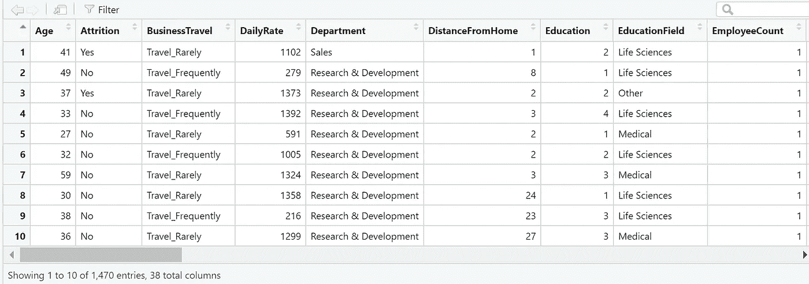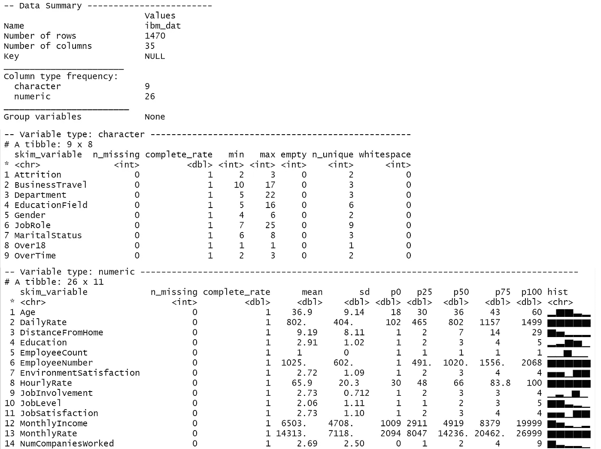

我们似乎有 26 个数字变量和 9 个字符变量，它们的层次不同。没有一个观察值丢失，skim 函数给出的总结显示了一些描述性的统计数据，包括平均值、标准偏差、百分位数以及直方图。我是 skim 函数的忠实粉丝——看看获得如此简洁而详细的数据概览是多么实用！

很明显，被视为不公平的报酬会影响一个人离开工作去寻找更好报酬的意图(Harden，Boakye & Ryan，2018；Sarkar，2018 年；布莱恩特与艾伦，2013)。这就是为什么我们想要创建另一个变量来表示每个员工月收入的支付竞争力——其背后的原因是员工可能会将他们的收入与从事相同工作水平的同龄人的收入进行比较。认为自己的报酬公平的人应该不太可能离开公司，相比之下，类似职位的人得到的报酬要少得多。为此，我们将使用 data.table 语法，首先按工作级别计算中位薪酬，并为每个观察结果存储适当的值。然后，我们将每个员工的月收入除以中位收入，得到他或她的薪酬比率:一个直接代表该员工根据工作级别预期获得的薪酬的指标。因此，分数为 1 意味着该员工与该职位的平均报酬完全匹配。得分为 1.2 意味着员工的工资比平均工资高 20%，得分为 0.8 意味着员工的工资比每个工作级别的正常工资低 20%。为了在阶乘层次上表示这一点，我们将赋值

*   至 0.75 和 1.25 之间的“平均值”
*   至 0 和 0.74 之间的“以下”
*   在 1.25 和 2 的补偿比范围内。

这就是我们新生成的功能在前 10 个观察结果中的样子:

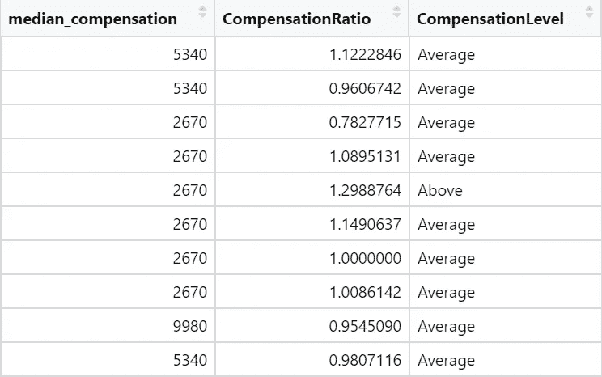

但实际还剩多少员工？让我们计算一下流失率，了解一下班级的分布情况。

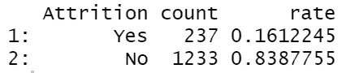

因此，似乎有 237 名员工(16%)在给定的时间内离开了公司，而大多数(近 84%)留在了公司。如上所述，许多人力资源经理无法访问包含数千名完整记录员工的庞大数据集。现在，如果我们想为一家拥有 50 至 250 名员工的中小型公司提供建议，该怎么办？我们还能训练最大似然算法来预测营业额吗？

为了创造一点额外的挑战，并模仿真实生活中的样本，模仿一家[中小型公司](https://data.oecd.org/entrepreneur/enterprises-by-business-size.htm#:~:text=In%20small%20and%20medium%2Dsized,employ%20250%20or%20more%20people.)，我们将从我们完整的 IBM Watson 数据集随机抽取 126 个观察结果。我会播下一颗种子，让它更容易被你复制。

# 员工流失——什么可能导致员工离职？

现在让我们仔细看看员工流失的两个关键因素之间的相互作用:工作满意度和薪酬。从文献中得出的一个典型假设是，更高的工作满意度与更低的员工流动可能性相关联——不快乐的员工通常有更多的理由离开，因为他们期望在其他地方更快乐，并且不会对当前的组织产生情感上的承诺，这使得一旦找到有吸引力的替代方案，就更有必要和更容易离开(Zimmermann，Swider & Boswell，2018)。

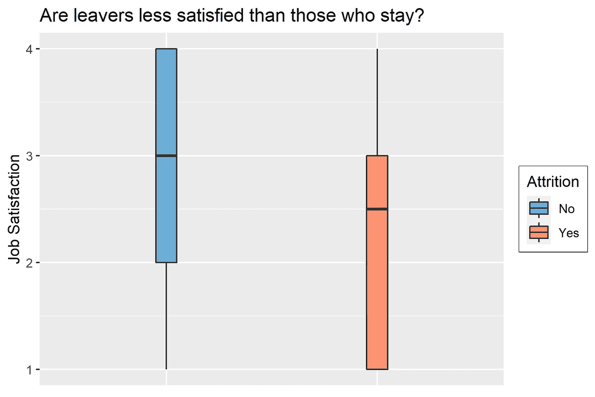

看起来数据总体上支持这一假设:即使分布的尾部表明一些留下来的员工实际上不满意，而一些离开的员工很高兴，但总体趋势表明，离开的员工实际上比我们样本中剩余的员工更不满意。

好吧——但是月收入和工作满意度的组合与员工流失有什么不同呢？更具体地说，收入较低会是那些对工作真正满意的员工离开的原因吗？

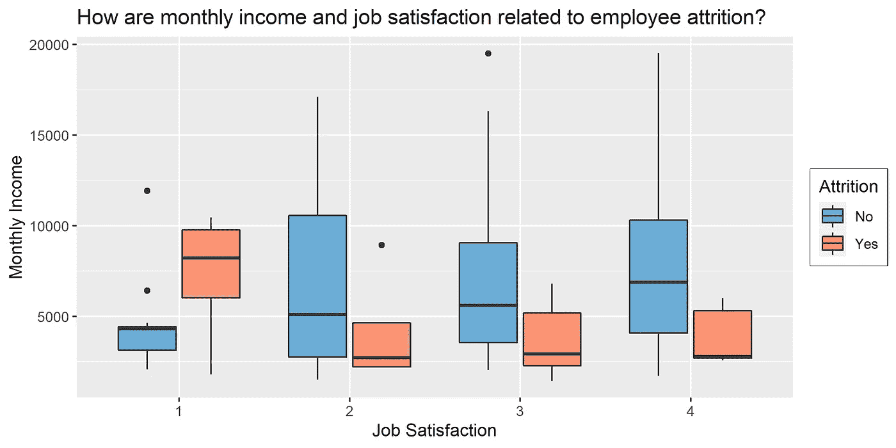

当然，我们无法完全确定收入或工作满意度与员工流失之间是否存在因果关系，但看看是否有任何关联的迹象仍然很有趣。令人惊讶的是，对于非常不满意的员工来说，月收入实际上比留下来的员工高。这表明，在员工对工作不满意的情况下，月收入本身并不能真正解释员工流动率——金钱不是一切！这与对薪酬的满意度只是一个硬币的一面的观察结果是一致的:要真正对自己的工作感到满意，员工不仅期望对自己的辛勤工作获得适当的报酬，还期望一系列有助于他们对工作总体满意的因素(例如，来自主管的非金钱支持、与优秀同事的良好关系、工作本身的成就感等)。)(齐默曼等人，2018)。有趣的是，对于更满意的员工来说，这种关系似乎是相反的:正如所料，留下来的人比离开的人工资高得多。我们在幸福阶梯上爬得越高，这种模式似乎就越明显:薪酬差距似乎随着工作满意度的每一级而线性增加。我们可以推测，越满意的员工有更多的资源投入到他们的工作中，使他们更能适应高压的工作要求(巴克&德默罗蒂，2007)。由于薪酬通常与绩效挂钩，这可能会导致两种情况:精力的提升可能会给一些员工带来适当的晋升，让他们更有动力留在当前的雇主身边。但如果他们没有得到任何更好的补偿作为回报，这可能会被视为不公平的，也是离开组织的另一个原因(Birtch，Chiang & Van Esch，2016)。不过，测试这个假设有点超出了本文的范围，并且很难测试这样一个不包含纵向信息的模拟数据集。

但我们可以说，薪酬肯定与员工的工作级别有关，因为经理自然比初级顾问挣得多。如果我们用之前创建的 CompensationRatio 变量交换 y 轴，这些关系成立吗？例如，中到高度满意的员工离职时的工资是否低于他们的工作级别所期望的水平？

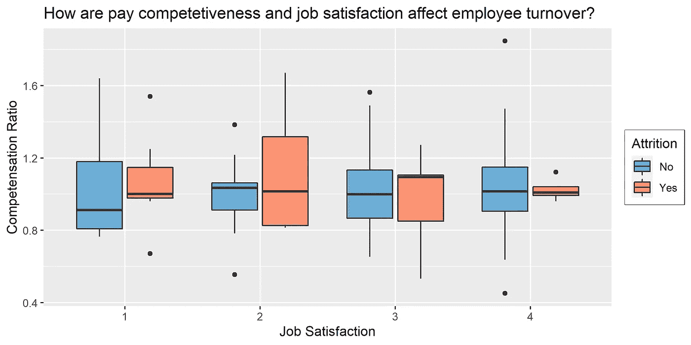

不完全是。平均而言，离职者的薪酬通常与同龄人持平，甚至更高。即使看起来不同程度的薪酬竞争力的范围在工作满意度量表的中间稍大一些，这表明已经离开的不太快乐的员工的薪酬竞争力可能会有很大的不同。但是我们应该小心谨慎，避免任何过早的解释:表现出中等程度工作满意度的员工可能比处于更极端水平(非常快乐/不快乐)的员工多得多。如果我们有更多的员工处于满意度分布的中间位置，那么每个级别的薪酬竞争力都被覆盖的可能性会更大，对吗？另一方面，如中心极限定理所述，较大的样本通常导致分布看起来更正态分布且更不平坦，而密度峰值在平均值附近。让我们计算一个快速的健全性检查，看看这如何适用于我们的示例:

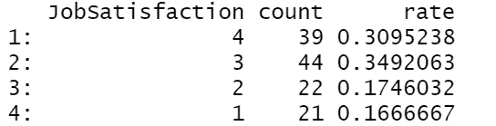

哇——在我们的样本中，满意的员工比不满意的员工多，因为他们约占观察结果的 65%。因此，在这种情况下，我们的第二种解释更有可能。乍一看，工作满意度和薪酬竞争力之间没有明显的交互作用，这可能会导致员工流失。

作为一名训练有素的心理学家，我对心理气候如何影响员工离职意愿的问题特别感兴趣。特别是对于建模部分，我们将使用由 Max Kuhn 和其他聪明的贡献者开发的分类和回归训练的缩写 [caret 包](https://cran.r-project.org/web/packages/caret/caret.pdf)。Caret 有一个很好的内置函数，可以快速了解我们感兴趣的特性。

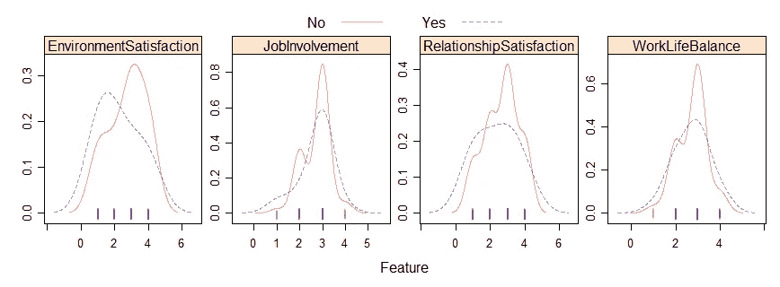

因为这些变量的等级本质上是有序的，所以密度图看起来很酷，但在这里可能不是理想的选择:曲线的峰度直接受到我们的阶级不平衡(少数人离开，许多人留下)的影响，这可能会产生误导，我们不希望在没有模式的地方产生幻觉。因此，让我们尝试另一种技术:马赛克图。

vcd 软件包中的 mosaic 函数用来测试样本中的频率是否是偶然产生的。这是通过在后台计算卡方检验来完成的。我们现在可以通过查看矩形的大小和颜色来分析结果:矩形的面积代表任何给定水平组合的病例比例，瓷砖的颜色表示变量之间的程度关系——颜色与灰色的偏差越大，我们就越必须质疑不同因子组合之间的统计独立性(如右侧的皮尔森残差标度所示)。通常，深蓝色代表随机发生的情况比预期的多，而深红色代表随机发生的情况比预期的少。

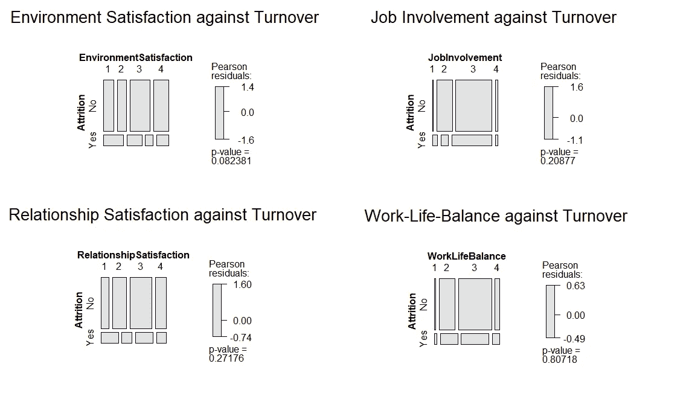

好的——在我们的例子中，每个瓦片都是灰色的，这表明没有严重偏离统计独立性。只有在环境满意度的情况下，我们才能知道离职者与其他人相比，是否对他们的工作环境过度不满意，正如我们从上面的特征图中得出的接近显著的 p 值和两种分布之间的变化所表明的那样。一个限制可能是镶嵌图函数可能不够敏感，不足以捕捉随机频率分布的轻微偏差-我们仍然有一个小样本量，通过我们尝试研究的分类水平的组合进一步细分。

# 特征预处理-为分析准备好数据并移除任何冗余

我们现在为实际的建模部分准备好数据集。作为第一步，我们将删除所有不太可能有任何预测能力的变量。例如，employee-ID 不能解释员工流动率的任何有意义的变化，因此现在应该在其他变量中删除它。其他示例包括与其他要素共享大量内容的变量，因此可能会导致多重共线性问题(例如，小时费率和月收入)。我们将通过同时适当地将所有字符串变量(例如，Department)转换为因子来保存缩减的数据集。

为了非常确定我们没有忽略任何高度相关的变量，我们将自动检测并删除它们。为此，我们首先识别任何数字变量，计算相关矩阵，并找出超过 0.5 的相关性。

因此，我们的代码确实标记了一些变量——我们应该仔细看看:“YearsAtCompany”、“JobLevel”、“MonthlyIncome”、“YearsInCurrentRole”和“PercentSalaryHike”。

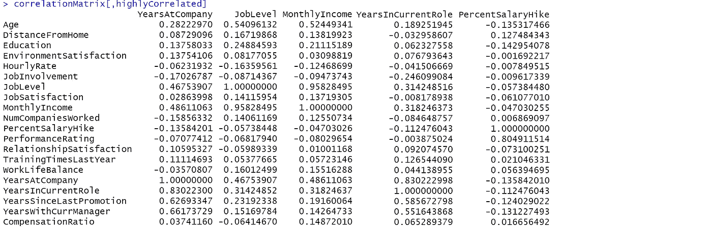

*   看来，YearsAtCompany 与 YearsInCurrentRole、YearsSinceLastPromotion 和 YearsWithCurrManager 高度相关。因此，只有一个与时间相关的变量可以保留:我建议保留“自上次晋升以来的年数”，因为这可以解释一些其他变量无法解释的额外差异:它不仅与员工进入公司以来的时间有关，还与没有晋升的年数有关。正如文献所表明的那样，经常因晋升而获得的定期加薪对防止人员流动起到了至关重要的保护作用(Das & Baruah，2013 年)。
*   工作级别与年龄和月收入高度相关:看似合理的是，年龄越大的员工，他们已经爬上职业阶梯的机会就越大，与前几年相比，他们的收入也显著增加。因为我们已经讨论了月收入的影响，我宁愿放弃工作级别和年龄，而不是我们的收入变量。
*   PercentSalaryHike 与绩效评级高度相关，因为出色的绩效会得到金钱奖励。

在分析了这些变量的相互关系后，让我们修改应该删除的变量列表，并创建一个包含所选变量的新数据框架:

为了让我们的机器学习算法发挥作用，我们需要将这些因素变量转换为虚拟变量。对于每个因素水平，我们将有一个单独的变量来表明相应的参与者是否属于这一类别(例如，一个很少旅行的人将得到 1 而不是 0)。首先，我们将检测除目标(损耗)之外的所有分类变量。然后，我们将利用 caret 的 dummyVars 函数，将其应用于我们的数据集，并创建一个全新的数据框架，其中包含我们选择的一组数值变量、虚拟变量和损耗(是/否)。请注意，插入符号函数 dummyVars 将变量转换为一组完整的虚拟变量，这意味着将覆盖所有因子级别，并且没有一个会被遗漏，这一过程不适用于输出总是与参考级别进行比较的线性模型(例如，如果我们想要比较女性对代表男性员工的截距的影响)。因此，我们的变量是一次性编码的。

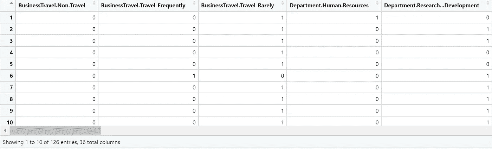

接下来，我们将使用 carets nearZeroVar 函数删除不提供任何预测值的变量。它适用于只有一个唯一值的预测值(即“零方差预测值”)。如果我们的所有员工都是经常出差的人，那么所有其他选项(很少出差或不出差)都是空白，这将在我们的统计模型中创建一个常数。它也适用于只有几个唯一值的预测值，这些值出现的频率非常低(例如，如果 100 个员工中有 1 个会离婚)。对于许多模型(基于树的模型除外)，这可能会导致模型崩溃或拟合不稳定。作为最后的预处理步骤，我们将确保我们已经正确地排序了目标的因子级别:我注意到在过去，caret 似乎只是将第一个级别作为正类(例如，是对否，赢对输等。)有时会“混淆”混淆矩阵，例如，特异性和敏感性很容易混淆。因此，我们希望通过明确指定“是”和“否”作为流失变量的因子级别，确保实际员工流动被视为正类。

# 智能建模—通过交叉验证处理小样本中的过度拟合

我们的最终数据集现在已经清理完毕，可以进行建模了。因为我们有一个小样本，我们可能会遇到这样的问题，即我们的模型过于适合特定于样本的数据，以至于我们不能在以后将其应用于新员工数据。这个问题通常被称为过度拟合——这种现象可以解释为什么我们有时无法再复制以前发现的效果。对于机器学习模型，我们经常将数据分成训练集和验证/测试集来克服这个问题。训练集用于训练模型，而验证/测试集用于根据从未见过的数据验证模型。如果我们将传统的 80/20 分割用于我们的用例，模型性能将在很大程度上取决于机会，因为每次算法随机选择 25 个人进行测试时，它都会有所不同。在我们的案例中，这个问题变得更加极端，因为我们有一个不平衡的类别:记住，只有大约 20%的员工离开了公司——这意味着我们的模型可能会在大约 5 名离职者和 20 名剩余者身上进行测试，这给我们留下了一个问题，即该算法是否会在不同的情况下表现相似。此外，如果我们通过查看预测准确性来评估模型性能，结果将很容易高估其实际性能，因为有许多积极的案例作为参考(例如，没有离职的员工)。你可以在这个有趣的 [Stackoverflow 讨论](https://www.researchgate.net/post/should_I_split_the_data_set_into_training_and_testing_or_use_K_cross-validation_for_the_whole_dateset_to_evaluate_the_classification_model)中找到更多关于如何从一个小的不平衡数据集中分割数据的问题。幸运的是，我们有统计工具箱里的东西:各种拆分的交叉验证。我们将把我们训练好的模型应用于一组新的观察值，并反复调整参数以减少预测误差。对于这些“新观察值”，我们甚至不需要新的样本:我们将通过将模型训练为一组观察值来回收数据集，并使用另一部分数据来测试模型性能。我们将重复 5 次，并对测试性能进行平均，以获得对我们模型性能的最终评估——一种称为 5 重交叉验证的技术。因此，我们可以利用我们所有的数据，同时仍然在“新”案例上测试模型。

# 用于相同目的的不同 ML 模型

现在，我们将设置一个可重用的列车控制对象，以使用相同的设置来构建我们的机器学习模型:重复的交叉验证确保我们运行我们的 5 重交叉验证过程 5 次。此外，我们要求 caret 为我们提供模型输出中的类概率以及最终预测，我们希望看到我们建模过程的进展(verbose = True)。我们将使用 caret 的内置超参数搜索及其标准设置。

我们将相互测试的模型如下:

**逻辑回归:**这是一种广泛使用的传统分类算法，基于统计学课程中的线性回归，最初由 Cox 于 1958 年提出。主要预测输出是观测值属于某个类别的估计概率。基于概率值，模型创建将输入空间分成两个区域的线性边界(例如，更可能是或更可能不是)。

**随机森林**:基本决策树是以树状方式构建的可解释模型:分支是特征的组合，树叶是感兴趣的类别标签(例如是或否)。随机森林通过结合所有多个弱学习者的力量来进行集体预测，使我们比基本决策树具有优势。这使得比简单的决策树更健壮，因为最终的预测不是由几个有影响的预测者主导的。

【极端梯度推进 (XGB):这种建模技术是陈(2014)介绍的另一种基于树的方法，该方法基于梯度推进树，梯度推进树是 Friedman 在 2001 年提出的用于回归和分类目的的集成机器学习方法。一个关键的特征是它们按顺序学习——每一棵树都试图纠正前一棵树的错误，直到无法实现进一步的改进。与梯度提升树相比，XGB 通常被描述为更快、更可扩展和更高效的技术版本。

GLMnet :这是 glm 模型的一个非常灵活、高效的扩展，在 [R](https://glmnet.stanford.edu/articles/glmnet.html) 中得到了很好的实现。它使用惩罚最大似然估计来拟合广义线性模型，并因此通过使用套索或弹性净惩罚项来减少常见回归模型(例如，基本逻辑或线性回归)中已知的过拟合。众所周知，它能够很好地处理小样本，更喜欢简单而不是过于复杂的模型，以及内置的变量选择。

**朴素贝叶斯**:该模型使用著名的贝叶斯定理，因为它基于相关特征的先验知识来估计事件的发生概率。分类器首先学习其输入的联合概率分布，并基于给定的每个相应特征组合的最大后验概率产生输出(例如，是或否)。

# 类别不平衡的作用—选择适当的精确度指标进行优化

因为我们有不平衡的样本(留下的比留下的多)，我们稍后不会准确地评估模型的性能。由于准确性是所有案例中正确分类的案例的比例，所以即使算法简单地将所有案例分类为多数类(例如，否)，给我们高分也不是什么大事。如果我们有更多对我们同样重要的平均分布的类，这是一个更合适的度量。但在这种情况下，我们实际上是关于积极的情况:你可以说，如果一个人真的留下来了，没有正确识别离开者(例如，敏感度或真阳性率)比意外预测该员工会离开(假阳性率或 1-特异性)更有害。因此，我想使用 F1 分数作为培训优化的准确性指标，因为它对正确分类积极案例(例如，员工流失)更加重要，对严重不平衡的数据集更有意义。

**F1-得分**是精确度和召回率的调和平均值:

**精度**是正确分类的阳性案例的数量除以所有阳性预测的数量(包括假阳性，例如，被确定为离职者但没有去的员工)。也叫阳性预测值。

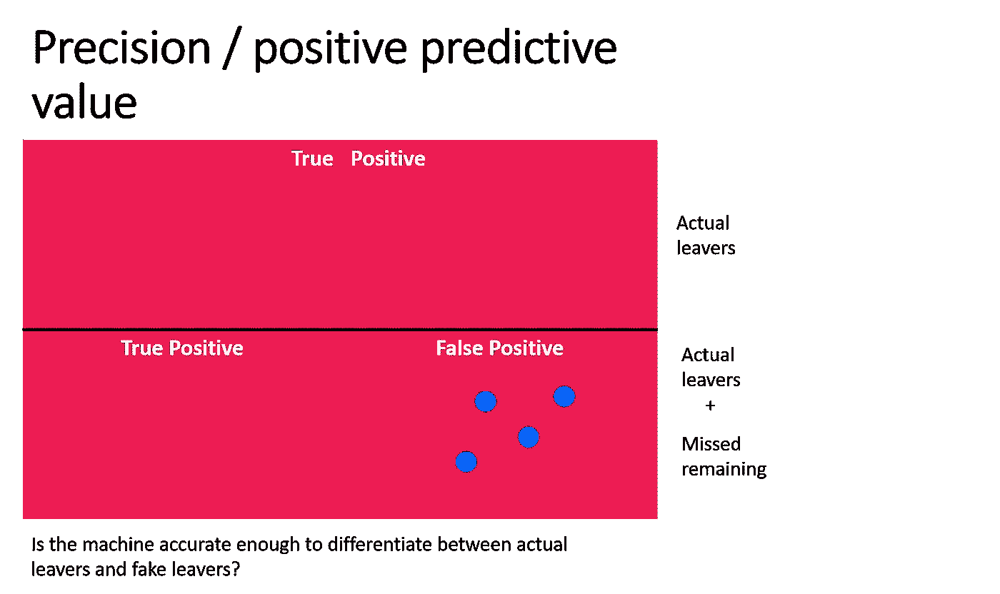

**另一方面，召回**是真实阳性病例的数量除以应该被识别为阳性的所有样本的数量(例如，所有实际离开者，即使不是所有都被正确识别)。在二进制分类用例中，它也被称为敏感度。如果您还没有得到它，不要担心，它没有简单的准确性度量那么直观。我希望我的想象能帮助你理解它。总之，F1 分数与算法正确检测阳性病例的能力相关。

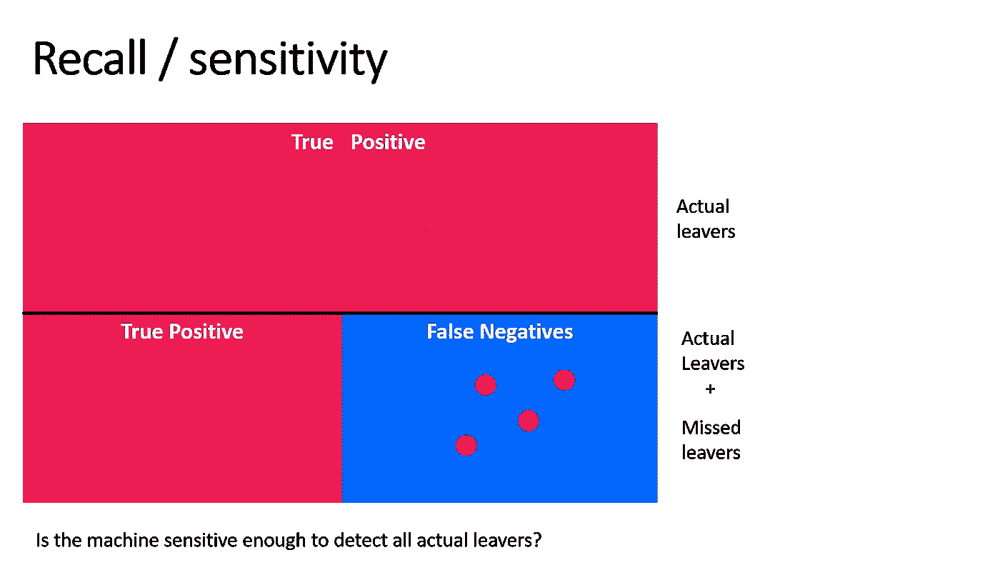

因为 caret 没有直接提供 f1 指标作为我们 train 函数的选项，我们将使用在 [Stackoverflow](https://stackoverflow.com/questions/47820750/training-model-in-caret-using-f1-metric) 上找到的 DIY 代码。您可以在此找到更多关于精确度指标[的信息。顺便说一句，解释其他不是我们达到的 F1 分数是否“足够好”并不容易，因为它](https://ncss-wpengine.netdna-ssl.com/wp-content/themes/ncss/pdf/Procedures/NCSS/One_ROC_Curve_and_Cutoff_Analysis.pdf)[很大程度上取决于我们样本](https://inside.getyourguide.com/blog/2020/9/30/what-makes-a-good-f1-score)中真正阳性案例的数量。因此，我们稍后将寻找我们在相同数据上获得的最高 F1 分数的模型。

## 决赛模型竞赛——让我们的机器学习算法来比赛吧！

为了有一个好的基线模型与其他模型进行比较，我们将创建一个逻辑回归模型:基于我们之前创建的可视化和心理学文献中的理论，我们假设较高的工作满意度可以防止员工流失。此外，我们假设月收入越低，员工离开公司以获得更高报酬的可能性就越大。此外，我们认为月收入对员工流动的影响会随着工作满意度的提高而放大。对于所有其他模型，我们将把之前选择的所有变量都扔进去，不再做进一步的理论预测。这样，我们可以看到是否给我们一个预测优势。

但是，在我们深入实际的模型比较之前，让我们看看我们的基线模型是否能够真正解释初级阶段的员工流失。

```
model_baseline
summary(model_baseline)
```

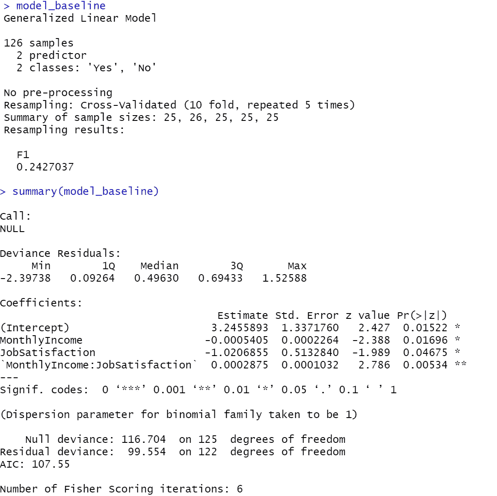

正如我们的假设所预测的，我们可以看到，模型的估计表明，员工离开公司的可能性随着每月收入每增加一美元和工作满意度每增加一个级别而略有下降。请注意，这些估计值不能直接解释，因为它们是以符合我们的逻辑回归公式的对数优势率来衡量的。互动项(月收入和工作满意度的组合)也变得具有统计学意义(p< .001).

Can the other models with a larger set of predictors do a better job predicting employee turnover in our small sample? Let’s find it out. We will first make a list of all our model objects (random forest, glmnet etc.) and name them for future reference. Then we will use the resamples-function from caret to plot the models’ performance against each. It will give us the range of F1 values across all 5 folds, making it possible to select the model with the highest average performance.

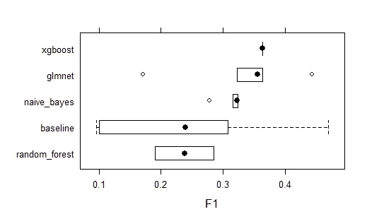

## *……赢家是:XGBoost！*

在正确分类离职者的能力方面，XGBoost 似乎优于所有其他模型，并在所有折叠中表现出相当稳健的性能。我们的基线模型根据用于测试的折叠显示了相当可变的模型性能，使得它看起来有点不稳定。然而，我们在这里通过比较苹果和香蕉做了一些不公平的比较:对于我们的基本模型，我们使用了一个理论上似乎合理的公式，同时我们将所有的候选变量放入其他模型中。在这些情况下，我们试图用一切来预测员工流失。这使得很难判断随机森林算法的模型性能是由于过于复杂的公式还是由于模型本身的种类。我甚至可以想象，一个更简单的模型对我们的情况可能是有益的，因为我们没有足够的观察来证明在我们的模型中使用如此大的一组预测因子。正如 Yarkoni 和 Westfall (2017 年)所指出的，一小组预测值应用于许多观测值的机会越高，过度拟合的可能性就越小，表现为较低的 n/p 比(样本大小与预测值之比)。然而，如果我们有一个小数据集和许多参数，这些参数对结果 X 的贡献都很小，就像在我们的第一轮建模中一样，我们就越有可能获得大的预测误差，并且训练集和测试集之间的性能差距将会很大。

因此，我们将通过演示如果您让 caret 用工作满意度、月收入以及所有模型的这些指标的组合来预测员工流失率会发生什么，来进行更公平的比较:

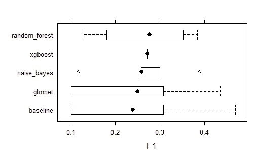

现在，随机森林似乎不再显示最差的性能，但 XGB 似乎再次成为我们的赢家。有趣的是，F1 分数包含非常相似的值，就像我们的复杂模型一样，这表明一个更加节俭的模型比过于复杂的模型更可取。让我们看看混淆矩阵是否能告诉我们更多关于 XGB 性能的信息，包括与基线模型相比的简单模型公式。提醒一下，这就是这样一个混乱矩阵如何转化为我们的问题。

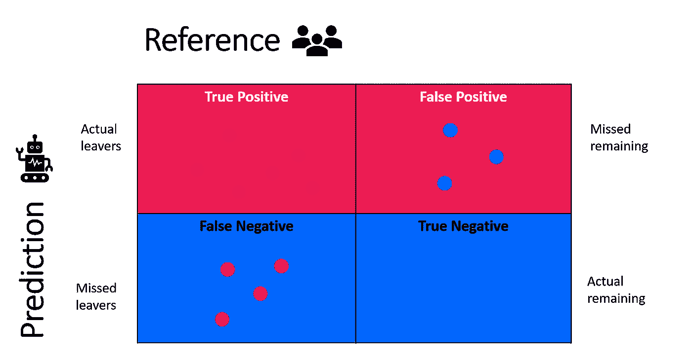

## 我们基线模型的准确性度量

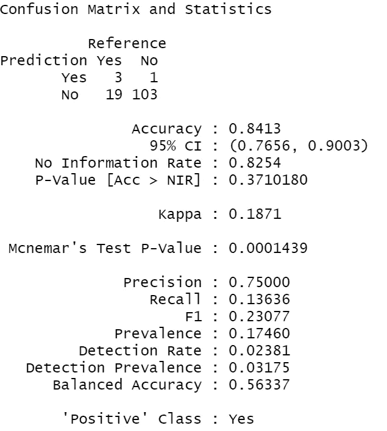

我们基线模型的准确性度量

## 我们的 XGBoost 模型的准确性度量

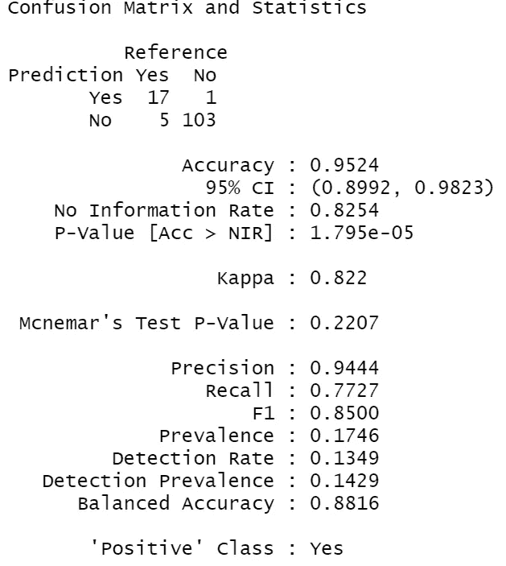

XGBoost 模型的精度指标

哇——直接比较表明，XGBoost 在预测员工流失方面比我们的基线模型好得多！通过查看原始的混淆矩阵，我们可以看到 XGBoost 正确地识别了 22 个离开者中的 17 个，而基线模型只识别了其中的 3 个。我们的 winner 模型的精确度非常高(0.94)，这意味着它没有混淆真实离职者和虚假离职者(误报，即实际上没有离开公司但留下来的员工)。另一方面，基线模型仅预测了 4 个阳性病例，其中 3 个是正确的，导致 0.75 的相当差的精度。对于其他指标，正确检测员工流失的能力变得更加明显:因为 XGBoost 算法也错过了 5 个真正的阳性案例，并错误地将它们标记为阴性，所以召回率不是非常高，但仍然可以接受(0.77)。提醒一下，回忆是真实阳性病例的数量除以应该被识别为阳性的所有样本的数量(例如，所有实际离开者，即使不是所有都被正确识别)，也称为敏感度。相比之下，基线模型不够敏感，无法找出真正的离职者，并意外地将其中的大多数人标记为剩余员工。

底部的平衡准确度分数也反映了绩效差距，它代表了相应模型的特异性和敏感性之间的平衡，表明我们的基线模型在正确识别忠诚员工方面表现不佳。除 F1 分数外，平衡精度被认为是不平衡样本中[模型精度的更好代表](https://statisticaloddsandends.wordpress.com/2020/01/23/what-is-balanced-accuracy/amp/)。

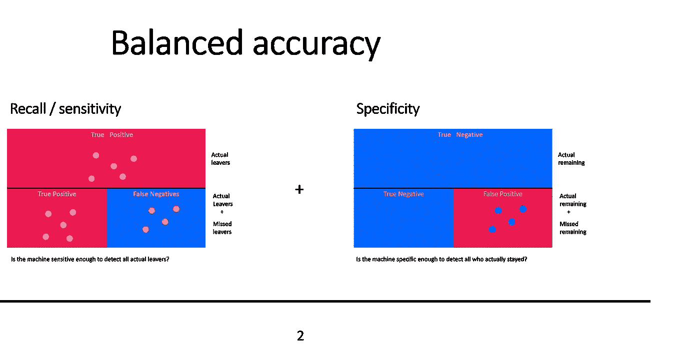

总而言之，XGBoost 似乎比简单的广义线性模型更具预测优势，即使我们保持预测因子不变。

# 离职风险？制定数据驱动的保留策略

下一步，我们希望实际使用该模型来提高我们小公司的保留率。为此，我们将首先获得仍然活跃的员工的指数，并根据我们的模型预测这些员工离职的可能性。然后我们将保存这些概率以及实际的员工数据。最后，我们将找出离职风险最高的前 5 名员工。为了给公司一个介入的机会，这些人可能是应该首先招募的，以了解他们需要什么来变得更快乐，以及他们希望未来如何发展。这样，我们就有希望解决任何自愿离职的问题。最后，我们将向经理们提供一份完整的员工名单，按照离职风险排序——毕竟，让员工有机会摆脱可能改善工作氛围的建设性反馈是件好事。

# 从我的错误中吸取教训——我还没有告诉你的…

*   **不要使用 tibbles 进行建模**

在我发现 data.table 语法的美妙之处之前，我曾经使用过 tibbles，因为我认为%>%运算符是一个非常直观的工具。不幸的是，caret 只接受数据帧(或 data.tables ),而不接受 tibbles，我花了很长时间才弄明白为什么我的代码不能运行。直到我发现了[在 github](https://github.com/topepo/caret/issues/611) 上的这个评论，并把整个数据争论部分改成了类似 DT 的结构。确保在使用 caret 建模之前将 tibbles 转换为经典数据帧，或者首先不要使用 dplyr 语法。

*   **合适的精度度量带来如此巨大的差异**

此外，我首先使用 AUC ROC 分数作为优化的指标，然后发现它也可以与其他指标(例如 F1 分数)一起使用。这导致了一个可怕的模型性能，敏感性得分低于 0.1-算法没有真正检测到积极的情况(例如，实际的员工流失)，这可能是由于我们严重不平衡的数据集造成的。正如之前预测的那样，模型摘要仍然显示了可接受的准确性分数，因为对于模型来说，识别那些留下来的人并不是一件大事，因为大多数员工无论如何都不会流失。使用更合适的优化指标确实改变了游戏规则，极大地提高了模型性能。

*   **我们的结果具有高度的样本特异性**

在我为从原始 IBM HR analytics 数据集抽取随机样本时的复制目的设置种子之前，我意识到样本与样本之间的结果会有很大不同。对于环境或关系满意度等心理变量来说尤其如此。即使这对您来说听起来有点显而易见，但请思考这对于您没有任何更大的数据集可供从中提取子集的情况意味着什么:您对数据生成过程的解释(例如，哪些因素可以解释员工流动)会有很大的偏差，但由于缺乏数据，您还没有任何机会验证它。在我们有机会在更大的人群中证明之前，这应该使我们在对自然界的一般模式得出初步结论时小心谨慎。此外，请记住，数据集是虚构的，因为它不包含真实的人力资源员工数据，所以它不应该被用作回答真正科学问题的单一来源。

# 是时候深入思考了——我们能在小样本中预测员工流动率吗？


照片由[克雷格·任](https://unsplash.com/@craig1901?utm_source=unsplash&utm_medium=referral&utm_content=creditCopyText)在 [Unsplash](https://unsplash.com/s/photos/business?utm_source=unsplash&utm_medium=referral&utm_content=creditCopyText) 上拍摄

从技术角度来看，我认为我们确实可以利用机器学习来预测员工离职，即使是在小样本中，如果你有一个完整的高质量的数据集。此外，我们已经看到，当涉及到预测器的数量时，一个更简单、更节俭的模型至少可以与一个复杂的模型表现得一样好。然而，机器学习模型的类型会对我们预测的准确性产生巨大的影响。从更广泛的角度来看，我们需要意识到这样一个事实，即我们似乎不可避免地会捕捉到某种程度的特定于样本的错误，而这种错误不会推广到新员工。因此，不建议让算法独自决定人们的工作和生活——作为人类，作为数据科学家、经理或人力资源专家，我们需要为在我们监督下做出的决定负责。

有几种方法可以增加我们的数据驱动方法对外部各方的透明度:如果我们在评估数据之前没有强有力的假设，明确声明我们的工作在本质上是探索性的可能是有帮助的，因为我们的解释有些事后性，因此可能有偏见。这个限制也适用于我们的方法，因为我们在指定我们的模型公式之前检查了驱动员工流动的潜在心理原因。在一天结束时，利用两个世界可能是最有成效的:调查数据背后的根源和原因，拓宽我们对数据中我们实际上并没有首先假设的模式的看法，并总是测试模型预测样本外行为的能力，以最小化过度拟合。因此，结合一定程度的理论灵活性和对数据的仔细解读，我们可以做出良好合理的预测。

当你真正考虑在你的组织中部署人力资源分析工具时，该模型的最终用户需要了解它的好处和局限性:即使我们理解增加流动可能性的共同根源，人和组织仍然是非常独特的——离开的原因也是如此。因此，导致频繁离职的个人和实际原因可能会因公司而异，甚至会随着时间的推移而变化。因此，当一个预测模型被应用时，在它已经过时并犯下严重错误之前，必须不断地对它进行评估。我是数据驱动技术的超级粉丝，如果我们深思熟虑地使用它们，机器学习技术可以成为一个强大的工具，来永远改善工作场所。但如果我们机械地使用它，它很容易成为危险的黑盒人工智能批评者担心，我们的社会不应该以此为目标。所以，让我们保持对数据的关注。

# 参考

[1] A. Hammermann & C. Thiele， [*人物分析:evidentizbasiert Entscheidungsfindung im personal management*](https://www.econstor.eu/handle/10419/204564)*(2019)，(№35/2019)，IW-报告。*

*[2] R. S. Sexton，S. McMurtrey，J. O. Michalopoulos & A. M .，[员工流动:一种神经网络解决方案](https://www.sciencedirect.com/science/article/abs/pii/S0305054804001534) (2005)，*计算机&运筹学*， *32* (10)，2635–2651。*

*[3] J. P. Isson & J. S. Harriott， [*大数据时代的人物分析:改变你吸引、获取、发展和留住人才的方式*](https://books.google.de/books?hl=de&lr=&id=bNc9CgAAQBAJ&oi=fnd&pg=PR11&dq=Amazon.fr%3FPeople+Analytics+in+the+era+of+big+Data:+Changing+the+way+you+Attract,+Acquire,+Develop,+and+Retain+Talent%3FJean+Paul+Isson%3FLivres.+Accessed:+Dec.+15,+2019.+%5BOnline%5D.+Available:+https://www.amazon.fr/People-Analytics-Era-Big-Data/dp/1119050782&ots=MRMsT0vxaC&sig=EjEfKs6vPXJHsgst0EixbT0X4W8#v=onepage&q&f=false) (2016)，John Wiley & Sons。*

*[4] L .博克， [*工作规则！:谷歌的艺术和思维，我们的生活和工作。*](https://books.google.de/books?hl=de&lr=&id=8uahCwAAQBAJ&oi=fnd&pg=PT6&dq=laszlo+bock+work+rules&ots=EiY3dXVmy0&sig=V86O_4OWZE7gPGht01v2I0NCbwQ#v=onepage&q=laszlo%20bock%20work%20rules&f=false) (2016) *，*瓦伦。*

*[5] Y. Zhao，M. K. Hryniewicki，F. Cheng，B. Fu & X. Zhu，[用机器学习进行员工离职预测:一种可靠的方法](https://www.researchgate.net/profile/Yue-Zhao-70/publication/328772915_Employee_Turnover_Prediction_with_Machine_Learning_A_Reliable_Approach/links/5dec49f34585159aa46ba991/Employee-Turnover-Prediction-with-Machine-Learning-A-Reliable-Approach.pdf) (2018)，载于*SAI 智能系统会议论文集*(第 737–758 页)。斯普林格，查姆。*

*[6] T. Yarkoni & J. Westfall，[《在心理学中选择预测而非解释:机器学习的教训》](https://journals.sagepub.com/doi/pdf/10.1177/1745691617693393?casa_token=AV3SAc6GoowAAAAA:NTM2R35rP4dmDMVO9D49TUVcuYHmSSDLa8z2CVxEgX-AJQqd3l_-WmbDlXeq7d-WyEC419FCG-iP) (2017)，*心理科学视角*， *12* (6)，1100–1122。*

*[7] A. A. Mahmoud，T. A. Shawabkeh，W. A. Salameh & I. Al Amro，[使用机器学习进行招聘流程和绩效评估中的绩效预测](https://www.careerskeen.com/pdf/Performance%20Predicting%20in%20Hiring%20Process%20and%20Performance%20Appraisals%20Using%20Machine%20Learning.pdf) (2019)，载于 *2019 年第十届国际信息与通信系统会议(ICICS)* (第 110–115 页)。IEEE。*

*[8] D. H. Kluemper，P. A. Rosen & K. W. Mossholder，[社交网络网站、个性评级和组织环境:比看上去的更多？](https://onlinelibrary.wiley.com/doi/pdf/10.1111/j.1559-1816.2011.00881.x?casa_token=W89hYUINtHsAAAAA:j3PDILtRuETLU7_OFFyKXH9ia5uBMvd_NUArK9UvoWLlIUuSmP_RD8nCDQy4X0n-BS68gHesBmODSHg)(2012)1。*应用社会心理学杂志*， *42* (5)，1143–1172。*

*[9] A. Apatean，E. Szakacs & M. Tilca，[基于机器学习的人员招聘应用](http://users.utcluj.ro/~atn/papers/ATN_4_2017_4.pdf) (2017)，*Napo censis Technica*， *58* (4)，16–21。*

*[10]李延明，赖超英，高春平，[将人格特质与支持向量机结合以获得人员招聘的素质匹配](http://iebi.nctu.edu.tw/publications/cyl/INCORPORATE%20PERSONALITY%20TRAIT%20WITH%20SUPPORT%20VECTOR%20MACHINE%20TO%20ACQUIRE%20QUALITY%20MATCHING%20OF%20PERSONNEL%20RECRUITMENT.pdf) (2008)，载于*第四届国际商务与信息会议*(第 1-11 页)。*

*[11] T. Chamorro-Premuzic，D. Winsborough，R. A. Sherman 和 R. Hogan，[新人才信号:闪亮的新物体或勇敢的新世界](https://discovery.ucl.ac.uk/id/eprint/1528182/1/Chamorro-Premuzic_New_Talent_Signals_ChamorroPremuzic_submitted.pdf) (2013)，Ind .风琴。心理学。透视。Sci。实践。, 53:1689–1699.*

*[12] E. Faliagka，K. Ramantas，A. Tsakalidis & G. Tzimas，[将机器学习算法应用于在线招聘系统](http://citeseerx.ist.psu.edu/viewdoc/download?doi=10.1.1.885.909&rep=rep1&type=pdf) (2012)，载于 *Proc .互联网和网络应用及服务国际会议*(第 215-220 页)。*

*[13] M. Loi，[民智必须造福于民。人力资源管理中数据驱动算法系统的伦理分析](https://algorithmwatch.org/de/wp-content/uploads/2020/03/AlgorithmWatch_AutoHR_Study_Ethics_Loi_2020.pdf) (2020 年)*算法观察*。*

*[14] N. B. Yahia，J. Hlel & R. Colomo-Palacios，[从大数据到深度数据支持人员分析进行员工流失预测](https://ieeexplore.ieee.org/stamp/stamp.jsp?tp=&arnumber=9409047) (2021)， *IEEE Access* ， *9* ，60447–60458。*

*[15] G. Harden，K. G. Boakye & S. Ryan，[技术专业人员的离职意向:一个社会交换理论的视角](https://www.tandfonline.com/doi/pdf/10.1080/08874417.2016.1236356?casa_token=W_ePRsglt_0AAAAA:Lck6e2Lk8CdIIi_HztsLzMIV0LQvTnlrwipTiv2yiOKuSmjT3SYiQojvuWEf8hKJiwLj8wde9EiF) (2018)，*计算机信息系统杂志*， *58* (4)，291–300。*

*[16] J. Sarkar，[薪酬与离职挂钩:回顾与未来方向](https://www.researchgate.net/profile/Jeeta-Sarkar/publication/348690823_Linking_Compensation_and_Turnover_Retrospection_and_Future_Directions_Linking_Compensation_and_Turnover_Retrospection_and_Future_Directions/links/600b23c592851c13fe2d75f5/Linking-Compensation-and-Turnover-Retrospection-and-Future-Directions-Linking-Compensation-and-Turnover-Retrospection-and-Future-Directions.pdf) (2018)， *IUP 组织行为学杂志*， *17* (1)。*

*[17] P.C. Bryant & D. G. Allen，[薪酬、福利与员工流失:留住顶尖人才的人力资源战略](https://journals.sagepub.com/doi/full/10.1177/0886368713494342?casa_token=InXgPJ_OiJ4AAAAA:F5OHa6iN1k_EcxY3Po0NH9wCjzPNLJYr5VzscGQvSdJh1Hxfy7MN8uomtuoulZ4Ail-Wx6pqGZh0) (2013)，*薪酬&福利回顾*， *45* (3)，171–175。*

*[18] R. D. Zimmerman，B. W. Swider & W. R. Boswell，[员工离职内容模型综合](https://onlinelibrary.wiley.com/doi/full/10.1002/hrm.21938?casa_token=TW6DjFd62iwAAAAA%3AXNb9kHyGQFFJjki5UTWOaIBe1PJjAypJRfYyIO8rQqcPFx2FeyLFjmaYb2VTH18MYtZ__XXkcZlx8PI) (2019)，*人力资源管理*， *58* (1)，99–114。*

*[19] A. B. Bakker & E. Demerouti，[工作需求‐资源模型:最先进水平](https://files.transtutors.com/cdn/uploadassignments/3087042_4_jod-demand-resources--2007-.pdf) (2007)，*管理心理学杂志*。*

*[20] T. A，Birtch，F. F. Chiang & E. Van Esch，[一个理解工作特征-工作结果关系的社会交换理论框架:心理契约履行的中介作用。](https://www.tandfonline.com/doi/pdf/10.1080/09585192.2015.1069752?casa_token=pTqaMnniLCEAAAAA:vHD-0eg3XNslHkORCo1dDmRyaYVaM_zqp53u4TYwfC573qNd13F-oJ38_HyxV2vEC3NI4cSz0CQ1) (2016)，*《国际人力资源管理杂志》*， *27* (11)，1217–1236。*

*[21] M .库恩、j .温、s .韦斯顿、a .威廉斯、c .基弗、a .恩格尔哈特。，… & M. Benesty，[包'脱字'](https://cran.r-project.org/web/packages/caret/caret.pdf) (2020)，*R 刊*， *223* 。*

*[22] B. L. Das & M. Baruah，员工保留:文献综述(2013)，*商业与管理杂志*， *14* (2)，8–16。*

*[23] T. Chen & Guestrin， [Xgboost:一个可扩展的树提升系统](https://dl.acm.org/doi/abs/10.1145/2939672.2939785) (2016)，载于第 22 届 acm sigkdd 知识发现和数据挖掘国际会议的*会议录*(第 785–794 页)。*