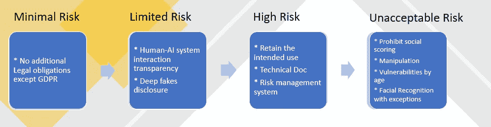
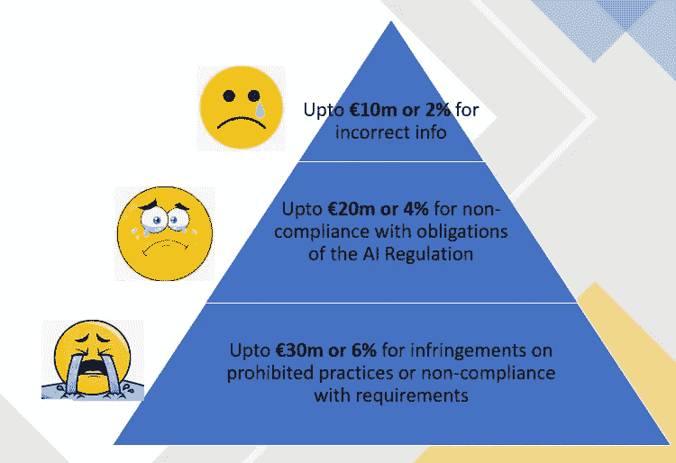

# 人类与机器

> 原文：<https://towardsdatascience.com/humans-with-vs-machines-a76dbd51161e?source=collection_archive---------32----------------------->

## 一个受监管的人工智能行业如何才能导致良好的人机关系

安德烈·德·森蒂斯峰在 [Unsplash](https://unsplash.com/s/photos/good-and-bad-robot?utm_source=unsplash&utm_medium=referral&utm_content=creditCopyText) 上拍摄的照片

> 所以我们向你们保证，他们永远，永远，永远不会变得邪恶——“米切尔对机器”

如果你认为我在天马行空地谈论人工智能设备能对我们做什么，那你就错了。

我最近看了电影《米切尔夫妇与机器》，看到人工智能机器人通过将人类放入豆荚来接管世界的画面，我感到非常震惊。这些太空舱将永远被放入太空，此后世界将由机器统治。

这既不是美好的结局，也不是我们当初设计如此先进的技术时所设想的世界。

在另一个深思熟虑的例子中，这部电影展示了所有设备如何获得感知能力，并形成一个社区，根据一个支持人工智能的高级数字助理的命令采取行动，这个数字助理似乎是其盟友的创造者。

看到这些设备如何变得“情绪驱动”，将世界带入一场灾难，令人绝望。

虽然我可以继续谈论这部电影及其有趣的信息，即如果“技术的自由使用不受控制”可能会给我们带来的危险，但让我们快速跳到我今天帖子的核心本质。

> 艾可能会出现在这部电影的反派，但它本来就不是。人工智能只是一种技术，除非被设计成这样，否则不会造成破坏——我知道这听起来很明显，但值得同等重视。

因此，在我们做出判断之前，让我们看看这项技术的两个方面:

**好的一面:**

[来源](https://www.freepik.com/free-vector/happy-female-farmer-working-farm-feed-population-flat-vector-illustration-cartoon-farm-with-automation-technology_10172819.htm#page=1&query=agriculture&position=4):PCH . vector 创建的人物向量

*   农业
*   减少空气和水污染
*   通过减少塑料垃圾来改善海洋生物
*   医疗保健的进步…

**“另一面”:**

侵犯隐私:照片由[凯利·麦克林托克](https://unsplash.com/@kelli_mcclintock?utm_source=unsplash&utm_medium=referral&utm_content=creditCopyText)在 [Unsplash](https://unsplash.com/s/photos/no-entry?utm_source=unsplash&utm_medium=referral&utm_content=creditCopyText) 上拍摄

*   隐私侵犯
*   行为操纵
*   24*7 虚拟监控
*   结构偏差的放大

作为一名数据科学家，我明白人工智能不会给我们带来任何好处，因为它本身不会给我们带来坏处。

> AI 和我们使用它的“意图”一样好。意图总结了我们试图让人工智能适应的所有好的或坏的结构。

**好日子来了:**

人工智能拥有巨大的未开发潜力，可以在创新的道路上取得进展，并为人类带来众多好处。

但是正如我们在上面读到的，人工智能伴随着它的风险，伴随着风险产生了对监管框架的需求。

然而，法规也需要有一个基本原理，以便不阻碍好的人工智能的飞行，并拯救“人类利益不落入恶意之手”

**带领我们通过:**

欧盟于 2016 年通过了数据保护和隐私法，**通用数据保护条例(** GDPR)。

正如维基百科所说，

> GDPR 的主要目标是让个人控制他们的个人数据，并通过统一欧盟内部的法规来简化国际业务的监管环境

继保护个人数据的使用和传输之后，欧盟委员会宣布了一项监管框架提案，以管理高风险的人工智能系统和应用。

在更广泛的层面上，该法规涵盖了违反欧盟价值观和基本权利的人工智能系统，并确保了这些与人类互动的系统的透明度。还需要定期评估、评价和审查法规。

我一直关注人工智能在操纵用户意识和驱动决策方面的应用。该条例旨在谴责这种基于年龄、身体或精神残疾利用一群人的脆弱性的做法。

作者使用 PowerPoint 创建的快速笔记

它也不鼓励对自然人进行社会评分，因为这可能导致对他们不利或不利的待遇，从而导致最初收集数据的环境不同。

该规定提出，非高风险人工智能系统可以自愿遵守高风险系统的要求。

我们已经多次谈到高风险系统，现在是我们阐明这种系统的构成的时候了。

**高风险 AI 应用:**

如果产品或系统带来重大风险或预期风险会显著增加，从而危及人身和财产的健康和安全。

除了高风险人工智能系统提供商，用户和人工智能价值链上的其他参与者，如进口商、经销商和授权代表，也需要遵守这些义务。

**敢不从(双关):**

不遵守规定是一件代价高昂的事情。百分比是指违规公司在上一个财政年度的全球年营业额。

添加了表情符号的作者

前方有什么？

虽然我高度赞赏监管提案，并强烈认为人工智能行业需要通过此类框架进行及时干预，以看到“人工智能永远消失”的那一天，但寻求利润的企业可能会寻找一种方法，以避免不利于其增长的限制。

我希望这种规定在全球得到尊重和遵守，以便任何人都没有安全的避难所来逃避这一框架，并以任何形式扩散其伤害人类的方式。

参考资料:

*   【https://eur-lex.europa.eu/legal-content/EN/TXT/? qid = 1623335154975&uri = CELEX % 3a 52021 PC 0206