# 加湿咖啡，脱气更快，浓缩更好

> 原文：<https://towardsdatascience.com/humidified-coffee-for-faster-degassing-and-better-espresso-3bdf601b2890?source=collection_archive---------18----------------------->

## 咖啡数据科学

## 探索湿度对多次烘烤的影响

在意式浓缩咖啡中，一个好镜头的主要变量是烘焙时间。这在浓缩咖啡中比其他方法更具挑战性，因为在喷射过程中释放的 CO2 会减缓流动和提取。让烤肉放置几个星期，大部分二氧化碳就会释放出来，这样就更容易拍出最好的照片。

通常情况下，我会让我的烤肉放置 3 到 5 周，因为我发现这是品尝和提炼的最佳时机。这么长时间休息的唯一问题是氧化。我已经用[真空](/coffee-bean-storage-vacuum-vs-sealed-containers-c5d6a2b6f1b0)罐子将氧化降到最低，但是这个过程只能通过冷藏或冷冻来减缓。然而，[冷过程](/coffee-bean-degassing-d747c8a9d4c9)也会减缓脱气。

最近，我尝试了一个奇怪的测试，在咖啡中加入一个湿度控制袋。我很快意识到我无意中发现了一些奇妙的东西。镜头更好吃，但他们也流动得更快。他们表现得好像被脱气了一样。我研究了一种方法，并在这里描述了一种方法，可以加速新鲜烘焙食品的脱气，从而改善风味和提取。

# 咖啡湿度的历史

几个月前，我看了一段詹姆斯·霍夫曼的视频，视频中他使用湿度控制袋储存咖啡，这是他从哈马德·拉赫希德那里得到的想法。[两年前](https://youtu.be/n8Ufd-Woxh0)，哈马德开始研究利用湿度来长期储存咖啡。两人都在研究利用湿度来陈化咖啡豆，詹姆斯指出二氧化碳的缺乏。他也注意到了不同的味道。

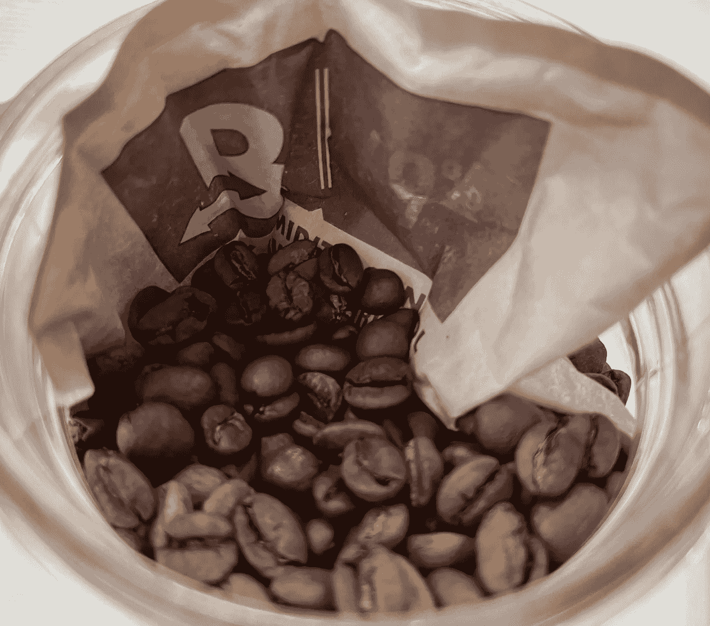

在此之后，没有太多的探索或讨论。我开始观察这一地区，看是否能为他们的观察提供一些数据。

# 加湿咖啡

最初，我打算把[湿度控制袋](https://bovedainc.com/)放在里面更长时间，但是在第一次烘烤后，我决定只把它放在容器里几天(大约 5 天)。然后我用一个真空罐。所以我称之为湿度处理或加湿咖啡。

我发现加湿咖啡会让咖啡豆更快脱气。他们还增加了大约 1%的体重。我的大部分烘焙食物由于水分减少了大约 13%的重量，这很典型。

当观察研磨分布时，加湿咖啡会导致咖啡研磨得更粗糙。为了达到同样的效果，我必须在利基市场做得更好。我从典型的设置 13 到设置 5，以达到类似的研磨分布。下面，就是蓝色虚线和绿色线条。其他研磨设置仅供参考。

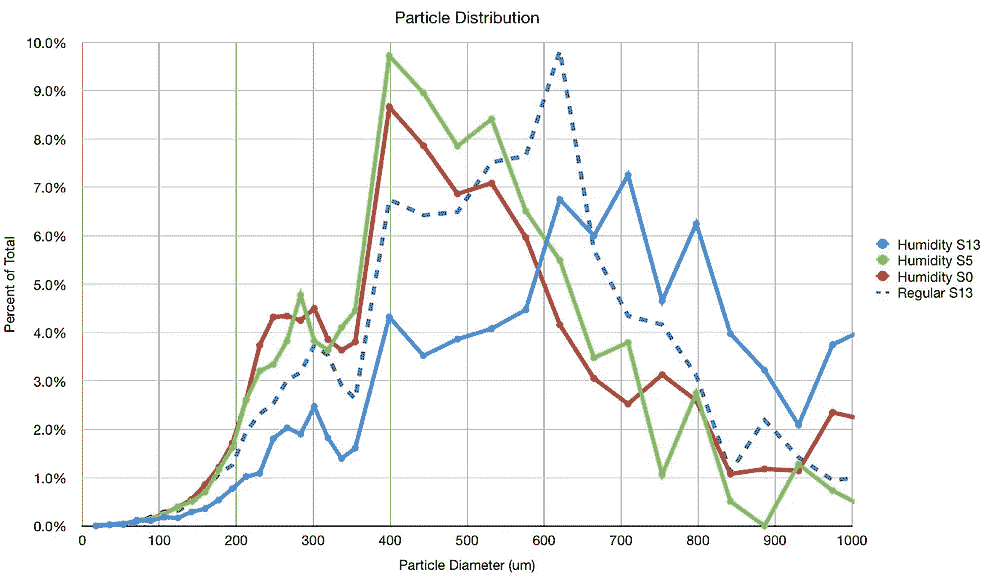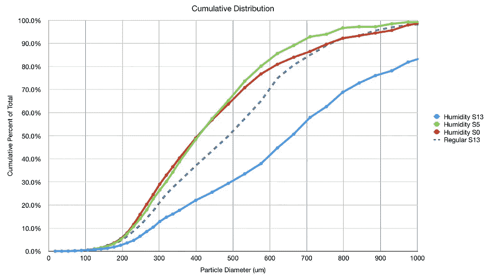

# 绩效指标

我使用两个指标来评估技术之间的差异:最终得分和咖啡萃取。

[**最终得分**](https://towardsdatascience.com/@rmckeon/coffee-data-sheet-d95fd241e7f6) 是评分卡上 7 个指标(辛辣、浓郁、糖浆、甜味、酸味、苦味和回味)的平均值。当然，这些分数是主观的，但它们符合我的口味，帮助我提高了我的拍摄水平。分数有一些变化。我的目标是保持每个指标的一致性，但有时粒度很难确定。

</coffee-solubility-in-espresso-an-initial-study-88f78a432e2c>**使用折射仪测量总溶解固体量(TDS)，这个数字结合咖啡的输出重量和输入重量用于确定提取到杯中的咖啡的百分比，称为**提取率(EY)** 。**

# **设备/技术**

**浓缩咖啡机:金特快**

**咖啡研磨机:利基零**

**咖啡:中杯家庭烘焙咖啡(第一口+ 1 分钟)**

**镜头准备:[断奏夯实](/staccato-tamping-improving-espresso-without-a-sifter-b22de5db28f6)**

**输液:[压力脉动](/pressure-pulsing-for-better-espresso-62f09362211d)**

**过滤篮:20g VST**

**输入/输出:21g 输入，约 24g 输出**

**其他设备:Atago TDS 测量仪，Acaia Pyxis 秤**

# **表演**

**我看了 6 次烘烤的 37 对照片。通过连续拍摄相互比较来确定配对。挑战在于，我必须等三个星期才能使用常规烘焙，所以除了第一次烘焙，每一对都是在不同的时间品尝和取出的。**

**在所有指标中，加湿咖啡更好。以下是最终得分(口味)和 EY/TDS:**

**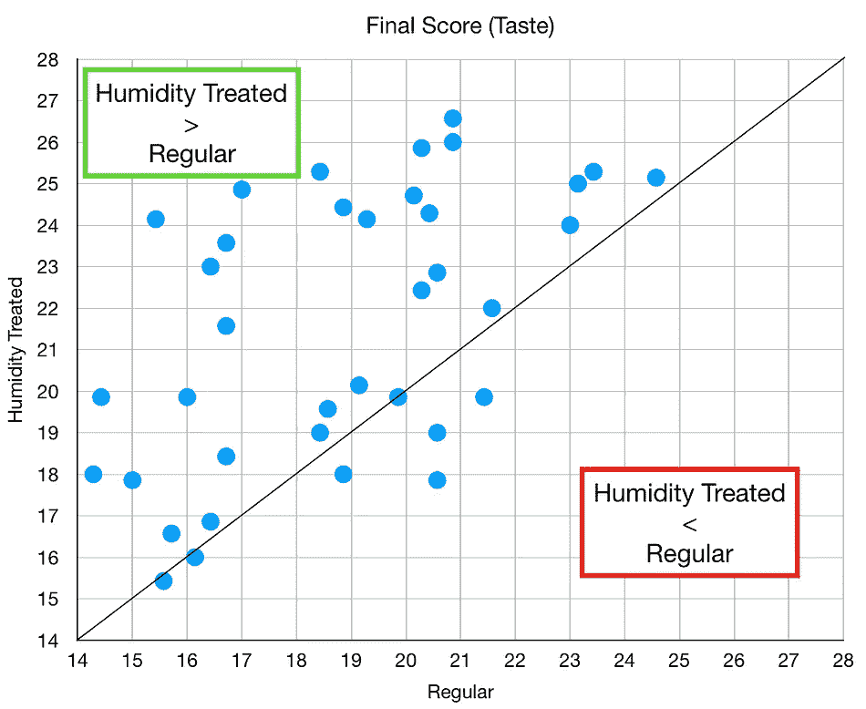****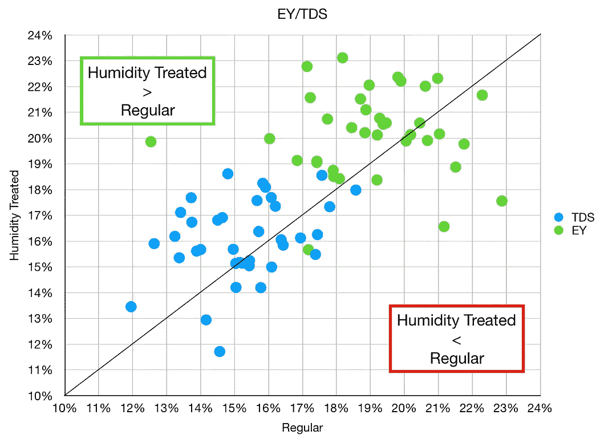**

**我们可以通过烘烤来分开，看看一些有趣的簇在哪里。2021 年 9 月 17 日的烘焙比其他人的改善要少。**

**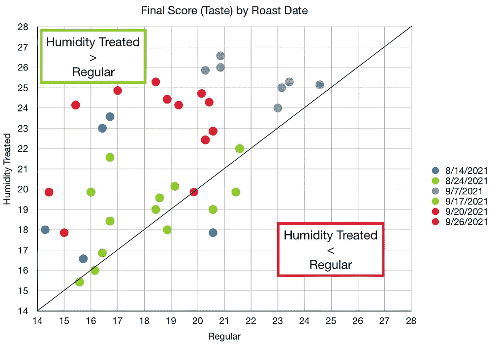****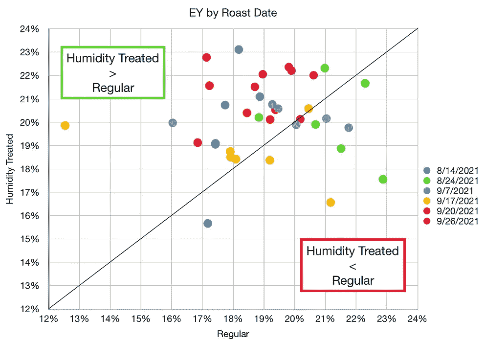**

**比较烘焙时间，与第 3 周到第 4 周的普通咖啡相比，我在前两周使用了大部分的加湿咖啡。**

**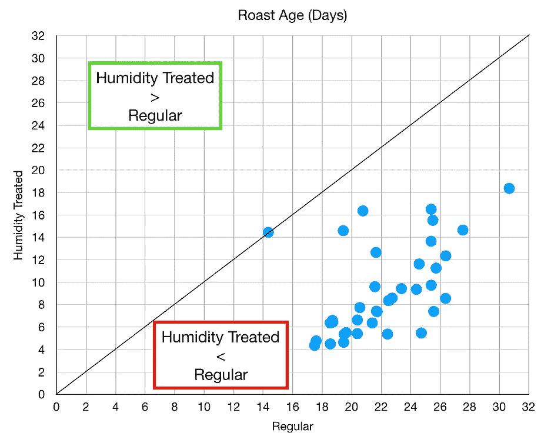****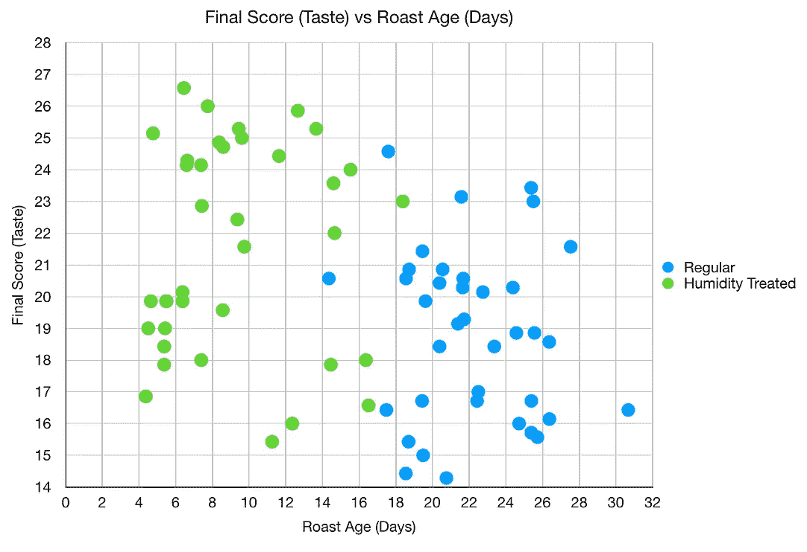**

**加湿咖啡的拍摄时间下降。这使得比较相同量的预输注具有挑战性，但我试图为每一个都拍摄最佳镜头。**

**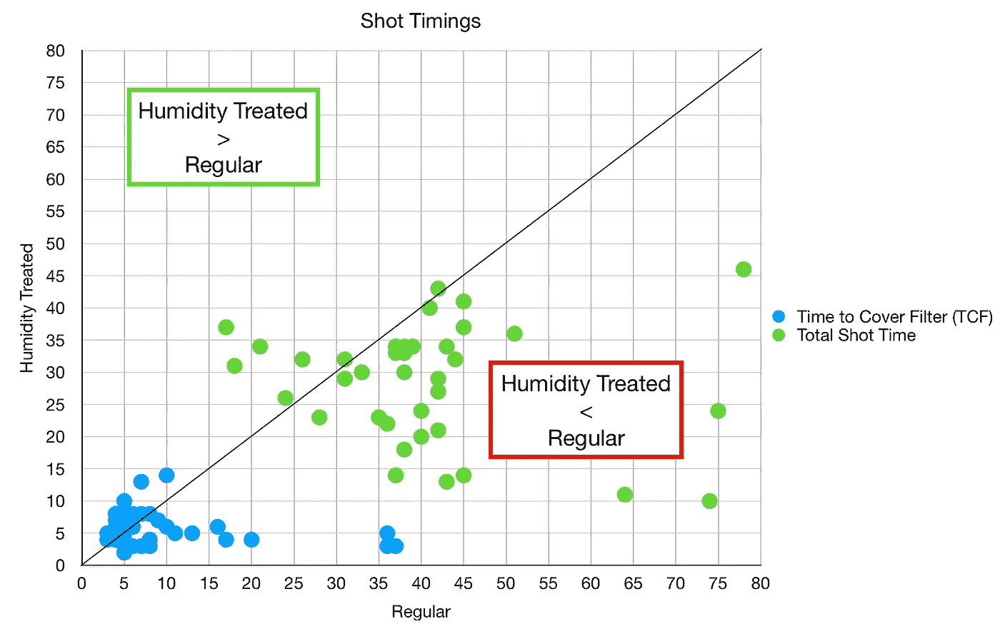**

**我在这张表格里做了一些一般的烘烤统计。请注意，两次烘烤(2021 年 9 月 17 日和 2021 年 9 月 20 日)在加湿的同时放入冰箱，但它们随后像其他烘烤一样储存在室温下。**

**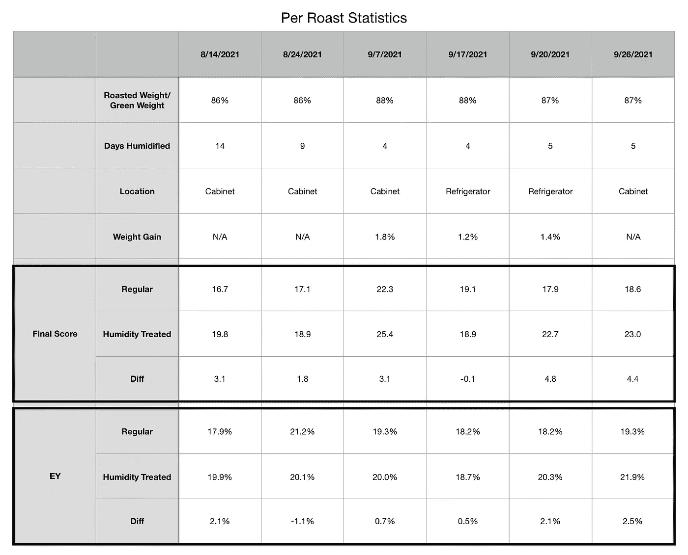**

**然后，我使用双尾 t 检验计算了 37 对样本的统计显著性。我添加了一列，在那里我将加湿咖啡的所有 EY 值调整了 1.5%，因为它们增加了大约 1.5%的重量。这意味着如果你放入 20 克咖啡，其中约 1.5%来自水，所以更高的 TDS 意味着 EY 更高。**

**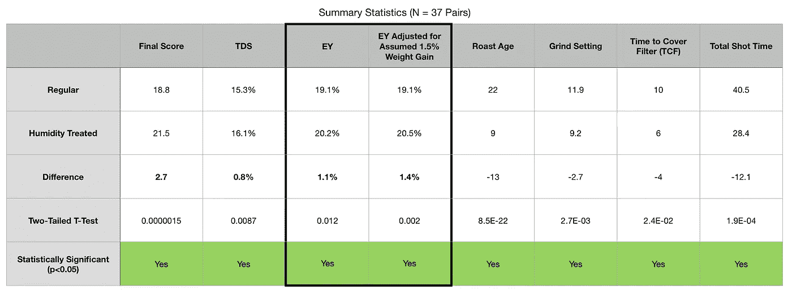**

# **推荐**

1.  **添加湿度控制袋 5 至 7 天的中等烘烤。你必须尝试其他的烘烤等级。我使用了 69%的湿度控制。你可以使用少量的水，大约是咖啡总重量的 1%到 2%。**
2.  **磨得更细。在利基市场上，我建议从 5 到 6 级开始。**
3.  **加大剂量。我一直用稍微高一点的剂量玩，因为子弹射得太快了**
4.  **稍微降低水温以减缓水流。**

**我开发了一种工艺来处理新烘焙的咖啡豆，使它们更快脱气，并在两周前准备好用于浓缩咖啡。这一湿度过程大大增加了风味和提取。湿度处理对于人们在家或在商业环境中是实用的，因为它只是暂时改变咖啡的储存。也有可能在储存过程中向咖啡中加入少量的水(约为重量的 1%)，但我还没有测试过。**

**我还注意到，经过潮湿处理后，照片没有那么酸了。这在味道上非常明显。詹姆斯·霍夫曼(James Hoffman)描述说，存放了几个月的咖啡有一种奇怪的味道，我确实注意到，经过湿度处理后，最初的一两次味道有所不同，但这种味道似乎很快就消失了。**

**如果你愿意，可以在 Twitter 和 YouTube 上关注我，我会在那里发布不同机器上的浓缩咖啡视频和浓缩咖啡相关的东西。你也可以在 [LinkedIn](https://www.linkedin.com/in/robert-mckeon-aloe-01581595?source=post_page---------------------------) 上找到我。也可以关注我[中](https://towardsdatascience.com/@rmckeon/follow)和[订阅](https://rmckeon.medium.com/subscribe)。**

# **[我的进一步阅读](https://rmckeon.medium.com/story-collection-splash-page-e15025710347):**

**[浓缩咖啡系列文章](https://rmckeon.medium.com/a-collection-of-espresso-articles-de8a3abf9917?postPublishedType=repub)**

**[工作和学校故事集](https://rmckeon.medium.com/a-collection-of-work-and-school-stories-6b7ca5a58318?source=your_stories_page-------------------------------------)**

**[个人故事和关注点](https://rmckeon.medium.com/personal-stories-and-concerns-51bd8b3e63e6?source=your_stories_page-------------------------------------)**

**[乐高故事启动页面](https://rmckeon.medium.com/lego-story-splash-page-b91ba4f56bc7?source=your_stories_page-------------------------------------)**

**[摄影启动页面](https://rmckeon.medium.com/photography-splash-page-fe93297abc06?source=your_stories_page-------------------------------------)**

**[使用图像处理测量咖啡研磨颗粒分布](https://link.medium.com/9Az9gAfWXdb)**

**[改进浓缩咖啡](https://rmckeon.medium.com/improving-espresso-splash-page-576c70e64d0d?source=your_stories_page-------------------------------------)**

**[断奏生活方式概述](https://rmckeon.medium.com/a-summary-of-the-staccato-lifestyle-dd1dc6d4b861?source=your_stories_page-------------------------------------)**

**[测量咖啡磨粒分布](https://rmckeon.medium.com/measuring-coffee-grind-distribution-d37a39ffc215?source=your_stories_page-------------------------------------)**

**[咖啡萃取](https://rmckeon.medium.com/coffee-extraction-splash-page-3e568df003ac?source=your_stories_page-------------------------------------)**

**[咖啡烘焙](https://rmckeon.medium.com/coffee-roasting-splash-page-780b0c3242ea?source=your_stories_page-------------------------------------)**

**[咖啡豆](https://rmckeon.medium.com/coffee-beans-splash-page-e52e1993274f?source=your_stories_page-------------------------------------)**

**[浓缩咖啡滤纸](https://rmckeon.medium.com/paper-filters-for-espresso-splash-page-f55fc553e98?source=your_stories_page-------------------------------------)**

**[浓缩咖啡篮及相关主题](https://rmckeon.medium.com/espresso-baskets-and-related-topics-splash-page-ff10f690a738?source=your_stories_page-------------------------------------)**

**[意式咖啡观点](https://rmckeon.medium.com/espresso-opinions-splash-page-5a89856d74da?source=your_stories_page-------------------------------------)**

**[透明 Portafilter 实验](https://rmckeon.medium.com/transparent-portafilter-experiments-splash-page-8fd3ae3a286d?source=your_stories_page-------------------------------------)**

**[杠杆机维修](https://rmckeon.medium.com/lever-machine-maintenance-splash-page-72c1e3102ff?source=your_stories_page-------------------------------------)**

**[咖啡评论和想法](https://rmckeon.medium.com/coffee-reviews-and-thoughts-splash-page-ca6840eb04f7?source=your_stories_page-------------------------------------)**

**[咖啡实验](https://rmckeon.medium.com/coffee-experiments-splash-page-671a77ba4d42?source=your_stories_page-------------------------------------)**