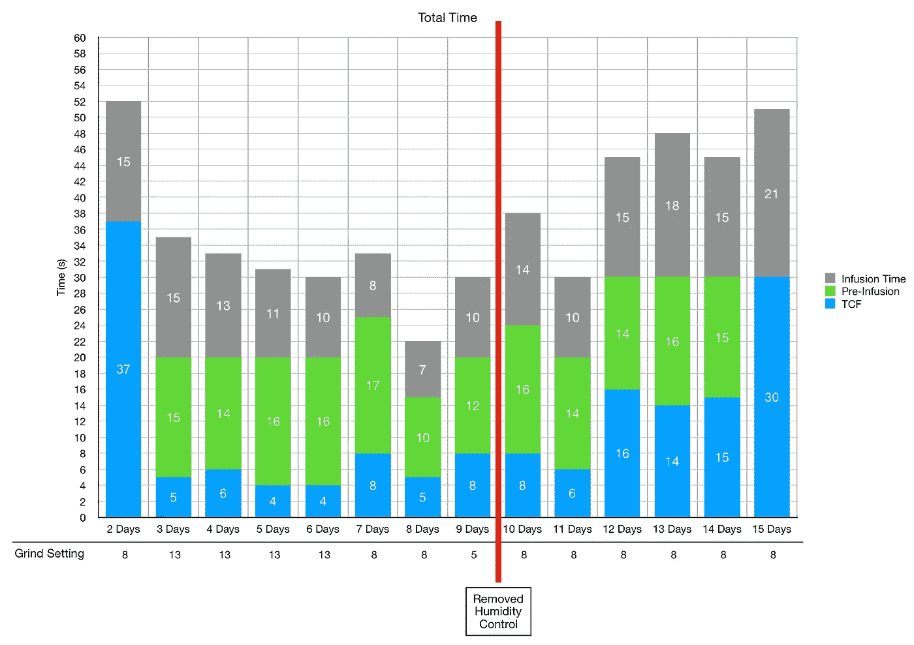

# 潮湿的咖啡随着时间的推移

> 原文：<https://towardsdatascience.com/humidified-coffee-over-time-4b41f108d30d?source=collection_archive---------19----------------------->

## 咖啡数据科学

## 探索湿度对时间的影响

[之前](/humidified-coffee-for-faster-degassing-and-better-espresso-3bdf601b2890)，我发现加湿咖啡可以在几天内快速脱气，而不是几周(对于中度烘焙)。此外，味道和提取改善，这是一个额外的奖励。

我想更好地了解这些影响，所以我做了一次烘烤，并将湿度控制袋放在烘烤中两周。我收集了一些关于体重增加、研磨分布和每日拍摄的数据。

所有图片由作者提供

# 重量的增加

我用我的 Acaia Pyxis 秤来测量烤肉的重量。我开始对烤肉进行取样，所以我测量了每次拍摄之间的百分比变化，并在最后将它们合并。

我通常在 5 天后将湿度控制袋拿出来进行其他烘烤，这导致重量增加了约 1.2%。当体重增加时，我很担心，因为有持续的变化。

## 咖啡研磨颗粒分布

我每天测量研磨分布。日班不多，但几天后，有必要去研磨设置更好。

此外，当我移除湿度控制时，研磨分布开始变得更细，这表明随着水从豆子中出来，效果会逐渐消失。

# 绩效指标

我使用两个指标来评估技术之间的差异:最终得分和咖啡萃取。

[**最终得分**](https://towardsdatascience.com/@rmckeon/coffee-data-sheet-d95fd241e7f6) 是记分卡 7 个指标(尖锐、浓郁、糖浆、甜味、酸味、苦味和回味)的平均值。当然，这些分数是主观的，但它们符合我的口味，帮助我提高了我的拍摄水平。分数有一些变化。我的目标是保持每个指标的一致性，但有时粒度很难确定。

**用折射仪测量总溶解固体量(TDS)，这个数字结合咖啡的输出重量和输入重量用于确定提取到杯中的咖啡的百分比，称为**提取率(EY)** 。**

# **设备/技术**

**浓缩咖啡机:金特快**

**咖啡研磨机:利基零**

**咖啡:中杯家庭烘焙咖啡(第一口+ 1 分钟)**

**镜头准备:[断奏夯实](/staccato-tamping-improving-espresso-without-a-sifter-b22de5db28f6)**

**输液:[压力脉动](/pressure-pulsing-for-better-espresso-62f09362211d)**

**过滤篮:20g VST**

**其他设备:Atago TDS 测量仪，Acaia Pyxis 秤**

# **表演**

**这些镜头的味道是一致的，但在最后几天急剧下降。这些镜头尝起来很旧。**

****

**对于 EY，它们在开始时增加，然后保持，但在最后两次拍摄中也有所下降。这有助于降低阴囊的味道。**

****

**拍摄时间下降，直到我不得不做更精细的研磨。这是可以预料的，并且可能与脱气发生的数量有关。**

****

# **克丽玛**

**为了更好地理解克莉玛的变化，我查看了一些烘烤的数据，包括有湿度和没有湿度的情况。我用视频的最后一帧测量了克丽玛，当时镜头还在拉。我测量了从咖啡线到克莉玛线顶端的毫升数。虽然一些照片储存在潮湿的环境中，但大多数照片没有。**

****

# **水与湿度**

**可以用一点水来代替湿度控制袋。所以我在水中加入 1%的豆子，放置 5 天，然后我做了一些配对拍摄。我没有看到很大的不同。所有的水分都被豆子吸收了，我想我可以收集更多的数据，但看不出有什么不同。然而，这是一个我没有兴趣继续下去的实验。我认为用水是比购买湿度控制袋更可行的选择。**

********

**这些数据更好地帮助我理解了湿度是如何影响豆子的。该机制似乎是脱气，因为克莉玛减少了。这允许更高的提取率，带来更好的味道，因为咖啡豆暴露在更少的氧气中(导致氧化)。**

**如果你愿意，可以在推特、 [YouTube](https://m.youtube.com/channel/UClgcmAtBMTmVVGANjtntXTw?source=post_page---------------------------) 和 [Instagram](https://www.instagram.com/espressofun/) 上关注我，我会在那里发布不同机器上的浓缩咖啡照片和浓缩咖啡相关的视频。你也可以在 [LinkedIn](https://www.linkedin.com/in/robert-mckeon-aloe-01581595?source=post_page---------------------------) 上找到我。也可以关注我在[中](https://towardsdatascience.com/@rmckeon/follow)和[订阅](https://rmckeon.medium.com/subscribe)。**

# **[我的进一步阅读](https://rmckeon.medium.com/story-collection-splash-page-e15025710347):**

**[我未来的书](https://www.kickstarter.com/projects/espressofun/engineering-better-espresso-data-driven-coffee)**

**[浓缩咖啡系列文章](https://rmckeon.medium.com/a-collection-of-espresso-articles-de8a3abf9917?postPublishedType=repub)**

**[工作和学校故事集](https://rmckeon.medium.com/a-collection-of-work-and-school-stories-6b7ca5a58318?source=your_stories_page-------------------------------------)**

**[个人故事和关注点](https://rmckeon.medium.com/personal-stories-and-concerns-51bd8b3e63e6?source=your_stories_page-------------------------------------)**

**[乐高故事启动页面](https://rmckeon.medium.com/lego-story-splash-page-b91ba4f56bc7?source=your_stories_page-------------------------------------)**

**[摄影启动页面](https://rmckeon.medium.com/photography-splash-page-fe93297abc06?source=your_stories_page-------------------------------------)**

**[改善浓缩咖啡](https://rmckeon.medium.com/improving-espresso-splash-page-576c70e64d0d?source=your_stories_page-------------------------------------)**

**[断奏生活方式概述](https://rmckeon.medium.com/a-summary-of-the-staccato-lifestyle-dd1dc6d4b861?source=your_stories_page-------------------------------------)**

**[测量咖啡磨粒分布](https://rmckeon.medium.com/measuring-coffee-grind-distribution-d37a39ffc215?source=your_stories_page-------------------------------------)**

**[浓缩咖啡中的粉末迁移](https://medium.com/nerd-for-tech/rebuking-fines-migration-in-espresso-6790e6c964de)**

**[咖啡萃取](https://rmckeon.medium.com/coffee-extraction-splash-page-3e568df003ac?source=your_stories_page-------------------------------------)**

**[咖啡烘焙](https://rmckeon.medium.com/coffee-roasting-splash-page-780b0c3242ea?source=your_stories_page-------------------------------------)**

**[咖啡豆](https://rmckeon.medium.com/coffee-beans-splash-page-e52e1993274f?source=your_stories_page-------------------------------------)**

**[浓缩咖啡滤纸](https://rmckeon.medium.com/paper-filters-for-espresso-splash-page-f55fc553e98?source=your_stories_page-------------------------------------)**

**[浓缩咖啡篮及相关主题](https://rmckeon.medium.com/espresso-baskets-and-related-topics-splash-page-ff10f690a738?source=your_stories_page-------------------------------------)**

**[意式咖啡观点](https://rmckeon.medium.com/espresso-opinions-splash-page-5a89856d74da?source=your_stories_page-------------------------------------)**

**[透明 Portafilter 实验](https://rmckeon.medium.com/transparent-portafilter-experiments-splash-page-8fd3ae3a286d?source=your_stories_page-------------------------------------)**

**[杠杆机维修](https://rmckeon.medium.com/lever-machine-maintenance-splash-page-72c1e3102ff?source=your_stories_page-------------------------------------)**

**[咖啡评论和想法](https://rmckeon.medium.com/coffee-reviews-and-thoughts-splash-page-ca6840eb04f7?source=your_stories_page-------------------------------------)**

**[咖啡实验](https://rmckeon.medium.com/coffee-experiments-splash-page-671a77ba4d42?source=your_stories_page-------------------------------------)**