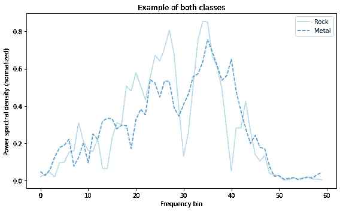
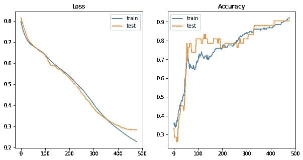
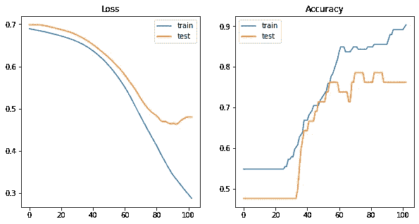
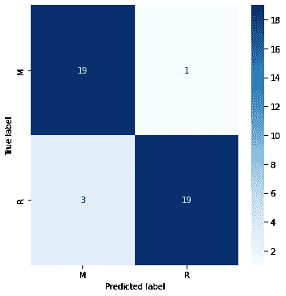

# 用深度学习猎水雷

> 原文：<https://towardsdatascience.com/hunting-naval-mines-with-deep-learning-8cbc3c872db1?source=collection_archive---------33----------------------->

## 一种帮助改进水雷探测的模型，使用自动编码器进行特征选择，使用深度神经网络进行二进制分类


用于海军水雷防御的机器人潜艇|图片由美国海军研究所提供

# 问题的简要介绍

毫无疑问，水雷是影响海洋航行的一个重要因素。几十年前就有很多了。生产和埋设地雷的费用通常是清除费用的 0.5%至 10%，而清除一个雷区的时间可能是埋设地雷的时间的 200 倍。现在仍然存在一些可以追溯到第二次世界大战[时期的海军雷场](https://www.thelocal.se/20090616/20102/)，并且在许多年内仍然是[的危险区](https://www.bbc.com/news/uk-england-hampshire-48327618)，因为它们太大，清除起来太昂贵。

在下面的段落中，将讨论几个深度学习实现。为了保持对项目的友好描述，建议您在阅读文章的同时阅读下面[报告](https://github.com/augustodn/rocks-vs-mines)中提供的笔记本。提供了 2 个笔记本，在第一个笔记本中，训练了一个[自动编码器](https://blog.keras.io/building-autoencoders-in-keras.html)。第二，自动编码器的编码器部分用于训练一个[神经网络二元分类器](https://machinelearningmastery.com/tutorial-first-neural-network-python-keras/)。这些笔记本也有 [Kaggle](https://www.kaggle.com/augustodenevreze) 版本。

本文的[数据集](http://archive.ics.uci.edu/ml/datasets/connectionist+bench+(sonar,+mines+vs.+rocks))包含从金属圆柱体和岩石上以不同角度和不同条件反射声纳信号获得的模式。传输的声纳信号是调频啁啾声，频率上升。每个模式是一组 60 个频率区间，范围从 0.0 到 1.0。每个数字代表特定频带内的能量，在一定时间内进行积分。



每个类别的功率谱密度示例|按作者分类的图像

如果物体是岩石，则与每个记录相关联的标签包含字母“R ”,如果是地雷(金属圆筒),则包含字母“M”。标签中的数字按方位角的升序排列，但它们不直接对角度进行编码。数据集在类别之间几乎是平衡的，如下图所示。


按作者分类的数据集|图像中的类别分布

# 设计解决方案

每个人都同意数据中的维度是一个[诅咒](https://www.kdnuggets.com/2015/03/deep-learning-curse-dimensionality-autoencoders.html)，拥有许多不同的维度往往会导致算法和模型表现不佳。对于深度神经网络来说，这并不是例外，这篇文章将试图证明这一点，在提供的笔记本中有更多的信息。即使数据集只有 60 个维度，问题依然存在。请记住，例如，对于图像，问题可能会大几个数量级。

由于我们有许多维度，我们可以训练一个自动编码器网络，这是一种无监督的深度学习技术，以减少变量之间的共线性，并有望使用更小维度的分类器，可以表现得更好。或者，也可以使用传统的 PCA，但是一般来说，自动编码器的 T2 表现更好。


变量之间的相关性|作者图片

从前面的图中可以看出，变量之间存在一些相关性，可以使用所提出的方法来压缩这些信息。

# 自动编码器结构

自动编码器由两个主要部分组成，编码器和解码器网络。编码器网络在训练和部署期间使用，而解码器网络仅在训练期间使用。编码器网络的目的是发现给定输入的压缩表示。在这个项目中，一个 10 维的表示是从一个 60 维的输入生成的。这发生在自动编码器的中间，也就是所谓的瓶颈。解码器网络只是编码器网络的反映，其目的是尽可能接近地重建原始输入。


自动编码器结构| [Chervinskii —自己的作品，CC BY-SA 4.0](https://commons.wikimedia.org/w/index.php?curid=45555552)

该网络也有两个优化。使用了[批次标准化](https://machinelearningmastery.com/batch-normalization-for-training-of-deep-neural-networks/)来稳定学习过程，并显著减少实现最小损失所需的时期数。此外，选择了[泄漏 ReLU](https://paperswithcode.com/method/leaky-relu) 激活，而不是常规 ReLU。第一种倾向于提高网络性能，实现更小的损耗值。


Autoencoder 培训和测试损失|作者图片

作为基线比较，选择了逻辑回归模型。它在一种情况下用 60 个输入进行训练，在另一种情况下用 10 个输入的压缩版本进行训练。这些结果随后得到了测试数据集的验证。尺寸较小的模型略胜一筹。这表明减少变量的数量确实有好处。

# 深度学习分类器

为了创建一个降维的分类器，在训练之后只使用自动编码器的第一部分，特别是编码器部分。这组层连接到分类器的输入。一组完全连接的层跟随编码器部分，直到到达输出，这最后一层仅由一个神经元组成。所描述的网络输出与原始论文中的略有不同，因为作者定义了两个输出:每个类一个。


作为二进制分类器的输入连接的编码器|由作者创建的图像

为了训练这个网络并避免过度拟合，使用了[提前停止](https://keras.io/api/callbacks/early_stopping/)回调。这样，当被监控的度量不再改善时，训练停止。测试损失已被用作[提前停止](https://keras.io/api/callbacks/early_stopping/)的监控参数。结果可以在下面看到，蓝色的图属于训练数据集上的损失和准确性。测试数据集中的结果用黄色曲线表示。



压缩神经网络|图像的训练集和测试集的损失和准确性(作者)

可以将结果与用非压缩输入训练网络后获得的结果进行比较。在这种情况下提出的网络模型是:

```
inputs --> 30 --> 20 --> 10 --> 5 --> 3 --> output
```

每个数字代表每层神经元的数量。在下图中，可以观察到在模型开始过度拟合之前，在测试数据集中获得的准确度不超过 80%。



未压缩神经网络的损失和准确性|图片由作者提供

最后，给出了简化模型的混淆矩阵。大多数案例都被正确分类，这表明模型具有几乎最佳的泛化能力。由于它倾向于探测地雷而不是岩石，这种假阳性产生了更安全的偏差。



# 那又怎样？

在分析结果之后，可以观察到用自动编码器执行的特征提取有助于分类器网络实现更高的精度值。结果与 Gorman 和 Sejnowski 在[原始论文](https://papers.cnl.salk.edu/PDFs/Analysis%20of%20Hidden%20Units%20in%20a%20Layered%20Network%20Trained%20to%20Classify%20Sonar%20Targets%201988-2996.pdf)中获得的结果一致。然而，为了获得相同的结果，他们训练了一个具有大约 12 个隐藏层的模型！。在相同的方向上，对于具有 3 个隐藏层并且没有编码的网络获得的结果类似于前面提到的论文。

一些[的其他努力](http://users.cecs.anu.edu.au/~Tom.Gedeon/conf/ABCs2018/paper/ABCs2018_paper_61.pdf)已经完成，以增加准确性减少隐藏层的神经元数量([修剪](/pruning-neural-networks-1bb3ab5791f9))没有成功。还有另一个[出版物](https://www.researchgate.net/publication/330958762_Prediction_of_Underwater_Surface_Target_through_SONAR_A_Case_Study_of_Machine_Learning)专注于几个经典机器学习(ML)优化模型的比较，取得了与此类似的结果。这一结果是在使用 [WEKA](https://en.wikipedia.org/wiki/Weka_(machine_learning)) 软件应用特征选择技术后获得的。然而，它不能提供神经网络的良好性能。

最后，有一篇优秀的[文章](https://www.simonwenkel.com/2018/08/23/revisiting_ml_sonar_mines_vs_rocks.html)分析了不同的神经网络架构。其中也有与经典 ML 模型的比较。作者提出了一种特征去除技术，在分析了随机森林模型的影响因素后，通过简单地删除那些对其影响较小的变量。

# 最后的话

自动编码器在特征选择过程中表现出良好的性能。即使当我们像这样处理结构化数据时。该项目的主要目标是在训练模型之前分析自动特征选择的用例，特别是深度神经网络。在其他用途中，可以提到目前在移动电话中广泛使用的数据压缩。自动编码器的另一个用例是图像去噪。在 Keras 官方博客中有一个关于 autoencoder 应用的极好的[条目](https://blog.keras.io/building-autoencoders-in-keras.html)。这是由[弗朗索瓦·乔莱](https://twitter.com/fchollet)写的，他是 Keras 的创造者，也是一本伟大的深度学习[书](https://www.manning.com/books/deep-learning-with-python)的作者。

除了自动编码器的所有好处之外，由于它们是特定于数据的，这使得它们对于现实世界的数据压缩问题不切实际:您只能在与它们被训练的数据相似的数据上使用它们。如果有人假装在一般应用中使用它们，这将需要大量的训练数据。

谢谢你来到这里。你可以从这个 [repo](https://github.com/augustodn/rocks-vs-mines) 中获得本文使用的笔记本。我随时可以谈论数据科学，请随时通过 [twitter](https://twitter.com/augusto_dn) 联系我。

# 参考

## 博客

[在 Keras 中构建自动编码器](https://blog.keras.io/building-autoencoders-in-keras.html)

[用于分类的自动编码器特征提取](https://machinelearningmastery.com/autoencoder-for-classification/)

[使用神经网络和 keras 构建您的第一个二元分类器](https://machinelearningmastery.com/tutorial-first-neural-network-python-keras/)

[声纳数据——水雷 vs 岩石——关于 cAInvas](https://medium.com/ai-techsystems/sonar-data-mines-vs-rocks-on-cainvas-c0a08dde895b) (太大的神经网络)

[重温机器学习数据集——声纳、地雷与岩石](https://www.simonwenkel.com/2018/08/23/revisiting_ml_sonar_mines_vs_rocks.html)

## 报纸

[为分类声纳目标而训练的分层网络中隐藏单元的分析](https://papers.cnl.salk.edu/PDFs/Analysis%20of%20Hidden%20Units%20in%20a%20Layered%20Network%20Trained%20to%20Classify%20Sonar%20Targets%201988-2996.pdf)

[通过声纳预测水下水面目标:机器学习案例研究](https://www.researchgate.net/profile/Nishtha-Hooda/publication/330958762_Prediction_of_Underwater_Surface_Target_through_SONAR_A_Case_Study_of_Machine_Learning/links/5c5d5c45a6fdccb608afbcdf/Prediction-of-Underwater-Surface-Target-through-SONAR-A-Case-Study-of-Machine-Learning.pdf)

[神经网络对声纳目标、地雷和岩石进行分类](http://users.cecs.anu.edu.au/~Tom.Gedeon/conf/ABCs2018/paper/ABCs2018_paper_61.pdf)(结果不佳)