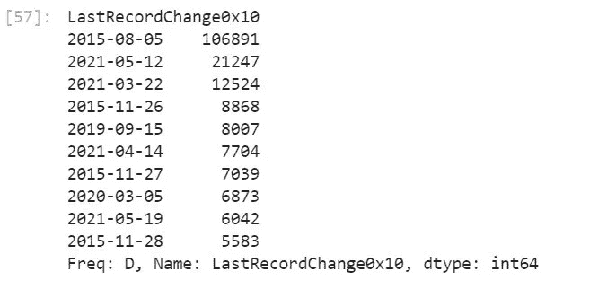
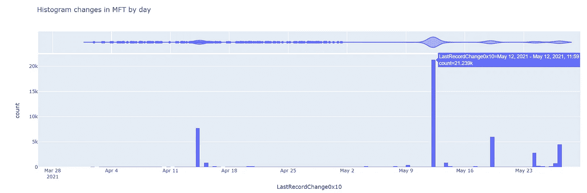
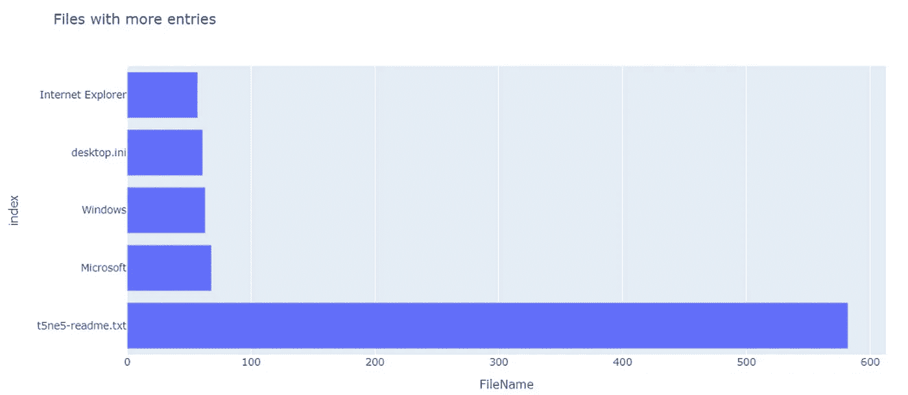
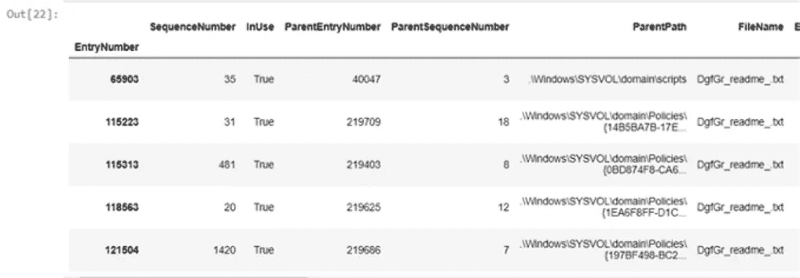
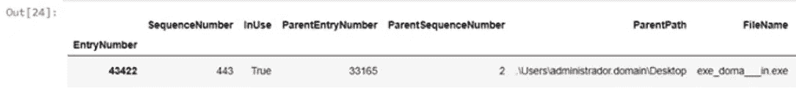

# 与熊猫的狩猎威胁🐼👊——MFT 分析公司

> 原文：<https://towardsdatascience.com/hunting-threats-with-pandas-mft-analysis-9f96a99ef27a?source=collection_archive---------26----------------------->

## 利用数据分析技术和工具改进事故响应。

在我看来，看到网络安全的发展方向确实令人兴奋。事件响应甚至威胁追踪越来越多地与海量信息的处理联系在一起。我认为这一方面是由于当前设备存储和/或生成的遥测数据量，另一方面是由于越来越多的事故，其中许多是非常大的事故，涉及许多计算机，甚至一个组织的许多站点。
这意味着，当我们必须在威胁追踪中找到组织内的攻击者时，或者当我们必须在 DFIR 演习中找到攻击者的踪迹时，我们必须处理越来越多的信息，来自多个来源、具有不同格式的数百万个事件……这简直是一场噩梦。

我一直认为，编程是任何网络安全分析师的基本技能，如果我们没有最起码的知识，我们注定要一直使用第三方工具，而这些工具并不总是符合我们的需求。在这种情况下没有什么不同，能够创建自动化数据处理的小脚本或程序将会有很大的不同。

# 蟒蛇和熊猫来救援了！


照片由[埃里克·麦克林](https://www.pexels.com/@introspectivedsgn?utm_content=attributionCopyText&utm_medium=referral&utm_source=pexels)从[派克斯](https://www.pexels.com/photo/man-in-black-and-white-panda-costume-standing-on-payphone-booth-during-night-time-4065800/?utm_content=attributionCopyText&utm_medium=referral&utm_source=pexels)拍摄

虽然 Python 有能力让使用它的程序员感到惊讶，但 Pandas 却让我大吃一惊！Pandas 是一个数据分析和操作工具，正如它的创造者所定义的那样，它快速、强大、灵活……它们有所不足，令人震惊。😍虽然它们是独立的项目，但强烈建议使用 JupyterLab 与熊猫“玩耍”,它被推荐用于任何事情，如果你从未使用过它，当你使用它时，你会后悔以前没有这样做。我推荐你安装 Anaconda🐍要使用 JupyterLab，这不会让我们的计算机充满我们不需要的 Python 库，你必须有条理！😄首先，一旦安装了 Anaconda，我们将通过在 Anaconda 控制台中运行这个命令来启动 JupyterLab。

```
C:>jupyter notebook
```

一旦进入 Jupyter 界面，你就可以用 Pyhton 3 创建一个新的笔记本并开始游戏。

# MFT 分析📂

虽然我的意图是发表几篇帖子来讨论在分析师的日常工作中使用 Pandas 的方法，但在本例中，我们将讨论如何使用 Pandas 和 Python 来处理 MFT(主文件表)。
首先，在许多安全事件中，MFT 是非常宝贵的资产，因为它是一个数据库，NTFS 文件系统在其中跟踪存储卷上创建的所有文件和目录。需要查看该日志的情况不胜枚举，但在这种情况下，我们的受害者遭受了勒索软件的侵害。
MFT 不是一种舒适的工作格式，为了让我们更容易，我将使用 [Eric Zimmerman 的 MFTECmd](https://ericzimmerman.github.io/#!index.md) 工具。🔝
如果 MFT 不是很大，我们可以用 MS Excel 进行分析，但很多时候文件太大，我们需要更通用的工具。

最初，必须声明一些变量并运行 MFETCmd 工具。

```
**import** **os**
**from** **subprocess** **import** check_output
mft_path = "**\"**C:**\\**kape**\\**collected**\\**2021-06-01T151604**\\**C**\\**$MFT**\"**"
mftexplorer_path = "**\"**C:**\\**MFTExplorer**\\**MFTECmd.exe**\"**"
output_folder = "C:**\\**Documents**\\**test"
output_filename = "MyOutputFile.csv"command = "**{0}** -f **{1}** --csv **\"{2}\"** --csvf **\"{3}\"**".format(mftexplorer_path, mft_path, output_folder, output_filename)
print(command)
output = os.popen(command).read()
```

这个执行的结果将是 set 文件夹中的一个 CSV 文件，这就是我们需要用来喂养熊猫的文件。🐼

```
**import** **pandas** **as** **pd** 
pd.set_option('display.max_columns', 500)

data = pd.read_csv(output_folder + "**\\**" + output_filename)
```

此时，我们已经有了一个包含来自 MFT 的所有信息的数据框架。为了继续舒适地处理数据，建议调整包含日期的字段的类型。

```
data.set_index("EntryNumber", inplace=**True**)
data['Created0x10'] =  pd.to_datetime(data['Created0x10'], format='%Y-%m-**%d** %H:%M:%S.**%f**')
data['Created0x30'] =  pd.to_datetime(data['Created0x30'], format='%Y-%m-**%d** %H:%M:%S.**%f**')
data['LastModified0x10'] =  pd.to_datetime(data['LastModified0x10'], format='%Y-%m-**%d** %H:%M:%S.**%f**')
data['LastModified0x30'] =  pd.to_datetime(data['LastModified0x30'], format='%Y-%m-**%d** %H:%M:%S.**%f**')
data['LastRecordChange0x10'] =  pd.to_datetime(data['LastRecordChange0x10'], format='%Y-%m-**%d** %H:%M:%S.**%f**')
data['LastRecordChange0x30'] =  pd.to_datetime(data['LastRecordChange0x30'], format='%Y-%m-**%d** %H:%M:%S.**%f**')
```

数据现在已准备好供查询。在这种情况下，这个 MFT 属于遭受勒索软件攻击的计算机，更具体地说是 Avaddon。
假设我们不知道勒索软件是何时执行的，并且我们想知道它以便执行调查。
首先，让我们看看在 MFT 中哪一天对文件进行了更多的更改。

```
dates = data["LastRecordChange0x10"]
dates.index = dates.dt.to_period('d')
s = dates.groupby(level=0).size()
s.sort_values(ascending=**False**).head(10)
```



MFT 发生更多变化的日子

在上图中，您可以看到我们如何通过几个命令提取文件的修改日期，在对数据进行分组后，我们首先获得操作系统的安装日期，然后获得攻击的日期。
如果我们希望以更直观的方式查看，我们可以生成一个图表，显示过去两个月所做的更改。



MFT 每日直方图变化

我们可以做的另一个测试是寻找过去 4 个月 MFT 中重复次数最多的文件，目的是发现异常。

```
fig = px.bar(names_plot, x="FileName", "title=Files with more entries")
Fig.show()
```



具有更多条目的文件

勒索信！该勒索软件在执行过程中创建勒索笔记，并使用它加密的每个文件修改它们。为了更详细地查看信息，我们将执行以下操作。

```
readme = data[data["FileName"].str.contains("_readme_.txt")]
redme.sort_values(by="LastModified0x10", ascending=True).head()
```



勒索信

在这种情况下，随着赎金笔记的出现，我们可以知道事件发生的时间，但现在我们将试图找出谁可能是肇事者，只有 MFT。为此，我们将尝试查询勒索病毒案例中攻击者使用的最常见扩展名的文件，但仅限于创建第一封勒索信之前的 12 小时内。🔍

```
first_note = readme1.sort_values(by="LastModified0x10", ascending=**True**).iloc[0]["LastModified0x10"]
range_exe = first_note + pd.offsets.Hour(-12)
data_filtered = data[(data['Created0x10'] > "2021-05-22") & (data['Created0x10'] < "2021-05-25")]
files = data_filtered[data_filtered["FileName"].str.contains("\.exe|\.ps1|\.msi|\.vba", regex=**True**)]
```



赎金可执行文件

现在我们有了文件，我们必须找出它是如何进入电脑的，但这是 MFT 无法告诉我们的事情😄。虽然我们没有深入研究，但我们可以对多个 MFT 文件进行分析，按名称模式搜索，比较创建和修改日期，搜索具有可疑属性的文件……这是一个充满可能性的世界。

在以后的文章中，我将会谈到一些更高级的案例，在这些案例中，Pandas 可以帮助我们进行调查，例如分析千兆字节的防火墙日志或分析 Windows 事件。我希望你喜欢它，并鼓励你把熊猫和朱庇特列入你的狩猎工具库。

你可以在[这个链接](https://github.com/lucky-luk3/Infosec_Notebooks/blob/main/MFT_analysis_public_v0.2.ipynb)找到这个笔记本，好好享受吧！

下集再见，祝狩猎愉快！