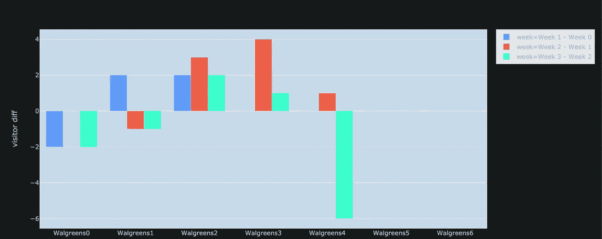

# 亨利飓风:一个数据故事

> 原文：<https://towardsdatascience.com/hurricane-henri-a-data-story-5a3bee2840fc?source=collection_archive---------29----------------------->

## [实践教程](https://towardsdatascience.com/tagged/hands-on-tutorials)

## 分析因东海岸亨利飓风影响而产生的游客数据波动


由 [NASA](https://unsplash.com/@nasa?utm_source=unsplash&utm_medium=referral&utm_content=creditCopyText) 在 [Unsplash](https://unsplash.com/s/photos/hurricane?utm_source=unsplash&utm_medium=referral&utm_content=creditCopyText) 上拍摄的照片

亨利飓风是一种 1 级飓风，在 2021 年 8 月造成了东海岸的严重破坏。这场飓风于 8 月 16 日在罗德岛州登陆，并于 8 月 24 日消散。亨利达到了每小时 70 英里的峰值强度，并导致了从大规模财产损失到纽约、新泽西和宾夕法尼亚等州的暴雨和洪水的破坏。这篇特别的文章旨在分析这场飓风对纽约州、新泽西州和宾夕法尼亚州的旅游景点的游客指标的影响。

为了执行此分析，我将使用位于纽约州、新泽西州和宾夕法尼亚州的 POI 的 [SafeGraph](https://www.safegraph.com/) 每周模式数据。SafeGraph 是一家数据提供商，为数百家企业和类别提供 POI 数据。它向学术界免费提供数据。SafeGraph 每周模式数据在结构上类似于每月模式数据(每月模式的文档可在[此处](https://docs.safegraph.com/docs/monthly-patterns)找到)，但提供的数据是每周和每天的，而不是每月的。这个更加具体和细致入微的数据集的文档可以在[这里](https://docs.safegraph.com/docs/weekly-patterns)找到。

# 分析:

分析的第一步是加载数据并执行一些基本的数据预处理，以提取我们需要的数据。这个分析涉及到几个压缩为 JSON 字符串和数组的列的扩展，比如关于分时段平均停留时间和每日访问者数据的列。为了执行这个扩展，我们可以在 Spark 中使用 from_json 命令。对于此分析，使用了从 2021 年 8 月 2 日到 2021 年 8 月 30 日的数据，并将这些数据分成位于不同文件中的每周间隔。由于预处理阶段在所有四周都是相同的，我们可以使用 08/02 这一周作为我们分析的基线，并假设对所有文件执行相同的分析。该过程的第一步是加载数据:

```
path0802 = '/content/drive/MyDrive/UpWork/safeGraph/Data Projects/Project 6/patterns0802.csv'df0802 = pd.read_csv(path0802)df0802 = df0802[(df0802['region'] == 'NY') | (df0802['region'] == 'PA') | (df0802['region'] == 'NJ')]df0802 = df0802.drop(['parent_placekey','iso_country_code','safegraph_brand_ids','visitor_country_of_origin','related_same_day_brand','related_same_week_brand','device_type','brands','visitor_daytime_cbgs','visitor_home_aggregation','visitor_home_cbgs'], axis = 1)df0802['postal_code'] = pd.to_numeric(df0802['postal_code'], errors='coerce')df0802['raw_visit_counts'] = pd.to_numeric(df0802['raw_visit_counts'], errors='coerce')df0802['raw_visitor_counts'] = pd.to_numeric(df0802['raw_visitor_counts'], errors='coerce')df0802['poi_cbg'] = pd.to_numeric(df0802['poi_cbg'], errors='coerce')df0802['distance_from_home'] = pd.to_numeric(df0802['distance_from_home'], errors='coerce')df0802['median_dwell'] = pd.to_numeric(df0802['median_dwell'], errors='coerce')df0802 = spark.createDataFrame(df0802)df0802.show(2)
```


作者图片

从这里我们可以展开 JSON 字符串列:

```
#Horizontal Explosion of JSON columns using Pysparkfrom pyspark.sql.functions import from_json,exprfrom pyspark.sql.types import StructType, StructField, StringType, ArrayType, IntegerTypebucketedDT_schema = StructType([StructField('<5',IntegerType(),True),StructField('5-10',IntegerType(),True),StructField('11-20',IntegerType(),True),StructField('21-60',IntegerType(),True),StructField('61-120',IntegerType(),True),StructField('121-240',IntegerType(),True),StructField('>240',IntegerType(),True)])df0802 = df0802.withColumn('bucketed_dwell_times',from_json('bucketed_dwell_times',bucketedDT_schema)).select('placekey','location_name','street_address','city','region','postal_code','date_range_start','date_range_end','raw_visit_counts','raw_visitor_counts','visits_by_day','distance_from_home','median_dwell','bucketed_dwell_times.*')df0802 = df0802.toPandas()df0802.head(3)
```


作者图片

下一步是扩展数组列:

```
from ast import literal_evaldf0802['visits_by_day'] = df0802['visits_by_day'].transform(lambda x: literal_eval(x))pops = ['visit_' + str(i) for i in range(1,8)]df0802[pops] = pd.DataFrame(df0802.visits_by_day.to_list(), index=df0802.index)df0802 = df0802.drop(['visits_by_day'], axis = 1)df0802 = df0802.reindex()df0802.head(3)
```


作者图片

既然数据集中的列已经展开，我们可以执行一些基本的分析:

08/02 访问数据的趋势分析

```
px.bar(df0802, 'location_name','raw_visitor_counts',color = 'region', width= 10000000, height= 1000, barmode= 'group')
```

由于该条形图涵盖了纽约、新泽西和宾夕法尼亚的所有 poi，其可视化程度太大，无法显示所有 poi。相反，我们可以关注单个 POI:


作者图片

在这个特定的图中，蓝色条代表 Wendy 在纽约的位置，红色条代表 Wendy 在宾夕法尼亚州的位置，蓝绿色条代表 Wendy 在新泽西州的位置。各个条形之间的分隔用来显示每个状态中的不同位置，访问者数据被分组在彼此之上。

考虑到这些兴趣点，我们如何通过查看访客指标对平均停留时间的影响来进一步分析，并尝试确定一些模式

```
px.scatter(df0802, x = 'raw_visitor_counts', y = 'median_dwell', color= 'region')
```


作者图片

通过对第一周的分析，我们能够确定，对于给定的 POI，平均停留时间和游客数量之间的相关性似乎很小。同样的趋势在分析的所有周中重复出现。如果您希望更深入地研究这一分析，您可以在笔记本文件[中看到这些可视化效果。](https://colab.research.google.com/drive/1KLQ_L5bTn5ubxPBY7OfkkWwXwE6Uunxi?usp=sharing)

从该分析中变得非常明显的一个因素是数据中存在的 poi 的绝对数量。如果我们想了解飓风亨利在 8 月份所有四周的影响，那么对所有 POI 进行分析可能会很麻烦，并使分析变得比必要的更复杂。为了简化流程并大幅减少考虑的兴趣点数量，我们可以应用随机抽样来选择所有 4 周分析的相同兴趣点，并查看飓风对每日访客指标的影响。

```
df0802_sample = df0802.sample(10)df0802_sample['id'] = np.array(['Week 0']*10)df0802_sample.head(2)placekey_arr = np.array(df0802_sample['placekey'])df0809_sample = df0809[(df0809['placekey'] == placekey_arr[0]) | (df0809['placekey'] == placekey_arr[1]) | (df0809['placekey'] == placekey_arr[2])| (df0809['placekey'] == placekey_arr[3]) | (df0809['placekey'] == placekey_arr[4]) | (df0809['placekey'] == placekey_arr[5])| (df0809['placekey'] == placekey_arr[6]) | (df0809['placekey'] == placekey_arr[7]) | (df0809['placekey'] == placekey_arr[8])| (df0809['placekey'] == placekey_arr[9]) ]df0809_sample['id'] = np.array(['Week 1']*10)df0816_sample = df0816[(df0816['placekey'] == placekey_arr[0]) | (df0816['placekey'] == placekey_arr[1]) | (df0816['placekey'] == placekey_arr[2])| (df0816['placekey'] == placekey_arr[3]) | (df0816['placekey'] == placekey_arr[4]) | (df0816['placekey'] == placekey_arr[5])| (df0816['placekey'] == placekey_arr[6]) | (df0816['placekey'] == placekey_arr[7]) | (df0816['placekey'] == placekey_arr[8])| (df0816['placekey'] == placekey_arr[9]) ]df0816_sample['id'] = np.array(['Week 2']*10)df0823_sample = df0823[(df0823['placekey'] == placekey_arr[0]) | (df0823['placekey'] == placekey_arr[1]) | (df0823['placekey'] == placekey_arr[2])| (df0823['placekey'] == placekey_arr[3]) | (df0823['placekey'] == placekey_arr[4]) | (df0823['placekey'] == placekey_arr[5])| (df0823['placekey'] == placekey_arr[6]) | (df0823['placekey'] == placekey_arr[7]) | (df0823['placekey'] == placekey_arr[8])| (df0823['placekey'] == placekey_arr[9]) ]df0823_sample['id'] = np.array(['Week 3']*10)df0823_sample.head(2)frames = [df0802_sample, df0809_sample,df0816_sample, df0823_sample]sample = pd.concat(frames)sample.head(50)
```

上面的代码片段从第一周的数据中随机抽取兴趣点样本，并将它们的 placekey 值映射到剩余 3 周的数据中，以确保随机抽样在所有四周中选取相同的兴趣点。当绘制这几周的访客数据时，我们得到以下结果


作者图片

从该图中，我们可以看到随机选择的兴趣点有一些明显的趋势。为了充分理解这些趋势的重要性并理解飓风 Henri 对这些 poi 的影响，我们需要首先了解飓风在八月的第三周影响了这些地区。考虑到这一信息，我们可以看到一些地点在第三周的游客中看到香料的趋势(MTA 科尔特尤路站)。这些可能是人们在飓风期间寻求庇护或获取货物的地点的例子。在这种情况下，MTA Cortelyou 路站是一个纽约市地铁站，游客的涌入可归因于该地区的暴雨造成的交通问题。在许多情况下，在第三周游客数量下降后，第四周的游客数量会有所增加(Franklin Towne Chs、Kathleen's closet 等)。).这些可能是风暴过后游客增加的例子。然而，在某些情况下，访客指标中没有可辨别的趋势可归因于飓风的存在。游客数量没有波动与两个原因有关。首先，这些特定的 POI 可能根本没有受到风暴的影响，因为数据包含位于所选三个州的所有 POI，而位于内陆的位置受风暴的影响可能较小。第二，我们可能无法真正看到游客指标的波动，因为每周游客人数是一周中各天的总和，飓风当天游客人数的减少可能会被当天之前在 POI 发生的事件所抵消，因为在地震发生前，人们可能会增加访问该地区的供应和其他材料的数量。为了解决第一个问题，采取了以下步骤:

```
NJ_arr = ['Cranbury', 'Jamesburg','Concordia']NY_arr = ['New York']PA_arr = ['Albrightsville', 'Gouldsboro', 'Jim Thorpe']df0802_sel = df0802[(df0802['city'] == NJ_arr[0]) | (df0802['city'] == NJ_arr[1]) | (df0802['city'] == NJ_arr[2]) |(df0802['city'] == NY_arr[0]) | (df0802['city'] == PA_arr[0]) | (df0802['city'] == PA_arr[1]) |(df0802['city'] == PA_arr[2])]df0802_sel['id'] = np.array(['Week 0']*2439) df0809_sel = df0809[(df0809['city'] == NJ_arr[0]) | (df0809['city'] == NJ_arr[1]) | (df0809['city'] == NJ_arr[2]) |(df0809['city'] == NY_arr[0]) | (df0809['city'] == PA_arr[0]) | (df0809['city'] == PA_arr[1]) |(df0809['city'] == PA_arr[2])]df0809_sel['id'] = np.array(['Week 1']*2436)df0816_sel = df0816[(df0816['city'] == NJ_arr[0]) | (df0816['city'] == NJ_arr[1]) | (df0816['city'] == NJ_arr[2]) |(df0816['city'] == NY_arr[0]) | (df0816['city'] == PA_arr[0]) | (df0816['city'] == PA_arr[1]) |(df0816['city'] == PA_arr[2])]df0816_sel['id'] = np.array(['Week 2']*2405)df0823_sel = df0823[(df0823['city'] == NJ_arr[0]) | (df0823['city'] == NJ_arr[1]) | (df0823['city'] == NJ_arr[2]) |(df0823['city'] == NY_arr[0]) | (df0823['city'] == PA_arr[0]) | (df0823['city'] == PA_arr[1]) |(df0823['city'] == PA_arr[2])]df0823_sel['id'] = np.array(['Week 3']*2411)df0823_sel.head(2)frames = [df0802_sel, df0809_sel,df0816_sel, df0823_sel]select = pd.concat(frames)select.head()
```


作者图片

根据维基百科，为了解决 POI 不靠近飓风位置的问题，我们决定查看游客波动对每个州受影响最大的位置的影响。现在可视化这个特定的数据集，我们可以看到以下内容


作者图片

上图显示了每周访问者数据中更清晰、更符合预期的模式。飓风亨利于 8 月 16 日在大西洋形成，并于 8 月 24 日左右在新英格兰地区消散。因此，我们预计 8 月前两周的游客模式基本上作为给定兴趣点的控制组，第三周的游客数据有所下降，第四周略有恢复。这种模式在这些受亨利飓风影响最严重的城镇的许多兴趣点都可以看到。poi 显示，前两周游客数量停滞或略有波动，随后随着飓风开始影响该地区，第三周游客数据出现下降。当飓风在第三周末消散时，这些兴趣点的游客数据如预期的那样再次增加

为了解决第二个问题，即一周的游客总数抵消了飓风当天的波动，我们进行了以下分析

```
df0802_1 = pd.read_csv(path0802)df0809_1 = pd.read_csv(path0809)df0816_1 = pd.read_csv(path0816)df0823_1 = pd.read_csv(path0823)BPC02 = df0802_1[df0802_1['location_name']== 'Battery Park City']BPC02['visits_by_day'] = BPC02['visits_by_day'].transform(lambda x: literal_eval(x))BPC02 = BPC02.explode('visits_by_day')name_02 = np.array(BPC02['location_name'])for i in range(len(name_02)):name_02[i] = name_02[i] + str(i)BPC02['location_name'] = name_02BPC02['id'] = np.array('week 0')BPC09 = df0809_1[df0809_1['location_name']== 'Battery Park City']BPC09['visits_by_day'] = BPC09['visits_by_day'].transform(lambda x: literal_eval(x))BPC09 = BPC09.explode('visits_by_day')name_09 = np.array(BPC09['location_name'])for i in range(len(name_09)):name_09[i] = name_09[i] + str(i)BPC09['location_name'] = name_09BPC09['id'] = np.array('week 1')BPC16 = df0816_1[df0816_1['location_name']== 'Battery Park City']BPC16['visits_by_day'] = BPC16['visits_by_day'].transform(lambda x: literal_eval(x))BPC16 = BPC16.explode('visits_by_day')name_16 = np.array(BPC16['location_name'])for i in range(len(name_16)):name_16[i] = name_16[i] + str(i)BPC16['location_name'] = name_16BPC16['id'] = np.array('week 2')BPC23 = df0823_1[df0823_1['location_name']== 'Battery Park City']BPC23['visits_by_day'] = BPC23['visits_by_day'].transform(lambda x: literal_eval(x))BPC23 = BPC23.explode('visits_by_day')name_23 = np.array(BPC23['location_name'])for i in range(len(name_23)):name_23[i] = name_23[i] + str(i)BPC23['location_name'] = name_23BPC23['id'] = np.array('week 3')frames = [BPC02, BPC09, BPC16, BPC23]BPC = pd.concat(frames)BPC['visits_by_day'] = pd.to_numeric(BPC['visits_by_day'])BPC.head()
```


作者图片

使用之前来自纽约、新泽西和宾夕法尼亚受影响最严重地区的数据，我们继续按照记录对应的一周中的某一天对记录进行拆分，以消除求和导致的任何潜在偏差。我们选择了三个地点:炮台公园城、沃格林和温迪。绘制 Battery Park City 的结果时，我们可以看到以下可视化效果


作者图片

看一下巴特利公园市的日常生活，特别是过去四周的生活，可以提供一种基本的标准来看待许多原因。第一个原因可以归因于这样一个事实，即该位置只是一个高档公寓住宅，这意味着没有理由在暴风雨前后大量游客前来寻求临时住所和食物等物品。这使得该位置可以作为飓风影响游客数据的一种地面实况。从上面的视觉化图像中，我们可以看到，在第三周的中期，该地区的游客数量明显下降，这可能与该地区在这一特定时间内经历的暴雨有关。我们还可以看到，随着风暴在本周末的消退，游客人数将会激增，人们可以返回旅游景点。另一个值得注意的趋势是，接近第二周结束时，到该地点的游客有所增加，这可能是因为在风暴来临之前，大量的人来到该地点寻求安全。为了更好地阐明这种可视化，我们决定绘制几周内访问者指标的差异，并看到这些结果，这些结果以更容易理解的方式给出了相同的分析

```
week0 = BPC[BPC['id']== 'week 0']week1 = BPC[BPC['id']== 'week 1']week2 = BPC[BPC['id']== 'week 2']week3 = BPC[BPC['id']== 'week 3']diff1 = list(np.array(pd.to_numeric(week1['visits_by_day'])) - np.array(pd.to_numeric(week0['visits_by_day'])))diff2 = list(np.array(pd.to_numeric(week2['visits_by_day'])) - np.array(pd.to_numeric(week1['visits_by_day'])))diff3 = list(np.array(pd.to_numeric(week2['visits_by_day'])) - np.array(pd.to_numeric(week3['visits_by_day'])))combineddiff = list(diff1) + list(diff2) + list(diff3)location = np.array(BPC['location_name'])data= {'Name': list(location[0:21]),'visitor diff': combineddiff,'week': list(np.array(["Week 1 - Week 0"] * 7))+  list(np.array(["Week 2 - Week 1"] * 7))+ list(np.array(["Week 3 - Week 2"] * 7))}diffdf = pd.DataFrame(data = data)diffdf.head()
```


作者图片

下一步是对 Walgreens 进行同样的分析，结果看起来如下


作者图片



作者图片

对于本节的第二个分析，我选择了像 Walgreens 这样的便利店，看看风暴的存在如何影响访问量。通过这个特殊的数据显示几天没有访客的数据，我们可以看到两个趋势。我们首先可以看到，在风暴到来的前一天，游客数量激增。本周随后的几天显示，由于风暴的存在，游客数量急剧下降。另一个可以看到的趋势是，在风暴过去后，商店的访客会出现巨大的高峰，因为人们试图在风暴过去后找到材料。

该分析的第三部分是在圣卡洛斯酒店进行的，结果可以通过以下可视化效果看到:


作者图片


作者图片

作为本项目中可以探索的 POI 类型的最后一个示例，我们可以看看纽约市的圣卡洛斯酒店。从这个特殊的 POI 中，我们可以看到人们在酒店临时避难的需求如何在风暴前几周推高游客指标，以及如何在风暴后几周影响游客指标。从上面的图像中我们可以看到，酒店的游客数量在八月的第一周达到高峰，然后在接下来的几周，当风暴接近城市时，游客数量会显著下降。我们可以看到，在第 3 周，风暴实际到达该城市，游客指标出现显著下降，从而表明人们如何在风暴前在酒店避难，并在暴雨期间没有离开参观 POI。在风暴平息后的一周，我们可以看到该地点的游客数量仍然低于前几周，表明风暴对 POI 游客数量的负面影响

# 结论:

从这一分析中，我们能够看到访客指标随着飓风亨利的到来而波动的方式，并显示出 SafeGraph 每周模式数据在协助此类分析方面的潜力。在本系列的下一部分，我们将再次使用每周模式数据来探索飓风 Ida 在受灾严重的州(如路易斯安那州)的影响。

***提问？***

我邀请你在 [SafeGraph 社区](https://www.safegraph.com/academics)的 **#help** 频道问他们，这是一个为数据爱好者提供的免费 Slack 社区。获得支持、共享您的工作或与 GIS 社区中的其他人联系。通过 SafeGraph 社区，学者们可以免费访问美国、英国和加拿大 700 多万家企业的数据。