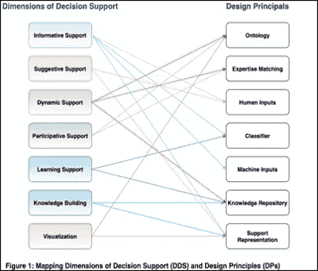
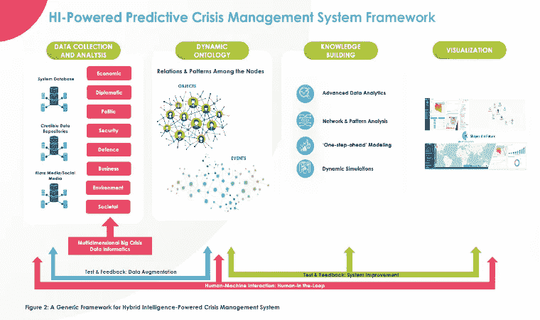

# 决策支持中的混合智能和一个用例:预测性危机管理

> 原文：<https://towardsdatascience.com/hybrid-intelligence-in-decision-support-and-a-use-case-predictive-crisis-management-916fe9a4a68?source=collection_archive---------46----------------------->

## [人工智能校准和安全](https://towardsdatascience.com/tagged/ai-alignment-and-safety)

## 如何应对决策技术中的人工智能挑战

**1。** **背景**

**a.** **欧盟最新规范和法规**

多年来，欧盟委员会一直在促进和改善整个欧盟的人工智能合作，以提高生产力，确保基于欧盟价值观的信心。继 2018 年[欧洲人工智能战略](https://ec.europa.eu/transparency/regdoc/rep/1/2018/EN/COM-2018-237-F1-EN-MAIN-PART-1.PDF)发布后，经过广泛的利益相关方咨询，人工智能高级专家组(HLEG)于 2019 年制定了[可信人工智能指南，并于 2020 年制定了可信人工智能评估清单。与此同时，2018 年 12 月发布了首个人工智能](https://digital-strategy.ec.europa.eu/en/library/communication-building-trust-human-centric-artificial-intelligence)[协调计划，作为与成员国的共同承诺。委员会在 2020 年发布的关于人工智能的白皮书为人工智能在欧洲提出了一个清晰的愿景:为卓越和信任的生态系统铺平道路，并为今天的提议奠定基础。《人工智能白皮书》的公众咨询吸引了世界各地的广泛参与。白皮书附有一份关于人工智能、物联网和机器人的安全和责任影响的'](https://ec.europa.eu/commission/presscorner/detail/en/IP_18_6689)[报告'](https://ec.europa.eu/info/publications/commission-report-safety-and-liability-implications-ai-internet-things-and-robotics-0_en)，得出结论认为，当前的产品安全立法包含几个需要解决的漏洞，特别是在机械指令中。

欧盟最近提出了“欧洲议会和理事会制定人工智能统一规则([人工智能法案](https://ec.europa.eu/commission/presscorner/detail/en/IP_21_1682))和修订某些联盟立法法案的条例提案”。

**b.** **欧盟规范和法规的要点**

欧洲人工智能方法的主要组成部分是:

*   该政策框架列出了将欧洲、国家和地区倡议更紧密地联系在一起的步骤。该框架的目标是动员资本沿着整个价值链建立一个“卓越的生态系统”，最早从研发开始。该框架还旨在建立正确的激励机制，以促进采用基于人工智能的解决方案，包括中小型企业。
*   人工智能的潜在欧洲监管结构的核心组成部分将建立一个独特的“信任生态系统”。委员会强烈支持以人为中心的方法，并考虑了人工智能高级专家组编写的道德准则。
*   欧洲数据战略旨在帮助欧洲成为世界上最具吸引力、最稳定、最具活力的数据敏捷经济体，使欧洲能够利用数据改善决策，改善全体人民的生活。
*   通信概述了术语“以人为中心”和“人为监督”。但是对于“人在回路中”的方法和新兴的方法——混合智能——却没有给予足够的重视。
*   关于人工智能驱动的决策，欧盟试图建立一个强大的法律框架——在数据保护、基本权利、安全和网络安全方面，以及与各种规模和各种产业基础的竞争性公司的内部市场。另一方面，这些沟通中缺少的一点是，通过商业和公共部门的数据做出更好的决策需要跨职能的人机团队和高级人机交互。

**2。** **分析**

欧洲已经建立了对人工智能的成功至关重要的强大的计算基础设施(例如高性能计算机)。欧洲还有大量未被充分利用的公共和工业数据。它在生产安全、稳定、低功耗的数字系统方面拥有公认的工业优势，这些系统对人工智能的发展至关重要。利用欧盟投资下一代技术和基础设施的能力，以及数据驱动的转型和数据敏捷经济等数字能力，欧洲在数据经济的关键使能技术和基础设施方面的技术主权将会增加。然而，像中国和美国这样的竞争对手现在正在快速创新，并将他们的数据访问和使用理念推广到世界各地。因此，除了在其他领域的努力之外，强化欧盟作为全球行动者的角色需要对颠覆性技术采取统一和全面的方针。在这种背景下，[成员国之间的分裂](https://ec.europa.eu/info/sites/default/files/communication-european-strategy-data-19feb2020_en.pdf)对于欧洲共同信息空间的愿景和下一代技术的发展是一个重大风险。

谈到欧盟委员会设立的人工智能高级别专家组提出的 AI 提出的关键关切，为了理解威胁的范围，值得提及以下最重要的关切:

-被禁止的人工智能做法，例如，通过超越人们意识的潜意识技术操纵人们，或利用特定的弱势群体，或操纵自由选择，或生物识别系统，或预测性警务，这是压倒性和压迫性的，

-高风险人工智能系统，如拟用作接受第三方事先合格评估的产品的安全组件的人工智能系统，

-隐蔽的人工智能系统，不能确保人类意识到——或者能够请求和验证——他们与人工智能系统交互的事实，

-算法决策系统的安全漏洞，这是由于恶意行为者可以利用的高度复杂性，

-具有认知技能的致命自主武器系统，可以在没有人类干预的情况下决定与谁、何时、何地作战。

为了应对人工智能的这些挑战，混合智能可能是一个值得信赖和可持续的选择。混合智能指的是人类和人工智能的完美结合。机器学习/人工智能可以根据以前案例中发现的模式进行统计推断，并随着数据输入的增加进行学习。此外，这种程序允许对模型配置中的复杂趋势以及单个组件之间的相互关系进行[检测，扩展了模拟和场景等方法。尽管如此，他们仍然无法](https://www.sciencedirect.com/science/article/abs/pii/S0893608019301583)[预测对案例的软的和主观的评估](https://www.researchgate.net/publication/318678765_Machine_learning_to_classify_and_predict_objective_and_subjective_assessments_of_vehicle_dynamics_the_case_of_steering_feel)，例如价值主张的创新性、团队的愿景或契合度，或者商业模型的整体准确性，这使得计算机不可能对这些数据进行注释。

因此，人类可以成为[评估数据的黄金标准](https://dukeundergraduatelawmagazine.org/2021/04/24/a-new-gold-standard-the-european-union-proposes-significant-regulations-on-artificial-intelligence/)，这些数据难以为创造力和创新等机器学习模型进行注释和训练。人类擅长对难以用统计方法客观量化的数据做出主观判断。此外，人类专家拥有组织良好的领域专业知识，允许他们识别和解释稀缺的数据。另一方面，由于人类确实有认知限制，这些可以通过混合智能过程来缓解。这种方法结合了更多人的意见，以最大限度地减少个人评估中的噪音和偏见。因此，通过访问更多样化的领域信息，将其合并到算法中，并降低有偏见的解释的风险，混合智能代表了补充机器学习系统的一种适当方式。

换句话说，通过整合人类和机器的互补能力，共同产生卓越的结果，并通过相互学习不断进化，混合智能驱动的决策支持极有可能改善个人决策活动的结果。此外，混合智能用于利用人类的智慧，同时最大限度地减少机器的缺点，如偏见和随机误差。这支持了混合系统可以像全自动系统一样运行的观点。涉及人类互动的每一个阶段都需要系统以这样一种方式构建，即人类可以理解它并采取后续行动，以及在决定关键步骤时的一些人类行为。此外，人类和人工智能一起工作来完成任务，使操作更加合理。这种系统不仅在生产率和正确性方面有价值，而且在人的选择和能动性方面也有价值。通过适当的界面进行持续的人工交互，可以加快对计算机无法处理的复杂或新颖数据的标记，降低与数据相关的错误和自动化偏差的风险。

混合智能驱动的系统可以确保数据和模型是正确的、相关的、透明的、可解释的和成本有效的，特别是在复杂问题的情况下。特别是对于改变生活的任务，如给予或不给予签证，检测和决定治疗，与全自动系统相比，混合智能驱动的决策系统可以提供问责制和透明度。总而言之，混合智能驱动的决策系统可以胜过单独的人工智能或基于人类的解决方案。然而，开发这样一个具有高科技隐私和准确性的决策系统需要一个非常有才华的跨职能人机团队和创新的方法。在这种背景下，为了设计这样的决策支持系统配置，图 1 绘制了决策支持(DDS)和设计原则(DPs)的维度。在这种配置中，DDS 定义为:

信息支持:没有任何建议或暗示如何行动的决策支持。

建议性支持:对如何锻炼提出建议的决策支持。

动态支持:向用户学习并提供按需指导。

参与式支持:基于用户输入的决策支持(特别是对于高度复杂的任务)。

学习支持:使用户能够主动决定需要和/或想要哪些信息的指导。

知识构建:产生新的认知工件。

视觉化:知识的心理图像。

因此，提议的存款计划如下:

DP 1:为混合智能决策支持系统(HP DSS)提供基于本体的表示，以传输主题专家(SMEs)的假设和输入，并在机器和人类之间创建共享的理解。

DP 2:通过推荐系统为 HP DSS 提供专业知识匹配(如简单的标记系统，将某些本体模型与特定领域专家匹配，以确保高的人工指导质量)。

DP 3:为惠普决策支持系统提供定性和定量的反馈机制，使人们能够提供充分的反馈。

DP 4:为 HP DSS 提供一个分类器(例如，分类和回归树)，以便根据人工计算预测模型设计选项的结果。

DP 5:为 HP DSS 提供机器反馈能力，以便根据机器输出预测模型设计选项的结果(例如，前馈人工神经网络、支持向量回归或递归神经网络)

DP 6:为 HP DSS 提供一个知识构建存储库，使其能够从流程中学习。

DP 7:为 HP DSS 提供一个可视化工具，允许用户访问信息性和建议性的决策支持。

作者图片

**3。** **案例:预见性危机管理**

政府、研究和商业行为者越来越依赖算法决策。许多计算机算法建立在传统数据分析方法的[之上，这些方法利用统计技术发现变量之间的关系，然后预测结果。但是如前一节所述，特别是在高度复杂和不确定的情况下，由于](https://www.researchgate.net/publication/322620283_From_Conventional_Data_Analysis_Methods_to_Big_Data_Analytics)[算法决策](https://www.europarl.europa.eu/RegData/etudes/STUD/2019/624261/EPRS_STU(2019)624261_EN.pdf)的不足，混合智能决策系统在冲突和危机&运营管理和执法活动等情况下提供更好的决策支持方面有着重要的前景。

由于欧盟正在追求成为一个全球性的行动者，因此获得高价值的能力是至关重要的，如战略预见分析、预测危机和运营管理、游戏和模拟。更重要的是，每个月都有成千上万的人死于世界各地的大规模政治暴力，迫使更多的人在国内或跨境逃亡。武装冲突具有毁灭性的经济影响，破坏民主制度的运作能力，阻碍国家摆脱贫困，并阻碍最需要的人道主义援助。当大规模危机和冲突发生在意想不到的地方和时间时，避免、最小化和适应大规模危机和冲突的困难就会加剧。不用说，一个在所有有冲突风险的地方提供预警并评估冲突爆发、升级、持续和解决的可能性的系统将对欧盟决策者和第一反应者大有裨益。

毫无疑问，冲突和危机的不确定性是设计决策架构的主要挑战。为了通过提前做好准备来解决处理危机或冲突的问题，混合智能危机管理系统可以提供一个适用于整个[危机生命周期](https://www.noggin.io/blog/the-stages-of-crisis-understanding-the-crisis-management-lifecycle)、危机前准备、危机期间响应和危机后响应的综合框架。因此，可以系统地定义行为者和事件的功能行为模式，然后分析模式和关系，从而获得早期预警，预测他们未来的行动，最终发现、减轻和预防潜在的危机和冲突以及关键机会的可能性。此外，系统必须确保人机交互，并保持人在回路中的通道。基于这些论点，该框架将有四个主要支柱:

-采用全面的数据收集和分析模型，

-构建动态本体结构并通过寻找本体的节点之间的关系来构建网络，

-构建知识提取管道:使用结合了提议的网络拓扑和模式识别方法的统一检测方法，开发模拟模型，例如[一步到位建模](https://www.sciencedirect.com/science/article/pii/S0140988313001746)或[动态模拟](https://www.nature.com/articles/s41467-020-15651-9)

-开发可视化系统。

图 2 显示了一个混合智能驱动的危机管理系统的通用框架。大部分危机分析研究都是回顾性的，包括描述性分析和诊断性分析。前瞻性分析，如预测性和规范性分析，相对来说受到的关注相对较少。因此，根据这一框架，连接输入层和输出层的知识管道将由四个基本步骤组成:描述性分析(发生了什么？)，诊断分析(为什么会发生？)，预测分析(会怎么样？)，最后是规定性分析(我们该怎么办？).

总之，以情报为动力的混合危机管理系统将极大地改变危机和冲突管理流程以及整个危机信息学生态系统。多维大危机数据信息学既包括海量数据，也包括广泛的数据源(可以由多种数据类型组成)。这些大规模危机数据源中的每一个都提供了一个独特的(但必然是不完整的)视角，来观察到底发生了什么以及为什么会发生。动态本体提供了事件和对象的混合识别模型，并以其独特的结构保证了可重用性。知识建设支柱包括预测性和规范性危机分析以及模拟，这些将成为先发制人的危机和冲突管理的核心能力。最后，可视化为各种用户和利益相关者提供了可解释性和无摩擦的互通平台，确保了响应和管理工作的互操作性和协调性。

作者图片

**4。** **结论和政策建议**

从欧盟的角度来看，人工智能是一项战略技术，如果它以人为中心，符合伦理，可持续发展，同时仍然尊重基本权利和价值，它可以为人民、企业和整个社会的福祉做出贡献。欧洲人工智能战略旨在提升欧洲的人工智能创新潜力，同时促进欧盟经济中道德和值得信赖的人工智能的增长和采用。最新的欧盟规范和条例特别强调可信度、可解释性、准确性和人类参与。然而，当涉及到决策支持或算法决策系统时，似乎欧盟人工智能的观点需要用混合智能方法进行审查。尽管在最近的欧盟通信中已经强调了一些术语，如“以人为中心”或“人为监督”,但在欧洲利用混合智能系统仍需要深入理解和全面的方法。简而言之，欧盟必须避免在许多公众眼中的欧盟运作黑箱中运行算法黑箱。

因此，欧盟应该寻求在其内部流程中更多地使用混合情报，并将其作为欧盟委员会决策和现有政策审查的一项投入。为此，向欧盟提出的以下政策建议概述如下:

-管理共同欧洲混合情报战略的立法框架，并据此启动《混合情报法》;

-促进对高级人机交互系统的投资，加强欧洲在托管、处理和使用人在回路和互操作性方面的能力和基础设施

-投资欧洲混合智能战略的高影响力项目，包括数据共享和人机交互架构(包括标准、最佳实践、工具)和治理机制，以及欧洲可信混合智能联盟和相关服务

-让大学、实验室、研究中心、初创企业和中小型企业投资于混合智能的使用以及人机之间的互操作性

-在 Horizon Europe 项目组合中增加新的项目号召，鼓励使用混合智能。