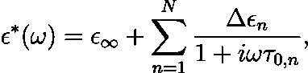

# 多极德拜介电函数近似的线性-非线性混合优化方法

> 原文：<https://towardsdatascience.com/hybrid-linear-nonlinear-optimization-approach-to-the-approximation-of-multi-pole-debye-dielectric-9163aa86baeb?source=collection_archive---------41----------------------->

## [思想和理论](https://towardsdatascience.com/tagged/thoughts-and-theory)

*在我之前的* [*帖子*](https://medium.com/@sylwia.majchrowska/modelling-dispersive-materials-with-gprmax-software-during-google-summer-of-code-2021-adventure-b9042b4e9341) *中，我介绍了我在 Google Summer of Code 2021 期间所做的一些工作，这些工作与色散材料的电特性建模有关。在帖子里，我想分享我最终提交的结果。*

特里·维利迪斯在 [Unsplash](https://unsplash.com?utm_source=medium&utm_medium=referral) 上拍摄的照片

使用外部电场可以极化某些种类的材料。这些电磁绝缘材料被称为电介质。它们的极化是由内部电荷的轻微运动引起的(正的方向与外部磁场的方向相反，负的方向与外部磁场的方向相反)。这产生了一个内部电场，在某些情况下，还可以重新定向材料的分子。为了测量材料的电极化率，使用了称为介电常数的变量(由希腊字母 *ε* 表示)。

> 具有高介电常数的材料比具有低介电常数的材料响应于施加的电场极化更多，从而在材料中存储更多的能量。介电性质的研究涉及材料中电能和磁能的储存和耗散，对于解释各种物理现象非常重要[1]。

此外，一些材料表现出介电色散。这意味着电介质材料的介电常数取决于外加电场的频率。这种频率依赖性反映了一个事实，即当施加电场时，材料的极化不会立即改变。材料的响应总是在施加电场后出现，在振荡电场的情况下，会出现特征介电弛豫过程[1]。

*宽频率范围内的介电常数谱。ε′和ε″分别表示介电常数的实部和虚部。影响材料响应的各种过程被标记在图像上。图片由[1]提供。*

# 松弛函数的变体

德拜方程模拟角频率ω的交变电场中的弛豫过程，描述理想的非相互作用电偶极子群体的介电弛豫响应。作为极化指数衰减的基本原理，复介电常数由德拜函数给出为[2]

这里，实部ε′(ω)是介电常数，虚部ε″(ω)是损耗因子，I =√–1。ε *s* 为静态介电常数，ε∞为无限频率介电常数，τo 为弛豫时间，为弛豫过程的特征时间。

*德拜函数的实部和虚部。f0 是弛豫频率。图片作者。*

然而，单极德拜方程是大多数材料在宽频率范围内的介电行为的不良模型。为了克服这一点，经验导出的 Havriliak–Negami 弛豫被提出作为单极德拜弛豫模型的修改。该方程另外具有两个指数参数，并表示为[3]

其中α和β为正实常数(0 ≥ α，β ≤ 1)。根据该模型，可以推导出β=1 时的科尔-科尔方程[4]和α=1 时的科尔-戴维森方程[5]。当α=1，β=1 时，得到再见方程。Havriliak-Negami 函数首先用于描述聚合物的介电特性[3]，而 Cole-Cole 方程主要用于模拟生物组织[6]和液体[7]。

另一方面，恒定 Q 因子方法(或品质 Q 因子)[8]中的 Jonscher 函数主要用于描述混凝土[9]和土壤[10]的介电特性。其他类型的弛豫函数估计非均质材料的体积介电常数。这里，复折射率模型(CRIM) [11]可以根据其组分的介电性质和体积分数来说明混合物的介电性质。

Havriliak-Negami、Jonscher 函数以及稳定的 Q 因子、CRIM 和实验获得的数据不能直接应用于 FDTD 算法。许多研究人员采用的方法是使用多极德拜展开法，利用多个弛豫时间和形式[12]中的无量纲权重对复介电常数进行近似

εn 和τ0，N(N = 1，2，…，N)分别是德拜色散的介电常数(重量)和弛豫时间的变化。参数 N 表示德拜极点的数量(德拜展开分量的总数)。多极德拜模型被广泛使用，因为它可以容易地在时域和频域中表达。

# 寻找松弛时间和无量纲权重

多极德拜拟合过程的目标是最小化目标函数，该目标函数是所选择的弛豫模型(这里我们有 Havriliak-Negami、Jonsher、CRIM 或实验数据)和德拜展开的近似形式之间的差异。任务中的函数被明确定义，包括两倍于德拜极点数量的变量，因为我们要计算弛豫时间和无量纲权重。

由于色散材料的因果性质，介电常数的实部和虚部通过 Kramers-Kronig 关系彼此相关。这表明，对于相同的参数，介电常数的实部和虚部可以用德拜函数的和来近似表示。然后，可以仅对虚部的实值展开进行优化过程。在文献中，一些单一的非线性优化程序被用来寻找所有的未知参数(即权重和松弛时间)。然而，因为展开是德拜函数的线性组合，所以更有效的方法是使用线性最小二乘法(LS)来找到权重，使用非线性方法来找到弛豫频率，这里默认使用粒子群优化(PSO)技术。

用粒子群算法寻找函数的全局最小值。图片由[维基共享](https://commons.wikimedia.org/wiki/File:ParticleSwarmArrowsAnimation.gif)提供。

gprMax 子包 ***DebyeFit*** 中采用的技术是 Kelley 等人[13]提出的混合线性-非线性优化方法的修改。这些调整可以克服一些不稳定性问题，从而使该过程更加稳健和快速。特别地，在负权重的情况下，符号被反转，以便在优化过程中引入大的惩罚(从而间接地约束权重总是正的)。此外，介电常数的近似实部和计算实部之间的差异被添加到成本作用中，以避免可能的不稳定性。

# 代码结构

gprMax 子包 ***DebyeFit*** 包含两个主要脚本:

*   ***Debye_fit.py*** 带有所有松弛函数类的定义，
*   ***optimization . py***定义了三种选择的全局优化方法。

***类弛豫*** 设计用于模拟不同的弛豫函数，如 Havriliak-Negami(` havriliaknegami 类')、Jon scher(` Jon scher 类')、复折射率混合(` CRIM 类')模型，以及通过实验得出的或使用其他函数计算的任意介电数据(` Rawdata 类')。所选对象类型的构造器构造适当的松弛对象，并定义其所有参数，以及频率点网格。

***类优化器*** 支持全局优化算法(粒子群、对偶退火、进化算法),用于找到一组最佳松弛时间，使实际电容率和近似电容率之间的误差最小化，并计算给定松弛时间的优化权重。这里编写的代码主要基于外部库，如“scipy”和“pyswarm”。优化器对象是在松弛模块中创建的。用户可以从三种优化算法中选择一种，并以 python 字典的形式显示其属性。

通过使用 run 方法，在松弛对象初始化之后启动拟合过程。函数内部实现的算法由以下步骤组成:

1.  使用 check_inputs 方法检查输入的有效性。
2.  使用 print_info 方法打印关于所选近似设置的信息。
3.  使用计算方法计算实部和虚部，然后设置 self.rl 和 self.im 属性。
4.  使用 optimize 方法调用主优化模块，并根据 error 方法计算误差。[可选]如果德拜极点的数量设置为-1，则重复优化程序，直到百分比误差小于 5%或达到 20 个德拜极点。
5.  使用 print_output 方法以 gprMax 格式打印结果
6.  [可选]使用 save_result 方法以 gprMax 格式将结果保存在 txt 文件中
7.  [可选]使用 plot_result 方法绘制实际和近似的介电特性。

*最终用户可以绘制实际和近似电容率以及频率范围内的误差。图片作者。*

# 总结

为 [gprMax](https://www.gprmax.com/) 工作是一次很好的学习经历。gprMax 是构建大型复杂 GPR 模拟的强大工具。它在许多领域的广泛应用证实了它的有用性。

这项工作描述了新的先进建模功能的增加，如拟合实验得出的或使用某些弛豫函数计算的任意介电数据的可能性。这里采用的混合线性-非线性优化方法提供了一种有效且精确的优化程序，以将多极德拜展开拟合到介电数据。

# 文学

[1]应用笔记 1217–1，*测量材料介电特性的基础知识*，惠普文献编号 5091–3300 e，1992 年。

[2] P .德拜，*极地分子*，多佛出版公司，纽约州，1929 年。

[3] S. Havriliak 和 S. Negami，*某些聚合物中介电和机械松弛过程的复平面表示*，聚合物，第 8 卷，第 161-210 页，1967 年。

[4] K. S. Cole 和 R. H. Cole，*电介质中的分散和吸收，交流电流特性*，化学物理杂志，第 9 卷，第 341-351 页，1941 年。

[5] M. F .曼宁和 M. E .贝尔，*固体电介质中的导电和相关现象*，修订版。物理学，第 12 卷，第 215-257 页，1940 年。

[6] D. Ireland，A. Abbosh，*使用优化的德拜模型和 FDTD 方法在微波频率下模拟人体头部*，IEEE Trans。天线与传播，第 61 卷第 4 期，第 2352–2355 页，2013 年。

[7] J. Barthel、R. Buchner 和 M. Munsterer，“电解质数据收集，第 2 部分:水和水性电解质溶液的介电特性”，系列。化学数据系列。德国法兰克福:DECHEMA，第十二卷，1995 年。

[8] M. Bano，*遵循介电常数频率复幂定律的有损介质的探地雷达波建模*，地球物理勘探，第 41 卷，第 11–26 页，2004 年。

[9] T. Bourdi、J. Rhazi、F. Boone 和 G. Ballivy，*Jonschermodel 在混凝土介电常数表征中的应用*，物理学杂志 D:应用物理学，第 41 卷，第 205410 页，2008 年 10 月。

[10] E. Kjartansson，*恒定 Q 波传播和衰减*，地球物理研究杂志，第 84 卷，第 4737-4748 页，1979 年。

[11] J. R. Birchak，C.G. Gardner，J.E. Hipp，J . M Victor，*用于检测土壤湿度的高介电常数微波探头*，Proc .IEEE，第 62 卷，第 93-98 页，1974 年。

[12] C. A. Balanis，*高级工程电磁学*，纽约州:威利市，第二区。2.8.1, 1989.

[13] D. F. Kelley，T. J. Destan 和 R. J. Luebbers，*使用混合粒子群最小二乘优化方法对复介电常数进行德拜函数展开*，IEEE 天线与传播汇刊，第 55 卷，第 7 期，第 1999–2005 页，2007 年 7 月。

 [## [GSoC 2021]通过 majsylw 拉动请求#296 gprMax/gprMax 模拟复杂材料

### 这个拉取请求包含了我在 GSoC 2021 期间所做的工作。

github.com](https://github.com/gprMax/gprMax/pull/296)