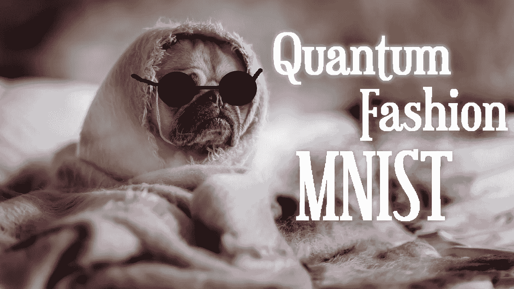
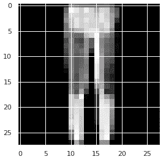
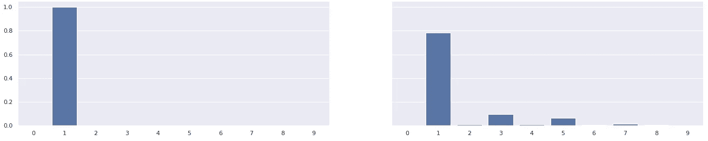
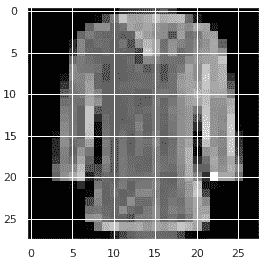
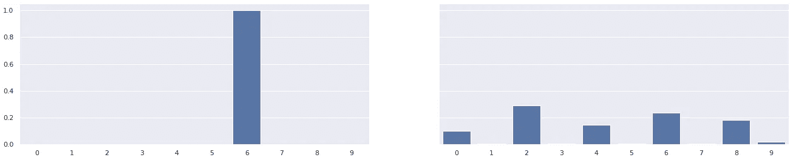
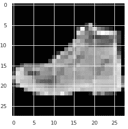
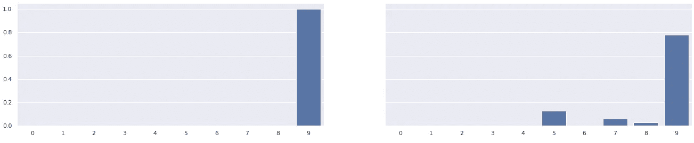

# 简化 MNIST 数据的混合量子神经网络

> 原文：<https://towardsdatascience.com/hybrid-quantum-neural-network-for-reduced-mnist-data-840897ad08a?source=collection_archive---------12----------------------->

## 用少于 200 行的 Pennylane 和量子变分电路求解时尚 MNIST

量子时尚 MNIST 的标志图片。编辑自[马太·亨利](https://unsplash.com/@matthewhenry?utm_source=unsplash&utm_medium=referral&utm_content=creditCopyText)在 [Unsplash](https://unsplash.com/s/photos/cute?utm_source=unsplash&utm_medium=referral&utm_content=creditCopyText) 上的照片

Q *uantum 机器学习* (QML)已经被证明在低输入维度的机器学习问题上是有效的。杰尔比[1]和欧文[2]已经解决了南极环境问题。量子卷积已被用来解决一个简化版本的 Mnist 数字数据集[3]。

另一种基于降维算法的解决方案已经提出[4]，但在这篇文章中，我们将只关注基于变分量子电路(VQC)的实现。我们将开发一个量子神经网络，使用 Pennylane 以稍微减少的输入对 MNIST 时装数据集进行分类。

# 介绍

我们将尝试使用 QML 解决的问题是使用 VQC 对 MNIST 数据集进行分类。由于解决整个问题需要时间，我们将使用一个降维的数据集。我们将尝试在我们的 VQC 中适应的维度将是 64，而不是最初的 784。

我们将使用运行在 Colab 机器上的 Python 代码。在这个 Colab 上，我们需要安装 Pennylane 作为量子机器学习库，我们将使用已经安装的 Tensorflow 作为接口。

# 数据准备

第一步或目标将是准备图书馆和加载我们心爱的 MNIST 数据。

完成设置后，我们将定义用于模型的参数。

数据的过滤是通过选择我们感兴趣的列表中的类别的索引来完成的。这段代码确实是临时的，我相信有更好的实现。

# 使用自动编码器预处理

选择用于降低数据维度的模型是一个非常简单的自动编码器模型，基于 Tensorflow 自己的教程。[5]

我们将使用相对于量子位数量的潜在维度大小。层数和每层中神经元的数量由用户决定。

对数据进行编码就像将数据传递给编码器一样简单。然后，我们需要将输出替换为分类值。

# 量子神经网络(QNN)

我们现在将准备量子网络来分类我们的时尚数据。首先，我们将简单介绍一下 VQC。

**变分量子电路**是一个量子电路，它依赖于许多自由参数，我们可以手动调整这些参数，或者用学习算法来逼近某个函数。它可以被视为一个具有可学习参数的数学近似模型。它们的工作方式类似于神经网络及其权重。

## 该电路

为了使用量子计算机或模拟器，我们需要导入我们的库和将要使用的层。

我们将使用的两个主要层是:

*   **mottonestatepreparation:**处理振幅状态准备。振幅状态准备包括将一个量子状态固定到一个给定的向量上，该向量的维数等于量子位数量的 2 次方。
*   **strong 纠缠层:**量子神经网络门，它旋转每个量子比特，然后以循环的方式将它们与 CNOT 纠缠在一起。这一层类似于神经元之间的致密层，但它们以量子方式表现。

***注意*** *:我们在这个电路中不使用 AmplitudeEmbedding 的原因是由于 Pennylane 中的一个已知问题，尽管在运行实际的量子计算机时，这个算法会适用。*

该模型将使用强纠缠层来近似最小化某个损失函数的函数。此外，我们将使用一种称为“数据重新上传”的技术，它包括对网络中的输入数据进行多次采样。众所周知，这种技术可以改善电路效果。[6]

我们将使用的 QNN 模型由上面定义的量子电路组成，后面是一个致密层来准备输出。

一旦模型编译完成，我们就可以用之前选择的数据训练模型了。由于训练可能需要 3 个小时，但在第一个纪元后没有太大改善，我们将把训练限制在第一个纪元。进一步的时代可能会改善系统，但这是留给读者的一个练习。；)

使用这个参数，我们得到了 95%的分类准确率。

如果我们实际上试图使用相同的 6 个量子位和 10 个类，训练过程将花费更长的时间，并且准确率将下降到适度的 70%。虽然这不像带有 4 个标签的 previus 95%那样令人印象深刻，但它表明这些模型确实有能力解决实际问题，而无需太多的经典处理。

让我们来看看 10 个标签的例子，QNN！
*警告，这在所有人看来都没什么了不起。*

## 示例 1:一对 troursers

MNIST 数据集的裤子图像

前一图片类别(左)和图片预测(右)

QNN 可以清楚地检测出图片是一条裤子。

## 示例 2:失败的示例

MNIST 数据集的衬衫图像

前一图片类别(左)和图片预测(右)

这个例子对我们的网络来说似乎很难，因为它打印了 5 个可能的类别。当查看预测的类别时，有趣的事情出现了:检测到的标签都是衬衫类型的标签，而所有鞋子和裤子都被丢弃了！

## 例子 3:鞋子很奇怪

MNIST 数据集的鞋子图像

前一图片类别(左)和图片预测(右)

有些鞋确实比其他鞋有更好的结果，但总的来说，它们倾向于聚集在鞋的标签上。

# 结论

正如我们刚刚看到的，量子神经网络比我们想象的更接近现实生活，一些实际案例已经在入门环境和数据集上实现。

在本帖中，我们已经证明了可以使用 QNN 对时尚 MNIST 数据进行分类，并在稍微降低维度的数据上取得良好的结果。我们在 64 维数据上用 4 个标签实现了 95%的准确率，用 10 个标签实现了 70%的准确率。作为第一步，我们可以开始想象在不久的将来，只有 10 个量子位的系统将能够在不减少数据的情况下对整个数据集进行分类！

# 参考

[1] S. Jerbi，[用于强化学习的变分量子策略](https://arxiv.org/abs/2103.05577) (2021)，ArXiV
[2] O. Lockwood 和 M. Si，[利用量子变分电路的强化学习](https://arxiv.org/abs/2008.07524) (2020)，ArXiV
[3] E. Farhi 和 H. Neven，[在近期限处理器上利用量子神经网络进行分类](https://arxiv.org/pdf/1802.06002.pdf) (2018)，ArXiV
[4] I. Kerenidis 和 A. Luongo，【T10 Tensorflow Core
[6] A. Perez，a .塞尔韦拉，E. Gil，José L .，[通用量子分类器的数据重新上传](https://arxiv.org/pdf/1907.02085.pdf) (2020)，ArXiV