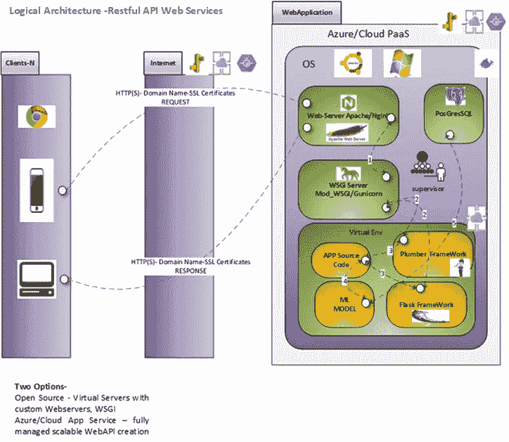
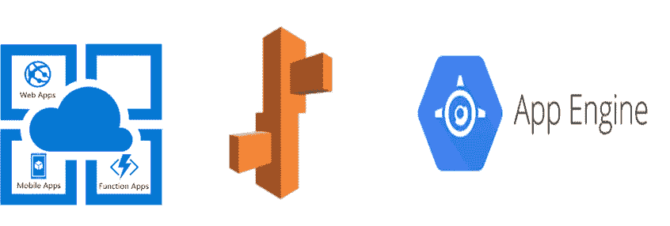
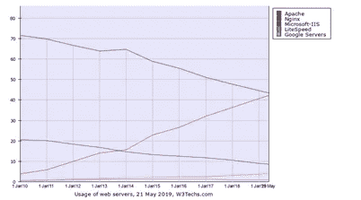
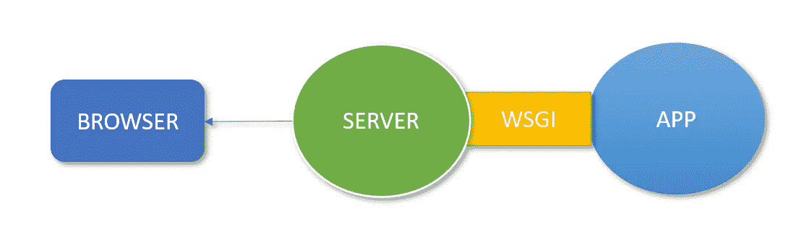
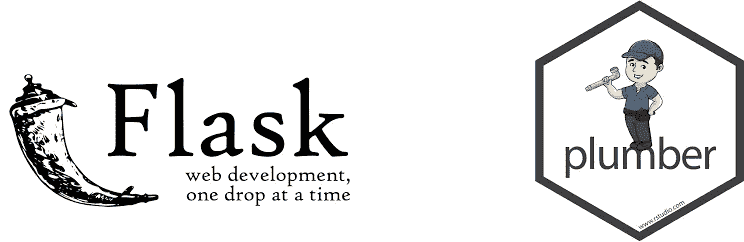
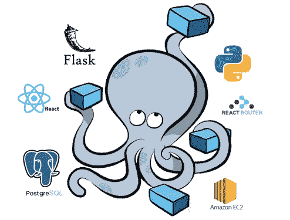

# 面向数据科学家的混合云/基于边缘的 AIML 模型部署架构

> 原文：<https://towardsdatascience.com/hybrid-rest-api-design-and-architecture-for-data-scientists-617cf3637542?source=collection_archive---------48----------------------->

AIML 应用服务统一架构@版权所有-作者图片

# **简介**

机器学习模型的部署是数据科学过程的关键要素之一。通常，数据科学家在部署部分努力将模型公开为一个无缝的 API，供许多端点使用。在本文中，我将解释 API 的架构和设计——本地的和云的。数据科学家最流行的框架是基于 python 的 Flask API 服务器和面向 R 用户的 Plumber。我们将探索如何在生产环境中使用这些框架来使 API 更加健壮、可伸缩和容错。

# **平台即服务(PaaS)或本地服务器**

web 应用程序的核心是应用程序将要驻留和执行的服务器。它构成了 web 应用程序的基础。它也被称为应用程序的生产环境。它可以是单个服务器，也可以是部署在本地或云上的服务器集群。托管可以是裸机硬件，如戴尔、IBM 等，用于在本地构建应用程序，也可以是基础架构即服务，即基于云的裸机硬件，如 EC2 for Amazon、VM for azure。云部署的另一个选项是平台即服务，从裸机硬件到操作系统、web 框架和 Web 服务器，Web 应用程序的所有组件都作为完全托管的现成服务提供。如图所示，Azure App Service、亚马逊弹性豆梗、GCP App Engine 是几个比较流行的基于云的 PaaS。

OS——操作系统构成了控制和管理 HWs、软件资源的主要系统，计算机程序可以在该系统上执行。对于 web 应用程序，可以使用基于 Linux、Windows 或 macOS 的核心操作系统。最受欢迎的是基于 Linux 的版本，适用于本地和虚拟应用程序。

# **网络服务器**

如图所示，web 服务器响应来自客户端的 HTTP 请求，并以 JSON、XML 或 HTML 格式返回状态代码和内容。从数据科学的角度来看，JSON 格式是最流行的 web 服务器响应形式。它还充当 WSGI 服务器的反向代理。反向代理只是 WSGI 和外界之间的一个中间层。web 服务器面向外部世界，并将请求重新路由到 WSGI 服务器。随着您的应用程序的增长，我们希望在服务器(VPS)之间优化和分布它，以便能够同时处理更多的连接。在您的应用服务器前面有一个反向代理有助于无缝扩展。

跨多个应用程序实例的负载平衡是一种常用的技术，用于优化资源利用率、最大化吞吐量、减少延迟以及确保容错配置。

Web 服务器有一个高效的 HTTP 负载平衡器，将流量分配给几个应用服务器，并提高 web 应用程序的性能、可伸缩性和可靠性。

流行的 Web 服务器是 APACHE 和 NGINX。几十年来，Apache 一直是领先的 web 服务器，但 NGINX 现在已经占据了大约 50%的 web 流量。NGINX 比 apache 有性能优势，而且相对容易配置。如果您想使用 apache，它会预装在 Linux 发行版中。

w3techs 的[数据显示，Nginx 的市场份额一直在稳步增长，将 Apache 挤出，从第一的位置上退位。](https://w3techs.com/technologies/history_overview/web_server/ms/q)

如果你想知道更多关于 Apache Vs NGINX 的细节，你可以访问 https://kinsta.com/blog/nginx-vs-apache/的

对于 HTTP 请求，如果您不想直接输入服务器 IP，而是使用 URL，最好进行域名注册，并获得 SSL/TLS 证书，以保护和加密到您的 web 服务器的交易。由于 web 服务器是面向世界的，它暴露在许多安全威胁之下，因此用 HTTPS 加密来保护它是很重要的。

对于内部部署，其中 API 服务器用作其他内部应用程序的微服务，使用直接的基于 IP 的 HTTP 访问。如果需要，我们可以用 SSH 密钥和防火墙来保护服务器。

# **WSGI 服务器**

Apache，NGINX 不懂 Python web 应用的运行方式。WSGI——Web 服务器网关接口——是专门为理解 python 应用程序并将其传递给 Apache、NGINX 等 Web 服务器而设计的。它是标准化的，以促进 web 应用程序在不同的 WSGI 服务器实现之间的可移植性，如 Gunicorn Mod_wagi、uwsgi 等。如果你使用 Apache，那么使用 Mod_wsgi，而对于 NGINX，Gunicorn 是一个流行的选择，因为它只需要很少的配置。

作者图片

如果你使用基于云的应用服务，它默认使用现成的 Gunicorn WSGI 服务器。

关于 WSGI 的更多细节可以在@

[https://wsgi.readthedocs.io/en/latest/servers.html](https://wsgi.readthedocs.io/en/latest/servers.html)

[https://www . app dynamics . com/blog/engineering/an-introduction-to-python-wsgi-servers-part-1/](https://www.appdynamics.com/blog/engineering/an-introduction-to-python-wsgi-servers-part-1/)

# **Web 框架**

Web 框架是负责构建 web 应用程序(如 HTTP 请求、响应、URL 路由、身份验证、数据处理、安全性、会话)的工具的库。

对于数据科学家来说，流行的 Web 服务器是 Python 开发人员的 Flask 和 R 开发人员的 Plumber。Flask 和 Plumber 都有无缝连接 WSGI 服务器的能力。

注意 web 框架如何与应用程序源代码、模型和后端数据库(如果有)进行交互。通常顶层包装器——python 或 R——会调用 web 框架实例以及其他依赖项来创建应用程序。

还要注意，云应用服务将只提供容器化、WSGI 支持和内置的 web 服务器，以及完全托管的服务。使用 web 框架创建应用程序是数据科学家需要编写的底层代码。

# **主管**

ref-[https://www . opensourceforu . com/2019/10/how-to-run-multiple-services-inside-a-single-container-using-supervisord/](https://www.opensourceforu.com/2019/10/how-to-run-multiple-services-inside-a-single-container-using-supervisord/)

想象一下当你的 Flask 或 Plumber 应用程序崩溃或者实际的服务器重启时的情况。为了维护应用程序的持续可用性和持久性，并使应用程序具有更强的容错能力，我们需要一个处理这一切的进程管理器。

supervisor 是一个客户机/服务器系统，它允许用户在类似 UNIX 的操作系统上监视和控制许多进程。

# REST Webserver 的工作流

1.注册域名，并从 namescheap.com 这样的域名提供商那里获得 SSL 认证。如果内部微服务调用，使用必要的防火墙和 SSH 密钥通过服务器 IP 地址进行 HTTP 调用

2.设置 web 服务器。Apache 或 NGINX 是两种最流行的 web 服务器。

3.设置 WSGI 服务器。如果使用 Apache，那么使用 Mod_WSGI。如果使用 NGINX，请使用 Gunicorn。大多数云提供商默认使用 Gunicorn WSGI。

4.安装支持 python 或 r 的 web 框架。如果使用 Python，请使用 Flask。如果用 R 代表水管工。

5.编写您的应用程序包装器，使用请求/响应端点调用 Webserver、您的模型、后端数据库的实例。

6.安装 supervisor 来处理 web 服务器/应用程序中的一些容错问题。

7.为动态负载平衡/扩展需求创建一个分级容器。

**在下一篇文章中，我们将介绍架构的每个模块的设置/安装步骤。我们将看到 Apache 和 NGINX 的设置**

参考

1.  [https://wsgi.readthedocs.io/en/latest/servers.html](https://wsgi.readthedocs.io/en/latest/servers.html)
2.  [https://www . app dynamics . com/blog/engineering/an-introduction-to-python-wsgi-servers-part-1/](https://www.appdynamics.com/blog/engineering/an-introduction-to-python-wsgi-servers-part-1/)
3.  [https://www . opensourceforu . com/2019/10/how-to-run-multiple-services-inside-a-single-container-using-supervisord/](https://www.opensourceforu.com/2019/10/how-to-run-multiple-services-inside-a-single-container-using-supervisord/)
4.  [https://www . digital ocean . com/community/tutorials/how-to-install-and-manage-supervisor-on-Ubuntu-and-debian-VPS](https://www.digitalocean.com/community/tutorials/how-to-install-and-manage-supervisor-on-ubuntu-and-debian-vps)