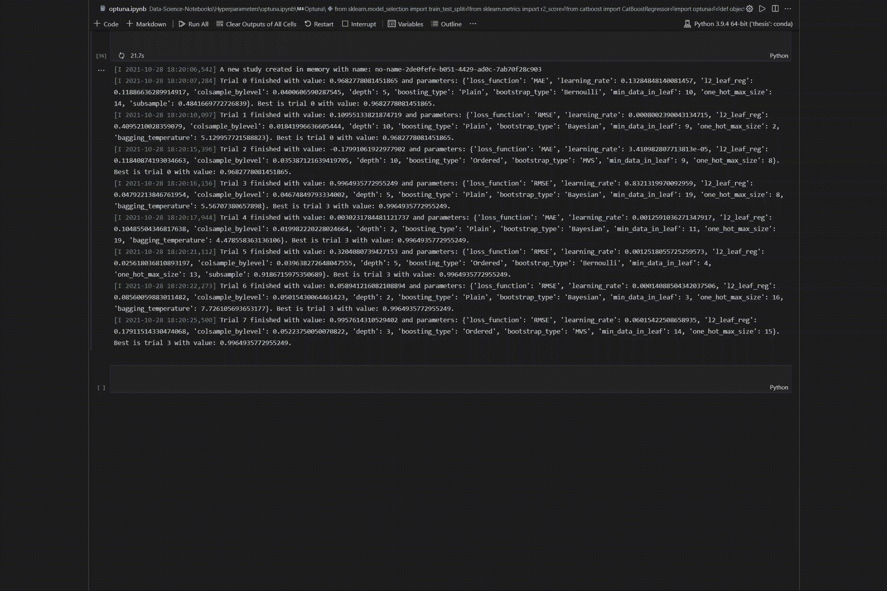
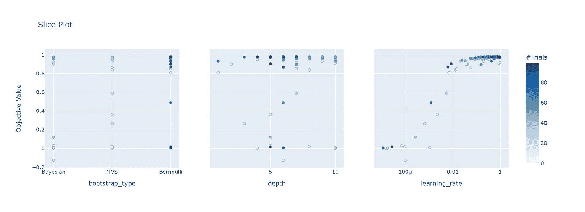

# 使用 Optuna 进行超参数优化

> 原文：<https://towardsdatascience.com/hyper-parameter-optimization-with-optuna-4920d5732edf?source=collection_archive---------7----------------------->

## 如何生成模型的最佳版本。

Optuna 超参数优化(GIF 由作者提供)

超参数优化是一项艰巨的任务。然而，使用像 Optuna 这样的工具可以使它变得更容易。

在这篇文章中，我展示了如何使用 Optuna 调优 CatBoost 模型的超参数。

> 这里针对 Optuna 的代码可以快速适应您正在训练的任何模型。请随意收藏这篇文章以备将来使用。

来自 Optuna 的单个超参数性能(由作者绘制)

# 超参数

构建数据科学模型的一个经常被低估的任务是超参数优化。这项任务通常放在构建模型的最后。

然而，它可以**区分一个可怕的模型和一个神奇的模型**。这些超参数自成一类，因为它们简化了您正在使用的模型的结构。

相比之下，常规参数是由机器学习算法在训练期间学习的参数。在最基本的示例中，线性回归使用参数来确定每个要素的权重。

这些参数控制模型的基本输出。但是，对于线性回归，您也可以将正则化添加到模型中，并附带一个超参数来控制正则化项的权重。

这个带有超参数的附加项改变了模型的整体预测方式。改变这个参数可以让一个像样的模型预测无意义的东西，或者将模型转换成非常健壮的东西。

## 改变模型行为

这种行为在更复杂的模型中更为突出，如决策树，其中许多不同的超参数控制着树的深度、叶子的数量、分割的方式以及许多其他选项。

这些选项中的每一个都控制着模型的结构及其决策方式。虽然在每个配置中仍然有决策树，但是树的类型可以有很大的不同。**这就是松树和盆景的区别。**

更复杂的是，进一步的集合模型带来了额外的挑战。这些复杂的模型建立在许多不同的模型之上，每个模型都有其超参数。

大多数情况下，您选择每个模型用来训练集合中的模型的超参数。例如，在诸如 CatBoost 的基于树的集合模型中，这些初始参数控制树的集合。无论是树的形状还是数量。

# **超参数优化**

谈到超参数优化，有几个选项可用。最常用的方法是网格搜索的变体。

## 网格搜索

网格搜索是一种简单的强力方法，可以为您输入到搜索空间的每个超参数组合生成模型。因此，为每个品种创建一个模型，然后进行比较。虽然一开始很吸引人，但还是要意识到一些关键的方面。

首先，确定**最优超参数是一个 NP-Hard 问题**，因为你要处理超参数的组合。因此，就复杂性而言，强力搜索的代价是惊人的。

要注意的第二个方面是，你可能正在训练的模型在搜索的大部分时间里一直表现很差。但是网格搜索是为了建立和训练这些模型而设计的。

假设您正在构建一个决策树，您有一个网格搜索，其中包括从“基尼”到标准熵的变化。此外，假设您发现“Gini”在您运行的前几个测试中的性能要优越得多。然而，即使熵在每个后续模型中表现更差，网格搜索仍将搜索这些组合中的每一个。

## 随机搜索

网格搜索的替代方法是随机搜索。乍一看，这似乎是比网格搜索更糟糕的选择。然而，已经证明随机搜索比网格搜索执行得更好。

基本原理很简单，随机搜索避免了网格搜索执行的许多冗余搜索。例如，通过以不均匀的间隔搜索超参数空间，更有可能找到超参数的更实质的局部最优。

## 可供选择的事物

现在有了到目前为止讨论的两个超参数搜索的替代方案。这些选择正是这篇文章的目标。

由于**之前的两种方法都没有结合任何结构化的方法来搜索**最优超参数集，因此它们处于劣势。相反，像 scikit-optimization 和 Optuna 这样的库已经引导了超参数搜索。

关于网格搜索和随机搜索比较的更多细节，你可以阅读我关于超参数优化的文章。此外，我展示了另一种方法，贝叶斯优化如何比这两种方法表现得更好。

</hyperparameter-tuning-always-tune-your-models-7db7aeaf47e9>  

# **Optuna**

Optuna 是一个优化工具，允许用户在超参数空间上运行实验。重要的是，它也总是用户暂停搜索，尝试其他超参数组合，然后继续优化过程。

此外，Optuna 支持基于树的超参数搜索，称为 TPESampler“树结构 Parzen Estimator”。这种方法依靠贝叶斯概率来确定哪些超参数选择是最有希望的，并迭代地调整搜索。

## Optuna 设置

无论您使用的是哪种模型，使用 Optuna 优化超参数都遵循类似的过程。第一步是建立一个学习函数。该函数规定了每个超参数的样本分布。

最常见的可用选项是分类、整数、浮点或统一对数。当您想要检查 0.001、0.01 和 0.1 范围内的值时，对数统一是理想的，其中每个值都有相同的被选中概率。

Optuna 的另一个巨大优势是能够设置条件超参数。不幸的是，许多超参数只有在与其他参数结合使用时才有意义。因此，简单地使用它们的变体会导致错误。为每个选择添加案例可以确保这些情况不会发生。

## 模型优化

为了说明 Optuna 的一个用例，我选择优化一个 CatBoost 模型。这些模型有大量的超参数。虽然这篇文章只展示了其中的一小部分，但还是展示了许多 Optuna 特性，比如条件超参数。

# Catboost

Catboost 是一种基于树的集成方法。这是一个非常稳健的模型。

与其他预测模型相比，CatBoost 的一个直接好处是 **CatBoost 可以直接处理分类变量**。因此“猫”这个名字是分类的缩写。

CatBoost 的这一特性使其成为懒惰的数据科学家的理想选择。将分类变量转换为数值变量可能需要一些时间，并且需要支持其他模型的假设。此外，您需要确定特征的正确表示。

但是，使用 CatBoost，您只需要定义分类参数，然后调整超参数来处理这些分类特征。

超参数“cat_features”规定了哪些特性是分类的。**如果没有指定所有这些分类特征，CatBoost 将抛出一个浮点型预期错误**，因为模型通常假设剩余的特征是数字。

# CatBoost 超参数

*   **loss_function** —训练损失函数，对于回归可以使用 RMSE 或 MAE。
*   **迭代** —限制树的数量。但是，其他超参数可能会限制树的数量，从而导致总数小于迭代次数。
*   **learning_rate** —学习率在优化期间使用，即在梯度下降期间。
*   **L2 _ leaf _ reg**-指定正则化项的系数。该术语是 L2，并被添加到成本函数中。
*   **深度** —树的深度。
*   **min_data_in_leaf** —指定何时停止分割。当实例数量低于此最小值时，该节点将成为一个叶节点。
*   **one_hot_max_size** —唯一值小于或等于该值的参数的 One-Hot 编码。
*   **boosting _ type**——“有序”或“普通”有序在较小的数据集上更好，但比普通方案慢。因此，对于较大的数据集，建议使用“普通”增强类型。
*   **RSM**—‘Alias:col sample _ by level’定义了用于在分割时选择特征以及再次随机选择特征的百分比。
*   **bootstrap_type** —对权重进行采样的方法，可以是“贝叶斯”、“伯努利”、“MVS”、“泊松”或“否”
*   **bagging_temperature** —定义贝叶斯引导的设置。当参数设置为 1 时，根据指数分布添加权重。
*   **子样本** —当‘泊松’、‘伯努利’或‘MVS’用于引导法时，使用装袋的采样率。

# 实验

对于这个例子，我在公共领域许可下使用 diamonds 数据集。这个数据集由分类变量和数字变量的组合组成。

该数据集旨在根据其他属性预测钻石的价格。一些变量是分类的，这通常需要一些预处理。

<https://www.kaggle.com/shivam2503/diamonds>  

但是，使用 CatBoost，无需任何预处理就可以生成模型。此外，即使是缺失值也可以使用 CatBoost 进行处理，这使得它成为一个非常健壮且易于使用的模型。

只需加载数据集并运行。

为 CatBoost 设置 Optuna 研究(由作者编写代码)

在 Optuna 中设置研究后，仍需要调整一些参数。首先是采样器。在这里，我手动更改采样器以使用前面讨论的 TPESampler。这种选择确保了搜索将比标准的网格搜索更加结构化和有针对性。

需要注意的其他几个选项是方向、n_trials 和超时。方向规定了如何执行优化。**确保这与您正在使用的损失函数的预期优化相匹配。**

接下来，n_trials 控制将执行多少超参数空间的样本。加上超时，这两个因素会影响研究运行的时间。如果你发现自己时间紧迫，这些可以成为救命稻草。

由于搜索的最终状态将被保存(并可在以后重新启动)，您可以使用同一研究连续搜索越来越好的超参数选择。

运行 Optuna 研究(作者代码)

# 超参数搜索的可视化

一旦研究终止，无论是在达到最后一次迭代还是达到超时限制之后，下一步就是评审研究结果。

上面的脚本将输出最佳模型性能和使用的超参数。您还可以使用 Optuna 的内置可视化功能查看研究进度。

## 超参数重要性

确定哪些参数对模型的整体性能影响最大。

绘图超参数重要性(作者代码)

来自 Optuna 的 CatBoost 超参数重要性图(由作者绘制)

## 多次迭代的性能

该图显示了模型在多次迭代中的性能。预期的行为是搜索顺序地提高模型性能。

情节优化进度(作者代码)

超过 100 次迭代的 Optuna 优化进度(由作者绘制)

## 单个超参数的性能

该图显示了多次试验中不同超参数的变化。颜色表示试用号。

因此，预期的行为是，随着研究的进展，超参数将收敛到单一值。

单个超参数性能(作者代码)

来自 Optuna 的单个超参数性能(由作者绘制)

# 包裹

如果没有对超参数进行适当的调整，模型的性能会受到很大影响。有几个选项可用于优化；然而，像 Optuna 这样的工具使这个过程变得简单而有效。

Optuna 为超参数优化和有效的搜索结构提供了一种基于贝叶斯的方法。用户可以搜索、停止、搜索更多内容并保存结果。

对于具有许多选项的复杂模型(如 CatBoost ),搜索可用模型配置的能力变得至关重要。

Optuna 为模型的实际超参数调整提供了一个理想的解决方案。

如果你有兴趣阅读关于新颖的数据科学工具和理解机器学习算法的文章，可以考虑在 medium 上关注我。我总是在我的文章中包含代码，您可以将其应用到您的工作中！

*如果你对我的写作感兴趣，想直接支持我，请通过以下链接订阅。这个链接确保我会收到你的会员费的一部分。*

<https://zjwarnes.medium.com/membership> 