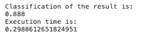
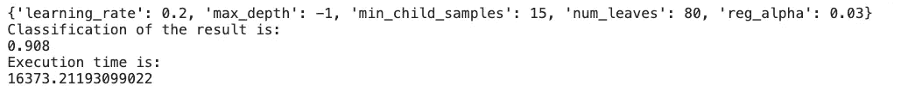
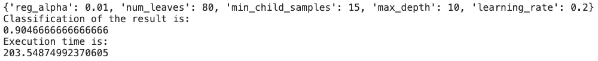

# Python 中的超参数调整

> 原文：<https://towardsdatascience.com/hyper-parameter-tuning-in-python-1923797f124f?source=collection_archive---------11----------------------->

## 网格搜索与随机搜索


照片由[丹尼斯·莱昂](https://unsplash.com/@denisseleon?utm_source=unsplash&utm_medium=referral&utm_content=creditCopyText)在 [Unsplash](https://unsplash.com/s/photos/tune?utm_source=unsplash&utm_medium=referral&utm_content=creditCopyText) 上拍摄

当我跑完一个模型有一个结果的时候，我总想问问自己。这是我能得到的最好结果吗？

除了改变算法或增加训练数据量，我们还可以利用超参数调整来**使模型对我们的数据集更加稳健**。

> 首先，让我们弄清楚术语。什么是参数，什么是超参数？

**参数:****可以通过训练数据**进行训练和调整的模型参数。例如 y = Ax+B。A 和 B 是可以由训练数据训练的参数。

**超参数:**不受训练数据影响的**模型参数。它为该特定算法定义了**底层模型结构**。例如，决策树算法的休假次数**

本文将介绍进行超参数调优的一般步骤和两个常用的自动调优包。出于演示目的，我使用 make_classification 包创建了一个分类数据集。

```
#Create classification dataset
from sklearn.datasets import make_classification
X, Y = make_classification(n_samples=10000, n_informative=10,n_redundant=0, n_classes=3,
                               n_features=10,
                               random_state=0)#split into training and testing set
from sklearn.model_selection import train_test_split
X_train, X_test, Y_train, Y_test = train_test_split(X, Y, test_size=0.3, random_state=0)
```

## 基线模型(无调整)

```
import time
start = time.time()
import lightgbm as lgb
from sklearn.metrics import accuracy_score
clf = lgb.LGBMClassifier()
clf.fit(X=X_train, y=Y_train)
predicted=clf.predict(X_test)
print('Classification of the result is:')
print(accuracy_score(Y_test, predicted))
end = time.time()
print('Execution time is:')
print(end - start)
```



基本模型结果

我在这里使用了 Light GBM 作为算法。基线模型的准确率为 88.8%，完成整个过程只需要 0.3 秒。

# 超参数调整的步骤

## 第一步:我们想要实现什么？

首先，我们需要确定我们在调优过程中试图实现的主要目标。通常，有 3 个共同的目标。

1.  提高准确性
2.  减少过度拟合
3.  更快的运行速度

前两个目标可以通过自动调整超参数来实现。我们可以通过在样本外数据集上测试来评估该模型(这意味着我们没有使用它进行训练)。

最后一个目标“运行速度”通常在处理大量数据时需要。如果数据科学模型已部署并每天运行，我们希望该模型能在合理的时间范围内给出结果。通常，我们可以在最后一步手动调整这一部分。

对于我的例子，我没有非常大的数据集，因此我只关心准确性和过度拟合问题(前两个目标)。

## 步骤 2:每个目标的调优参数是什么？

在我们明确了我们想要达到的目标之后，我们应该确定每个目标的调整参数。通常，根据您选择的算法，您可以找到关于所有可能的调优参数的文档。

在这个例子中，我使用的是 Light GBM，您可以在这里找到完整的参数列表。

以下是我为自动调谐选择的 5 个超参数:

*   **num_leaves:** 一棵树的最大叶子数，树模型的主要参数
*   **min_child_samples:** 一次休假的最小数据数
*   **最大深度:**树的最大深度
*   **learning_rate:** 收缩率，决定模型可以学习的速度
*   **reg_alpha:** 正则化，处理过度拟合

“叶数”、“最小 _ 子 _ 样本数”、“最大 _ 深度”和“注册 _alpha”会影响精确度和过度拟合。“叶子数量”和“最大深度”的值越高，精确度越高，也会导致更多的过度拟合。min_child_samples 和 reg_alpha 越高，过拟合越小，但精度会降低。学习速率决定了模型学习的速度，但也会影响精度。

## 步骤 3:确定调谐的值范围

通常，当我们第一次开始使用某些算法时，我们不知道为自动调整设置什么值范围。我所做的是**首先找出该超参数的默认值**，然后**围绕默认值**设置数值范围。

我通常会运行模型 2 回合。**对于第一轮，我通常会设置区间，主要是为了找到一个合适的参数值范围**。例如，在我的例子中，num_leaves 是需要优化的最重要的参数。默认值为 31。因此，首先，我将范围设置为[10，20，30，60，90，120]，范围很大。

在第一轮结果之后，我得到 num_leaves 的最佳参数值为 60。对于第二轮，我会将间隔再次设置为 60 左右，更接近于[40，50，60，70，80]。

> 您不需要运行模型太多次，因为最佳参数是不同参数的组合，因此**单个参数**没有最佳值。运行模型 2 次只是你在合理范围内缩小参数值的一种方法。

## 步骤 4:为模型运行自动调整

这里，我使用两种常用的方法 [GridSearch](https://scikit-learn.org/stable/modules/generated/sklearn.model_selection.GridSearchCV.html) 和 [RandomSearch](https://scikit-learn.org/stable/modules/generated/sklearn.model_selection.RandomizedSearchCV.html) 进行自动调优。这两种方法都采用了**“适应和评分”方法**。这意味着它将从定义的范围中选择一组超参数，拟合模型，产生分数，并最终输出具有最高分数的模型。这里的“分数”是由我们定义的，它**取决于我们试图最大化**什么。例如，它可以是准确度、对数损失、F1 分数等。

> G rid 搜索与随机搜索


图片来自[麻省理工学院关于随机搜索的论文](https://jmlr.csail.mit.edu/papers/volume13/bergstra12a/bergstra12a.pdf)

**网格搜索:**在预定义的参数值范围内进行穷举搜索。试验次数由调谐参数的数量和范围决定。

```
start = time.time()
from sklearn.model_selection import GridSearchCV
import lightgbm as lgb
lgb=lgb.LGBMClassifier()#Define the parameters
parameters = {'num_leaves':[20,40,60,80,100], 'min_child_samples':[5,10,15],'max_depth':[-1,5,10,20],
             'learning_rate':[0.05,0.1,0.2],'reg_alpha':[0,0.01,0.03]}#Define the scoring
clf=GridSearchCV(lgb,parameters,scoring='accuracy')
clf.fit(X=X_train, y=Y_train)
print(clf.best_params_)
predicted=clf.predict(X_test)
print('Classification of the result is:')
print(accuracy_score(Y_test, predicted))
end = time.time()
print('Execution time is:')
print(end - start)
```



网格搜索的结果

与基线模型相比，网格搜索将精确度提高了大约 1.2%。但是，运行时间是 4 个多小时！

**随机搜索:**从预定义的参数值范围内随机抽取样本。**试验次数由‘n _ ITER’参数**决定，因此更具灵活性。此外，如图所示，当您有一个连续的值范围时，它可以检索更多随机分布的情况，而不是从“网格线”中检索参数集。

```
start = time.time()
from sklearn.model_selection import RandomizedSearchCV
import lightgbm as lgb
lgb=lgb.LGBMClassifier()
parameters = {'num_leaves':[20,40,60,80,100], 'min_child_samples':[5,10,15],'max_depth':[-1,5,10,20],
             'learning_rate':[0.05,0.1,0.2],'reg_alpha':[0,0.01,0.03]}
clf=RandomizedSearchCV(lgb,parameters,scoring='accuracy',n_iter=100)
clf.fit(X=X_train, y=Y_train)
print(clf.best_params_)
predicted=clf.predict(X_test)
print('Classification of the result is:')
print(accuracy_score(Y_test, predicted))
end = time.time()
print('Execution time is:')
print(end - start)
```



随机搜索的结果

我指定试验次数为 100 次。随机搜索调优模型的精度仅比网格搜索低 0.3%。然而，它只需要 3.5 分钟，比网格搜索快得多。

## 第五步:看看调好的结果，做一些手动调整

根据目标和调整后的模型结果，您可以选择手动调整一些超参数。例如，如果测试精度仍然远低于训练精度，您可以选择为正则化设置更高的值，以减少过度拟合。或者，如果你想提高跑步速度，你可以设置一个较高的学习率或减少 num_leaves。

# 建议/结论

本文的主要信息不仅仅是关于超参数自动调整的技术部分，还包括我们应该如何调整超参数的**思考过程**。

在网格搜索和随机搜索之间，我推荐使用随机搜索，原因如下:

1.  随机搜索有更多的灵活性，可以控制你想进行多少次试验。
2.  随机搜索的运行时间通常要短得多，因此它给你更多的时间来尝试更多轮次的调优。
3.  对于连续超参数，随机搜索可以探索一组更独特的值

如果你有任何问题或建议，或者任何你想了解的新话题，请在评论中提出！

感谢您的阅读，希望它能帮助您更好地理解超参数调优。