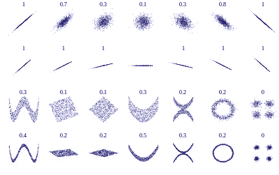
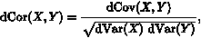
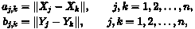
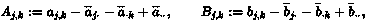
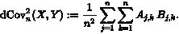
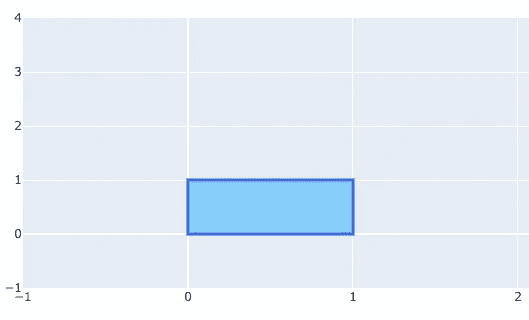
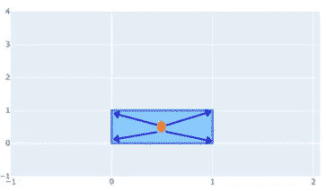
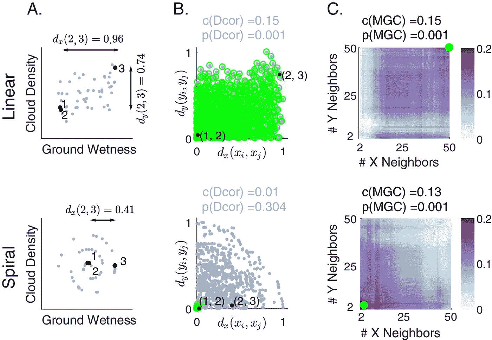
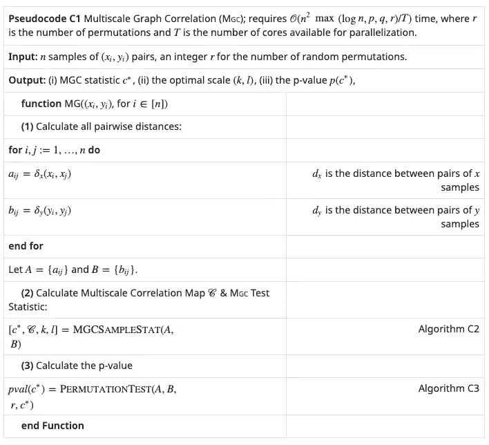

# 超维度假设检验——多尺度图形相关性和距离相关性

> 原文：<https://towardsdatascience.com/hyperdimension-hypothesis-testing-multiscale-graph-correlation-and-distance-correlation-119f2c2c6c18?source=collection_archive---------39----------------------->

## [理解大数据](https://towardsdatascience.com/tagged/making-sense-of-big-data)

## 如何对大型数据集进行独立性和 K 样本测试


你有没有想过:

*   两个变量是否相关？
*   两个样本是否来自同一个分布？

如果是这样的话，这篇文章是给你的。本文将解释这两种方法，并在最后介绍 [Hyppo](https://hyppo.neurodata.io/) 库。

# **距离相关(Dcorr)**

这一理论最初由加博·j·策克利等人发表在 2007 年《统计年鉴》上。它是对任意维度的两个随机向量对之间的相关性的一种度量，这两个向量不一定相等。通过一些设计调整，它也可以用于 K 样本测试。

有什么了不起的？这是**非参数**测试，意味着没有关于变量之间关系的潜在假设，也没有关于分布的假设。与传统的相关方法如 [Pearson's r](https://en.wikipedia.org/wiki/Pearson_correlation_coefficient) 相比，它可以有效地检测出数据中的**非线性关系**。



[样本数据集性能](https://upload.wikimedia.org/wikipedia/commons/9/99/Distance_Correlation_Examples.svg)

## 数学定义

下面是计算距离相关性的公式。



[距离关联](https://wikimedia.org/api/rest_v1/media/math/render/svg/4705de443ddff6faf7822a4a0b02eaf42b0d7d33)

x 和 Y 是**双中心距离**矩阵。这两个矩阵之间的协方差是分子，标准差的乘积是分母。在我看来，理解这种方法主要有三个要素:

*   距离矩阵:存储给定变量任意两点之间欧几里得距离的成对矩阵。



[距离矩阵](https://wikimedia.org/api/rest_v1/media/math/render/svg/902f03b7eaae4d7c422dda6600d8c6f03e0a8f3c)

*   双中心矩阵:对于距离矩阵中的每个元素，减去列和行的平均值，然后加上矩阵的大平均值。本质上，这一步是将原点更改为点云的中心(我知道最初听起来可能很混乱，但一个简单的例子即将出现)。



[双定心](https://wikimedia.org/api/rest_v1/media/math/render/svg/2401660e88d209f5a9d732ab8b9bc6e3e4f87616)

*   Frobenius 内积:它是上一步中两个双中心矩阵的内积，是一个标量值。结果表明这两个矩阵是多么相似。如果它们是独立的，你会得到 0。你可以把这个操作想象成表示两个矩阵在高维空间正交性的向量点积。



[距离协方差](https://wikimedia.org/api/rest_v1/media/math/render/svg/690d25098aa7a1a954e388785dd32cf64f54c6d9)

## 简单的例子

感谢这个[讨论](https://stats.stackexchange.com/a/183927)，我做了一些可视化来说明这个概念。这里我们有四个点(𝑋,𝑌)=[(0,0),(0,1),(1,0),(1,1)组成一个正方形。



作者图片

X 和 Y 的距离矩阵为:

```
X = array([[0., 0., 1., 1.],
          [0., 0., 1., 1.],
          [1., 1., 0., 0.],
          [1., 1., 0., 0.]])Y = array([[0., 1., 0., 1.],
          [1., 0., 1., 0.],
          [0., 1., 0., 1.],
          [1., 0., 1., 0.]])
```

双居中后，矩阵将变成:

```
X_centered = array([[-0.5, -0.5,  0.5,  0.5],
                    [-0.5, -0.5,  0.5,  0.5],
                    [ 0.5,  0.5, -0.5, -0.5],
                    [ 0.5,  0.5, -0.5, -0.5]])Y_centered = array([[-0.5,  0.5, -0.5,  0.5],
                    [ 0.5, -0.5,  0.5, -0.5],
                    [-0.5,  0.5, -0.5,  0.5],
                    [ 0.5, -0.5,  0.5, -0.5]])
```

唯一满足条件的点是正方形的中点。



作者图片

# 多尺度图形相关(MGC)

MGC 是一个相对较新的衡量标准，由学者岑成·申、凯里·e·普里贝和约书亚·t·沃格尔斯坦在 2018 年提出。本质上，它是 K 最近邻(KNN)和距离相关性(Dcorr)的组合。

主要优势:

*   也是**非参数**假设检验，没有数据关系和分布的底层假设。
*   与之前提出的分析大型复杂数据集的方法相比，它需要一半到三分之一的样本量。
*   它表明不同属性之间关系的性质。

**它与 Dcorr 的区别在于能够检测数据子集中的非线性关系。下面是论文中的一个例子。如果云密度和地面湿度之间存在线性关系，则一个变量的距离变化与另一个变量相关。MGC 和 Dcorr 都能成功地拒绝两个变量相互独立的零假设。然而，如果关系是螺旋形的(底部),则一个区域中的距离变化仅在小区域中与另一个区域相关。使用所有的数据并不能提供足够的信息来检测这种关系，因此只有 MGC 在这种情况下工作得很好。详细解释请参考[⁴.的论文](https://elifesciences.org/articles/41690#s1:~:text=To%20illustrate%20the%20importance%20of%20adapting,2007)%2C%20thereby%20motivating%20its%20use%20here.)**



[来源](https://iiif.elifesciences.org/lax:41690%2Felife-41690-fig1-v2.tif/full/full/0/default.jpg)

## MGC ≈ KNN +德科尔

下面的伪代码说明了主要的架构。首先，它计算变量 X 和 y 的距离矩阵。



[纸上公式](https://elifesciences.org/articles/41690)

然后，它会创建一个多尺度相关图，并返回最高的统计得分 C*。这一步是 MGC 和 Dcorr 的主要区别。这里是一个高层次的总结:

*   对输入距离矩阵 A(列)和 B(行)进行排序。
*   计算具有不同大小的最近邻 k(对于矩阵 A)，l(对于矩阵 B)的距离相关性。这就构造了一个新的相关矩阵，k 为行，l 为列。每个元素包含在 k，l 组合中计算的距离相关值。
*   在相关图中找到最大的 [**连通区域**](https://docs.scipy.org/doc/scipy/reference/generated/scipy.ndimage.label.html?highlight=label#scipy.ndimage.label) ，避免样本噪声引起的相关膨胀。

最后，它运行置换测试，交换 Y 变量的值，并重复前面的步骤来生成一组统计分数。最后，它将观察样本的 C*与排列测试的所有其他分数进行比较，并计算 P 值。

# 用例

*   评估聚类结果，如客户特征分析。
*   使用嵌入确定文档是否来自同一人群。
*   选择与目标变量相关的特征。
*   还有更多…

# 希波

这是实现 MGC 和 Dcorr 的库[。这是一个很好的工具，可以用详细的文档来检验超维度假设。我利用这个库构建了一个简单的演示代码，这里是](https://hyppo.neurodata.io/)[笔记本](https://github.com/rafaelymz/hypothesis_testing/blob/main/demo_independence.ipynb)。

快乐阅读！

参考资料:

1.  [https://arxiv.org/pdf/0803.4101.pdf](https://arxiv.org/pdf/0803.4101.pdf)
2.  [https://en.wikipedia.org/wiki/Distance_correlation](https://en.wikipedia.org/wiki/Distance_correlation)
3.  [https://arxiv.org/abs/1710.09768](https://arxiv.org/abs/1710.09768)
4.  [https://elifesciences.org/articles/41690](https://elifesciences.org/articles/41690)