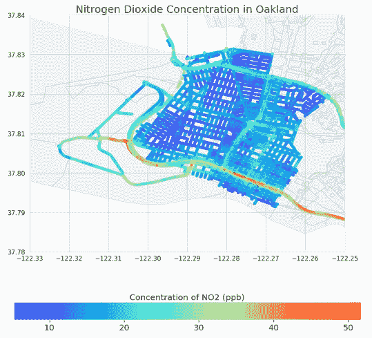
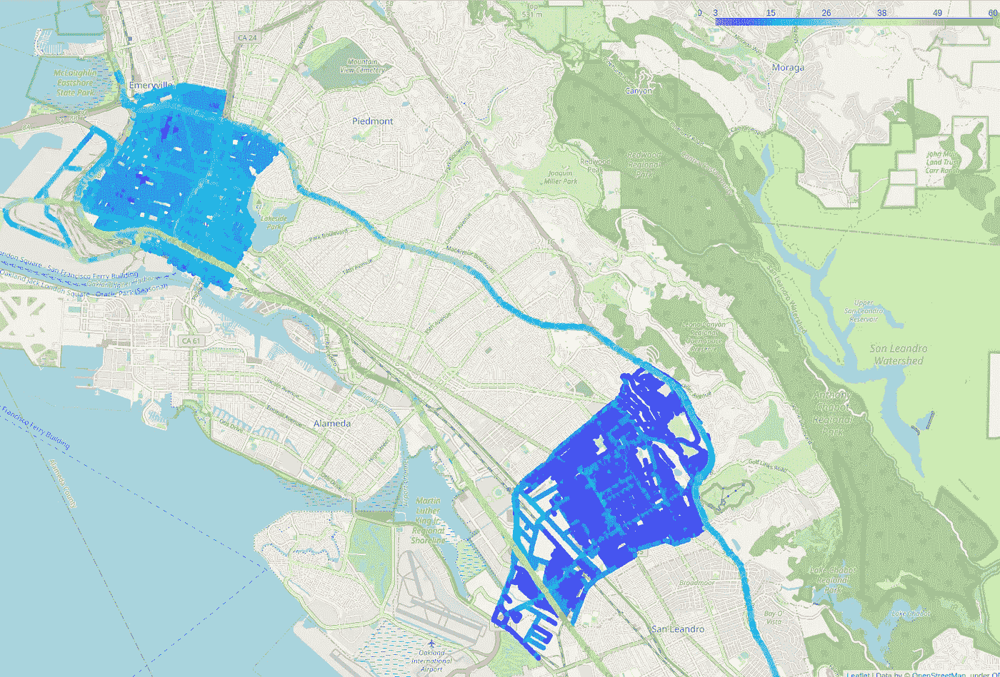
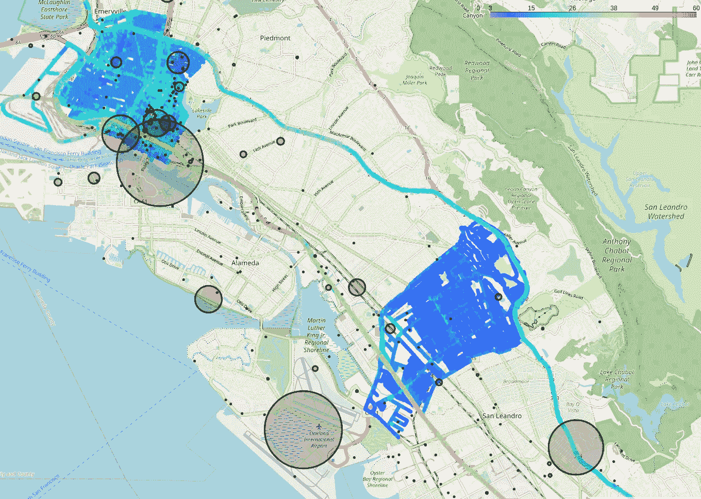
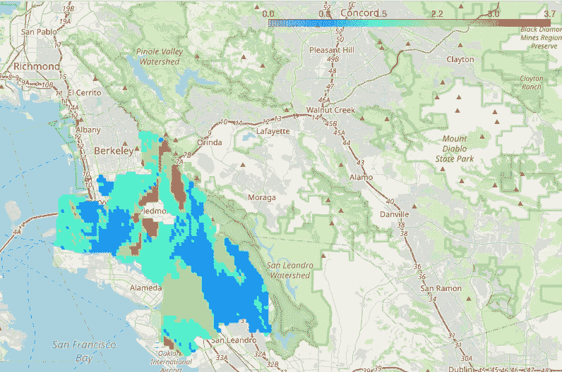

# 使用机器学习的超局部空气质量预测

> 原文：<https://towardsdatascience.com/hyperlocal-air-quality-prediction-using-machine-learning-ed3a661b9a71?source=collection_archive---------25----------------------->

## [实践教程](https://towardsdatascience.com/tagged/hands-on-tutorials)

## 使用公开可用数据预测加州奥克兰的空气质量

加利福尼亚州奥克兰市谷歌街景车测量的 NO2 浓度

## 介绍

当谷歌和法国电力公司发布了他们关于奥克兰空气污染地图的研究[时，这项研究的结果获得了很多关注。他们发布的数据是首批数据集之一，显示了东奥克兰和西奥克兰不同城市街区的空气质量如何变化。以前，奥克兰的空气质量测量只能通过放置在城市不同地方的少数几个监测器获得。这项研究揭示了奥克兰许多地方的空气污染水平上升，特别是在水泥厂和汽车修理厂附近的社区，这些地方以前并不明显。](https://www.edf.org/airqualitymaps/oakland/mapping-pollution)

作为一名环境研究人员和数据科学家，我很想知道我是否可以将从重复的道路采样(2015-2016 年)中收集的数据集与机器学习相结合，以预测城市中不同位置的空气质量，这些位置没有测量数据。这可以帮助我们更好地了解个人暴露于污染的程度。

任何地方的空气质量取决于几个因素，如主要街道和高速公路上的交通、铁路、港口和工业来源的排放、时间因素以及其他气象因素，如风速和风向。经过大量的研究，我决定将我的项目范围扩大到探索以下问题:

> “我们能否建立一个机器学习模型，根据当地的气象条件、当地的排放源(如工业)和高速公路上的交通状况，预测奥克兰任何位置的空气质量？”

使用 Folium、Streamlit 和 Heroku 创建的 web 应用程序快照。查看[这篇](https://varsha-gopalakrishnan.medium.com/deploying-your-geospatial-machine-learning-projects-as-web-apps-using-streamlit-and-heroku-45d64f6d5cb0)博客了解更多细节。

我开发了这个网络应用程序，它可以预测奥克兰所有居民区的黑碳(BC)和二氧化氮(NO2)的污染浓度。这款网络应用能让用户了解他们所在社区的空气污染物浓度，帮助识别空气质量好的地区，以便购买或租赁房屋，并帮助识别浓度异常高的“热点”。

下面概述了构建这个 web 应用程序的数据分析和机器学习管道。

**数据分析和机器学习管道**

**目标变量**

EDF 和谷歌的科学家收集的数据集包含了 2015 年 6 月至 2016 年 5 月期间由配备移动传感设备的谷歌街景车在 150 天内收集的 NO2、BC 和一氧化氮(NO)的浓度。然后，在一年的时间内对数据集进行汇总，得出奥克兰市约 30 米范围内的中值浓度。

下图显示了在奥克兰地区测量的 NO2 浓度(ppb)图。然而，这个数据集虽然非常有用，但只提供了奥克兰某些街区的空气质量测量值。

奥克兰市年平均 NO2 浓度(ppb)图。浓度测量是由谷歌街景车拍摄的，这些车驶过了东奥克兰和西奥克兰的几乎所有街区。这里有一张互动地图。

为了使用这个数据集来建立一个可以预测奥克兰其他社区空气质量的概化模型，我首先训练了一个机器学习模型，通过创建一组描述污染物浓度的概化特征来预测 EDF 数据集中测量的相同位置的空气污染物浓度。然后，我使用这个经过训练的模型，通过为感兴趣的位置生成这些特征来预测任何给定地址的浓度。

让我们首先看看这些特性是如何基于位置(坐标)开发的。

**输入数据和特征工程**

为了开发可用于预测浓度的特征集，我们首先需要了解任何给定位置(“*目标位置*”)的空气浓度如何与空气污染源相关联，例如工业排放、交通排放和当地气象参数。

我将这些功能分为以下几类:

**排放点源** —我使用美国环保局的[国家排放清单数据库](https://www.epa.gov/air-emissions-inventories/2014-national-emissions-inventory-nei-data) (2014)来获取奥克兰所有主要点源的位置，并使用“*点源和目标位置之间的距离”*作为度量标准来测量与浓度的相关性。

**交通** —为了理解每个地点的空气污染如何与交通相关，我使用了两种不同的交通指标作为特征。第一个交通指标是 1000 英尺范围内的交通路口数量。感兴趣位置的半径，第二个度量是感兴趣位置到高速公路的接近度(距离)。使用[立交桥 API](https://wiki.openstreetmap.org/wiki/Overpass_API) 从 OpenStreetMap 获取交通指标。

**气象参数**——了解空气污染与年平均气象参数如降水、气压、最低气温的关系。还有麦克斯。温度和太阳辐射，我使用[橡树岭国家实验室的 Daymet 数据集](https://medium.com/r?url=https%3A%2F%2Fdaymet.ornl.gov%2F)通过对 2015 年 6 月至 2016 年 5 月的每日数据进行平均，以 1 公里乘 1 公里的网格为基础获得了奥克兰所有地区的气象参数。**

预测空气浓度的机器学习模型模式

上图显示了所有输入数据集和机器学习模型模式的列表。最终特征集包含 324 个特征，这里的目标变量是不同点的 NO2 浓度。

* *虽然风速和风向肯定起着重要作用，但我暂时忽略了这两个方面，因为这里测量的浓度是年平均值。

**开发机器学习模型**

为了建立一个预测浓度的模型，我尝试了五种不同的机器学习算法，包括简单的线性回归模型、岭回归、弹性网、随机森林和 XGBoost 回归。将 NO2 数据集分成测试/训练数据，并将 4 重交叉验证方法应用于训练数据集。模型预测与来自 Google-EDF 数据集的地面实况测量进行了比较。随机森林和 XGBoost 方法产生了最佳预测。由于 XGBoost 具有最低的 RMSE (2.69)和最高的 R2 值(0.925)，所以我选择实现 XGBoost 模型来将预测扩展到不同的邻域。

NO2 测试数据集的 XGBoost 预测

我使用随机森林方法来了解哪些特征在预测浓度时最重要，并根据重要性对这些特征进行排序。下面的交互式地图显示了对该地区 NO2 浓度贡献最大的前 100 个污染源(在本例中为要素)的位置。圆点的大小表示特征的重要性，圆点越大表示重要性越高。

*该图显示了机器学习模型中预测 NO2 浓度(ppb)的前 100 个特征的位置。黑色圆圈的大小表示特征的重要性。一张互动版地图在这里***。**

*影响该地区 NO2 浓度的一些最重要的特征包括带有发电机的商业综合体(KTUV Fox 2 办公室)、奥克兰国际机场、圣莱安德罗的一家医院(可能带有发电机和锅炉)以及奥克兰的数字房地产数据中心。*

***在不同的街区做预测***

*下一步是使用 XGBoost 模型来预测整个奥克兰地区点网格中的浓度，方法是为网格中的每个点生成一个要素集。对于每个网格点，我使用生成的输入特征集和 XGBoost 模型来预测该点的浓度。*

*下图显示了加利福尼亚州奥克兰市不同社区所有网格点的 NO2 浓度(ppb)预测热图。*

**

*奥克兰预测 NO2 浓度图(ppb)。互动地图在[这里](https://varshg.com/aq-maps/NO2-predicted.html)可用。*

*皮埃蒙特附近有高浓度的 NO2，这可能主要是由于靠近主要公路(I-580)。San Leandro 区域附近的蓝/绿色区域表示 NO2 浓度较低，因为这些邻近区域距离主要点源较远。*

*我用同样的方法建立了一个不同的模型来预测生物浓缩度(微克/立方米)。*

**

*奥克兰的预测生物浓缩地图(微克/立方米)。互动地图在[这里](https://varshg.com/aq-maps/BC-predicted.html)可用。*

***结论和后续步骤***

*这项工作利用环境保护基金与奥克兰谷歌街景合作收集的空气污染监测数据集，建立一个机器学习模型，使用主要排放源、交通路口数量、与高速公路的接近程度和当地气象数据的公开数据来预测任何感兴趣位置的空气污染浓度。该模型针对奥克兰地区一些邻近地区的数据点进行训练，用于预测整个奥克兰地区数据点网格中的浓度。*

*这里生成的热图特别有助于城市规划者、环境管理团队和公共卫生专家预测加利福尼亚州东湾区任何位置的空气质量，并确定“热点”或浓度异常高的位置。这项工作的另一个应用可能是让公众识别空气质量好的社区，以便购买、出租或出售他们的房屋。*

*最近，谷歌发布了一个包含湾区所有城市测量的浓度的[空气质量数据集](https://docs.google.com/forms/d/e/1FAIpQLSf_4GIkK1tmVMFRSxz42KgvOM3Z3NGeOFFje_FS8FBbz1vTig/viewform)，建立一个类似的机器学习模型来预测湾区不同城市的浓度会很有趣。*

*我的 Github 库为这项工作，随着更详细的报告可以在这里找到。如果你有兴趣了解更多关于这个网络应用是如何建立的，看看我的帖子[这里](https://varsha-gopalakrishnan.medium.com/deploying-your-geospatial-machine-learning-projects-as-web-apps-using-streamlit-and-heroku-45d64f6d5cb0)！*