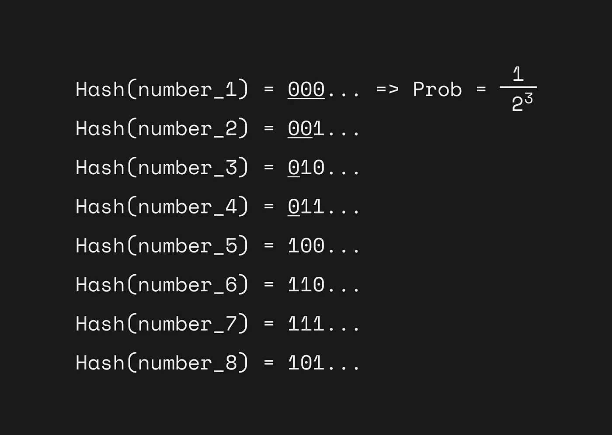
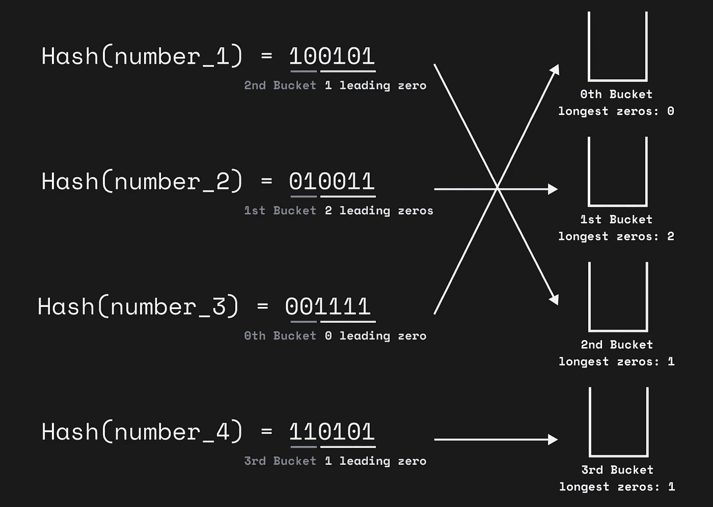
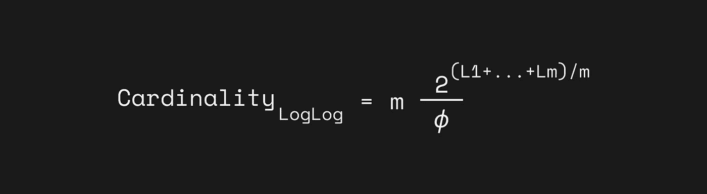
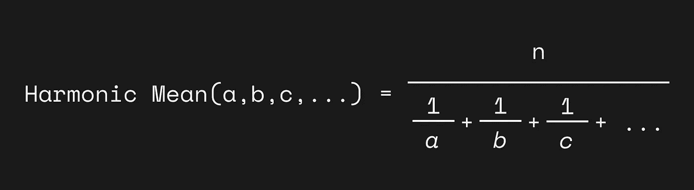
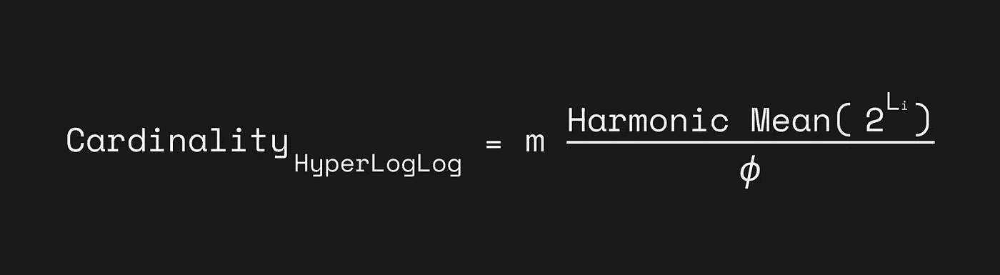

# HyperLogLog:数据科学家的简单而强大的算法

> 原文：<https://towardsdatascience.com/hyperloglog-a-simple-but-powerful-algorithm-for-data-scientists-aed50fe47869?source=collection_archive---------6----------------------->

## [理解大数据](https://towardsdatascience.com/tagged/making-sense-of-big-data)

## 如何使用很少的内存和时间来估计超大数据集中的基数？

[HyperLogLog](https://en.wikipedia.org/wiki/HyperLogLog) 是一个美丽的算法，即使只是学习它也让我兴奋不已(部分是因为它的名字)。

这个简单但极其强大的算法旨在回答一个问题:如何在一个非常大的数据集中估计唯一值的数量(即基数)？这个问题在计算机科学中被称为 [Count-distinct 问题](https://en.wikipedia.org/wiki/Count-distinct_problem)或者应用数学中的基数估计问题。在本文中我们称之为基数估计问题，因为它听起来更令人印象深刻。

但是在我们理解 HyperLogLog 如何解决基数估计问题之前，我们首先要知道为什么我们需要 HyperLogLog 来解决这个问题。

由[马库斯·斯皮斯克](https://unsplash.com/@markusspiske?utm_source=medium&utm_medium=referral)在 [Unsplash](https://unsplash.com?utm_source=medium&utm_medium=referral) 上拍摄

# 展览中有多少独特的参观者？

想象你正在举办一个艺术展。你的工作是站在入口处，数一数到目前为止有多少访客，只用笔和纸。假设计数中的小误差是可以接受的，你如何完成任务？

一个解决办法是:写下所有访客的全名，然后检查上面有多少独特的名字。

但是如果你一天有成千上万的访问者呢？你有足够的文件吗？写下成千上万个名字你会开心吗？

另一个解决方法是:你可以写下他们电话号码的最后 6 位，而不是写下他们的名字。

尽管如此，它仍然需要大量的工作。现在，让我们把任务变得更加困难。你能实时或接近实时地统计数字吗？更难的是:你能仅仅通过数手指来完成任务吗？

# Flajolet-Martin 算法

是的，你可以。你可以通过手指计数来实时统计成千上万的独立访客。

我们的朋友 Philippe Flajolet 和 G. Nigel Martin 在他们 1984 年的论文“数据库应用的概率计数算法”中介绍了一种出色的算法，可以帮助我们解决这个问题。[1]

解决方法是:用你的手指记录你在电话号码的 6 位数中看到的最长的前导零序列。

例如，如果你得到`532885`，最长的零序列是 0。

下一次你得到`042311`，最长的序列现在是 1。

当你看到超过 10 个人时，最长的序列很可能是 1。同样，当你看到超过 100 个人时，最长的序列将更有可能是 2。

很容易看出，在随机数据中，平均每一个 10ᴷ元素中会出现一次`K`0 序列。

现在，想象你现在最长的序列是 5，很有可能你见过 1000 多人找到某人电话号码的后 6 位数字以`00000`开头。

你明白了。

基于概率，估计有多少独特的游客将接近 10ᴸ，因为 l 是你在所有数字中找到的最长的前导零序列。

事实上，在我们朋友 1984 年的文章中，他们首先散列元素以获得更均匀分布的二进制输出。例如，他们可能将一个元素 x1 散列到`010001`，将另一个元素 x2 散列到`101000`。因此，由于某些模式(如区号)而不是均匀分布的电话号码也可以正确估计。此外，因为他们把输出变成了二进制位数组，现在基数的估计是 2ᴸ.

然而，统计分析表明，2ᴸ实际上引入了一个可预测的偏差。因此，他们加上一个修正系数 *ϕ* ≈ 0.77351 来完成最终公式:2ᴸ / *ϕ* 。

这个算法叫做 [Flajolet-Martin 算法](https://en.wikipedia.org/wiki/Flajolet%E2%80%93Martin_algorithm)。多好的名字！稍后我们会看到命名的重要性，以及 Flajolet 实际上是如何提高他的命名技巧的。

# 如何改进:日志日志

我知道你可能认为这种估计似乎不那么可靠。想象一下，从第一个元素得到的哈希值是`000000010`——jackpot！在现实生活中，数据中的一些异常值可能会打乱我们的估计。当然，我们的朋友 Flajolet 也知道。

如何让我们的估计少受离群值的影响？一个显而易见的解决方案是使用多个独立的哈希函数重复 Flajolet-Martin 算法，并对所有结果进行平均。例如，如果我们使用 m 个不同的哈希函数获得最长的前导零序列，这里我们将最长的前导零序列的值表示为 L₁、L₂、…、Lₘ，那么我们的最终估计值就是 m * 2^((L₁+…+Lₘ)/m).

但是，使用多个哈希函数对输入进行哈希运算的计算开销会非常大。因此，我们的朋友 Flajolet 和他的新朋友 Marianne Durand 想出了一个变通办法:使用一个哈希函数并使用其部分输出将值拆分到许多不同的桶中，怎么样？为了将值分成桶，他们只使用哈希值的前几位作为桶的索引，并根据剩余的内容计算前导零的最长序列。

例如，如果我们想要四个桶，我们可以使用哈希值输出的前两位作为桶的索引。假设我们有四个元素，并获得它们的哈希值:

Hash(x1) = `100101`:现在第二个(`10`)桶，最长的前导零序列= 1 ( `0101`)

Hash(x2) = `010011`:现在第一个(`01`)桶，具有最长的前导零序列= 2 ( `0011`)

Hash(x3) = `001111`:现在第 0 个(`00`)桶，最长的前导零序列= 0 ( `1111`)

Hash(x4) = `110101`:现在第三个(`11`)桶，最长的前导零序列= 1 ( `0101`)

所有桶的最长前导零的平均值为(0+2+1+1)/4 = 1。所以，我们这里的估计是 4 * 2。它并不接近真实值，因为这里我们只有很少的样本，但你会明白的。

你可以在他们 2003 年的论文“大基数的对数计数”中找到关于对数对数的校正因子*和*的更多细节。[2](他们在原始论文中将校正系数表示为α。)

这是对数对数，求估计值的平均值以减少方差。对数对数的标准误差为 1.3/√m，给定 m 为桶数。

# 我们能不能取个更好的名字:SuperLogLog

在提出 Flajolet-Martin 算法和 LogLog 之后，我们的朋友 Flajolet 在处理基数估计问题方面势不可挡。他决定把这个问题推到极端。

在引入 LogLog 的同一篇论文[2]中，Durand 和 Flajolet 发现，在对这些篮子进行平均之前，通过剔除它们获得的最大值，可以大大提高精确度。

更具体地说，当从桶中收集值时，我们可以保留 70%的最小值，并丢弃其余的值进行平均。这样做，精度从 1.3/√m 提高到 1.05/√m，真是奇迹！在这里，他们决定给这种方法起一个更好的名字:SuperLogLog。

# 终极炒作:超日志

2007 年，我们亲爱的朋友 Flajolet 终于找到了基数估计问题的终极解决方案。这个解决方案就是 HyperLogLog，他称之为“接近最优的基数估计算法”。【3】背后的想法很简单:我们可以用[调和平均](https://en.wikipedia.org/wiki/Harmonic_mean)而不是用几何平均来平均我们从 LogLog 得到的结果！

调和平均值是倒数平均值的倒数。

倒数仅仅意味着 1/值。所以调和平均数的公式是 n / (1/a + 1/b + 1/c + …)。

例如，1，2，4 的调和平均值为

3 / (1/1 + 1/2 + 1/4) = 3 / (1.75) = 1.714

为什么使用谐波手段？因为它擅长处理大的异常值。例如，考虑 2、4、6、100 的调和平均值:

4 / (1/2 + 1/4 + 1/6 + 1/100) = 4.32

这里的大异常值 100 被忽略，因为我们只使用它的倒数。因此，我们得到了一个平均方法，可以减少受大离群值的影响。

同样，你可以在他们 2007 年的论文“HyperLogLog:一个接近最优的基数估计算法的分析”中找到关于 HyperLogLog 的修正因子 *ϕ* 的更多细节。[3]

通过使用调和平均值代替对数对数中使用的几何平均值，并且在超对数中仅使用 70%的最小值，超对数实现了 1.04/√m 的误差率，是所有误差率中最低的。

# 现实世界应用中的超对数

现在我们明白了超对数是如何工作的。该算法可以使用很少的内存和时间来估计非常大的数据集中唯一值的数量。事实上，它可以在仅使用 1.5kb 内存的情况下，以 2%的标准误差估计 10⁹以外的基数。在野外哪里可以找到 HyperLogLog？

照片由[埃里克·麦克莱恩](https://unsplash.com/@introspectivedsgn?utm_source=medium&utm_medium=referral)在 [Unsplash](https://unsplash.com?utm_source=medium&utm_medium=referral) 上拍摄

一个例子是 Reddit 如何计算一个帖子的独特浏览量。在 Reddit 的文章[视图计数中，他们阐述了 HyperLogLog 如何满足他们对视图计数的四个要求:](https://redditblog.com/2017/05/24/view-counting-at-reddit/)

*   计数必须是实时或接近实时的。没有每日或每小时的总量。
*   在短时间窗口内，每个用户只能被计数一次。
*   显示的计数必须在实际计数的几个百分点之内。
*   该系统必须能够以生产规模运行，并在事件发生后的几秒钟内处理事件。

其他一些很好的例子是必须处理 Pb 级数据的数据库和数据仓库。为了支持高效的计数唯一函数进行数据查询，这些应用程序使用了 HyperLogLog。这样的例子有[雷迪斯](http://antirez.com/news/75)、[亚马逊红移](https://aws.amazon.com/about-aws/whats-new/2020/10/amazon-redshift-announces-support-hyperloglog-sketches)、[脸书普雷斯托](https://engineering.fb.com/2018/12/13/data-infrastructure/hyperloglog/)、 [BigQuery](https://cloud.google.com/blog/products/gcp/counting-uniques-faster-in-bigquery-with-hyperloglog) 、[阿帕奇德鲁伊](https://druid.apache.org/blog/2014/02/18/hyperloglog-optimizations-for-real-world-systems.html)。

# 结论

就是这样。在这篇文章中，我们看到了纸与纸之间思想的发展和完善。我们学习计数不同问题(基数估计问题)，我们的朋友 Philippe Flajolet 和他的许多朋友，Flajolet–Martin 算法，LogLog，SuperLogLog，HyperLogLog 算法，以及它们的应用。

顺便提一下，在原始论文中，Flajolet-Martin 算法实际上是计算二进制中最低有效位的位置，而不是计算前导零的最长序列。此外，LogLog、SuperLogLog 和 HyperLogLog 实际上计算最左边的 1 的位置(所以它是 1 +前导 0 的数目)。为了清楚起见，我简化了这些细节，但是概念都非常相似。感兴趣的读者可以阅读原文，了解更准确的细节。

在你离开之前，你可以试着自己回答这些问题，作为对算法的复习。

*   有什么问题？
*   为什么要用算法？
*   算法如何解决问题？
*   算法用在哪里？

希望你喜欢这篇文章，并感谢阅读。

感谢 Colin Gladue 和 Ting-Wei (Tiffany) Chiang 阅读本文的草稿。

# 参考

1.  菲利普·弗拉霍莱特；马丁·奈杰尔(1985)。[“数据库应用的概率计数算法”](http://algo.inria.fr/flajolet/Publications/FlMa85.pdf)
2.  玛丽安·杜兰德；菲利普·弗莱霍莱(2003 年)。[“大基数的双对数计数”](http://algo.inria.fr/flajolet/Publications/DuFl03-LNCS.pdf)
3.  菲利普·弗拉霍莱特；Fusy，ric 奥利维耶·甘杜埃；弗雷德里克·穆尼尔(2007 年)。 [HyperLogLog:对一个接近最优的基数估计算法的分析](http://algo.inria.fr/flajolet/Publications/FlFuGaMe07.pdf)

来源:[https://upload . wikimedia . org/Wikipedia/commons/7/75/philippeflajolet . jpg](https://upload.wikimedia.org/wikipedia/commons/7/75/PhilippeFlajolet.jpg)

# 想了解更多？每周 I/O！

每周 I/O 是一个我分享我的学习输入/输出的项目。每个星期天，我都会写一封电子邮件简讯，里面有我那一周发现和学到的五件事。

在这里注册，让我与你分享一份学习输入/输出的精选清单🎉