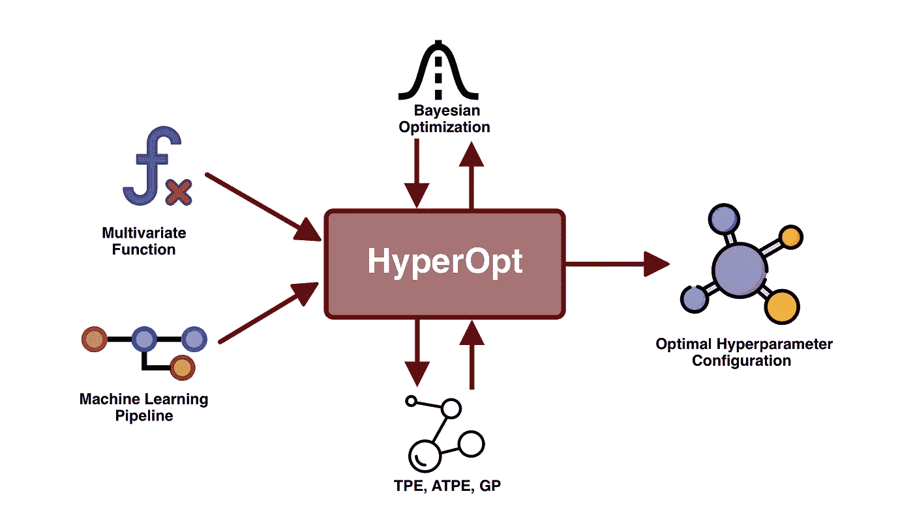
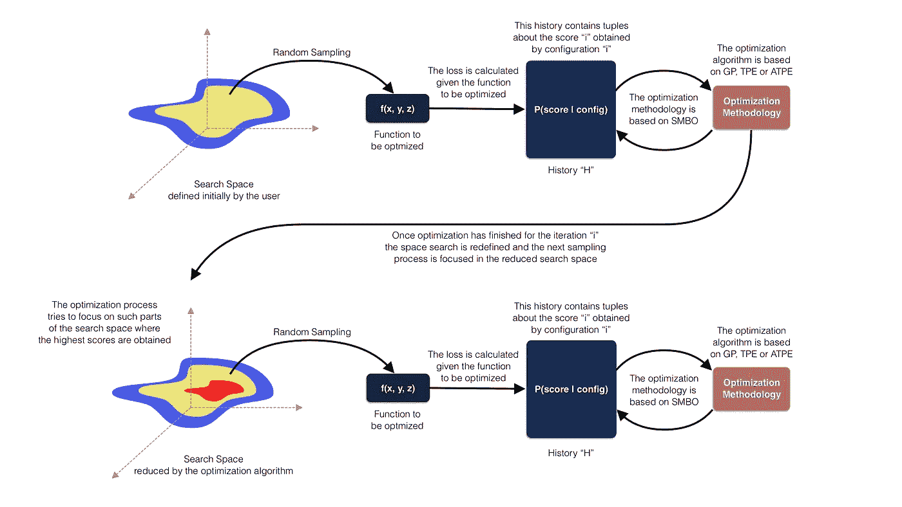
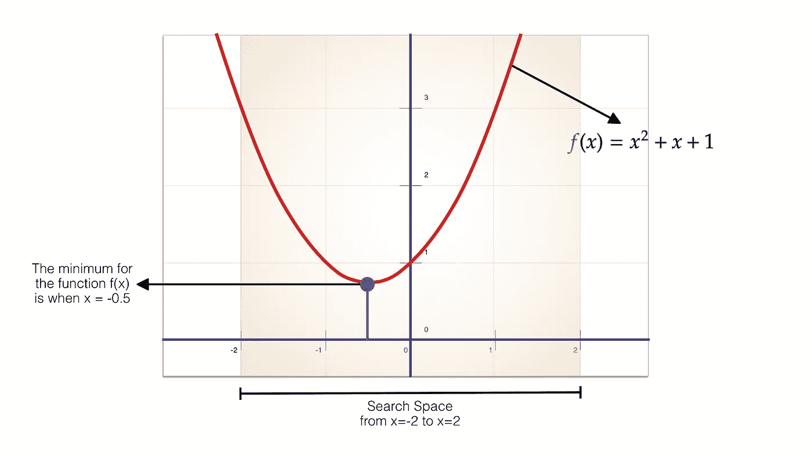

# 超视:基于贝叶斯优化的超参数调整

> 原文：<https://towardsdatascience.com/hyperopt-hyperparameter-tuning-based-on-bayesian-optimization-7fa32dffaf29?source=collection_archive---------2----------------------->

## [实践教程](https://towardsdatascience.com/tagged/hands-on-tutorials)

## 优化机器学习流水线的函数和超参数的替代方案。



图一。远视的代表性建筑|作者图片|图标取自[维塔利·戈尔巴乔夫](https://www.flaticon.es/autores/vitaly-gorbachev)、[自由选择](https://www.freepik.com/)

为给定的功能找到最佳的*超参数*配置不应该完全基于直觉或一些人的经验。相反，对这种最优配置的研究必须得到保证这种最优性的方法的支持。在这么多的方法中，我们可以找到一些基于穷举搜索(例如网格搜索和随机搜索[ [1](https://scikit-learn.org/stable/modules/grid_search.html) ])，或者在优化范式下，例如*遗传算法*(例如 TPOT [ [2](/tpot-pipelines-optimization-with-genetic-algorithms-56ec44ef6ede) ])和*贝叶斯优化* [ [3](https://arxiv.org/pdf/1807.02811.pdf) )。

让我们来谈谈 **HyperOpt** ，这是一款基于**贝叶斯** **优化**并由 **SMBO** (基于序列模型的全局优化)方法支持的工具，旨在自动搜索最优*超参数*配置。所以，这个博客将被划分如下:

*   **什么是远视？**
*   **什么是 hyperpt-sk learn？**
*   **实践中的远视**
*   **HyperOpt-sk 在实践中学习**

# 什么是远视？

**HyperOpt** 是由 **James Bergstra** 于 2011 年创建的开源 python 库【4】。 **HyperOpt** 是一个工具，允许自动搜索机器学习模型的最佳*超参数*。**hyperpt**基于**贝叶斯** **优化**，由 **SMBO** 方法支持，适用于不同的算法，例如:Parzen 估计器树( **TPE** )、Parzen 估计器自适应树( **ATPE** )和高斯过程(**GP**)【5】。

**贝叶斯优化**的方法集中在概率模型 *P(得分|配置)*上，通过查询*(得分，配置)*的历史 *H* 的迭代过程来更新概率模型，其目标是在给定配置 *c* 的情况下最大化*得分*。 **HyperOpt** 以**贝叶斯优化**为前提，通过在采样过程、搜索空间的定义和缩小以及最大化概率模型的算法上做一些改动【4】。

**HyperOpt** 需要 4 个基本组件来优化超参数:搜索空间、*损失函数*、*优化算法*和用于存储历史的数据库(*得分、配置*)。*搜索空间*将由连续凸函数确定。*损失函数*是需要优化的函数，它是通过评估具有“ *c* 配置的模型获得的。*优化算法*基于 **SMBO** 方法，具有 **GP** 、 **TPE** 和 **ATPE** 算法给出的变体。“ *H* ”数据库存储通过优化算法的迭代获得的一组元组(s *核心，配置*)。在图 2 中，我们可以看到关于 **HyperOpt** 如何工作的图形描述。



图二。作者远视图像的典型行为

鉴于 **HyperOpt** 的可用性和可伸缩性，创建了一个扩展，它合并了各种 **scikit-learn** 组件，以便优化带有大量参数的*机器学习管道*，这个扩展被称为 **HyperOpt-Sklearn** ，我们将在下一节中讨论它，让我们开始吧！

# 什么是 HyperOpt-Sklearn？

**HyperOpt-Sklearn** 于 2014 年推出[6]。 **HyperOpt-Sklearn** 构建在 **HyperOpt** 之上，旨在与 **scikit-learn** 套件的各种组件协同工作。**创建 HyperOpt-Sklearn** 的目的是优化机器学习管道，具体解决*数据转换*、*模型选择*和*超参数优化*的阶段。 **HyperOpt-Sklearn** 将 **HyperOpt** 的优点与 **scikit-learn** 框架的可用性和灵活性相结合，从这个意义上来说， **HyperOpt-Sklearn** 被设计用来处理分类和回归任务。在图 3 中，我们可以看到由 **HyperOpt-Sklearn** 优化的 ML 管道的组件。


图 3。由 HyperOpt-Sklearn 优化的 ML 管道组件|作者图片

简而言之，**hyperpt**旨在**贝叶斯优化**范式下优化一个或多个给定函数的超参数。另一方面， **HyperOpt-Sklearn** 被开发来优化机器学习流水线的不同组件，其使用 **HyperOpt** 作为核心，并从 **scikit-learn** 套件中获取各种组件。现在让我们看看如何在实践中使用它们。

# 实践中的远视

既然我们已经了解了**hyperpt**的工作原理及其组件，让我们来看看一个基本的实现。对于这个例子，我们将使用图 4 所示的函数。我们可以看到，函数的最小值是在 *x = -0.5* 的值时给出的。我们来看看如何在**hyperpt**中找到这个值。



图 4。作者使用 HyperOpt | Image 优化的示例函数

**HyperOpt** 需要 4 个基本实现参数，分别是:待优化的*函数*、搜索空间、优化器算法*和迭代次数*。因此，实现应该是这样的:**

*代码片段 1。远视实施*

*正如我们所见，我们正在定义**hyperpt**优化*虚拟函数*所需的每个组件。在第 7 行中，执行要优化的函数的定义。在第 11 行中，执行了*搜索空间*的定义，在这种情况下，只为“ *x* 的值定义了一个搜索空间，然而，对于具有一个以上变量的函数，将需要为每个变量定义一个搜索空间，同样，这种搜索空间将取决于要优化的函数的类型。在这种情况下，出于教导的目的，搜索空间被定义为从-2 到 2。最后，在第 18 行，*托管*优化过程*的类*被初始化。该函数接收待优化的*函数*、*搜索空间*、o *优化算法*(在这种情况下，它是 Parzen 估计器的*树形结构)和迭代次数作为参数。当执行前面的代码片段时，我们获得了优化函数的“ *x* 的值:**

```
*Optimal value of x: {'x': -0.5000806428004325}*
```

*前面的实现是一个基本示例，说明了**hyperpt**的工作原理及其主要组件。更复杂函数的优化需要搜索空间和优化器的充分定义。 **HyperOpt** 提供了一套搜索空间初始化器，你可以在这里找到[。](https://github.com/hyperopt/hyperopt/wiki/FMin#21-parameter-expressions)*

*很好，我们已经看到了 **HyperOpt** 如何在基本实现中工作，现在让我们看看 **HyperOpt-Sklearn** 如何为*机器学习流水线*优化工作。*

# *HyperOpt-sk 在实践中学习*

*实现 **HyperOpt-Sklearn** 的方式与 **HyperOpt 颇为相似。**由于 **HyperOpt-Sklearn** 专注于优化机器学习流水线，需要的 3 个基本参数是:*预处理器*的类型、*机器学习模型*(即分类器或回归器)和*优化器*。值得一提的是，这三个基本元素中的每一个都可以根据每个问题的需要进行定制。*

***HyperOpt Sklearn** 中适配的**预处理器**有: *PCA* ， *TfidfVectorizer* ， *StandardScalar，* *MinMaxScalar* ，*规格化器*， *OneHotEncoder* 。 **HyperOpt Sklearn** 中适配的**分类器有: *SVC，LinearSVC KNeightborsClassifier。RandomForestClassifier，extratereclassifier SGD classifier，MultinomialNB，BernoulliRBM，ColumnKMeans。****

*出于这篇博客的目的，让我们看看分类问题中 **HyperOpt-Sklearn** 的两个基本实现。在这个例子中，我们将使用众所周知的乳腺癌数据集。*

*代码片段 2。用于分类的 HyperOpt-Sklearn*

*正如我们所看到的，在第 22 行中，我们定义了将要实现的分类器，在这种情况下，指令是搜索由 **HyperOpt-Sklearn** 定义的所有分类器(实际上，由于优化所需的计算时间，不建议这样做，因为这是一个实际的例子，进行完全搜索不是一个决定性因素)。在第 23 行中，定义了数据将接收的转换类型，在本例中是使用由 **HyperOpt-Sklearn** 实现的完整转换器套件的指令(正如您所猜测的，只测试那些适合数据集的转换，例如文本转换器不适用于数值数据集)。在第 24 行定义了优化器，在本例中是 **TPE** 。其余的行决定了迭代的次数和每次评估的时间限制。*

*当执行代码片段 2 时，我们获得*

```
*Train score: 0.9723618090452262
Test score: 0.9824561403508771*
```

*最佳配置是:*

```
*{'learner': **ExtraTreesClassifier**(**max_features**=None, **min_samples_leaf**=9, **n_estimators**=19, **n_jobs**=1, **random_state**=3, **verbose**=False), '**preprocs**': (**MinMaxScaler**(**feature_range**=(-1.0, 1.0)),), '**ex_preprocs**': ()}*
```

*嗯，我们已经通过在 **HyperOpt-Sklearn** 覆盖的分类问题的整个范围内进行搜索，获得了一个最佳配置。现在让我们看看如何通过使用特定的分类器来缩小搜索空间。*

*对于这个例子，我们也将使用乳腺癌数据集。然而，这一次我们将使用单个分类器，我们将通过为每个分类器定义一个搜索空间来优化它的每个参数。*

*代码片段 3。用于分类和定制 SGD 分类器的 HyperOpt*

*在本例中，我们使用 **SGD** 作为分类器，我们希望优化*损失参数*以及 *alpha 值*。正如我们所看到的，在第 23 行中，我们为丢失定义了一个*搜索空间*，这样的搜索空间由三个不同的值(*铰链*、*对数*、*胡贝尔*)定义，在选择这三个值之一时会考虑一个概率值。另一方面，在第 29 行中，我们为 *alpha 值*定义了搜索空间，在这种情况下，实现了一个*对数函数*，它由一个*下限*和*上限*限定。最后，在第 33 行，定义了将托管优化过程的类。它接收的参数是分类器(及其各自的参数和搜索空间)、优化器、迭代次数和每次评估的指定时间。*

*当执行代码片段 3 时，我们获得*

```
*Train score: 0.9522613065326633
Test score: 0.9473684210526315*
```

*找到的最佳配置是:*

```
*{'learner': **SGDClassifier**(**alpha**=0.08612797536101766,     **class_weight**='balanced', **eta0**=6.478871110431366e-05, **l1_ratio**=0.20803307323675568, **learning_rate**='invscaling', **loss**='log', **max_iter**=18547873.0, **n_jobs**=1, **power_t**=0.1770890191026292, **random_state**=0, **tol**=0.000332542442869532, **verbose**=False), 
'preprocs': (**PCA**(**n_components**=8),), '**ex_preprocs**': ()}*
```

***HyperOpt-Sklearn** 配置和定制将始终取决于要解决的问题类型、数据类型以及可用的计算能力。*

# *结论*

*在这篇博客中，我们看到了什么是**hyperpt**，它的目的，它是如何工作的，它的主要组件是什么。同样，我们看到了**hyperpt**的主要扩展之一，也就是**hyperpt-sk learn**，它的组件以及它是如何工作的。*

***HyperOpt** 是超参数优化的替代方案，无论是在特定函数中，还是优化机器学习的流水线。**hyperpt**的一大优势是通过特定的调整实现了**贝叶斯优化**，这使得**hyperpt**成为调整超参数的考虑工具。*

# *参考*

*[1] [调整估计器的超参数](https://scikit-learn.org/stable/modules/grid_search.html)*

*[2] [TPOT:用遗传算法进行管道优化](/tpot-pipelines-optimization-with-genetic-algorithms-56ec44ef6ede)*

*[3] [贝叶斯优化教程](https://arxiv.org/pdf/1807.02811.pdf)*

*[4] [建立模型搜索的科学:视觉架构的数百维超参数优化](http://proceedings.mlr.press/v28/bergstra13.pdf)*

*[5] [超参数优化算法](https://papers.nips.cc/paper/2011/file/86e8f7ab32cfd12577bc2619bc635690-Paper.pdf)*

*[6][Hyperopt-sk Learn:sci kit-Learn 的自动超参数配置](https://conference.scipy.org/proceedings/scipy2014/pdfs/komer.pdf)*