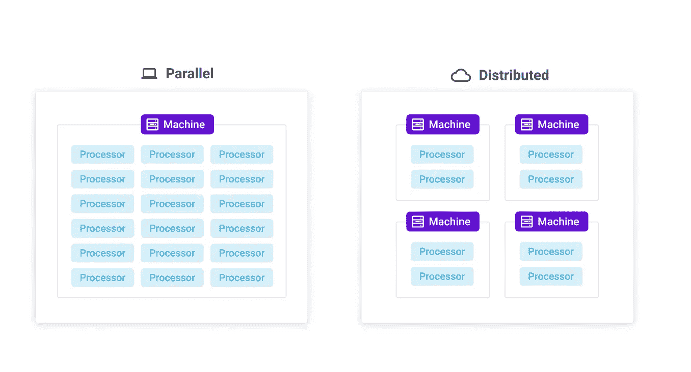
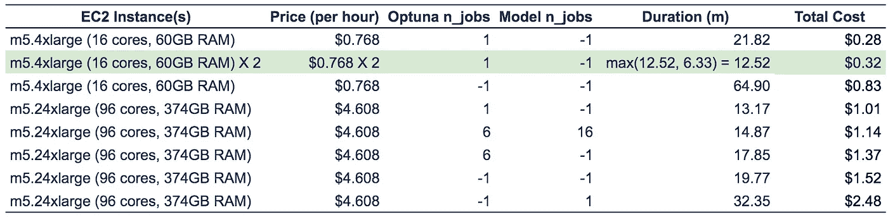
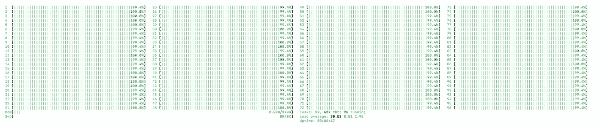

# 使用 AWS 和 Optuna 优化超参数运行时间和成本

> 原文：<https://towardsdatascience.com/hyperparameter-optimization-run-time-and-cost-using-aws-and-optuna-40442a83db3?source=collection_archive---------38----------------------->

在 [Unsplash](https://unsplash.com?utm_source=medium&utm_medium=referral) 上由 [Aron 视觉](https://unsplash.com/@aronvisuals?utm_source=medium&utm_medium=referral)拍摄的照片

## 并行和分布式计算

## 了解如何最好地利用您的计算资源

*大声喊出来*[*Zeev Waks*](https://medium.com/u/77e58abfa6f5?source=post_page-----40442a83db3--------------------------------)*谁参与了这个项目和这篇文章的写作。*

继我们关于[顺序超参数优化](https://medium.com/skyline-ai/selecting-hyperparameter-values-with-sequential-human-in-the-loop-search-space-modification-766d272ed061)的博客之后，我们在这里讨论运行时间和成本方面的工程考虑。我们专门研究了使用并行或分布式计算来加速参数搜索的方法。这一点很重要，因为超参数优化(HPO)通常是模型开发中最昂贵和最慢的方面之一。

我们使用 AWS 虚拟机(EC2 实例)作为硬件，使用 [Optuna](https://optuna.readthedocs.io/en/stable/) 作为软件框架，优化了我们的超参数。Optuna 是由 Preferred Networks，Inc .为 HPO 开发的一个相对较新的开源框架。

# 并行和分布式计算

并行和分布式计算都可以缩短运行时间。图片作者。

并行和分布式计算的目标是优化使用硬件资源来加速计算任务。虽然这两个术语听起来很相似，而且都是指同时运行多个进程，但是有一个重要的区别。

*   *并行计算*是指在一台**单机**的不同处理器上同时运行多个任务。
*   *分布式计算*是指在**多个自主机器**上同时运行任务的能力。

并行和分布式计算都支持扩展，以缩短运行时间。在并行模式下，通过纵向扩展来缩短运行时间，这意味着改进单个机器，例如增加更多的处理器或内存。对于分布式计算，*横向扩展**指的是增加更多的机器，同样可以提高性能。*

*关于并行计算和分布式计算之间的区别和关系还有很多方面[1]，但是我们不会在这篇博客中深入探讨。*

# *用例*

*我们用例的细节可以在[这里](https://medium.com/skyline-ai/selecting-hyperparameter-values-with-sequential-human-in-the-loop-search-space-modification-766d272ed061)找到。我们使用了 9 个超参数，并在 18k 到 80k 的范围内(范围取决于超参数值)训练模型，每个样本包含大约 80 个特征。*

*下面的代码展示了在 Optuna 中定义并行或分布式计算是多么简单。*

*在我们的案例中，并行计算可以在两个地方使用，用于训练回归模型和在同一台机器上同时搜索多个超参数组合(即 [Optuna trials](https://optuna.readthedocs.io/en/stable/reference/trial.html) )。相反，分布式计算在这里可以主要用于在多台机器上搜索不同的超参数组合。为了管理分发工作，我们在 AWS 帐户下使用了一个 [Redis](https://aws.amazon.com/redis/) DB 端点(阅读[这里](https://optuna.readthedocs.io/en/stable/reference/storages.html)关于其他存储选项)。*

# *结果*

*我们使用各种机器和并行/分布式配置来测量运行时间和成本，以便更好地理解运行 HPO 搜索的最佳组合。*

**

***每项研究使用 100 次试验，比较 HPO 成本和运行时间。**我们使用带有固定种子的 [RandomSampler](https://optuna.readthedocs.io/en/stable/reference/generated/optuna.samplers.RandomSampler.html#optuna.samplers.RandomSampler) 来确保在相同的超参数组合上进行比较。-1 表示所有可用的处理器。例如 AWS us-east-1 上的价格。图片作者。*

*我们的两个模型库， [Scikit-learn](https://scikit-learn.org/stable/) (我们使用了 [RandomForestRegressor](https://scikit-learn.org/stable/modules/generated/sklearn.ensemble.RandomForestRegressor.html) )和 [XGBoost](https://xgboost.readthedocs.io/en/latest/) ，以及 [Optuna](https://optuna.readthedocs.io/en/stable/) ，都通过定义一个内置参数 *n_jobs 来支持并行性。*n _ jobs 的值表示并行运行的任务数量，其中-1 表示所有可用处理器的使用率。*

*在我们的案例中，就运行持续时间而言，最佳配置是 Optuna *n_jobs=1* 和 model *n_jobs=-1* ，这意味着我们以并行方式训练模型，但没有使用并行方式来测试超参数组合。因为这种设置对于单台机器来说是最佳的，所以我们没有继续检查分布式运行的其他配置。*

**

*m5.24xlarge (96 个内核，374GB RAM) EC2 计算机的 CPU 利用率显示了出色的处理器利用率。作者图片*

*有趣的是，虽然 m5.24xlarge EC2 实例类型比 m5.4xlarge 实例大 6 倍，但它只提高了 40%的研究时间(有点令人失望)。然而，通过对两个较小的 m5.4x 大型实例使用分布式计算，我们都略微缩短了研究时间(43%比 40%)，并且花费了大约 1/3 的成本。*

*好消息是我们可以添加更多的实例来提高运行时间。此外，其中一台机器空闲了大约 6 分钟，因为它被分配了一组运行时间更短的试验。在进行更多的试验后，这种差异可能会变得不那么有意义。*

*此外，Optuna 并行性使用的线程通常非常适合 I/O 绑定任务，但相比之下，对于 CPU 密集型任务(如训练模型)来说并不是最佳选择([已知问题](https://github.com/optuna/optuna/issues/1480))。点击阅读多线程和多重处理[。为了解决这个问题，我们在同一台 m 5.24 x 大型机器上运行了两个不同的 Python 进程，并使用 Redis 同步了它们，但是这并没有改善我们的运行时间。](/multithreading-vs-multiprocessing-in-python-3afeb73e105f)*

# *摘要*

*我们证明了通过使用 Optuna 进行超参数优化，**横向扩展**(即添加更多的机器)可以减少运行持续时间和成本，至少在我们的案例中，比纵向扩展更有效。*

**我们鼓励读者尝试不同的配置，因为在我们的情况下，最佳设置可能不是其他场景的理想配置。**

*[*海*](https://medium.com/u/5921283ee0f1?source=post_page-----40442a83db3--------------------------------) *是天际线 ai*<http://skyline.ai>**的资深数据科学家，该公司打造的 AI 主谋解决 RE。***

# **参考**

**[1] M. Raynal，[并行计算与分布式计算:一个巨大的困惑？(立场文件)](https://link.springer.com/chapter/10.1007/978-3-319-27308-2_4)(2015)[springer link](https://link.springer.com/)**