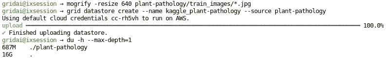
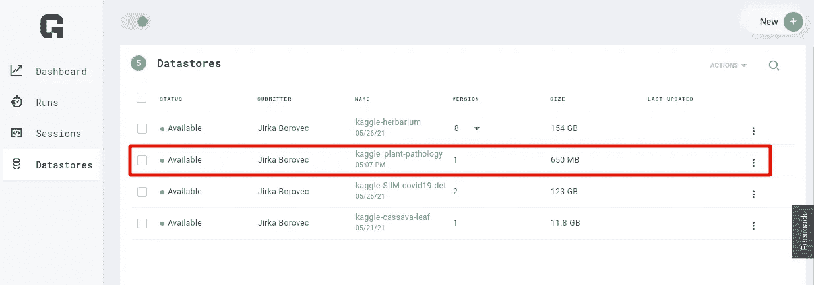
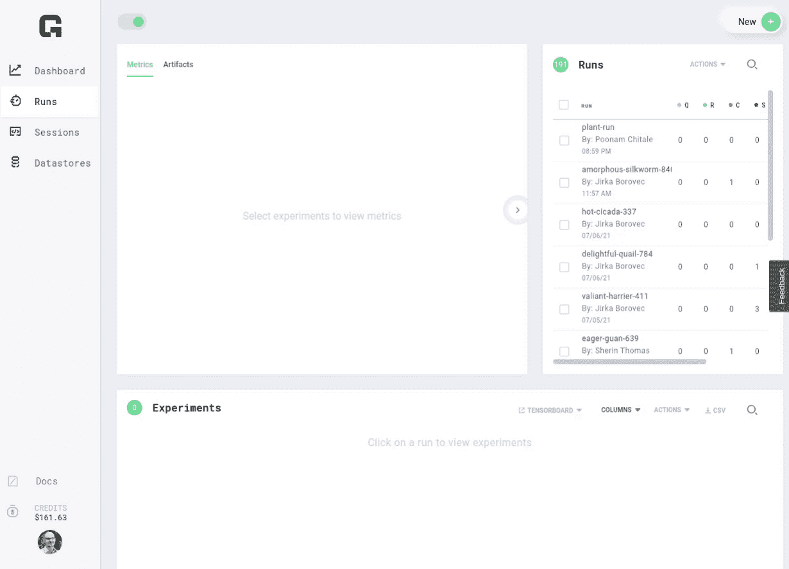
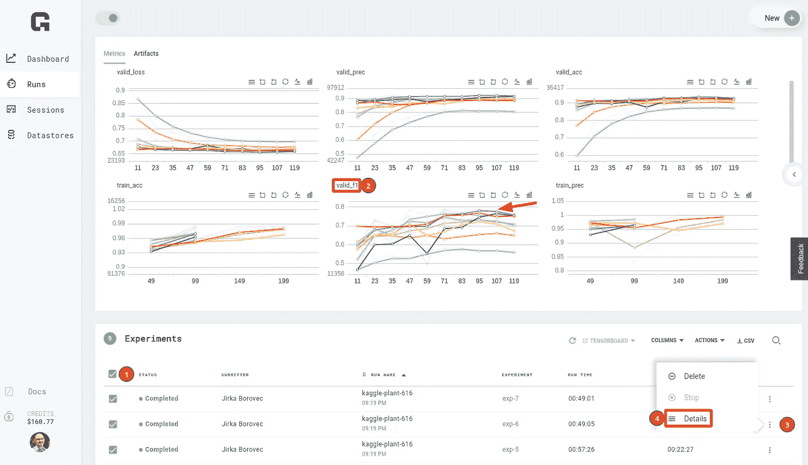
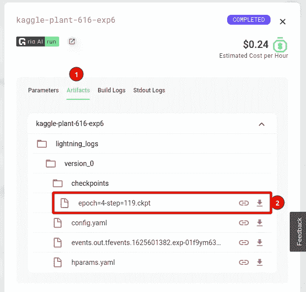

# 使用 Grid.ai 进行超参数优化，无需更改代码

> 原文：<https://towardsdatascience.com/hyperparameter-optimization-with-grid-ai-and-no-code-change-b89218d4ff49?source=collection_archive---------28----------------------->


图片由[米哈伊尔·尼洛夫](https://www.pexels.com/@mikhail-nilov?utm_content=attributionCopyText&utm_medium=referral&utm_source=pexels)从[派克斯](https://www.pexels.com/photo/people-night-dark-laptop-6963944/?utm_content=attributionCopyText&utm_medium=referral&utm_source=pexels)拍摄

## 这篇文章介绍了使用 Grid.ai 平台的超参数扫描搜索，允许在多个 spot 实例上并行化和实时性能观察。

在[之前的一篇文章](/converting-kaggle-training-notebooks-to-sharable-code-1cc59fec2414)中，我们展示了如何将科学笔记本转换成一个标准的 python 包，以供分享。然后，我们演示了如何通过命令行界面(CLI)将普通 python 脚本转换为训练脚本，从而实现更快的超参数交互。

[](/converting-kaggle-training-notebooks-to-sharable-code-1cc59fec2414) [## 将 Kaggle 培训笔记本转换为可共享代码

### 这篇文章展示了如何轻松地将笔记本转换成标准的 Python 包，并包含了一个简单的命令行…

towardsdatascience.com](/converting-kaggle-training-notebooks-to-sharable-code-1cc59fec2414) 

配置好 CLI 后，我们现在可以将不同的超参数(如学习率或模型架构)传递给我们的模型，而无需更改任何代码……但我们如何识别这些参数值的哪些组合会产生性能最佳的模型呢？

# 使用 Grid.ai 进行超参数优化

如何选择最优的超参数集是机器学习中最常见的问题之一。许多 Kaggle 大师声称，正确的参数值集是在排行榜上排名的模型和不相关的模型之间的差异。具有重要参数的简单模型可以从基本超参数优化中获得 5–15%的性能提升。

另一方面，对于大多数初学者来说，执行参数调整可能是一项费时费力的任务。一种常见但简单的超参数调整方法是顺序运行多个实验，并将配置值和结果写入 Excel 表格。

更高级的 Kagglers 可以使用简单的并行化超参数搜索，并使用 [MLFlow](https://mlflow.org/) 、[权重&偏差、](https://wandb.ai/site) [Neptune.ai](https://neptune.ai/) 等跟踪结果。然而，如果您采用这种方法，您需要在一台具有多个 GPU 的强大机器上进行训练，或者用几台机器创建和编排您的云。

> 注意如果你有自己强大的机器，还有几个其他的超参数搜索选项，比如 [Optuna](/why-is-everyone-at-kaggle-obsessed-with-optuna-for-hyperparameter-tuning-7608fdca337c) 、 [Ray tune](https://docs.ray.io/en/latest/tune) 、[等。](https://medium.com/pytorch/accelerate-your-hyperparameter-optimization-with-pytorchs-ecosystem-tools-bc17001b9a49)
> 
> 完全公开——我目前在 Grid.ai
> 担任高级研究工程师。注意，您也可以使用其他替代方案来利用这些最佳实践，如 Kaggle 内核或 Colab，但 Grid.ai 是我的首选平台，因为它使我能够使用云轻松地扩展培训我的模型。

幸运的是， [Grid Runs](https://docs.grid.ai/products/run-run-and-sweep-github-files) 支持对我们的代码进行快速超参数调优，而无需担心编排复杂的基础设施或向我们的代码添加外部库。网格运行自动收集日志和管理并行实验…不需要对我们的代码做任何更改！

## 创建数据存储

在大多数大型项目中，共享数据是快速实验的一个重要瓶颈，因为它需要安全的并行计算资源来访问。幸运的是，网格数据存储经过了优化，允许您的模型以最高速度进行训练，而无需承担技术债务或需要处理优化云存储的复杂性。此外，网格数据存储具有集成的数据集版本，可确保我们的超参数实验具有可比性和可再现性的机器学习！

[之前，我们在网格交互会话](/intuitive-kaggle-task-exploration-and-model-baselining-e5f641943d08)中预处理/缩减了数据集。现在，我们将把这个数据集上传到新创建的数据存储区。从会话上传数据可确保更快的上传速度。稍后，我们将通过网格运行来访问该数据存储，以运行超参数搜索，从而从我们的模型中获得最佳性能。

```
grid datastore create \
    --name kaggle_plant-pathology \
    --source plant-pathology
```

有关数据存储的更多详细信息，请参见[文档](https://docs.grid.ai/products/add-data-to-grid-datastores)。



创建/上传网格数据存储。

创建完成后，我们可以从 web UI 中快速检查所有数据存储库的一些基本信息，如大小或上次更新。



在 UI 中查看创建的数据存储。

## 超参数微调

现在，我们可以从上次[培训脚本](https://github.com/Borda/kaggle_plant-pathology/blob/a642861e8d4d896c15b10c5dfcf071d8436889b5/kaggle_plantpatho/cli_train.py)的地方开始。我们现在将展示如何使用三种不同的学习速率和三个 ResNet 模型主干的组合来运行 9 个实验。此外，您可以在命令行或 UI 中轻松扩展实验和超参数的数量，而无需更改任何代码。

以下步骤假设我们已经从 data science 内核创建了 [GitHub 存储库](https://github.com/Borda/kaggle_plant-pathology)。现在，我们可以链接我们想要运行超参数搜索的[训练脚本](https://github.com/Borda/kaggle_plant-pathology/blob/a642861e8d4d896c15b10c5dfcf071d8436889b5/kaggle_plantpatho/cli_train.py)。如果你还没有创建一个 GitHub 回购，请查看[这篇文章](/converting-kaggle-training-notebooks-to-sharable-code-1cc59fec2414)，或者你可以跟随我冒昧为这篇文章准备的回购。

[](https://github.com/Borda/kaggle_plant-pathology) [## GitHub-Borda/ka ggle _ plant-pathology:识别苹果树叶子上的病害类型

### 叶部病害对苹果园的整体产量和质量构成了重大威胁。当前…

github.com](https://github.com/Borda/kaggle_plant-pathology) 

然后，我们选择想要使用的机器类型。在我们的例子中，我们需要一个 GPU 来训练我们的模型，所以我每次实验都选择了一个[单 T4](https://docs.grid.ai/products/run-run-and-sweep-github-files/machines) ，使用[点实例](https://spot.io/what-are-ec2-spot-instances)来显著降低成本。这 9 次实验(每次训练大约需要 30 分钟)花费了不到 1 美元的免费积分来调整一个可分级的模型。



使用网格运行创建网格搜索的过程。

为了准备我们的超参数搜索，我们需要做的就是用一个范围(列表、采样等)替换我们的单个 CLI 的参数值。)的 pythonic 式的价值观:

```
--model.model "['resnet18', 'resnet34', 'resnet50']" \
--model.lr "[0.0001, 0.0005, 0.001]" \
--data.base_path grid:kaggle_plant-pathology:1 \
--trainer.max_epochs 5
```

对于每个实验，我们从上一步中创建的数据存储中装载数据，因此不需要在本地下载数据，大大加快了训练时间。

## 实时监控训练并保存最佳模型

监控实验使您能够调试和终止不收敛的模型。这有助于降低成本并节省资源，这些资源可以再投资于训练更好的模型。

PyTorch Lightning 默认使用 [TensorBoard 记录器](https://pytorch-lightning.readthedocs.io/en/latest/common/loggers.html#tensorboard)，与 [Grid.ai 平台](https://platform.grid.ai/)原生集成。 [TensorBoard](https://www.tensorflow.org/tensorboard) 让我们可以毫不费力地监控和比较所有实验的结果。



浏览所有实验的汇总结果，以找到 F1 分数最高的模型。

PyTorch Lightning 默认提供[自动检查点](https://pytorch-lightning.readthedocs.io/en/latest/common/weights_loading.html)。当找到最佳实验时，我们可以打开它的 details 窗口并导航到 artifact 选项卡来下载保存的检查点，我们将在推理中使用它。



从一个特定的实验中下载艺术品。

在这篇文章中，我们讨论了对超参数搜索的需求，并且我们已经运行了 walked throw 网格，这简化了云中的微调。我们甚至可以在线监控我们的训练，并最终根据我们的选择终止一些默认配置。

在未来，我们将使用我们训练有素的模型，并展示如何准备离线运行的 Kaggle submission 内核，以便在比赛中进行评分。

[](/submitting-model-predictions-to-kaggle-competition-ccb64b17132e) [## 向 Kaggle 竞赛提交模型预测

### 用 PyTorch 闪电和网格点实例在 Kaggle 上排名的最佳实践(第 5/5 部分)

towardsdatascience.com](/submitting-model-predictions-to-kaggle-competition-ccb64b17132e) 

**敬请关注，关注我了解更多！**

[](https://devblog.pytorchlightning.ai/best-practices-to-rank-on-kaggle-competition-with-pytorch-lightning-and-grid-ai-spot-instances-54aa5248aa8e) [## 使用 PyTorch Lightning 和 Grid.ai Spot 实例对 Kaggle 竞争进行排名的最佳实践

### 通过交互式会话、超参数解决图像分类挑战的完整数据科学周期…

devblog.pytorchlightning.ai](https://devblog.pytorchlightning.ai/best-practices-to-rank-on-kaggle-competition-with-pytorch-lightning-and-grid-ai-spot-instances-54aa5248aa8e) 

# 关于作者

[**Jirka boro vec**](https://medium.com/@jborovec)**已经在几家不同的 IT 公司从事机器学习和数据科学工作好几年了。特别是，他喜欢探索有趣的世界问题，并用最先进的技术解决它们。此外，他开发了几个开源 python 包，并积极参与其他知名项目。在 [*Grid.ai*](https://www.grid.ai/) 工作，担任研究工程师，[*pytorchlightning . ai*](https://pytorchlightning.ai/)主要撰稿人。**