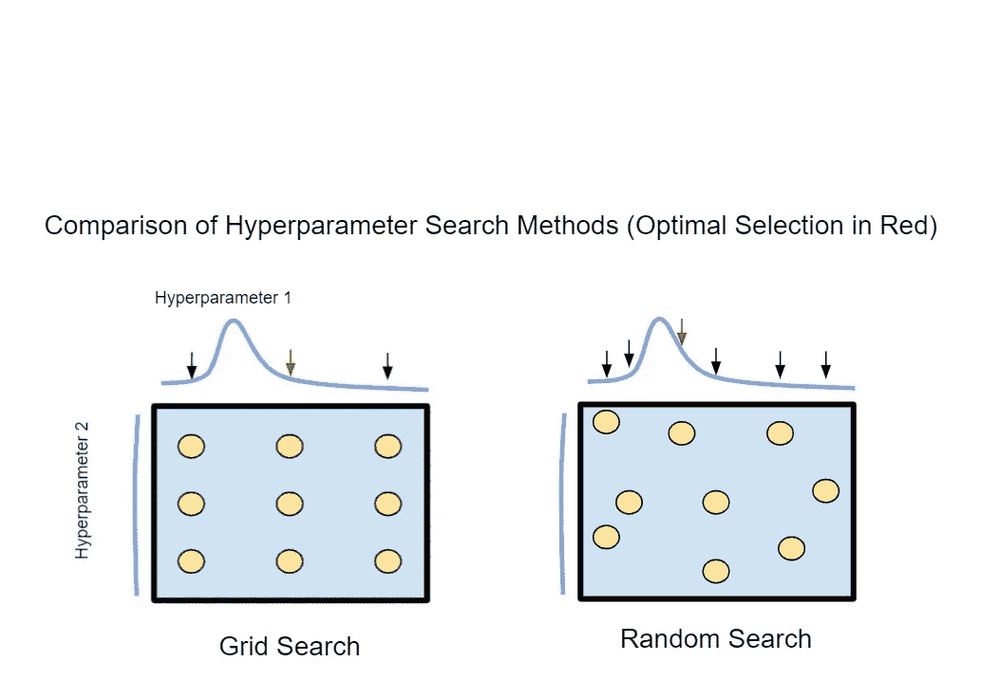
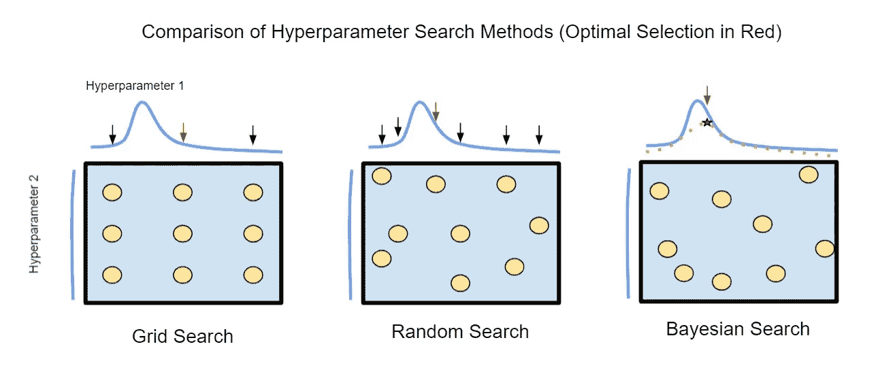
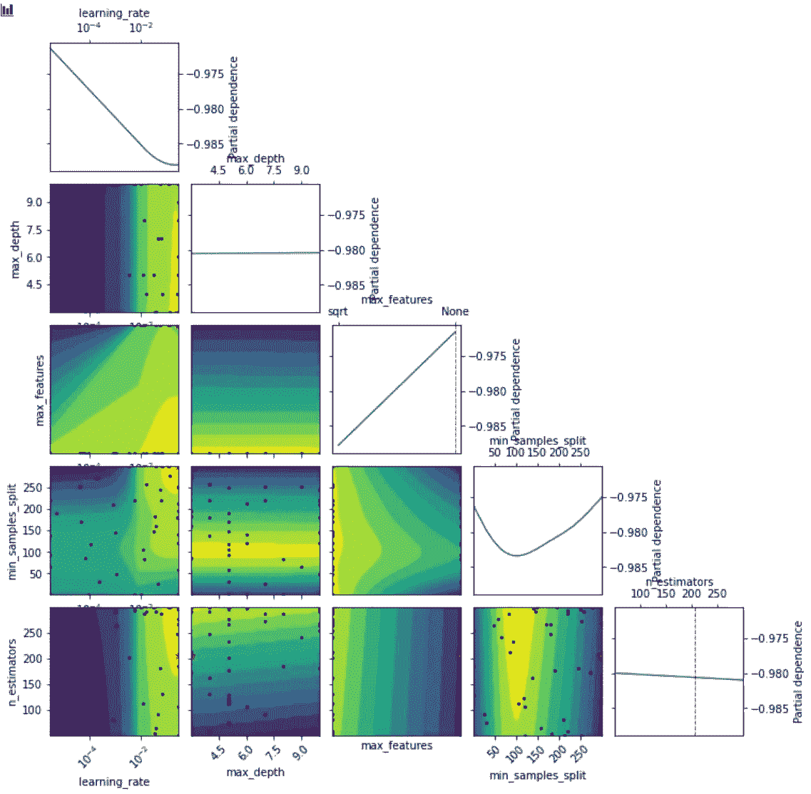

# 超参数调整—始终调整您的模型

> 原文：<https://towardsdatascience.com/hyperparameter-tuning-always-tune-your-models-7db7aeaf47e9?source=collection_archive---------16----------------------->

## [实践教程](https://towardsdatascience.com/tagged/hands-on-tutorials)

## 不要放弃免费的性能提升。


[西格蒙德](https://unsplash.com/@sigmund?utm_source=medium&utm_medium=referral)在 [Unsplash](https://unsplash.com?utm_source=medium&utm_medium=referral) 上拍照

## TLDR 概述

*   网格搜索—穷举且计算量大，在超参数搜索空间受限时使用。
*   随机搜索—与网格搜索相比，更大的搜索空间改进了模型，网格搜索是 scikit-learn 内置的定位方法。
*   贝叶斯优化—改进了随机搜索和超参数解释的性能，尽可能使用。

# 什么是超参数调谐？

超参数调整是提高模型性能的一个重要方面。给定一个具有许多超参数的复杂模型，有效的超参数调整可以显著提高性能。例如，梯度增强分类器有许多不同的参数要微调，每个参数都会唯一地改变模型的性能。有些可能影响很小或没有影响，而另一些可能对模型的可行性至关重要。

最常见的方法是尝试几种用户定义的超参数组合，比较结果，并选择总体最佳表现者。这种方法有一些明显的缺点，因为基于初始选项的选择是有偏差的。虽然关于目标问题的先验知识可以为理想的选择提供一些指导，但是还有潜在的更好的选择没有被检查。网格搜索遵循这一基本方法，但即使有了先验知识，这也是不理想的。

## 履行

这篇文章的完整笔记可以在[这里](https://github.com/zjwarnes/Data-Science-Notebooks)找到。

这些超参数搜索中的每一个都非常容易实现，所以您应该在模型优化过程中加入一个。对于我的例子，我使用乳腺癌数据集。首先，我加载数据、相关的库，初始化一些元参数，并拆分数据集。接下来，我创建一个小管道，运行每个搜索并打印出性能。

```
**import** **pandas** **as** **pd**
**from** **scipy.stats** **import** uniform, geom, loguniform, randint, expon
**from** **sklearn.ensemble** **import** GradientBoostingClassifier
**from** **sklearn.model_selection** **import** cross_val_score, GridSearchCV, train_test_split, RandomizedSearchCV
**from** **sklearn.metrics** **import** roc_auc_score
**from** **sklearn.pipeline** **import** make_pipeline, Pipeline
**from** **sklearn.datasets** **import** load_iris, load_boston, load_diabetes, load_digits, load_linnerud, load_wine, load_breast_cancerTEST_SIZE = 0.1 
RANDOM_STATE = 10  
data = load_breast_cancer() 
df = pd.DataFrame(data.data, columns=data.feature_names) df['target'] = data.target X = df.drop(['target'], axis=1) 
y = df['target'].astype(float) 
X_train, X_test, y_train, y_test = train_test_split(X, y, test_size=TEST_SIZE, random_state=RANDOM_STATE, stratify=y)
```

# **网格搜索与随机搜索**

## 网格搜索

网格搜索是最常见的超参数选择技术之一。这种方法实际上是一种强力策略，只需为每个超参数配置创建和测试一个模型，这种方法受益于穷举搜索行为。此外，可以肯定的是，每个组合都经过了比较。

然而，应该清楚的是，使用全面搜索超参数是昂贵的。由于这些搜索处理组合的复杂性，必须测试的模型数量急剧增加，特别是当目标模型类型有许多参数要调整时。由于这种计算负担，当一些超参数的最佳选择已知时，网格搜索是最有效的。

## 随机搜索

随机搜索是网格搜索的常用替代方法。与对每个超参数配置的穷举搜索相反，随机搜索只对设定数量的样本运行。每个样本从可能的参数列表或参数分布中随机选择超参数。虽然与网格搜索相比，这种方法似乎不是最佳的，但在相同的计算量下，它表现得更好。

当存在许多可忽略的超参数时，该方法的好处是显而易见的。例如，在梯度增强模型中，用于具有少量特征的模型的特征选择可以是总特征的平方根或特征数量的对数。当特征的数量很小时，两个选择之间的差异是有限的。将参数的两种变体添加到搜索中会使网格搜索中的搜索空间加倍。相比之下，随机搜索将只包括所有样本中成比例的这些参数选择。包含可忽略参数变量的样本将揭示该参数的影响，并大大节省计算时间。

因此，随机搜索可以在更大的超参数空间上进行优化，其计算量与网格搜索相同。因此，与通过网格搜索优化的模型相比，随机搜索进一步提高了最优模型的性能。

此外，随机搜索比网格搜索还有一个好处。因为网格搜索使用超参数的离散选择来创建模型，所以错过不可忽略的超参数的最佳选择的概率增加了。相反，随机搜索可以从可能的超参数的连续或完全离散分布中选择配置。这种行为已被证明在识别最佳模型设置时更有效，尤其是当超参数的搜索空间很大时。

## 比较方法

各种方法之间的比较如下图所示。假设两个超参数需要调整，每个参数在每个配置下的模型真实性能以蓝色显示。应该清楚的是，网格搜索产生的模型可能会“错过”模型的最佳超参数配置。相反，随机搜索有效地忽略了第一个可忽略的超参数，并从第二个超参数中采样更多不同的值。因此，随机搜索可以找到更优的超参数选择。



搜索方法之间的差异(作者提供的照片)

## 实施搜索

网格搜索和随机搜索是标准 scikit-learn 包的一部分，可与 scikit-learn 生成的现有模型无缝协作。下面是使用网格搜索和随机搜索创建管道的大致设置。这个例子的模型是 GradientBoostingClassifier，但是这个模型是可以互换的。

要切换到另一个模型，请更新管道定义中的模型，并更新 *hyper_parameter* 字典中的参数名称和选择/分布。参数名称应带有前缀“ *model__* ，以匹配管道中的名称“ *model* ”。这些名称可以根据需要进行更改。

## 网格搜索

```
N_JOBS = 1
K_FOLDS = 10
N_ITER_NO_CHANGE = 100
SCORING_METRIC = 'roc_auc'

*# Gradient Boosting Parameters*
hyper_parameters = {
        'model__n_estimators': [50, 150, 300],
        'model__learning_rate': [0.1, 0.03, 0.001],
        'model__max_depth': [3, 5, 8],
        'model__max_features': ['sqrt'], 
        'model__min_samples_split': [2],
        'model__n_iter_no_change': [N_ITER_NO_CHANGE], *# Note single elements should still be in a list*
        'model__random_state': [RANDOM_STATE],
        'model__min_samples_leaf': [2, 10]
}

*# Make pipeline - Add steps if needed, i.e. feature selection*
pipe = Pipeline(steps=[
    ('model', GradientBoostingClassifier())
])

*# 'n_iter' no longer needed as all combinations are checked*
search_space = GridSearchCV(
    pipe, hyper_parameters, 
    cv=K_FOLDS, scoring=SCORING_METRIC, n_jobs = N_JOBS, 
    return_train_score=**True**, verbose = 1
)
search_space.fit(X_train, y_train) 

y_pred = search_space.best_estimator_.predict(X_train)
y_pred_prob = search_space.best_estimator_.predict_proba(X_train)[:,1]
y_pred_test = search_space.best_estimator_.predict_proba(X_test)[:,1]

print( 
    'Best Training Score: ', search_space.cv_results_['mean_train_score'][search_space.best_index_], 
    '**\n**Best Test Score: ', search_space.best_score_,
    '**\n**Hold Out Test Score: ', roc_auc_score(y_test, y_pred_test)
)
```

然后是随机搜索的代码，请注意从参数列表选项到统计库中定义的分布的变化。

## 随机搜索

```
N_ITER = 54
N_JOBS = 1
K_FOLDS = 10
N_ITER_NO_CHANGE = 100
SCORING_METRIC = 'roc_auc'

hyper_parameters = {
        'model__n_estimators': randint(50,500),
        'model__learning_rate': loguniform(3e-4, 3e-1),
        'model__max_depth': randint(3,10),
        'model__max_features': ['sqrt'], 
        'model__min_samples_split': randint(2,20),
        'model__n_iter_no_change': [N_ITER_NO_CHANGE], *# Note single elements should still be in a list*
        'model__random_state': [RANDOM_STATE],
        'model__min_samples_leaf': randint(1,10)
}

pipe = Pipeline(steps=[
    ('model', GradientBoostingClassifier())
])

search_space = RandomizedSearchCV(
    pipe, hyper_parameters, 
    n_iter = N_ITER, cv=K_FOLDS, 
    scoring=SCORING_METRIC, n_jobs = N_JOBS, 
    return_train_score=**True**, verbose = 1
)
search_space.fit(X_train, y_train) 

y_pred = search_space.best_estimator_.predict(X_train)
y_pred_prob = search_space.best_estimator_.predict_proba(X_train)[:,1]
y_pred_test = search_space.best_estimator_.predict_proba(X_test)[:,1]

print( 
    'Best Training Score: ', search_space.cv_results_['mean_train_score'][search_space.best_index_], 
    '**\n**Best Test Score: ', search_space.best_score_,
    '**\n**Hold Out Test Score: ', roc_auc_score(y_test, y_pred_test)
)
```

# **贝叶斯搜索**

随机搜索被证明比网格搜索更有效。然而，另一种方法证明可以找到更优的超参数选择。贝叶斯搜索是一种超参数选择技术，它对超参数搜索空间进行建模和优化。该建模使用高斯过程来完成，该高斯过程对从超参数空间产生的函数进行建模。

搜索过程如下。样本取自超参数空间，创建多个模型，测量模型的性能，并使用 argmax 函数进行优化，以确定最佳超参数配置。这个过程类似于随机搜索，增加的好处是模式被外推以找到更优的模型。此外，贝叶斯超参数搜索对每个超参数进行相互比较建模，这允许对模型的有效性进行更稳健的解释。

## 贝叶斯搜索与其他搜索

将贝叶斯超参数与网格搜索和随机搜索进行比较，您可以看到，贝叶斯搜索不仅随机采样类似于随机搜索，而且在许多样本之后，生成一个函数来对超参数空间进行建模，然后对其进行优化。这一过程会在图像中产生虚线，最佳点由小红星表示。请注意，这仍然不是函数的真正最佳超参数选择，但却提高了模型性能。



搜索方法之间的差异(作者提供的照片)

## 实现贝叶斯搜索

不幸的是，贝叶斯优化的代码不是标准 scikit-learn 包的一部分。然而，软件包 scikit-optimize 提供了一个与 scikit-learn 模型集成的贝叶斯超参数优化功能。该方法的代码遵循与网格和随机搜索相似的模式，但是参数分布的定义不同。

```
**from** **skopt** **import** BayesSearchCV
**from** **skopt.space** **import** Real, Categorical, Integer

N_ITER = 54
N_JOBS = 1
hyper_parameters = {
        'n_estimators': Integer(50, 300),
        'max_depth': Integer(3, 10),
        'min_samples_split': Integer(2, 300),
        'learning_rate': Real(3e-6, 3e-1,prior='log-uniform'),     
        'max_features': Categorical(['sqrt', **None**]),
}
search_space = BayesSearchCV(
    estimator=GradientBoostingClassifier(
        n_iter_no_change=N_ITER_NO_CHANGE, 
        random_state=RANDOM_STATE
    ),
    search_spaces=hyper_parameters,
    scoring=SCORING_METRIC,
    cv=K_FOLDS,
    n_iter=N_ITER,
    random_state=RANDOM_STATE,
    return_train_score=**True**,
    verbose = 1,
    n_jobs=N_JOBS
)
*# executes bayesian optimization*
_ = search_space.fit(X_train, y_train)

y_pred = search_space.best_estimator_.predict(X_train)
y_pred_prob = search_space.best_estimator_.predict_proba(X_train)[:,1]
y_pred_test = search_space.best_estimator_.predict_proba(X_test)[:,1]

*# model can be saved, used for predictions or scoring*
print( 
    'Best Training Score: ', search_space.cv_results_['mean_train_score'][search_space.best_index_], 
    '**\n**Best Test Score: ', search_space.best_score_,
    '**\n**Hold Out Test Score: ', roc_auc_score(y_test, y_pred_test)
)
```

## 理解贝叶斯搜索

此外，scikit-optimization 提供了可视化超参数优化函数的方法。这些图可以进一步指导优化过程。此外，可以查看紧急模式，例如识别可忽略的参数和有限的搜索空间。这些图用于进一步细化搜索空间，以创建一个更加优化的模型。

```
**import** **matplotlib.pyplot** **as** **plt**
**from** **skopt.plots** **import** plot_objective, plot_histogram

_ = plot_objective(search_space.optimizer_results_[0],
                   n_minimum_search=int(1e8))
plt.show()
```



每个超参数的贝叶斯优化 PDP 图(作者提供图片)

# 结论

如果您还没有使用超参数优化，并且您的模型有超参数，那么您应该使用超参数优化。然后，根据您的可用资源和包依赖项，您可以使用所描述的三种方法中的任何一种。

例如，贝叶斯优化非常适合快速找到好的超参数设置，而网格搜索可以在定义小搜索空间时进一步微调模型。一般来说，随机搜索是这两种方法之间的折中，您应该(至少)将这种超参数搜索整合到您现有的模型和管道中，以获得立竿见影的性能提升。

如果你有兴趣阅读关于新颖的数据科学工具和理解机器学习算法的文章，可以考虑在 Medium 上关注我。

*如果你对我的写作感兴趣，想直接支持我，请通过以下链接订阅。这个链接确保我会收到你的会员费的一部分。*

[](https://zjwarnes.medium.com/membership) [## 通过我的推荐链接加入 Medium-Zachary Warnes

### 阅读扎卡里·沃恩斯(以及媒体上成千上万的其他作家)的每一个故事。您的会员费直接支持…

zjwarnes.medium.com](https://zjwarnes.medium.com/membership)