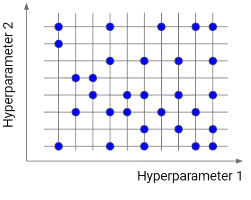
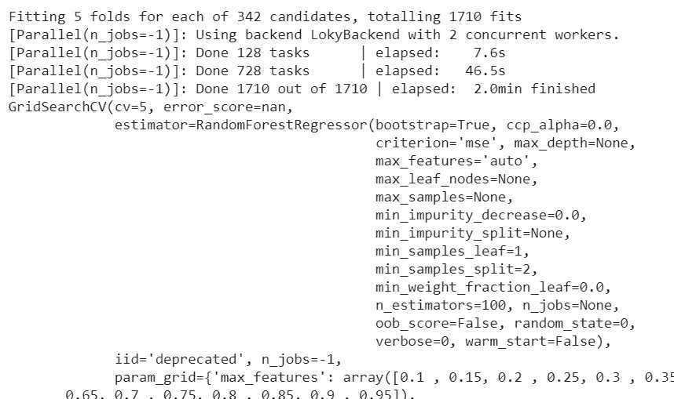
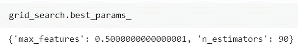
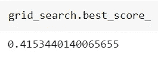
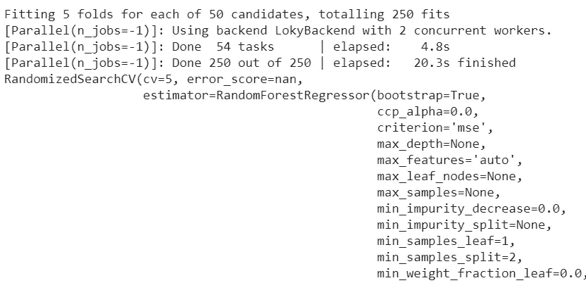
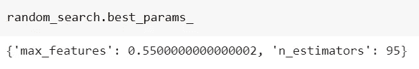
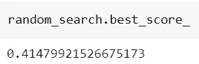

# 超参数调谐:网格搜索和随机搜索

> 原文：<https://towardsdatascience.com/hyperparameter-tuning-grid-search-and-random-search-caadb703c046?source=collection_archive---------26----------------------->

## 两种最常见的超参数调谐技术



作者图片

超参数调整是机器学习管道中最重要的部分之一。超参数值的错误选择可能导致错误的结果和性能差的模型。

有几种方法可以执行超参数调整。其中两种是网格搜索和随机搜索。

让我们看看它们是如何工作的。

# 超参数调谐的需要

超参数是模型参数，其值在训练之前设置。比如一个前馈神经网络的神经元个数就是一个超参数，因为我们在训练之前就设定好了。超参数的另一个例子是随机森林中的树木数量或[套索回归](https://www.yourdatateacher.com/2021/03/29/an-introduction-to-linear-models/)的惩罚强度。它们都是在训练阶段之前设置的数字，它们的值会影响模型的行为。

我们为什么要调整模型的超参数？因为我们事先并不知道它们的最优值。具有不同超参数的模型实际上是不同的模型，因此它可能具有较低的性能。

在神经网络的情况下，神经元数量少会导致欠拟合，数量多会导致过拟合。在这两种情况下，模型都不好，所以我们需要找到导致最佳性能的中间神经元数量。

如果模型有几个超参数，我们需要在多维空间中寻找超参数值的最佳组合。这就是为什么超参数调整，即找到超参数的正确值的过程，是一项非常复杂和耗时的任务。

我们来看两个最重要的超参数调优算法，网格搜索和随机搜索。

# 网格搜索

网格搜索是最简单的超参数调整算法。基本上，我们将超参数的域划分成一个离散的网格。然后，我们尝试这个网格值的每个组合，使用交叉验证计算一些性能指标。交叉验证中最大化平均值的网格点是超参数值的最佳组合。


作者图片

网格搜索是一种覆盖所有组合的穷举算法，因此它实际上可以找到域中的最佳点。最大的缺点是它非常慢。检查空间的每一个组合需要大量的时间，有时这是不可行的。别忘了网格中的每个点都需要 k 重交叉验证，这需要 *k* 个训练步骤。因此，以这种方式调整模型的超参数可能相当复杂和昂贵。然而，如果我们寻找超参数值的最佳组合，网格搜索是一个非常好的想法。

# 随机搜索

随机搜索类似于网格搜索，但它不是使用网格中的所有点，而是只测试这些点的随机选择的子集。这个子集越小，优化速度越快，但精度越低。这个数据集越大，优化就越精确，但越接近网格搜索。


作者图片

当您有几个带有精细网格值的超参数时，随机搜索是一个非常有用的选项。使用由 5-100 个随机选择的点组成的子集，我们能够得到一组相当好的超参数值。它不太可能是最好的一点，但它仍然可以是一组很好的值，为我们提供一个很好的模型。

# Python 中的一个例子

让我们看看如何使用 scikit-learn 在 Python 中实现这些算法。在本例中，我们将对仅使用 n_estimators 和 max_features 超参数的*糖尿病*数据集优化随机森林回归器。你可以在我的 GitHub [这里](https://github.com/gianlucamalato/machinelearning/blob/master/Grid_search_and_random_search.ipynb)找到全部代码。

首先，让我们导入一些有用的库:

```
from sklearn.datasets import load_diabetes 
from sklearn.model_selection import GridSearchCV, RandomizedSearchCV, train_test_split 
from sklearn.ensemble import RandomForestRegressor 
import numpy as np
```

然后，让我们导入数据集，并将其分成训练集和测试集。所有的计算都将在训练集上完成。

```
X,y = load_diabetes(return_X_y=True) 
X_train, X_test, y_train, y_test = train_test_split(X, y, test_size=0.33, random_state=42)
```

现在，让我们开始网格搜索。网格搜索是使用 scikit-learn 的 *GridSearchCV* 对象完成的。当我们寻找超参数值的最佳组合时，它将我们要优化的估计量、交叉验证中的折叠数以及要考虑的评分标准作为输入。最后一个参数是我们要研究的每个超参数的值列表。GridSearchCV 将为我们创建所有的组合。

假设我们希望将 *n_estimators* 超参数从 5 扩展到 100，步长为 5，将 *max_features* 超参数从 0.1 扩展到 1.0，步长为 0.05。我们正在寻找这些范围的组合，使 5 倍交叉验证的平均值最大化。下面是我们需要编写的代码:

```
grid_search = GridSearchCV(RandomForestRegressor(random_state=0), 
{ 'n_estimators':np.arange(5,100,5), 'max_features':np.arange(0.1,1.0,0.05), }
,cv=5, scoring="r2",verbose=1,n_jobs=-1 ) grid_search.fit(X_train,y_train)
```

一旦我们适合网格搜索，Python 将跨越我们提供的列表中的所有值的组合，并挑选得分最高的一个。这个过程可能需要一段时间，因为我们的网格很大。

两分钟后，我们得到:



正如我们从第一行看到的，网格搜索适合 1710 次。

最后，我们可以看看找到的最佳组合:



最好的成绩是:



现在，让我们看看随机搜索会发生什么。代码完全相同，但是现在我们必须定义要使用的迭代次数。我们将使用 50 次迭代。最后，我们将添加一个随机状态，以使结果可重复。

```
random_search = RandomizedSearchCV(RandomForestRegressor(random_state=0), 
{ 'n_estimators':np.arange(5,100,5), 'max_features':np.arange(0.1,1.0,0.05), }
,cv=5, scoring="r2",verbose=1,n_jobs=-1, n_iter=50, random_state = 0 ) random_search.fit(X_train,y_train)
```

现在我们只进行 250 次拟合(50 次迭代，每次 5 次拟合)。这个过程只需要 20 秒钟就能得出结果。



以下是最佳组合:



它的最好成绩是:



正如我们所看到的，结果与网格搜索非常相似，但随机搜索使我们节省了 83%的计算时间。

# 结论

我认为，在这两种算法中，随机搜索是非常有用的，因为它更快，而且由于它不会到达网格中的最佳点，所以它避免了过度拟合，并且更能够一般化。然而，对于小网格(即少于 200 点)，如果训练阶段不太慢，我建议使用网格搜索。对于一般情况，随机搜索可以提高训练速度，并为我们的模型找到一个相当好的解决方案。

如果你对超参数调优感兴趣，加入我关于 Python 中[监督机器学习的在线课程。](https://yourdatateacher.teachable.com/p/supervised-machine-learning-with-python)

*原载于 2021 年 5 月 19 日*[](https://www.yourdatateacher.com/2021/05/19/hyperparameter-tuning-grid-search-and-random-search/)**。**